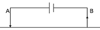

.. _DC_basic_principles_current_voltage_halfspace:

Currents and voltages in a uniform earth
****************************************

Single electrode current source
===============================

In order to derive a relation between measurements (:math:`I`, :math:`V` and
geometry) and the required physical property (resistivity or  :math:`\rho` ),
we must start by identifying how these parameters relate to electric field
strength, :math:`E` (Volts per meter), current density, :math:`J` (Amps per unit
area), and resistivity  (Ohm-m) in the three dimensional situation of a field
survey (the introduction defines resistivity and conductivity).

.. figure:: ./images/currents_in_earth.gif
	:align: right
	:scale: 100 %

Consider first a uniform Earth and one electrode, which is pumping a current,
:math:`I`, into the ground. We want to find the electric potential within the
ground at a distance, :math:`r`, from the current source. The current density in
the ground is related to source current injected, and it flows radially
outward from its point source. The potential measured at a surface defined by
:math:`r` is related to the electric field that exists in the ground because of
the current. These two relations will be combined with the 3D form of Ohm's
law to end up with an expression for conductivity (the physical property we
want) in terms of the current source, measured potential, and the distance.

First, by symmetry the current density out of the hemisphere of radius,
:math:`r`, is

.. math::
		J = \frac{I}{2 \pi r^2} 	\qquad (1)

and the current is flowing in a radial direction. Since :math:`J= \sigma E`
(Ohm's Law), the electric field must also be pointing radially outward. The
relationship between the electric field and the potential is

.. math::
		E = -\frac{dV(r)}{dr}

Combining the expression for :math:`E`, Ohm's Law and equation 1, we have

.. math::
		J = -\sigma \frac{dV(r)}{dr} &= \frac{I}{2 \pi r^2}

		\frac{dV(r)}{dr} &= \frac{-I}{2\pi \sigma r^2}

If we integrate,

.. math::
		V(r) = \frac{I}{2 \pi \sigma r} + C

chose

.. math::
		V(\infty) \longrightarrow C = 0

So the potential due to a point current electrode at the surface is:

.. math::
		V(r) = \frac{I}{2 \pi \sigma r}

The electric potential inside the earth caused by the radial flow of current
is illustrated in the diagram below.

.. figure:: ./images/radial_flow.gif
	:align: center
	:scale: 100 %

.. figure:: ./images/pot_decay.gif
	:align: right
	:scale: 100 %

At the surface, where measurements are made, the potential is infinite at the
current electrode because :math:`r=0`, and it decays with distance.

.. math::
	V(r) = \frac{I}{2 \pi \sigma r} = \frac {I \rho} 
	{2 \pi r}

Two electrode current sources
=============================

In a geophysical survey, current is injected into the ground using two
electrodes. It is convenient to label the electrodes as

A. positive current electrode (carries a current :math:`+I`)		
B. negative current electrode (carries a current :math:`-I`)

.. figure:: ./images/fieldlines.gif
	:align: right
	:scale: 100 %

For a uniform Earth, lines of current flow are shown in red in the figure to
the right, and corresponding lines of equal potential (equipotential lines)
are shown in black. Instead of the current flowing radially out from the
current electrodes, it now flows along curved paths connecting the two current
electrodes. Six current paths are shown. Between the surface of the earth and
any current path we can compute the total proportion of current encompassed.
The table below shows the proportion for the six paths shown (current path 1
is the top-most path and 6 is the bottom-most path).

+-----------------------+-----------------------+
|  **Current Path**     | **% of Total Current**|
+=======================+=======================+
|   1                   |    17                 | 
+-----------------------+-----------------------+
|   2                   |    32                 | 
+-----------------------+-----------------------+
|   3                   |    43                 | 
+-----------------------+-----------------------+
|   4                   |    49                 | 
+-----------------------+-----------------------+
|   5                   |    51                 | 
+-----------------------+-----------------------+
|   6                   |    57                 | 
+-----------------------+-----------------------+

From these calculations and the graph of the current flow shown above, notice
that almost 50% of the current placed into the ground flows through rock at
depths shallower than or equal to the current electrode spacing.

The graph shown below plots the potential that would be measured along the
surface of the earth for a fixed 2-electrode source. The voltage we would
observe with our voltmeter (between purple electrodes) is the **difference**
in potential at the two voltage electrodes, :math:`\Delta V`.

.. figure:: ./images/pot_difference.gif
	:align: center
	:scale: 100 %

Current flow in the ground
==========================

The path of the current in the earth after it is injected with two electrodes
depends upon the distribution of electrical resistivity. If the Earth is
uniform, current flows in a regular three dimensional pattern under the
electrodes as illustrated Figure 1. The north slice number 8 (flagged with a
:math:`\ast`) is similar to the type of image commonly shown in texts to
indicate how current flows in two dimensions under a pair of source
electrodes.

 .. raw:: html
    :file: ./figure1.html
