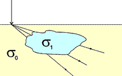
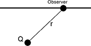
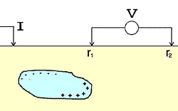

.. _DC_basic_principles_heterogeneous_earth:

Currents and voltages in an heterogeneous earth
***********************************************

Usually the subsurface is not uniform (otherwise Geophysics and Earth Sciences would be meaningless).
Some analytics solutions exist for very simple cases such as a sphere in a uniform field or a layered Earth.
In all others cases, the use of numerical modeling techniques is required to compute the response of
a particular physical property distribution. We use the differential equations described in :ref:`DC_basic_principles_equations` to achieve it. You can also see the article Leading Edge for more information
about numerical techniques.

The animation below, taken from the `Mont Isa`_ case history shows an example of such computation to visualize the current distribution for different sources in a highly structure underground: 

 .. raw:: html
    :file: ./images/Mt_Isa_Current_Anim.html

Galvanic currents will flow towards regions of high conductivity and away from regions of high resistivity.

The Elura orebody (in New South Wales, Australia) show below is an example of a
target with a range of electrical resistivities. Details are from
I.G. Hone, *Geoelectric Properties of the Elura Prospect, Cobar, NSW*, in "The
Geophysics of the Elura Orebody, Cobar NSW," 1980, Australian Society of
Exploration Geophysicists.

 .. raw:: html
    :file: ./figure2.html

.. _Mont Isa: http://em.geosci.xyz/content/case_histories/mt_isa/index.html

Charge distribution
===================

One of the fundamental principles regarding current flow is that away from the
current electrode, all the current that goes into a body must come out. There
are no sources or sinks of current anywhere, except at the current electrode
itself.

Because there are no sources or sinks of current in the earth (conservation of
charge), the normal component of current density is constant across any
boundary where conductivity changes. That is, all of the current that flows
into one side of the boundary must flow out the other side. Also, since lines
of equal potential in an electric field are perpendicular to current flow, the
electric field perpendicular to the normal component of current at the
boundaries must also be constant across the boundary. Therefore there are two
boundary conditions that must hold across interfaces where conductivity
changes:

	- the *normal* component of current density, :math:`J`, must be continuous, and
	- *tangential* components of electric field, :math:`E`, must be continuous.

Recall that Ohm's law is :math:`J = \sigma E`. Since the normal component of
:math:`J` is continuous across a boundary where conductivity changes, the normal
component of the :math:`E`-field must NOT be equal. If :math:`\sigma_2 >
\sigma_1` then :math:`E_2 < E_1`. The following figure should clarify:

.. figure:: ./images/sigma_E_relation.gif
	:align: center
	:scale: 120 %

The only way an electric field can change at a boundary is if there is a
charge on the boundary. If the current is flowing from a resistive medium to a
conductive medium, then the charge buildup will be negative. If the current
flows from a conductive medium to a resistive medium, then the charge will be
positive. This is illustrated in the diagram below-left, where the anomalous
body (blue) is more conductive than the host (yellow). In the figure below-
right, the change in :math:`E`-field is illustrated for a field crossing from a
resistive medium (yellow) into a more conductive zone (blue). Tangential
components are unchanged, but normal components of :math:`E` are different so
that normal components of :math:`J` can remain unchanged. This change in
direction is the origin of the concept that current lines "converge" upon
entering a conductor, and "diverge" upon entering a resistor (illustrated with
cartoons of the ore body in :ref:`DC_surveys`).

.. figure:: ./images/conductive_body.gif
	:align: left
	:scale: 135 %

.. figure:: ./images/E_field.gif
	:figclass: center
	:align: left
	:scale: 120 %

In fact, the charge density that accumulates will be related to the ratio of the two conductivities:

.. figure:: ./images/conductivity_ratio.gif
	:align: center
	:scale: 100 %

How are charges on boundaries related to DC resistivity surveying? Any electric charge produces an electric potential. The Coulomb electrostatic potential is given by

.. math::
		V(r) = \frac{1}{4 \pi \epsilon_0} \frac{Q}{r}

All charge on the edges of a body produce their own electric potentials, and
at the surface (or anywhere else), the total potential is the sum of the
potentials due to the individual charges (principal of superposition). These
potentials are what we measure as voltages, and they are caused by charges
building up on boundaries where conductivity changes, which in turn are caused
by the current being forced to flow by the transmitter. Of course we don't
measure absolute potential; rather, we measure the potential difference
between two locations (say :math:`r_1` and :math:`r_2`).

You can visualize it with this two spheres example. Can you tell which one is conductive and which one is resistive?

 .. raw:: html
    :file: ./images/TwoSphere_Current_Anim.html
