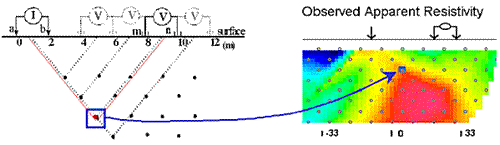

.. _DC_measurements_and_data:

DC resistivity: measurements and data
*************************************

Introduction
============

For DC resistivity surveys, the energy source is a generator which injects a constant current into the ground using two electrodes. The "signals out" (data) are voltages measured at various places on the surface, along with strength of the known current source (in Amperes) and details about relative geometry of the four electrodes.

In order to create maps or graphs of raw data for quality assessment or for direct interpretations, measurements are converted into a form that is related to the relevant physical property. For each measurement, a 3D version of Ohm's Law is used to generate a datum with units of resistivity (or conductivity). These transformed data are called **apparent resistivities** because they represent the earth's true resistivity only if the ground is uniform. When subsurface resistivity varies, interpretation must be based upon the way in which apparent resistivity varies as a function of electrode geometry and position. The commonly used survey procedures are explained later on this page, after discussions about current flow, sources, measurements, and conversion to apparent resistivities.

Current flow in the ground
==========================

The path of the current in the earth after it is injected with two electrodes depends upon the distribution of electrical resistivity. If the Earth is uniform, current flows in a regular three dimensional pattern under the electrodes as illustrated Figure 1. The north slice number 8 (flagged with a *) is similar to the type of image commonly shown in texts to indicate how current flows in two dimensions under a pair of source electrodes.

.. <<add multiple figure here>>

Figure 1 here!

Normally the earth is *not* uniform. Galvanic currents will flow towards regions of high conductivity and away from regions of high resistivity, as illustrated in Figure 2.

.. <<add multiple figure here>>
Figure 2 here!

The relation between charge distribution, current flow and resulting potentials is discussed more fully in the section on principles. 

Sources
=======

High power and reliable constant current are the primary requirements of DC resistivity transmitters. For small scale work (electrodes up to roughly 100 m apart), a transmitter capable of sourcing up to several hundred milliwatts of power might be adequate. For larger scale work (electrodes as much as 1000 m or more apart), it is possible to obtain transmitters that can source up to 30,000 watts. See the section called "DC resistivity instruments" for more details.

Current is usually injected as a 50% duty cycle reversing square wave (Figure 3). That is, current is on for several seconds, off for several seconds, on with reversed polarity, off, etc. Voltages are recorded while current is on.

.. figure:: ./images/txwave.gif
	:align: center
	:scale: 100 %

	Figure 3

.. raw:: ./foo.html

This pattern for the current source is necessary because a voltage measured when the current is off will be non-zero in many situations. Naturally occurring potentials are called spontaneous or self potentials (SP), and they are usually caused by electrochemical activity in the ground. From the point of view of DC resistivity surveys, SP voltages are noise because measured voltages must be caused by the source current only. The 50% duty cycle reversing square wave is employed so as to remove the (poorly known) SP signals.

Measurements: potential difference
==================================

It is tempting to compare the earth to a resistor in an electric circuit (Figure 4a). However, it is important to recognize the difference between resistance and resistivity. If we apply Ohm's law, \\(R=V/I\\), to the situation in Figure 4b, we will have a resistance, which is in units of Ohms. This is *not*\\( \\) the ground's resistivity, which has units of Ohm-m. We do not want the resistance of this circuit; we want a measure of the ground's resistivity.

.. figure:: ./images/figure4a.gif
	:align: center
	:scale: 100 %

	Figure 4a

.. figure:: ./images/figure4b.gif
	:align: center
	:scale: 100 %

	Figure 4b

In order to derive the relation between measurements (\\(I\\), \\(V\\), geometry) and the required physical property (resistivity, \\(\\rho\\)  ) we start from first principles (see the section called "Physical principles of DC resistivity". The derivation is a three step process:

	
- First find a relation for potential due to a point source of current at the surface of a uniform medium. The expression will look like Ohm's law with the addition of terms involving the distance between source and potential measurement location.

- Next, the potential due to two sources (actually, a source and a sink) is the superposition of potentials due to each one.

- Finally, since we must make potential measurements using two electrodes, an expression for potential difference can be derived as the difference between relations for potential at single electrodes.

The actual measurement configuration can be summarized as shown in Figure 5. This conceptualization is useful, regardless of the actual placement of electrodes on the surface.

.. figure:: ./images/figure5.gif
	:align: center
	:scale: 100 %

	Figure 5

The measured voltage for any arrangement of electrodes can be derived from Figure 5 as follows (again, details are in the principles section):

.. math::
	\Delta V &= \frac{I \rho}{2 \pi} \left \{ \frac{1}{r_{AM}} - \frac{1}{r_{BM}} - \frac{1}{r_{AN}} + \frac{1}{r_{BN}}  	 \right \}\\[0.8em]

	\Delta V &=I \rho G

**G** is a geometric factor (including the factor \\(1/2 \\pi\\)), which depends upon the locations of electrodes.

Data: Apparent resistivity
==========================

Rearranging the last expression above, we define *apparent resistivity*\\( \\) as the resistivity of a halfspace which produces the observed potential from a particular electrode geometry:

.. math::
	\rho_a = \frac{\Delta V}{IG}

similarly, the apparent conductivity is 

.. math::
	\sigma_a = \frac{1}{\rho_a} = \frac{IG}{\Delta V}

**Apparent resistivity** is the resistivity derived using only the known current, measured voltage, and array geometry. It is the earth's true resistivity only when the earth is a uniform halfspace. When the earth is more complicated, the measured apparent resistivity will lie between the maximum and the minimum of the true resistivities.

For any survey we can compute the apparent resistivity if measured voltage, \\(I\\), and the geometric factor, \\(G\\) are known. Sometimes there is a simple expression for \\(G\\). For example, if electrodes are spaced equally by a distance \\(a\\), then:

.. math::
		G = \frac{ \frac{1}{a} - \frac{1}{2a}	 - \frac{1}{2a} + \frac{1}{a} }{2 \pi}	= \frac{1}{2 \pi a}

This is the case for the "Wenner" array shown in Figure 6, which summarizes the geometric factor for a variety of common electrode configurations. Note that in this figure, \\(k=1/G\\) . Usage of the various arrays is illustrated in the next section.

.. figure:: ./images/figure6.gif
	:align: center
	:scale: 100 %

	Figure 6. Survey configurations for DC resistivity surveying.

Survey configurations
=====================

There is a wide assortment of configurations commonly used for gathering DC resistivity (and induced polarization) data. In the field, the choice of array depends upon:

	1. The type of information needed. For example, the location of a target may be all that is needed, or it may be necessary to characterize the details of the target.
	2. The most likely type of model (1D, 2D, or 3D) that will be used for interpretation.
	3. The economics of the situation. Since wires must be placed to all electrode locations, and electrodes must be planted in the ground, surveys covering large areas in difficult terrain with hard or gravelly surface materials can rapidly become very expensive.

The most common specific arrays are detailed in Figure 7, but there are several general types of surveys conducted on the surface.

**Soundings** provide 1D solutions, or vertical structure under one surface location. Electrode geometry is varied symmetrically about a single measurement location. The most common configurations for soundings are the Wenner and Schulmberger arrays.

**Profiling** provides information about lateral variations, usually with some information about vertical variations. Most profiles involve placing all electrodes on survey lines so that 2D models of the earth's electrical structure can be found. All seven types shown in the interactive figure below (Figure 7) can be used for profiling.

**Three dimensional configurations** of several types exist, in which electrodes are not in line. Examples include:

- Equatorial dipole-dipole array (Figure 6 above), which is used primarily for very shallow work such as archaeological investigations.
- Twin Probe configuration (basically a Wenner Gamma in Figure 6 above, but with spacing more like dipole-dipole) is also used mainly for very shallow investigations such as archaeological work.
- The so-called E-Scan technique is a pole-pole configuration. However, it is organized by planting a large number of electrodes all over the area of interest, without trying to stay on a grid or on lines. Potentials are recorded at all electrodes and one is used for a current source. Then a new electrode becomes a current source, and all potentials are recorded. Once an electrode has been used as a source, it is never used again. This large data set must be inverted in order to obtain interpretable information. The E-Scan technique is expensive but it has been used in the exploration for geothermal energy and minerals.
- Off-line profiling involves moving the sources along one survey line and recording potentials using electrodes planted along a different (usually parallel) line.
- There are also numerous other proprietary or experimental electrode configurations designed for 3D interpretation.

**Azimuthal arrays** are used to investigate the horizontal electrical anisotropy near the surface. Electrode configurations are usually one of the linear arrays (Wenner, dipole-dipole, etc.). However, instead of moving the array along a line (profiling), or expanding it about a central point (sounding), the array is rotated about a central point so that resistivity as a function of azimuthal direction can be plotted. Further details about the use of azimuthal arrays are given in the "Azimuthal resistivity" section.

**Borehole** work often involves conceptually similar arrays with sources and receivers in various combinations of surface and down-hole locations. These are not discussed further here.

The following images show how electrodes are placed for the various named arrays. Electrodes placed on lines imply that the array is usually used for profiling. A circle at the array's center implies that the array is generally expanded symmetrically about its center for acquiring sounding data.

.. <<add multiple figure here>>
Figure 7 here!

Plotting raw data
=================

How are apparent resistivities (calculated from measured potentials, currents and geometries) displayed for direct interpretation or for quality assessment? There is one conventional plotting scheme for soundings, while plotting of profiles depends upon the survey configuration.

Soundings
---------

Soundings are used when the earth's electrical structure needs to be interpreted in terms of layers under a single location at the surface. The electrode spacings are varied symmetrically about a central location.

Therefore, data must be plotted as a function of electrode spacing rather than as a function of location. The resulting plot is called a sounding curve, and it arises as shown in this interactive figure (Figure 8). Only current electrodes are shown. Potentials would be measured inside current electrodes using either the Wenner or Schulmberger configurations.

.. <<add multiple figure here>>
Figure 8 here!

Profiling
---------

Simple profiling involves moving a fixed array of four electrodes along a survey line. If there are no changes of spacing, then a simple graph of apparent resistivity versus line position would be adequate. A contour plot could be created if there is suitable coverage of the area.

**Pseudosections:** When profiling, potentials are usually measured at several positions for every current source location. Results at wider separations between the potential pair and the transmitter pair provide some information about deeper structures. The conventional method of plotting such results is the pseudosection, so called because it is not a true geological cross-section. Values of apparent resistivity are plotted on the graph as shown in Figures 9 and 10. The vertical axis represents separation distance, NOT depth. When all values are plotted, the result is contoured. Interpretation is tricky and requires some experience.

	Figure 9. Plotting a pseudosection of dipole-dipole data: current electrodes are spaced a meters apart (same for potential electrodes), and current-voltage separation is n×a meters (n is an integer). 

In the animation in Figure 10, the process of gathering and plotting profiling data is illustrated. The survey illustrated involves a dipole-dipole array with \\(a = 2\\) meters, and \\(n = 4\\).

.. <<add multiple figure here>>
Figure 10 here!

**Gradient array:** Large scale reconnaissance surveys are sometimes done using the gradient array (Figure 7e above). If the current sources are not moved, then the energizing field is the same for all measurements. There is, therefore, no inherent information about variations with depth, just like the case of gravity and magnetic surveys. Gradient array surveys are often displayed simply by contour plotting the results.

**Real Sections:** There is one variation of the gradient array that provides limited information about structures at depth. It is run under the trade name "real-section," but the plot is still a "pseudosection" because apparent resistivity data are plotted with no attempt to convert apparent (measured) resistivities into true (intrinsic) resistivities. In the following figures, red electrodes are the current source, and blue electrodes are the potential measurement electrodes. A row of potential measurements at fixed "a" spacing is gathered for each pair of current electrode placements. This is basically a set of seven (in this case) gradient surveys along the same line. At four stages in acquisition, the data look like the following:

.. <<add multiple figure here>>
Figuree 11 here!

**Choice of array:** Does the choice of array type matter for profiling? Appendix II has a brief comparison of pseudosections and the results of inverting data gathered using the arrays.

Processing options
==================

Very little processing is applied to most raw resistivity data, other than to convert from apparent resistivities to potentials if that is needed for input to inversion programs. This is accomplished by using the apparent resistivity formula for the array in use, and the known geometric factor. If the current, \\(I\\), is taken to be 1 (even if it was not 1 Amp in the field), then the result is a normalized potential in units of volts.