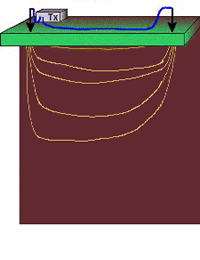
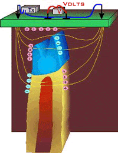
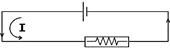
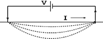

.. _DC_surveys:

Surveys
*******

.. sidebar:: DC Resistivity

    .. figure:: ./images/icon_dc.gif
    	:align: center

In resistivity surveying, information about the subsurface distribution of
electrical conductivity is obtained by examining how currents flow in the
earth. DC (direct current) resistivity methods involve injecting a steady
state electrical current into the ground and observing the resulting
distribution of potentials (voltages) at the surface or within boreholes.

Like all geophysical processes, DC surveys can be described in terms of input
energy, the earth's physical properties, and signals or data that are
measured.

.. figure:: ./images/source_receiver.gif
	:align: center
	:scale: 100 %

Using the same colour scheme as the flow diagram above, The next figure shows how
this conceptual framework applies for DC methods. The energy source is a pair
of electrodes that inject a known current into the ground at known locations
(:numref:`E source A`). The earth affects this energy because variations in the
electrical conductivity of subsurface structures will bend the current flow
lines (:numref:`E source B`). The measured signals or data (:numref:`E source B`) will involve
measurements of voltage at the earth's surface or within boreholes. This type
of data contains information about how charges become distributed at
boundaries where electrical conductivity changes.

    The energy source is a controlled DC electrical current injected into the ground.

.. figure:: ./images/E_source2.gif
    :align: center
    :scale: 100 %
    :name: E source B

    Increases and decreases in electrical conductivity cause current paths to converge and diverge respectively.

    Data are voltages caused by charges accumulating due to current flow.

For each placement of the transmitting electrodes, voltages will be measured
at different locations. Therefore, the complete data set includes measured
voltages with known currents and electrode geometries. In order to create maps
or graphs of raw data for quality assessment, it is usual to convert the data
into a form that has units of resistivity. The data are the input for DC
resistivity inversions, and the results will be 1D, 2D or 3D models of how
subsurface conductivity is distributed.

Sources (Tx)
============

High power and reliable constant current are the primary requirements of DC
resistivity transmitters. For small scale work (electrodes up to roughly 100 m
apart), a transmitter capable of sourcing up to several hundred milliwatts of
power might be adequate. For larger scale work (electrodes as much as 1000 m
or more apart), it is possible to obtain transmitters that can source up to
30,000 watts. See the section :ref:`DC_instruments` for more details.

Current is usually injected as a 50% duty cycle reversing square wave :numref:`txwave`. T
hat is, current is on for several seconds, off for several seconds, on
with reversed polarity, off, etc. Voltages are recorded while current is on.

 .. figure:: ./images/txwave.gif
	:align: center
	:scale: 100 %
	:name: txwave

	Input Signal

This pattern for the current source is necessary because a voltage measured
when the current is off will be non-zero in many situations. Naturally
occurring potentials are called spontaneous or self potentials (SP), and they
are usually caused by electrochemical activity in the ground. From the point
of view of DC resistivity surveys, SP voltages are noise because measured
voltages must be caused by the source current only. The 50% duty cycle
reversing square wave is employed so as to remove the (poorly known) SP
signals.

Measurements (Rx): potential difference
=======================================

It is tempting to compare the earth to a resistor in an electric circuit
(:numref:`resistance`, :numref:`resistivity`).
However, it is important to recognize the difference between
resistance and resistivity. If we apply Ohm's law, :math:`R=V/I`
we will have a resistance, which is in units of Ohms.
This is *not* the ground's resistivity, which has units of Ohm-m. We do
not want the resistance of this circuit, we want a measure of the ground's
resistivity.

    A simple resistor in a DC circuit

    The earth in a DC circuit

In order to derive the relation between measurements (:math:`I`, :math:`V`,
geometry) and the required physical property (resistivity, :math:`\rho`  ) we
start from first principles (see the section called "Physical principles of DC
resistivity". The derivation is a three step process:

- First find a relation for potential due to a point source of current at the surface of a uniform medium. The expression will look like Ohm's law with the addition of terms involving the distance between source and potential measurement location.

- Next, the potential due to two sources (actually, a source and a sink) is the superposition of potentials due to each one.

- Finally, since we must make potential measurements using two electrodes, an expression for potential difference can be derived as the difference between relations for potential at single electrodes.

 .. figure:: ./images/DCR_Gradient-Schlumberger_Array.svg
	:align: center
	:figwidth: 50 %
	:name: surveydesign

	Survey Design

The actual measurement configuration can be summarized as shown in :numref:`surveydesign`.
This conceptualization is useful, regardless of the actual placement of
electrodes on the surface.

The measured voltage for any arrangement of electrodes can be derived from
:numref:`surveydesign` as follows for an half-space:

 .. math::

	\Delta V &= \frac{I \rho}{2 \pi} \left \{ \frac{1}{r_{AM}} - \frac{1}{r_{BM}} - \frac{1}{r_{AN}} + \frac{1}{r_{BN}}  	 \right \}\\[0.8em]

 .. math::

	\Delta V &=I \rho G\\

**G** is a geometric factor (including the factor :math:`1/2 \pi`), which depends
upon the locations of electrodes. :math:`\rho` is the resistivity of the half-space.
For heterogeneous subsurface, see the secton :ref:`DC_data` for more information about apparent resistivity.

Survey configurations
=====================

 .. figure:: ./images/dcr_2dgeneral.png
    :name: dcr_2dgeneral
    :align: right
    :figwidth: 50%

There are many geometries of electrodes that can be used in the field for gathering DC
resistivity (and induced polarization) data. The electrodes can be co-linear
or they can be in an arbitrary configuration.
Current and potential electrodes can be on the surface or in boreholes. The
choice of which survey geometry to use is governed by:

	1.  what conductivity structure is sought. For example, the location of a target may be all that is needed, or it may be necessary to characterize the details of the target.
	2. field constraints for laying out electrodes.
	3. The economics of the situation and which equipment is used. Since wires must be placed to all electrode locations, and electrodes must be planted in the ground, surveys covering large areas in difficult terrain with hard or gravelly surface materials can rapidly become very expensive.

The most common specific arrays are detailed in :numref:`SurveyConfiguration` and in the interactive figure below, but there are several general types of surveys conducted on the surface.

.. figure:: ./images/figure6.gif
    :align: center
    :scale: 100 %
    :name: SurveyConfiguration

    DC survey congfigurations

**Soundings**:
  a fixed geometry of electrodes is expanded symetrically about a
  central point of the array. The data provide information about how the
  electrical structure varies with depth. The data curve is often called a
  "sounding" and a single sounding can be inverted to produce a 1D
  conductivity model. If multiple soundings are available they can be inverted
  in 2D or 3D. The most common sounding configurations are the Wenner and
  Schlumberger arrays.

**Profiling**:
  a fixed array is moved along a line. The data  provide
  information about lateral variations to a depth that is determined by the
  length of the array. All seven types shown in :numref:`SurveyConfiguration`
  and in the interactive figure below can be used for profiling.

**General configuration**:
  These are combinations of profiling and sounding
  arrays. They are often obtained by defining an electrode array and expanding
  and translating it along a line. In practice, this is achieved by laying out
  a line of electrodes, each of which can be used as a current or potential
  electrode. The most common acquistion arrays are dipole-dipole, pole-dipole,
  or pole-pole arrays.

**Gradient array**:
  This is a reconnaissance array that uses a fixed location
  for the A and B electrodes which are far apart. Measurements are taken in an
  area between the current electrodes. Potential differences in orthogonal
  directions can be acquired but usually only potential differences between
  electrodes aligned in the same direction as the A and B electrodes are
  obtained.

Traditionally, data have been collected using co-linear electrodes. Depending
upon the relative placement, the geometries have been given specific names.
The interactive figure below shows how electrodes are placed for various named
arrays. Electrodes placed on lines imply that the array is usually used for
profiling. A circle at the array's center implies that the array is generally
expanded symmetrically about its center for acquiring sounding data.

.. raw:: html
    :file: figure7.html

**Three dimensional configurations** of several types exist, in which electrodes
are not in line. Examples include:

.. figure:: images/dcr_3dgeneral.png
    :name: dcr_3dgeneral
    :align: right
    :figwidth: 50%

    Electrodes can be placed at the surface or along boreholes.

- Equatorial dipole-dipole array (:numref:`SurveyConfiguration`), which is used primarily for very shallow work such as archaeological investigations.
- Twin Probe configuration (basically a Wenner Gamma in :numref:`SurveyConfiguration` above, but with spacing more like dipole-dipole) is also used mainly for very shallow investigations such as archaeological work.
- The so-called E-Scan technique is a pole-pole configuration. However, it is organized by planting a large number of electrodes all over the area of interest, without trying to stay on a grid or on lines. Potentials are recorded at all electrodes and one is used for a current source. Then a new electrode becomes a current source, and all potentials are recorded. Once an electrode has been used as a source, it is never used again. This large data set must be inverted in order to obtain interpretable information. The E-Scan technique is expensive but it has been used in the exploration for geothermal energy and minerals.
- Off-line profiling involves moving the sources along one survey line and recording potentials using electrodes planted along a different (usually parallel) line.
- There are also numerous other proprietary or experimental electrode configurations designed for 3D interpretation.

**Azimuthal arrays** are used to investigate the horizontal electrical
anisotropy near the surface. Electrode configurations are usually one of the
linear arrays (Wenner, dipole-dipole, etc.). However, instead of moving the
array along a line (profiling), or expanding it about a central point
(sounding), the array is rotated about a central point so that resistivity
as a function of azimuthal direction can be plotted. Further details about
the use of azimuthal arrays are given in the "Azimuthal resistivity"
section.

.. This section is not in the new GPG

**Borehole** work often involves conceptually similar arrays with sources and
receivers in various combinations of surface and down-hole locations. These
are not discussed further here.

.. list-table::
   :header-rows: 0
   :widths: 10 10
   :stub-columns: 0

   *  - .. figure:: images/dcr_colinear.png
          :name: dcr_colinear
          :figwidth: 100%

          An example of a co-linear survey with multiple lines.
      - .. figure:: images/dcr_offset.png
          :name: dcr_offset
          :figwidth: 100%

          An example of an offset acquisition survey in 3D. The potential
          electrodes are on a different line than the current electrodes, as
          shown for two sets of MN electrodes.

   *  - .. figure:: images/dcr_escan.png
          :name: dcr_escan
          :figwidth: 100%

          An example of an E-Scan survey, which uses a pole-pole configuration
          in a non-grid format.

      - .. figure:: images/dcr_crosswell.png
          :name: dcr_crosswell
          :figwidth: 100%

          A cross-well survey has electrodes in boreholes and each electrode
          can be either a current or potential electrode. The figure shows an
          example of an along-well transmitter, where A and B are in the same
          well, and a cross-well transmitter, where A and B are in different
          wells.

   *  - .. figure:: images/dcr_tunnel.png
          :name: dcr_tunnel
          :figwidth: 100%

          DC resistivity surveys can also be conducted underground, in a
          tunnel environment. The tunnel restricts where the electrodes can be
          placed but any of the above mentioned surveys can be collected. The
          figure shows an example where the current electrode and potential
          electrodes are in different tunnels.

      -
