.. _GPR_concepts_and_examples:

Ground Penetrating Radar Concepts
*********************************

.. sidebar:: Ground Penetrating Radar

    .. figure:: ./images/icon_gpr.gif
    	:align: center

Ground Penetrating Radar (GPR) can be referred to as radio echo sounding. The seismic reflection analogy is often helpful: surveying involves injecting a short pulse of energy into the ground and recording echoes. GPR energy is EM (electromagnetic--i.e. "radio"), therefore physical properties that affect the survey are electrical conductivity, dielectric permitivity, and magnetic permeability. Results are usually presented similarly to seismic data, as position versus 2-way travel time. A wiggle trace presentation is shown on the second figure, below. The amplitude of the wiggle represents voltage on the antenna. More commonly the traces have one half the trace filled in (the variable area style of plot). Gray--or colour--scale images are also common, in which the colour is scaled to signal amplitude. Examples of different presentation options are presented later.

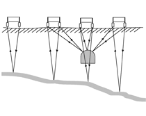

	GPR concept involving "common offset" instrument configuration. Energy from a transmitter reflects from the target and travels back to the receiver

.. figure:: ./images/gpr_section.gif
	:align: center
	:scale: 130 %

	Radar data or "section" resulting from the survey shown to the left.

The source energy--wavelets
===========================

.. figure:: ./images/pulses_wavforms_E_spectrum.gif
	:align: right
	:scale: 100 %

"Normal" radar (police speeding or traffic control systems) uses high frequency pulses and measures the power of returned energy. However, attenuation (i.e. absorption of energy) is greater for higher frequencies, and the resolution for records of returned power is limited to around a wavelength.

In order to be useful in the ground, GPR systems record voltage on antenna instead of power, thus permitting detection of the "first break" of returning pulses. Since antennas are the source of energy, it is easier to generate nearly ideal wavelets than for seismic surveys. The GPR waveform is usually a short pulse, which is therefore a wide-band signal. Bandwidth (total range of frequencies making up the wavelet) is usually \\(~1.5f_{center}\\) , where \\(f_{center}\\) is the "center" frequency determined by the antenna length.

Instruments generate short pulses by imposing a step function voltage onto an antenna. Normal dipole antennas will "ring", or oscillate. By applying resistive loading to the antenna, the emission is forced to be a short pulse rather than a continuous sinusoid (although at reduced emission energy).

Some GPR terminology
====================

**Dielectric permittivity** \\((\\epsilon)\\) and **Relative dielectric permittivity** \\((\\epsilon_R)\\) are explained below.

**Electrical conductivity** \\((\\sigma)\\) is the second of two electrical properties affecting GPR signals in the ground. Conductivity is 1/resistivity.

**Attenuation:** Attenuation dictates how deep we can see, and is usually described in terms of a "skin depth". Skin depth \\((\\delta)\\) is the depth at which the field strength falls to \\(1/2.71828\\) (or \\(1/e\\)) of its original amplitude. It decreases as both frequency and conductivity increase. Conductivity is the most influential parameter, as can be seen in the following table of physical properties. Maximum and minimum values (not including air, or free space) are coloured. Notice how "water" has both the highest and lowest conductivity--and hence attenuation rate--depending upon salinity. This is why the presence and composition of water is the single most significant contributor to GPR performance. Clay is also a very important factor, with only a small amount of clay contributing to significantly decreased GPR performance.

**Table of relative dialectric permittivity \\((\\epsilon_r)\\), electrical conductivity \\((\\sigma)\\), and velocity.** 

+-----------------------+----------------------+------------------------------+----------------------+
|  **Material**         | \\((\\epsilon_R)\\)  | \\((\\sigma)\\) (mSeimens/m) | \\(v_{avg}\\) (m/ns) |
+=======================+======================+==============================+======================+
|   Air                 |   1                  |   0                          |   0.3                |
+-----------------------+----------------------+------------------------------+----------------------+
|   Distilled Water     |   80                 |   0.01                       |   0.033              |
+-----------------------+----------------------+------------------------------+----------------------+
|   Fresh Water         |   80                 |   0.5                        |   0.033              |
+-----------------------+----------------------+------------------------------+----------------------+
|   Sea Water           |   80                 |   3000                       |   0.01               |
+-----------------------+----------------------+------------------------------+----------------------+
|   Dry Sand            |   3-5                |   0.01                       |   0.15               |
+-----------------------+----------------------+------------------------------+----------------------+
|   Saturated Sand      |   20-30              |   0.1-1.0                    |   0.06               |
+-----------------------+----------------------+------------------------------+----------------------+
|   Limestone           |   4-8                |   0.5-2.0                    |   0.12               |
+-----------------------+----------------------+------------------------------+----------------------+
|   Shales              |   5-15               |   1-100                      |   0.09               |
+-----------------------+----------------------+------------------------------+----------------------+
|   Silts               |   5-30               |   1-100                      |   0.07               |
+-----------------------+----------------------+------------------------------+----------------------+
|   Clays               |   5-40               |   2-1000                     |   0.06               |
+-----------------------+----------------------+------------------------------+----------------------+
|   Granite             |   4-6                |   0.01-1.0                   |   0.13               |
+-----------------------+----------------------+------------------------------+----------------------+
|   Dry Salt            |   5-6                |   0.01-1.0                   |   0.13               |
+-----------------------+----------------------+------------------------------+----------------------+
|   Ice                 |   3-4                |   0.01                       |   0.16               |
+-----------------------+----------------------+------------------------------+----------------------+

**Reflection** occurs at boundaries (where the transition zone thickness < wavelength) where \\(\\sigma\\) or \\(\\epsilon_R\\) change. In the lossless case (i.e. when conductivity = 0), the reflection coefficient is 

.. math::
		R = \frac{\sqrt{\epsilon_1}-\sqrt{\epsilon_2}}{\sqrt{\epsilon_2}+\sqrt{\epsilon_1}}

**Scattering** occurs when energy is returned from features that are smaller than a wavelength. Amount of scatter is proportional to wavelength, scatterer size and material.

**Spreading losses:** a geometric factor; spherical losses are proportional to \\(range^4\\).

**System performance:** antennas, transmitter, and receiver.

**Velocity:** For GPR purposes we often consider only dielectric permittivity \\(\\epsilon\\) to influence velocity. This is because at GPR frequencies \\(\\sigma/\\omega\\epsilon << 1\\). If \\(\\epsilon\\)  is around 10 then for \\(\\omega > 10^6\\) (true for all GPR signals), \\(\\sigma\\)  must be less than \\(10^5\\) for the condition to hold. This is often (although not always) true in earth materials. Then, assuming no magnetic materials, velocity can be approximated by

.. math::
		v = \frac{1}{\sqrt{\mu\epsilon}} = \frac{1}{\sqrt{\mu_0\mu_R\epsilon_0\epsilon_R}}=\frac{C}{\sqrt{\mu_R\epsilon_R}} \quad  where \quad C=\frac{1}{\sqrt{\mu_0\epsilon_0}}

where **C** is the velocity of light in air or free space, which is \\(300 \\; m/\\mu s\\). The range for velocity in typical earth materials is given in the table above. Note that a test for whether  \\(\\sigma/\\omega\\epsilon << 1\\) holds should be made before assuming the simple form for velocity.

Dielectric permittivity
=======================

**Dielectric permittivity  \\((\\epsilon)\\)**: This physical property quantifies how easily material becomes polarized in the presence of an electric field. The permittivity of free space is \\(\\epsilon_0 = 8.8541878176 10^{-12} F/m\\), a "Farad" (F) is the unit of capacitance, named after Michael Faraday. If free space did not have finite permittivity, electromagnetic waves (light, radio, etc) could not propagate in free space.

**Relative dielectric permittivity \\((\\epsilon_R)\\)**: Relative dielectric permittivity is a ratio: since dielectric permittivity \\(\\epsilon = \\epsilon_R \\epsilon_0\\), relative dielectric permittivity \\(\\epsilon_R = \\epsilon / \\epsilon_0\\).

 
Relative dielectric permittivity is the parameter usually referred to in GPR work. It is 1 (one) for free space or air, and 80 for water. Because it is a number that compares true value to free space value, it has no units.

Dielectric permittivity is in fact a complex value, often written \\( \\epsilon_R = \\epsilon_R^{\\prime} - i\\epsilon_R^{\\prime\\prime}\\). It can be considered as a measure of the extent to which charge distribution can be distorted or polarized by an applied electric field.

The so-called "real" part, \\(\\epsilon_r^{\\prime}\\), is the *relative dielectric constant*\\( \\), often introduced in electronics or physics courses in the context of capacitors. It is a storage component measured as capacitance per unit length. (Capacitance is "the amount of charge a material can hold" for a given applied voltage.) At different frequencies, polarization occurs at different scales: at very high frequencies, only subatomic particles can be polarized. At GPR frequencies, the reorientation of dipolar molecules is the largest contribution, hence water's importance in determining the velocity of EM waves in a material. Note that \\(\\epsilon_R = 80\\) for water, whereas \\(\\epsilon_R < 10\\) for most other common materials.

 .. figure:: ../GPR/images/dielectric_responses.jpg
	:align: center
	:scale: 100 %

	A dielectric permittivity spectrum over a wide range of frequencies, for real (top curve) and "imaginary" (bottom curve) components. Borrowed from `Wikipedia Dielectric Permittivity Article`_.

The so-called "imaginary" part, \\(\\epsilon_r^{\\prime\\prime}\\),  is a loss component that generally indicates how much energy is dissipated at the transition from one polarization mechanism to another. The behaviour of both is shown in the figure. Values are relatively constant for GPR frequencies of \\(10^6\\) through \\(10^9\\) , ensuring that wave behaviour is not dispersive; i.e. all frequency components of a broad band signal travel at the same speed.

The dielectric permittivity of most geological materials is closely dependent upon the amount of water (free or otherwise) in the material. Values of \\(\\epsilon_R\\) for geologic materials range from 1 to 80, as seen in the table above.

.. _Wikipedia Dielectric Permittivity Article: https://en.wikipedia.org/wiki/Permittivity

Velocity via CMP interpretation and hyperbolic diffraction patterns
===================================================================

It is important to determine the velocity of radar signals in the ground because the recorded data involves time yet we want to know about depths. Velocity can be determined by measurement of GPR data in the field. The figure below illustrate the four possible raypaths that a GPR signal could follow. Are they all visible? Yes, under good conditions, except that the critically refracted air wave (#4) is more than likely going to be too weak to see. In the figure, \\(v_0\\) is velocity of GPR signals in air, \\(v_1\\) is the velocity of GPR signals in the top layer, and \\(v_2\\) is the velocity in the second layer.

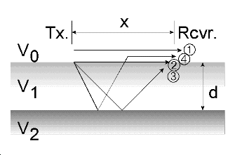

Equations for signal travel times:

.. math::
		&(1) \; Direct \; air \; wave: \;\, &&t(x) =x/v_0\\[0.8em]
		&(2) \; Direct \; ground \; wave: \;\, &&t(x) = x/v_1\\[0.4em]
		&(3) \; Reflected \; wave: \;\, &&t(x) =\frac{\sqrt{x^2 + 4d^2}}{v_1}\\[0.5em]
		&(4) \; Critically \; refracted \; wave:\;\, &&t(x) = x/v_0 + const\\

In order to estimate velocity, several records must be gathered which have the same reflection point, but which involve different travel paths through the same material. Then the ambiguity resulting from having both depth and velocity unknown can be resolved. This type of survey is called a Common Mid Point (CMP) survey. A good CMP data set involves many records, and is plotted in a time-distance plot in which the trace location (horizontal axis) is a function of antenna separation, not distance along a line. For all measurements the mid point between the antennas is kept constant. Here is a typical CMP data set. The red annotations on the following figure show the signal arrivals discussed in the five points below.

.. figure:: ./images/GPRcmp.gif
	:align: center
	:scale: 130 %

1. The air wave is the (nearly) straight line set of arrivals at shortest times. It should give a good indication of data quality. The slope (separation/time) should be consistent with the velocity of signals in the air since top axis is antenna separation (distance of travel for the air wave), and vertical axis is travel time from transmitter to receiver. In order to assess the quality of a CMP data set, consider the following:

	a. Was move-out (increase in separation) increased evenly?
	b. Are plotting and scaling OK?
	c. Was the ground uniform for the whole CMP survey?

2. The ground wave will be the next straight line, with a steeper slope (i.e. slower velocity). It should give a good estimate of surface material velocity.

3. The first hyperbolic shaped reflection arrival should provide a check on the top layer velocity. Use \\(t^2-x^2\\) analysis for these, as per seismology.

4. Subsequent reflection arrivals (non-parallel hyperbolae) should give apparent velocity estimates for deeper layers.

5. The critical angle (from arrival (#4) in the figure above) can also provide a check if XC can be determined. However it is not common to be able to distinguish this arrival among all the other signals.

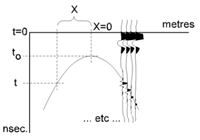

It is also possible to estimate the average velocity above a point diffractor (such as a buried pipe, tank or boulder) using the hyperbolic diffraction from the object (on the data plots, not the CMP). The relation is based on the \\(t^2-x^2\\) relations for hyperbolic diffraction patterns, and is 

.. math::
	v^2 = \frac{4x^2}{t^2 - t_o^2}

The parameters are defined in the figure to the right. 

GPR instruments and examples
============================

There are several sources of GPR instruments. The system available for teaching at UBC is an older PulseEKKO IV system from Sensors and Software of Mississauga, Ontario. For all manufacturers, instruments basically consist of a **control unit**, a **transmitter** (Tx), and a **receiver** (Rx). Usually, control is managed by a laptop computer connected to the electronic control unit which converts computer initialization commands into signals for the Tx and Rx, and sends a data stream from the receiver to the computer for storage. Connections to Tx and Rx are often optical cables in order to avoid electrical and electromagnetic coupling problems. Recall that signals are in the MHz, and are of very short duration--hence very wide band.

**Antennas** are attached directly to the Tx and Rx, again to reduce electronic problems due to coupling and noise. There are essentially two configurations available - shielded antennas and unshielded antennas.

1. **Unshielded antennas** are separate, so they can be used for CMP (common mid point, or velocity analysis surveys), reflection, or transmission survey types. They will also "see" features above and around the system and hence are difficult to use in buildings, and around overhead wiring, or with trees, vehicles, buildings, etc very near by.

2. **Shielded antennas** often include the Tx and Rx in one box. This makes basic reflection profiling very efficient, but such systems are less versatile (for example they can not perform CMP velocity analysis surveys).

Examples of both types of systems, and typical data sets, are presented in figures below.

Environmental waste
-------------------

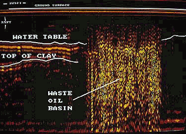

Shielded GSSI antenna system being used for investigating an environmental waste site.

Storage tanks
-------------

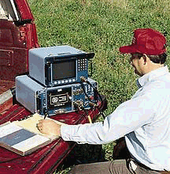

.. figure:: ./images/underground_storage.gif
	:figclass: center
	:align: left
	:scale: 115 %

The detection of underground storage tanks (UST's) is a common application.

Geotechnical work
-----------------

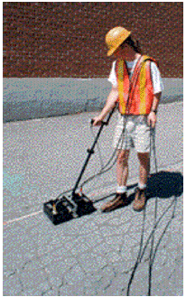

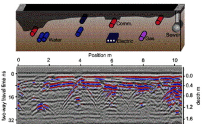

Very high frequency systems are also available for fine-scale geotechnical work. There are also a number of systems configured for towing behind a vehicle. Monitoring of railway and roadway integrity can be done very efficiently with these systems.

Geological Investigation
------------------------

.. figure:: ./images/eg5-f.gif
	:align: left
	:scale: 87 %

.. figure:: ./images/eg5-d.gif
	:figclass: center
	:align: left
	:scale: 100 %

Unshielded Sensors and Software antenna system being used for geological investigation. 

Mining
------

.. figure:: ./images/eg4-f.gif
	:align: left
	:scale: 130 %

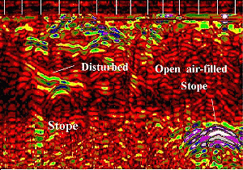

Shielded high frequency system being used to monitor mine wall integrity in a South African mine. 

Borehole Investigation
----------------------

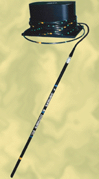

	GPR can also be performed for borehole investigations.This is an example of a sensor and software instrument.

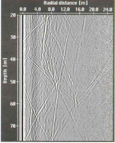

	Borehole GPR data gathered using a RAMAC system (available from Terraplus).

Hydrogeology
------------

.. figure:: ./images/gpr-06_brookswood.jpg
	:figclass: center
	:align: center
	:scale: 100 %

	UBC students operating a Pulse Ekko GPR system with 50 Mhz antennas, investigating an acquifer in Langely, BC.

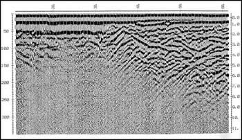

	GPR results over the boundary between aquifer and aquatard

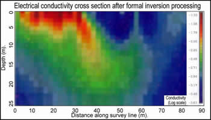

	Higher conductivity zone shows why GPR signals penetrate deeper in the gravelly acquifer. Conductive clay acquitard attenuates GPR signals more rapidly.

GPR for glaciological investigations
------------------------------------

.. figure:: ./images/gpr-06_kask-glac.jpg
	:align: center
	:scale: 100 %

	A small tributary glacier off the Kaskawalsh, Kluane National Park, Yukon. 

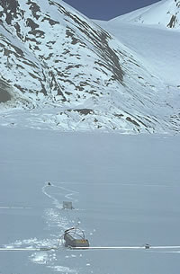

	Looking across near the glacier's firn line - the small portable GPR unit operates at 8 Mhz. 

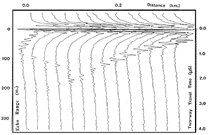

	Raw GPR data. Notice the "bow-tie" pattern under the deepest location.

.. figure:: ./images/gpr-06_kskrdr-arcs.gif	
	:align: center
	:scale: 100 %

	Arc migration resolves correct cross sectional glacier bed topography

