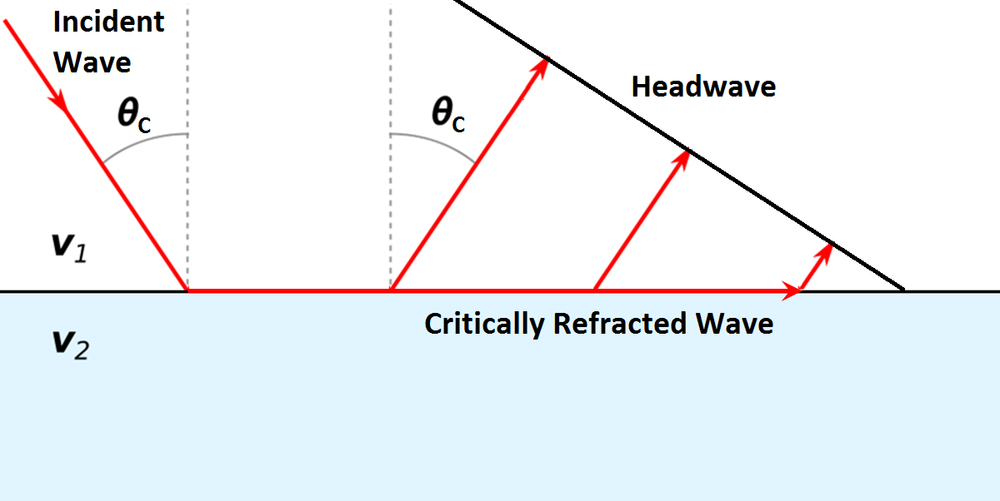
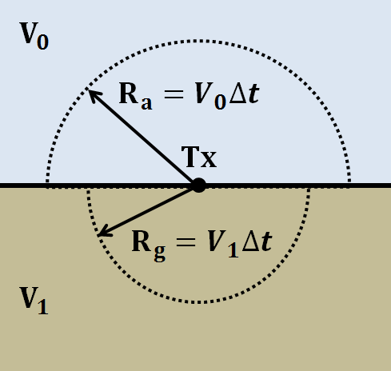
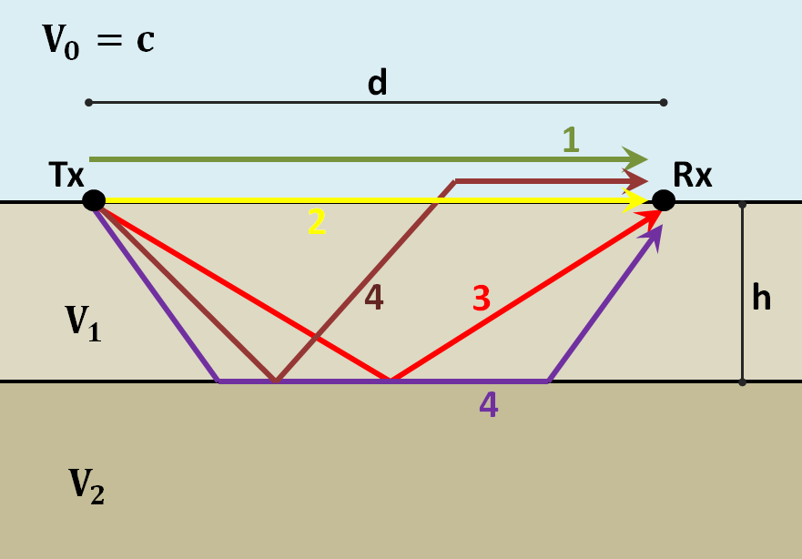

.. _GPR_fundamental_principles

Basic Principles
****************

Here, we present the fundamental principles which govern ground penetrating radar (GPR) signals.
As we mentionned earlier, the source of the GPR system sends a pulse of high-frequency electromagnetic waves (radiowaves) into the Earth.
And as these radiowaves propagate through the Earth, they are distorted due to the distribution of subsurface electromagnetic properties (:math:`\sigma , \; \mu` and :math:`\varepsilon`).

For radiowaves which are propagating through a homogeneous medium, the associated electric and magnetic fields behave according to the wave equation:

.. math::
	\begin{split}
	\nabla^2 \vec E + k^2 \vec E &= 0 \\
	\nabla^2 \vec H + k^2 \vec H &= 0
	\end{split}

where the properties of the wave (velocity, attenuation, wavelength etc...) are defined by the wavenumber (:math:`k`):

.. math::
	k = \sqrt{-i \omega \mu \sigma + \omega^2 \mu \varepsilon}

Notice that :math:`k` depends on the physical properties of the medium.
Therefore, so do the properties of the wave.

When radiowaves come into contact with an interface (a boundary defined by an abrupt change in the Earth's electromagnetic properties), energy associated with the incoming radiowaves can be reflected, transmitted and/or refracted.
This is illustrated in the figure below.
The reflection, transmission and refraction of radiowaves depends on the electromagnetic properties defining each side of the interface as well as the incident angle of the incoming radiowave signal.

For the purposes of GPR, the Earth may be thought of as a set of homogeneous regions separated by interfaces.
Using signals measured by the receivers, the goal of GPR is to define these interfaces and thus gain information about structures under the Earth's; which can be naturally occurring or man-made.

.. figure:: images_new/GPR_schematic_example.jpg
		:align: center
		:figwidth: 70%

                Schematic of a zero-offset GPR setup.

Wave Velocity
=============

Radiowaves corresponding to GPR signals propagate through different materials at different speeds.
The velocity of radiowaves depends on the physical properties of the medium.
In general, the velocity of radiowaves through a homogeneous material is given by:

.. math::
	V = \sqrt{\frac{2}{\mu \varepsilon}} \Bigg [ 1 + \Bigg ( 1 + \bigg ( \frac{\sigma}{\omega \varepsilon} \bigg )^2 \, \Bigg )^{1/2} \; \Bigg ]^{-1/2}

This equation can be used to show that the velocity of electromagnetic waves is largest in free-space (i.e. when :math:`\sigma = 0`, :math:`\mu = \mu_0` and :math:`\varepsilon = \varepsilon_0`).
Therefore, electromagnetic waves in matter travel slower than the speed of light (c = 3.00 :math:`\times 10^8` m/s).

GPR signals are characterized as being high-frequency.
Thus in many cases (and for this course), it is safe to assume that :math:`\sigma \ll \omega \varepsilon`; especially if the Earth is resistive.
As a result, the velocity of radiowaves can be simplified to:

.. math::
	V = \frac{1}{\sqrt{\mu \varepsilon}} = \frac{c}{\sqrt{\mu_r \varepsilon_r}}

where :math:`\mu_r` is the relative permeability and :math:`\varepsilon_r` is the relative permittivity.
If the propagation material is non-magnetic, then :math:`\mu_r` = 1 and the radiowave velocity simplifies to:

.. math::
	V = \frac{c}{\sqrt{\varepsilon_r}}
	

From this expression, we can see that radiowaves propagate more slowly in increasingly dielectric materials.
A table showing the dielectric permittivity, conductivity and radiowave velocity for various materials can be found :ref:`here <GPR_table_velocity>` .
Notice that:
	
	- Water saturation decreases the propagation velocity of sediments because they have high dielectric permittivities.
	- Dry rocks and igneous rocks have the highest propagation velocity

Attenuation
===========

Attenuation defines the continuous loss of amplitude a wave experiences as it propagates through a particular medium.
The rate at which the amplitude decreases is referred as the attenuation constant.
For an electromagnetic wave that has travelled a distance :math:`z`, the attenuation constant (:math:`\alpha`) is given by:

.. math::
	\frac{| \mathbf{A} |}{ | \mathbf{A_0} |} = e^{-\alpha z}

where :math:`\mathbf{A_0}` is the initial amplitude of the wave and :math:`\mathbf{A}` is the amplitude of the wave after it has travel distance :math:`z`.
We can see that as :math:`z \rightarrow \infty`, the amplitude of the wave goes to zero.
Additionally, for larger values of :math:`\alpha`, the wave attenuates more quickly.

The attenuation constant depends on the physical properties of the media.
In general, the attenuation constant can be expressed as:

.. math::
	\alpha = \omega \sqrt{\frac{\mu \varepsilon}{2}} \Bigg [ \Bigg ( 1 + \bigg ( \frac{\sigma}{\omega \varepsilon} \bigg )^2 \Bigg )^{1/2} - \; 1 \; \Bigg ]^{1/2}

.. _GPR_fundamental_principles_skin_depth:

Skin Depth
==========

Skin depth (:math:`\delta`) defines the propagation distance at which the amplitude of an electromagnetic wave is reduced by a factor of :math:`1/e`; i.e. reduced to 37\% of its original amplitude.
By definition, the skin depth is just the reciprocal of the attenuation constant:

.. figure:: images_new/GPR_attenuation_skin_depth.png
		:align: right
		:figwidth: 40%

                Figure comparing the attenuation of radiowaves in air versus in a conductiv medium.

.. math::
	\delta = \frac{1}{\alpha}

In conductive environments (:math:`\omega \varepsilon \ll \sigma`), a good approximation for  the skin depth is given by:

.. math::
	\delta \approx \sqrt{\frac{2}{\omega \mu \sigma}} \sim 1262 \sqrt{\frac{1}{\omega \sigma}}

The second equation offers a simpler approximation if the Earth is non-magnetic (i.e. :math:`\mu = \mu_0`).

For materials in which :math:`\omega \varepsilon \gg \sigma`, the skin depth is approximated by:

.. math::
	\delta \approx \frac{2}{\sigma} \sqrt{\frac{\varepsilon}{\mu}}

We can see from the two previous expressions that:

	- The skin depth is smaller if the frequency of the radiowaves is higher.
	- The skin depth is larger in materials with higher resistivities.
	- The skin depth is larger is materials with higher dielectric permittivities.

An example of the attenuation of electromagnetic waves in air versus inside a conductive is shown on the right.
We can see that in the air, the wave experienced little to no loss in amplitude as it propagate.
In the conductive material however, the amplitude of the wave decreases noticeably as it propagates.

Reflection and Transmission of Radiowaves
=========================================

.. sidebar:: Normal Incidence Reflection/Transmission

	.. figure:: images/normal_incidence_reflection.gif
		:align: center
		:figwidth: 100%
	
		Reflection of an incident wave with a reverse in polarity (:math:`\varepsilon_1 <\varepsilon_2`). `Link to source image <https://commons.wikimedia.org/wiki/File:Partial_transmittance.gif>`__

When a radiowave reaches an interface, some of its energy is reflected and some of its energy is transmitted accross the interface.
This results in both a reflected and a transmitted wave.

The amplitude of the reflected wave proportional to that of the incident wave is defined by the reflection coefficient (:math:`R`).
For radiowaves, the reflection coefficient can be expressed as a function of the dielectric permittivities on each side of the interface.
Assuming the radiowave arrives at an angle perpendicular to the interface, the reflection coefficient is given by:

.. math::
	R = \frac{\textrm{Reflected Amplitude}}{\textrm{Incident Amplitude}} = \frac{\sqrt{\varepsilon_1} - \sqrt{\varepsilon_2}}{\sqrt{\varepsilon_1} + \sqrt{\varepsilon_2}}

where :math:`\varepsilon_1` is the dielectric permittivity of the medium associated with the incident and reflected waves.

The reflection coefficient can be either positive or negative and has values between :math:`-1 < R < 1`.
The magnitude of :math:`R` determines how much of the incidend wave is reflected.
It should be noted that:

	- If :math:`\varepsilon_1` and :math:`\varepsilon_2` are similar, most of the incident wave is transmitted through the interface.
	- If one of the dielectric permittivities accross the interface is much smaller than the other, most of the incident wave is reflected. This case can prove problematic if you at attempting to gain information about structures below this interface.

The sign of the reflection coefficient determines whether the reflected wave experiences a reverse in polarity.
As a result, we can use the polarity of reflected radiowaves to determine whether :math:`\varepsilon_1` is greater than or less than :math:`\varepsilon_2`.
This can be summarized as follows:

	- If the returning signal (reflected wave) shows a reverse in polarity, :math:`R<0` and thus :math:`\varepsilon_1 < \varepsilon_2`
	- If the returning signal (reflected wave) does not show a reverse in polarity, :math:`R>0` and thus :math:`\varepsilon_1 > \varepsilon_2`

Reflection at Conductive Object Boundaries
==========================================

Many compact objects relevant to GPR applications (buried pipes, landmines, etc...) are highly conductive.
For highly conductive objects, the reflection and transmission of radiowaves cannot be characterized by the dielectric permittivities.
Instead, we must consider the electrical conductivity of the object.

From the general equation for propagation velocity, we see that as :math:`\sigma \rightarrow \infty`, the propagation velocity goes to zero.
Thus radiowaves cannot propagate through extremely conductive objects.
Because of this, when radiowaves reach the interface between the Earth and a highly conductive object, the wave is completely reflected.
This occurs regardless of the incident angle.

Refraction of Radiowaves
========================

.. figure:: images_new/GPR_refraction.png
	:align: right
	:figwidth: 25%
		
	Reflection and refraction of an incoming radiowave.

Refraction is used to describe the change in propagation direction of a wave due to a change in the propagation medium.
When a radiowave reaches an interface, recall that some of its energy is reflected and some of its energy is transmitted accross the interface.
The angles at which the incident wave is reflected and refracted are illustrated on the right.

The angle of the reflected radiowave depends directly on the angle of the incident wave.
The angle of the refracted wave can be obtained by using Snell's law (just like seismic waves):

.. math::
	\frac{\textrm{sin}\theta_1}{V_1} = \frac{\textrm{sin}\theta_2}{V_2}

For radiowaves in resistive and non-magnetic media, the propagation velocity is equal to :math:`V = c/ \! \sqrt{\varepsilon_r}` (see here add link).
In this case, Snell's law can be expressed as:

.. math::
	\sqrt{\varepsilon_1} \, \textrm{sin}\theta_1 = \sqrt{\varepsilon_2} \, \textrm{sin}\theta_2

**Critical Refraction**

		
	Critical refraction at interface and the resulting headwave.

Just like in refraction seismology, radiowaves can undergo critical refraction.
This occurs when the incident angle :math:`\theta_1` is such that the refracted wave propagates along the interface at velocity :math:`V_2`; ultimately leading to a head wave.
The critical angle (:math:`\theta_c`) is given by:

.. math::
	\textrm{sin} \theta_c = \frac{V_1}{V_2}

Once again, we can see that critical refraction only occurs when :math:`V_1 < V_2`.
Additionally the propagation direction of the head wave is characterized by :math:`\theta_c`.

Scattering
==========

Scattering is used to describe deviations in the paths of electromagnetic waves due to localized non-uniformities.
For the interfaces of larger-scale features, the deviation of the incoming wave path is explained through reflection and refraction.

Wave Fronts and Ray Paths
=========================

Like in seismology, it is very important to understand the difference between wave-fronts and ray paths.
One way to thing about it as follows:

	- **Wave-front**: The physical location of the radiowaves as they propagate throught the Earth.
	- **Ray path**: A particular path which a portion of the wave-front can take in order to reach a particular location.

Thus the wave-front represents the actual set of radiowaves, and the ray path is used to represent paths which signals can take to reach a receiver location.
To see a simple example of the wavefront generated by radar source, `see here <https://www.youtube.com/watch?v=eqfgP4qVK4s>`__ .

Geometric Spreading
===================

                Wave-front at time :math:`\Delta t`. Shows geometric spreading for radiowaves in the ground and in the air.

We have seen how radiowave signals lose their amplitude through attenutaion.
They also lose energy due to geometric spreading.
This makes sense given that the energy of the wave-front is now spread over a larger area.
For geometric spreading, the loss in amplitude of the radiowaves is represented by:

.. math::
	\frac{| \mathbf{A} |}{ | \mathbf{A_0} |} \propto \frac{1}{R}

where :math:`\mathbf{A_0}` is the amplitude of the waves as their leave the source and :math:`\mathbf{A}` is the amplitude of the waves after they have traveled distance :math:`R`.
As we can see from the figure, the rate of geometric spreading loss is higher in the air than it is in the ground.
This is due to the fact that radiowaves propagate faster in the air than they do in the ground.

Example: Signal Paths for a 2-Layer Earth
=========================================

                Radiowaves signals measured by a receiver for a 2-layer Earth.

Now that we understand the background theory, let's put it all together.
At :math:`t` = 0 s, the source (Tx) generates a pulse of radio waves.
As we can see on the right, there are many paths in which radiowaves can take in order to reach the receiver (Rx).
The propagation velocities, reflections and refractions can all be explained using the equations found above.
On the right, we have an example of a radargram, which shows the returning signal at increasing distances :math:`x` from the source.
Let us now try and explain the nature of each ray path.

**Path 1: Direct Air Wave**

.. figure:: images_new/GPR_radargram_2layer_example.png
		:align: right
		:figwidth: 45%

                Radargram for a 2-layer Earth.
               
               
This was travels through the air in a direct line from the transmitter to the receiver.
Recall that in the air, radiowaves propagate roughly at the speed of light (:math:`c = 3.00 \times 10^8` m/s).
As a result, the direct air wave is **always** the first signal measured by the receiver.
The time it takes this wave to reach the receiver is given by:

.. math::
	t_{air} = \frac{x}{c}

The direct wave is shown in **red** on the radargram.
According to the above equation, the velocity of the air wave is 1 divided by the slope of this line.

**Path 2: Direct Ground Wave**

This wave travels along the surface interface at velocity :math:`V_1`.
Like the air wave, the ground wave also takes a direct path.
Because :math:`V_1 < c`, the ground wave arrives later than the air wave.
The time it takes for the ground wave to reach the receiver is given by:

.. math::
	t_{ground} = \frac{x}{V_1}

The direct ground wave is shown in **pink**.
Like the air wave, the direct ground wave velocity can also be obtained from the slope of the line.

**Path 3: Reflected Wave**

The reflected wave travels through medium 1 at velocity :math:`V_1`.
Because it takes a longer path than the direct ground wave, it arrives later.
The time it takes for the reflected wave to reach the receiver is given by:

.. math::
	t_{ref} = \frac{\sqrt{x^2 + 4h^2}}{V_1}

The reflected wave is shown in **green**.
Unlike direct waves, the arrival time for the reflected wave is hyperbolic, which makes it distinguishable from other signals.
After sufficient distances (:math:`h \ll x`), the previous equation becomes approximately linear.
This portion of the curve can be used to estimate the velocity of the top-most layer.
Notice how the slope of the direct ground wave and reflected wave are parallel.

**Path 4: Critically Refracted at Surface**

This ray path is denoted in **blue**.
Because :math:`V_1 < V_0`, reflected waves are critically refracted at the surface.
While this wave propagates along the surface interface, it will have velocity a velocity roughly the speed of light.
In general, the time it takes for this wave to reach the receiver is given by:

.. math::
	t_c = \frac{x}{c} + \textrm{Constant}

Notice that the arrival time for the critically refracted wave is linear.
In this radargram example, we cannot easily see the critically refracted wave.
However, it does not mean that it does not exist.

