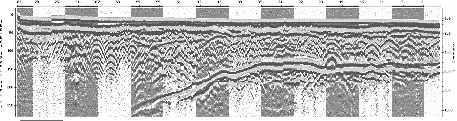
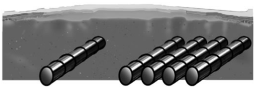
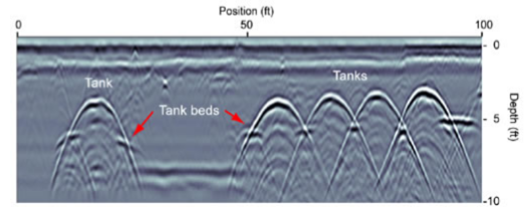
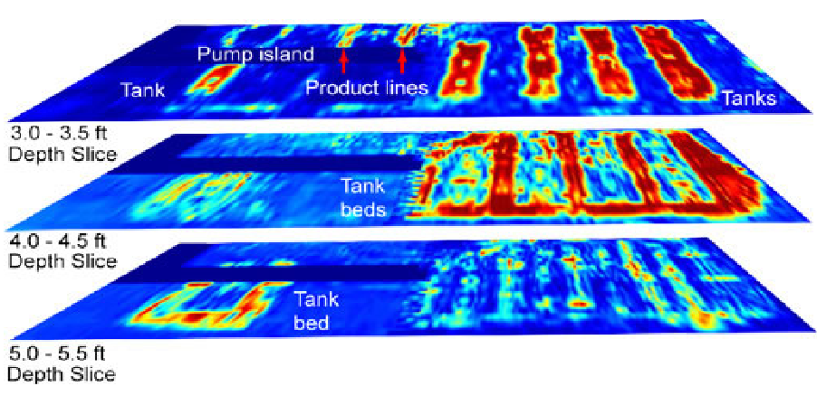
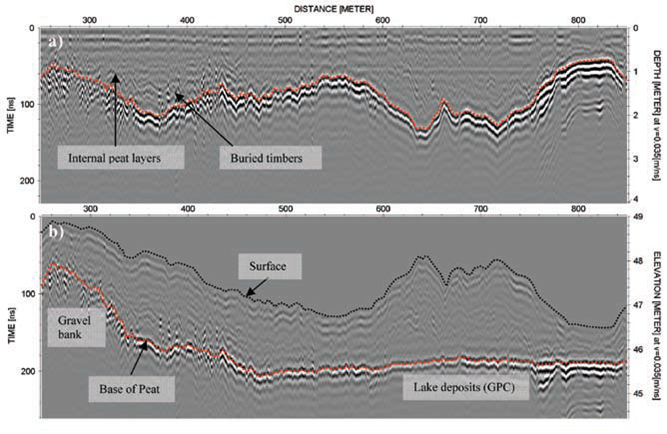
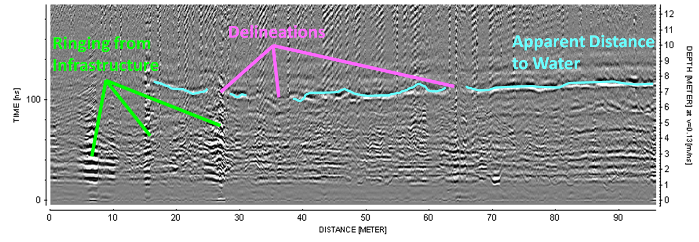
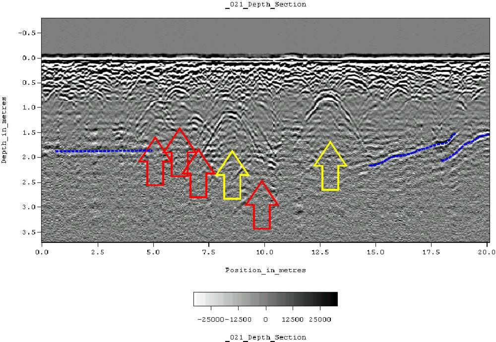
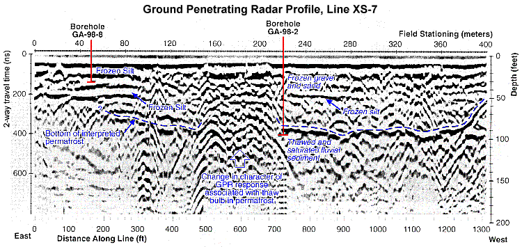

.. _GPR_interpretation:

Interpretation
**************

Here, we look at some real examples of GPR surveys and try to interpret the radargram data.
Although we are focusing on the interpretation of data, it will be contained within the 7-step framework.

Things to Keep in Mind
======================

When attempting to interpret radargram data, here are a few things to keep in mind.
Try to consider these things when examining the radargram below.

**Regarding the Survey**

	- What is the Tx-Rx separation distance?
	- What is the operating frequency and wavelet pulse width?
	- What do you know about the local physical properties? high/low conductivity? high/low dielectric permittivity?
	- Is the ground dry or saturated (permittivity)? Does the ground contain features which may scatter the signal?
	- Having considered the previous statements, what do you think the resolution and probing distance are?

**Regarding the Data**

	- When is the earliest useful signal you measure? When is the latest?
	- Why can't you see anything after the latest signal? Attenuation? Strong reflector?
	- Can you infer a layer velocity and turn the travel time axis into an apparent distance axis?
	- Is there a reverse in polarity of the wavelet signal? What does that tell you about :math:`\varepsilon_1` and :math:`\varepsilon_2` for an interface?

**Recognizing Features**

	- Do you notice any hyperbolic features? Indicates point reflector for zero-offset. Indicates layer for common midpoint.
	- For hyperbolic signatures (or signatures from other discrete shapes), what does the slope tell you about the propagation velocity of the medium it's in?
	- Based on the slope, is the object above ground (noise), or below ground (potential target)?
	- Are there any linear features (zero-offset)?
	- Do linear features indicate a flat or dipping interface? Is the a method you can use to get the dip?
	- Are you able to get signals from anything below an obvious reflector? What does that say about :math:`\varepsilon_1` and :math:`\varepsilon_2`?
	- Can slopes and hyperbolas be used to obtain layer velocities?

                Zero-offset radargram example.

Locating Buried Storage Tanks
=============================

                Diagram showing underground storage tanks.

                Corresponding radargram for a zero offset survey.

**Setup**: Real estate transactions regularly create the need for an environmental site assessment. Confirming the presence or absence of underground storage tanks (USTs) can be a  critical factor in contract closing.

**Physical Properties**: Storage tanks have a large conductivity. These will act as strong reflectors of GPR signals.

**Survey**: Survey line are done perpendicular to the known orientation of the storage tanks. A zero offset survey was used.

**Data**: GPR data were collected along several profile lines. These were used to generate radargrams.

**Processing**: An arrival time to depth conversion was done in order to approximate the depth to the storage tanks. The radargrams for several profile lines were interpolated in order to generate a 3D image.

                3D interpolation from several GPR survey lines.

**Interpretation**: From the radargram and 3D interpolated image, we can easily see five storage tanks buried at a depth of 3.5 ft (1 metre).
In the radargram, the signatures from the pipes are hyperbolic.
Below the tanks, we can see two tank beds.
The goal of the tank bed is to ensure that any leakage stays contained.
Because the storage tanks themselves are such strong reflectors, we do not see the reflection of the tank beds for certain Tx-Rx positions.

**Synthesis**: This survey was successful in locating the buried storage tanks at a potential building site.

Mapping Peat Thickness (Ireland)
================================

.. figure:: images_new/GPR_interp_peat_bog_diagram.png
		:align: center
		:figwidth: 70%

                GPR being used to map peat bog thickness.

**Setup**: Bog material in raised bogs are being used to energy consumption. We would like to map the peat bogs thickness over a 35,000 Ha region.

**Physical Properties**: Peat is a porous carbon material with large water content (they need to dry it before using). Region below is listed as lake deposits. Possibly a difference is water content and texture and this may provide a difference in dielectric permittivity.

**Survey**: GPR Towed 100MHz antenna, with RTK GPS for positional accuracy. Common offset survey. 

**Data**: Profiles collected every 60 m and plotted as distance-time sections. 

**Processing**: Processed to remove topography effects and identify correlated reflection events.

                Radargram over profile line. (a) Data before topographic correction. (b) Data after topographic correction.

**Interpretation**: As we can see at roughly 100 ns +/- 50 ns (a), there is well-established interface corresponding to the bottom of the peat bed.
At earlier times, we see reflected signals from the internal layered structure of the peat beds as well.
We also see localized features which are thought to be caused by buried timbers.
After the topographic correction (b), we see an embankment on the left side of the radargram.
The contrast in physical properties here is smaller, thus we do not see the reflection as strongly.

**Synthesis**: In various places, a peat augur (borehole device) was used to calibrate the data and verify the inferred thickness of the peat layer.
As a result, our interpretation of the data was correct and the GPR survey was successful.

Underground Potash Mine
=======================

**Setup**: Water is a serious problem for potash mines, as it can dissolve the rock and decrease structural integrity. The goal of this survey was to map the location of intruding water and locate its source.

**Physical Properties** In general, anhydrite minerals such as potash have relative permittivities :math:`\varepsilon_r \sim 5`.
On the other hand, water as a very high dielectric permittivity (:math:`\varepsilon = 80`).
Because these two units have such different dielectric permittivities, we expect a large reflection where radiowaves come into contact with the water.

**Survey**: GPR profiles were collected along the lengths of mine shafts using a common offset configuration.

**Data**: Radargrams along several profiles within mine shafts.

**Processing**: By assuming a propagation velocity of 0.13 m/ns (approximately known for potash), the two-way travel time was converted an apparent depth/distance.

                Radargram showing reflected signal corresponding to water and ringing from proximal infrastructure. Notice the radargram is upside down. Things nearer to the source and receiver are plotted near the bottom.

**Interpretation**: On the radargram, we see a strong reflected signal corresponding to the water which is percolating through the potash.
We see that the water is approximately 6 m away from the wave of the mine shaft.
The resolution is not high enough to determine the thickness of the water saturated potash.
However, we see that it is delineated in some areas and that the source of the water is likely on the right of the profile.
On the left side of the GPR profile, we see ringing causes by infrastructure.

**Synthesis**: In this case, the results of the GPR survey were correlated with the results from a DC resistivity survey (taught later in the course).
Boreholes also confirmed the inferred location of the water.
Ultimately, we were successful in locating the water and determining its source using GPR in conjunction with other methods.

Burial Site (Alabama)
=====================

**Setup**: Archaeological study of historic burial grounds in Alabama. Attempting to locate burial sites.

**Physical Properties** In this case, the contrast in physical properties is between the host rock and items buried along with human remains.
We expect that objects buried in the ground will act as point reflectors for the GPR signal.

**Survey**: Zero-offset survey along a 20 m profile.

**Data**: Radargram along a 20 m profile.

**Processing**: By using the hyperbolic signatures in the data, the host layer velocity was determined.
This was used to obtain the apparent depth.

                Radargram hyperbolic signatures associated with indigenous burials.

**Interpretation**: Yellow arrows indicate very distinct point reflections (hyperbolas), probably associated with human burials. 
Less distinct hyperbolic reflections are indicated by red arrows.
The apparent depth indicates that burials are between 0.75 m and 1.5 m.
Dashed blue lines are used to indicate horizontal and sloping reflectors, probably bedrock.
Smaller reflections near the surface are likely to be caused by tree roots.

**Synthesis**: Because of the nature of the site, subsurface testing was not used to confirm the interpretation.
However, the interpretation is supported by surface indications (grave markers and depressions).

Mapping Permafrost
==================

**Setup**: We would like to map the thickness and stability of a permafrost layer and identify key features.

**Physical Properties**: Permafrost has a relative permittivity of roughly 4-8 whereas the saturated fluvial sediments below have a much higher relative permittivity.
We expect this contrast in dielectric permittivity to provide a large reflection which can be measured by the GPR system.
We expect to see scattering where methane gas bubbles are percolating up through the ground.

**Survey**: Another common offset survey.

**Data**: Radargram over a 400 m profile.

**Processing**: By assuming a propagation velocity of the speed of light, the two-way travel time was converted an apparent depth.

**Interpretation**: The topmost layer is interpreted as being comprised of frozen silts followed by frozen gravels and sand.
Because rocky soils result in scattering of radiowave signals, data corresponding to the signal from the frozen gravel is noisy.
At about 400 ns, we clearly see a well-defined lower boundary for the permafrost (mostly on the right).
One of the most interesting features is found in the middle.
We see a change in character of GPR signal where the boundary should be defined.
This has been interpreted as an area where methane gas is bubbling to the surface.

**Synthesis**: The features in this radargram are much noisier and hard to interpret than previous examples.
Boreholes were used to confirm the interpretation.
Although penetration depth may have been an important aspect of planning the survey (due to scattering), a higher frequency survey may have provided more details near the surface.

