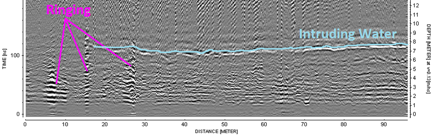

.. _GPR_interpretation

Interpretation
**************

Here, we look at some real examples of GPR surveys and try to interpret the radargram data.

Good Interpretation Questions
=============================

For a given radargram, here are some questions which may help your interpretation:

	- What are the latest features recorded in the radargram and what are their two-way travel times?
	- What is the two-way travel time of the earlier useful signal?

Mapping Peat Thickness (Ireland)
================================

.. figure:: images_new/GPR_interp_peat_bog_diagram.png
		:align: center
		:figwidth: 70%

                GPR being used to map peat bog thickness.

**Setup**: Bog material in raised bogs are being used to energy consumption. We would like to map the peat bogs thickness over a 35,000 Ha region.

**Physical Properties**: Peat is a porous carbon material with large water content (they need to dry it before using). Region below is listed as lake deposits. Possibly a difference is water content and texture and this may provide a difference in dielectric permittivity.

**Survey**: GPR Towed 100MHz antenna, with RTK GPS for positional accuracy. Common offset survey. 

**Data**: Profiles collected every 60 m and plotted as distance-time sections. 

**Processing**: Processed to remove topography effects and identify correlated reflection events.

.. figure:: images_new/GPR_interp_peat_bog_radargram.png
		:align: center
		:figwidth: 70%

                Radargram over profile line. (a) Data before topographic correction. (b) Data after topographic correction.

**Interpretation**: As we can see at roughly 100 ns +/- 50 ns (a), there is well-established interface corresponding to the bottom of the peat bed.
At earlier times, we see reflected signals from the internal layered structure of the peat beds as well.
We also see localized features which are thought to be caused by buried timbers.
After the topographic correction (b), we see an embankment on the left side of the radargram.
The contrast in physical properties here is smaller, thus we do not see the reflection as strongly.

**Synthesis**: In various places, a peat augur (borehole device) was used to calibrate the data and verify the inferred thickness of the peat layer.
As a result, our interpretation of the data was correct and the GPR survey was successful.

Underground Potash Mine
=======================

**Setup**: Water is a serious problem for potash mines, as it can desolve the rock and decrease structural integrity. The goal of this survey was to map the location of intruding water and locate its source.

**Physical Properties** In general, anhydrite minerals such as potash have relative permittivities :math:`\varepsilon_r \sim 5`.
On the other hand, water as a very high dielectric permittivity (:math:`\varepsilon = 80`).
Because these two units have such different dielectric permittivities, we expect a large reflection where radiowaves come into contact with the water.

**Survey**: GPR profiles were collected along the lengths of mine shafts using a common offset configuration.

**Data**: Radargrams along several profiles.

**Processing**: By assuming a propagation velocity of 0.13 m/ns (approximately known for potash), the two-way travel time was converted an apparent depth/distance.

                Radargram showing reflected signal corresponding to water and ringing from proximal infrastructure. Notice the radargram is upside down. Things nearer to the source and receiver are plotted near the bottom.

**Interpretation**: On the radargram, we see a strong reflected signal corresponding to the water which is percolating through the potash.
We see that the water is approximately 6 m away from the wave of the mine shaft.
The resolution is not high enough to determine the thickness of the water saturated potash.
However, we see that it is delineated in some areas and that the source of the water is likely on the right of the profile.
On the left side of the GPR profile, we see ringing causes by infrastructure.

**Synthesis**: In this case, the results of the GPR survey were correlated with the results from a DC resistivity survey (taught later in the course).
Boreholes also confirmed the inferred location of the water.
Ultimately, we were successful in locating the water and determining its source using GPR in conjunction with other methods.

Mapping Permafrost
==================

**Setup**: We would like to map the thickness and stability of a permafrost layer.

**Physical Properties**: 

**Survey**: 

**Data**: 

**Processing**: 

.. figure:: images_new/GPR_interp_permafrost.png
		:align: center
		:figwidth: 100%

**Interpretation**:               