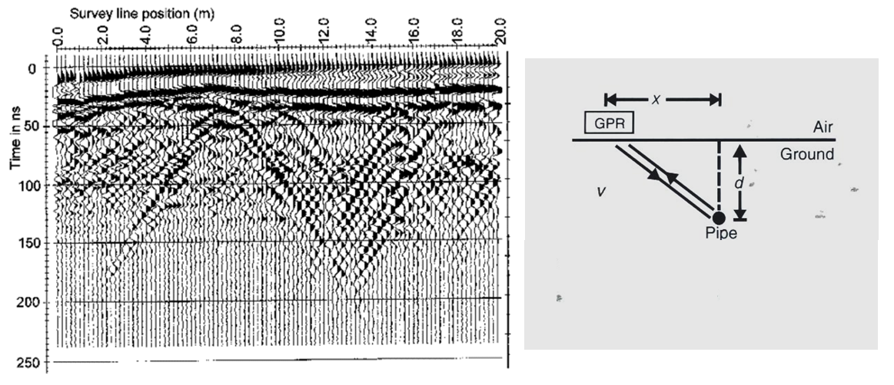

.. _GPR_survey_data

Survey and Data
***************

Here, we discuss the various survey geometries used in GPR and some of their applications.
Information about the GPR source signal and its impact on planning surveys is presented.
We also discuss sources of noise which may contaminate GPR data.

On this page, you will learn about:

	- Common offset, common midpoint and transillumination surveys.
	- Where these surveys are most effective.
	- What is the source signal used in GPR.
	- The properties of the source signal and how it impacts the effectiveness of GPR surveys.
	- The resolution of GPR surveys.
	- The probing distance of GPR surveys.
	- Sources of noise and their impact on GPR surveys.

Common Offset Survey
====================

	.. figure:: images_new/GPR_common_offset.png
		:align: right
		:figwidth: 40%

        	Common offset survey configuration.

Common offset surveys are the most frequently used configuration for GPR surveys.
In common offset survey, the distance between the transmitter and a single receiver is fixed.
Data are collected each time the transmitter-receiver pair are moved to a new position.
In some cases, the transmitter and receiver are placed at a zero-offset; otherwise known as a coincident source and receiver.

Common-offset surveys are effective for locating the depths of near-horizontal interfaces.
In addition, zero-offset surveys are very affective a locating pipes, tunnels and compact buried objects; as they generate hyperbolic signatures in radargram data.
Examples of this can be seen below.

Buried Compact Object
---------------------

Below we see a radargram for a zero-offset survey, which shows an obvious hyperbola.
For this example, the hyperbola corresponds to a buried pipe.

        (Left) Radargram for a zero-offset survey showing hyperbola from a buried pipe. (Right) Geometry showing the path of the radiowave at each reading.

.. figure:: images_new/GPR_example_buried_object_2.png
	:align: right
	:figwidth: 50%

	Geometry shown how radargram can be used to find propagation velocity.

According to the geometry of the problem (above-right), the total travel time of the GPR signal is given by:

.. math::
	t = \frac{2 \big ( x^2 + d^2 \big )^{1/2}}{V}

Now examine the figure on the right.
The top of the parabola corresponds to the horizontal location of the buried object (:math:`x_0`).
The minimum travel time (when the source and receiver are directly above) is given by:

.. math::
	t_0 = 2d/V

Using this to re-write the previous expression, we see that:

.. math::
	V = \frac{4x^2}{t^2 - t_0^2}

Therefore by determining :math:`t_0`, **any point** on the hyperbola can be used to determine the propagation velocity of the top layer.
This may come in handy when a portion of the hyperbola is obstructed by other signals.
Also note that once :math:`V` is determined, the definition of :math:`t_0` can be used to determine the depth of the object.

Dipping Layers
--------------

So far we have only considered interfaces which are approximately horizontal.
However, the subsurface may consist of dipping layers.
This can lead to challenges when attempting to interpret reflections in the data.

For a zero-offset survey, we can see that the reflected signal returns at an angle.
This is because the reflection happens perpendicular to the surface of the interface in this case.
As a result, the two-way travel time does not correspond to the depth of the interface.
Instead, it corresponds to the minimum travel distance.
If we assume the reflected signal gives us the vertical distance to the interface, we will **under-estimate** the dip of the interface.

.. figure:: images_new/GPR_dipping_layer.png
		:align: center
		:figwidth: 70%
	
		Reflections from a dipping layer for a common-offset survey.

**Migration Correction**

The true dip of the interface can be recovered using circular arcs.
To apply the correction (assuming you have obtained the velocity of the top-layer from the direct ground wave or other means):

1) Obtain the distance from the two-way travel time of the reflection. Assume this represents the vertical distance to the interface. Doing so will give you the dashed line shown in the figure above.

2) For each Tx-Rx position, draw and arc centered at this location, which passes through the under-estimated vertical distance point (found on the dashed line).

3) The true dipping interface is created by drawing a line which intersects all of the arcs at only a single point (black line).

Common Midpoint Survey
======================

        .. figure:: images_new/GPR_common_midpoint.png
		:align: right
		:figwidth: 40%
	
		Common midpoint survey configuration.
		

For this configuration, the distance between the transmitter and receiver are changed for every reading.
However, the halfway point between the transmitter and the receiver is kept the same.
As we will show, common midpoint surveys are useful for determining the top-layer velocity and thickness.

From the survey schematic, we see that if the interface is approximately flat, the point of reflection is the same for all readings.
As a result, the signal from the reflected wave in the radargram should form a hyperbola.

.. figure:: images_new/GPR_example_buried_object_2.png
	:align: right
	:figwidth: 50%

	Geometry shown how radargram can be used to find propagation velocity.

Once again, the travel time for the radiowave signal is given by:

.. math::
	t = \frac{2 \big ( x^2 + d^2 \big )^{1/2}}{V}

where :math:`d` is the thickness of the top layer and :math:`x` is the distance between the mid-point and either the transmitter or the receiver.
Once again by defining :math:`t_0 = 2d/V`, the top-layer velocity is given by:

.. math::
	V = \frac{4x^2}{t^2 - t_0^2}

Thus, **any point** on the parabola can be used to determine the top-layer velocity from a common mid-point survey.
And once :math:`V` is determined, the definition of :math:`t_0` can be used to obtain the thickness of the top layer.

	.. figure:: images_new/GPR_survey_transillumination.jpg
		:align: right
		:figwidth: 40%
	
	        Transillumination surveys. (A) Mine-shaft structural integrity (B) Borehole survey. (C) Concrete pillar testing.

Transillumination Survey
========================

When performing a transillumination GPR survey, multiple transmitters and receivers are placed on either side of an region of interest.
There are many applications for transillumination surveys, some of which are mentionned here.

In panel (A), a transillumination survey is being used to assess the structural integrity between two mine shafts.
By using GPR, we can determine if there are void spaces between the mine shafts or any potential planes of weakness.
The information collected can be used to assure the mine shaft is safe.

In panel (B), we see a transillumination borehole survey.
In some cases, a surface survey may not supply sufficient information about a particular region of interest.
Although it is more expensive and time-consuming, this type of survey may be required.

In panel (C), a GPR transmitter and receiver are placed on opposing sides of an object; in this case, a concrete pillar.
This represents a non-invasive approach for determining internal structures.

.. sidebar:: Wavelet Example

	.. figure:: images_new/GPR_wavelet_example.png
		:align: center
		:figwidth: 100%
		
		Example of a wavelet signal.
	
	.. figure:: images_new/GPR_wavelet_frequencies_example.png
		:align: center
		:figwidth: 100%
			
		Band of frequencies for a particular wavelet.

Source Signal
=============

As we have already discussed, the source attena sends a pulse of radiowaves into the ground.
This pulse however, is not made up entirely of radiowaves of a single frequency.
Instead, a set of sinusoidal waves of different frequencies are used create what is called a wavelet.
As a result, the wavelet contains information over a range of frequencies (generally between :math:`10^6` and :math:`10^9` Hz).

Before we move forward let us define a few terms:

	- **Wavelet**: A wave-like oscillation of short duration.
	- **Bandwidth**: The range of frequencies present in the source wavelet.
	- **Pulse Width**: The time duration of the wavelet.
	- **Spatial Length (wavelength)**: The physical length of the wavelet signal while it propagates through a medium.
	- **Central Frequency**: The central frequency corresponding to the bandwidth. In general, the central frequency defines the propagation of the GPR signal.

GPR Signals and Bandwidth
-------------------------

The figure below can be used to examine the relationships between the 5 aforementionned terms.
As we can see, the bandwidth and central frequency for the GPR signal depends on the pulse width of the wavelet.
Here are a few important relationships to keep in mind:

**1)** For a pulse width :math:`\Delta t`, the central frequency :math:`f_c` is given by:

.. math::
	f_c = \frac{1}{\Delta t}

As a result, longer wavelets generally contain lower-frequency information.
Frequencies corresponding to GPR signal are around 100 MHz to 1 GHz.
This results in pulse widths around 1 ns to 10 ns.

**2) The bandwidth increases as the pulse width decreases.**
In order to create a wavelet with a longer pulse width, only frequencies near the central frequency are needed.
However, a large range of frequencies (or bandwidth) is needed to create wavelets that have short pulse widths.

**3) The spatial length (wavelength) increases as the pulse with increases**.
As we can see from the figure below, the "wave envelope" is longer for wavelets that have a long pulse width.

.. figure:: images_new/GPR_pulse_bandwidth.png
		:align: center
		:figwidth: 65%

                

Survey Resolution and Probing Distance
======================================

The pulse width, and thus the frequency content contained within the GPR signal, is a very important aspect of planning a GPR survey.
The concepts of resolution and probing distance are discussed here.

Resolution
----------

Resolution defines the smallest features which can be distinguished in a GPR survey.
The resolution for GPR surveys depends on the pulse width of the signal.

In order for a layer to be detected using a GPR survey, it must be sufficiently thick compared to the wavelength of the incomming wavelet.
As a general rule, the layer must be at least 1/4 the wavelength of the incoming wavelet to be detectable.
Thus:

.. math::
	L > \frac{c \Delta t}{4 \sqrt{\varepsilon}} = \frac{c}{4 f_c \sqrt{\varepsilon}}

where :math:`L` is the layer thickness, :math:`c/\sqrt{\varepsilon}` is the propagation velocity for radiowaves, :math:`\Delta t` is the pulse width and :math:`f_c` is the central frequency.
As we can see from this expression, higher frequencies/shorter pulse widths are required to observe smaller features.
This means higher frequencies/shorter pulse widths are used for higher resolution surveys.

Probing Distance
----------------

.. figure:: images_new/GPR_probing_distance_2.jpg
	:align: right
	:figwidth: 50%

	Proving distances for GPR signals for various materials.

Probing distance characterizes the maximum depth in which GPR signals can be used to obtain information about subsurface structures.
As a general rule, the probing distance (:math:`D`) is approximated 3 :ref:`skin depths <GPR_fundamental_principles_skin_depth>` .
Thus:

.. math::
	D = 3 \delta \approx
	\begin{cases} 3 \sqrt{\dfrac{2}{\omega \mu \sigma}} \; \; &\textrm{for} \;\; \omega \varepsilon \ll \sigma \\ 
	\dfrac{6}{\sigma} \sqrt{\dfrac{\varepsilon}{\mu}}  \; \; &\textrm{for} \;\; \omega \varepsilon \gg \sigma \end{cases}
	

For materials which have larger skin depths, radiowaves can penetrate deeper into the ground and still provide a sufficiently strong returning signal.

.. figure:: images_new/GPR_probing_distance.jpg
	:align: right
	:figwidth: 50%
		
	Probing distance for various materials from 1 MHz through 1 GHz.
		
		
On the right we see figures which show probing distances for various materials.
Using these figures, we can see that:

	- As the frequency increases, the skin depth decreases and the probing distance decreases.
	- Frequencies used for GPR are :math:`\sim` 1 GHz. Therefore, the probing distances for GPR signals are generally quite shallow.
	- It is very difficult for GPR signals to penetrate concrete and asphalt, as the probing distance is only about 1 m for GPR.
	- Water saturated sedimentary rocks, such as clays and sandstones, have much lower probing distances than dry sedimentary rocks.
	- Rocks saturated with sea water have much smaller probing distances than rocks saturated with fresh water.
	- The probing distances for hard rocks (granites, limestones, schists...) is quite large.

Probing Distance versus Resolution
----------------------------------

.. sidebar:: Radargrams at Several Resolutions (Underground tunnels)

	.. figure:: images_new/GPR_resolution_low.jpg
		:align: center
	
		Higher resolution radargram (200 MHz).

	.. figure:: images_new/GPR_resolution_mid.jpg
		:align: center
		
		Medium resolution radargram (100 MHz).
	
	.. figure:: images_new/GPR_resolution_high.jpg
		:align: center
		
		Lower resolution radargram (50 MHz).

On the right we see several radargrams corresponding to data collected over two buried tunnels (hyperbolic features).
Each radargram was collected using at a different frequency.

By using a 200 MHz central frequency, we are hoping to obtain a high resolution radargram.
However, the attenuation of radiowaves is more severe at higher frequencies.
As a result, the GPR signal does not penetrate deep enough to image either of the tunnels.
At 100 MHz, both tunnels become partially visible in the radargram (hyperbolic signatures).
This is made possible because because the probing distance is larger.
In the 50MHz radargram, both tunnels are easily recognizable.
This is made possible because the probing distance is now large enough.
Notice however, that the hyperbolic features in the radargram are slightly less distinct.

We can see from this example that there is a compromise between resolution and probing distance.
It is important to choose which is high enough to image sufficient small features.
However, the probing distance of the background medium must be large enough to obtain a return signal.

GPR and Sources of Noise
========================

Noise is used to describe any measured signal which does not correspond to signals from desired targets.
When the sources of noise are sufficiently large, it can be difficult to identify and classify signals in radargrams.
That is why it is necessary to take steps which minimize the impact of external noise sources on the data.
Below are some source of noise relevant to GPR and their impact.

**Radiowaves from Other Sources**

.. figure:: images_new/GPR_noise_sheild.jpg
	:align: right
	:figwidth: 50%
		
	Some external sources of noise related to GPR system, which can be reduced through sheilding.

Much of 21st century communication is made possible with radiowaves.
Cellular phones, radio towers and other transmitting systems all use radiowave frequencies to transmit information through the air.
These signals can be measured by the receiver and have the potential to mask responses from desired targets.
To limit the effects of external sources, the transmitter and receiver are frequently protected by a sheild (as depicted in the image).

**Returning Signals from Above-Ground Objects**

GPR is used to gain information about structures below the Earth.
However, since radiowaves propagate through the air, it is possible to measure returning signals from nearby objects as well.
This is common in urban and wooded environments where GPR signals can reflect off of buildings and trees.

.. figure:: images_new/GPR_noise_trees.jpg
	:align: right
	:figwidth: 50%
		
	Zero-offset radargram example containing returning signals from nearby trees.

On the right, we see an example of a radargram for a zero-offset configuration.
The survey was performed in a wooded area without using a sheild.
Because the trees acts as point reflectors, they produce hyperbolic signatures in the radargram.
Using the slope on either end of the hyperbola, we find that the propagation velocity associated with this reflection is :math:`1/c`; this is demonstrated with a line.
This verifies that the signature must correspond to an object which is above the ground.
And we can infer that signatures after 100 ns correspond to nearby trees.

Below, we show the two-way travel path for reflected signals off a tree and a building.
A diagram showing the different radargram signatures for both the tree and the building is also provided.
Unlike the tree, the face of the building is not a point reflector.
However, the ends of the signature corresponding to the building also have slopes which are :math:`1/c`.
Thus, we can infer the propagation velocity.

To avoid measuring signals such as these, sheilds may also be used on the transmitter and receiver.
However, if signals from above ground objects are present in the radargram, they can be be identified for zero-offset configurations.

.. figure:: images_new/GPR_above_ground_objects.png
	:align: center
	:figwidth: 100%
		
	Zero-offset radargram example for returning signals from a tree and building wall.

**Ringing**

Ringing occurs when radiowave signals reverberate in regular fashion.
This is created when GPR signals repeatedly bounce within or between nearby objects.
In response to ringing, the returning signal from a particular interface(s) is not 'sharp' in the radargram.
Instead, it becomes present over all times.

.. figure:: images_new/GPR_wire_surface.png
	:align: center
	:figwidth: 80%
		
	(Left) Radargram showing ringing from a small metal wire near the surface. (Right) Ringing from two nearby objects.

**Noise from Scattering**

As we mentionned earlier, scattering is used to describe deviations in the paths of electromagnetic waves due to localized non-uniformities; which are less than 1/4 the wavelength of the radiowave signal.
Scattering is problematic for GPR because it reduces the amplitudes of useful signals while increasing extraneous noise.
If the Earth is made up of homogeneous units, scattering is negligible and returning GPR signals are easily visible.
If the Earth is very inhomogeneous, the effects of scattering may produce significant extraneous noise.

Below, we show a representation of data from a single Tx-Rx shot.
On the left, scattering is negligible and the returning wavelet is easily visible.
On the right, the returning wavelet is hard to see due to incoherent noise cause by scattering.

**Needs some kind of image**

**Reflections from Near-Surface Debris**

