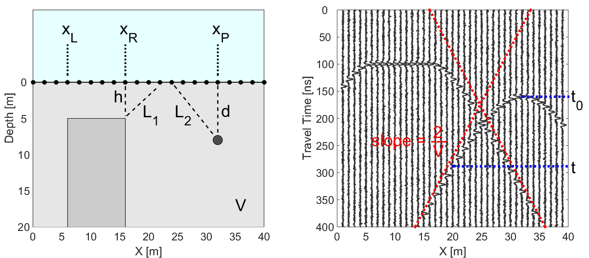
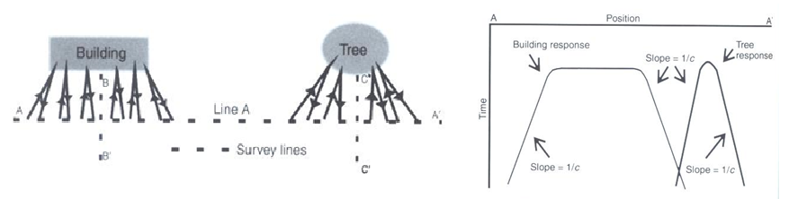
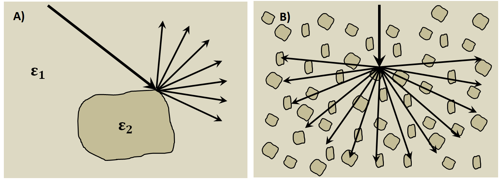

.. _GPR_survey_data:

Survey and Data
***************

Here, we discuss the various survey geometries used in GPR and some of their applications.
Information about the GPR source signal and its impact on planning surveys is presented.
We also discuss sources of noise which may contaminate GPR data.

On this page, you will learn about:

	- Common offset, common midpoint and transillumination surveys.
	- Where these surveys are most effective.
	- What is the source signal used in GPR.
	- The properties of the source signal and how it impacts the effectiveness of GPR surveys.
	- The resolution of GPR surveys.
	- The probing distance of GPR surveys.
	- Sources of noise and their impact on GPR surveys.

Common Offset Survey
====================

	.. figure:: images_new/GPR_common_offset.png
		:align: right
		:figwidth: 40%

        	Common offset survey configuration.

Common offset surveys are the most frequently used configuration for GPR surveys.
In common offset survey, the distance between the transmitter and a single receiver is fixed.
Data are collected each time the transmitter-receiver pair are moved to a new position.
In some cases, the transmitter and receiver are placed at a zero-offset; otherwise known as a coincident source and receiver.

Common-offset surveys are effective for locating the depths of approximately horizontal interfaces.
In addition, zero-offset surveys are very affective a locating pipes, tunnels and compact buried objects; as they generate hyperbolic signatures in radargram data.
Examples of this can be seen below.

Buried Compact Objects
----------------------

Below we see the geometry for a zero-offset survey and the corresponding radargram.
We will show how the geometry of the problem and the radargram can be used to resolve the locations of pipes and blocky objects.

        (Left) Problem geometry showing a buried pipe and a block. (Right) Corresponding radargram for the problem geometry.

In GPR, a **thin pipe** will act as a point reflector.
According to the geometry of the problem, the total travel time of the GPR signal as it reflects off the pipe is given by:

.. math::
	t_p = \frac{2 L_2}{V} = \frac{2 \sqrt{ (x - x_p)^2 + d^2}}{V}

where :math:`V` is the propagation velocity (light gray region) and :math:`d` is the depth to the pipe.
As we can see in the radargram, the arrival times for a compact object form a hyperbola.
When we are directly above the pipe (:math:`x = x_p`), the total travel time is smallest and equal to:

.. math::
	t_p (x_p) = \frac{2 d}{V}

For the **block**, things are a little more complicated.
Above the face of the block (:math:`x_L` = 6 m to :math:`x_R` = 16 m), the signal measured by the receiver reflects directly.
However, the return signal at locations outside the margins of the block occur on the points.
As a result, the total travel time for reflected signals off the block are given by:

.. math::
	t_b = \begin{cases} \dfrac{2 \sqrt{(x-x_L)^2 + h^2}}{V} \;\;\; &\textrm{for} \;\;\; x < x_L \\
	\dfrac{2h}{V} \;\;\; &\textrm{for} \;\;\; x_L \leq x \leq x_R \\
	\dfrac{2 \sqrt{(x-x_R)^2 + h^2}}{V} \;\;\; &\textrm{for} \;\;\; x > x_R \end{cases}

where :math:`h` is the depth to the top of the block.
As we can see from the previous equation, we expect to see a flat feature the block's radargram signature.
Then on either size of the block, the radargram signature resembles one-half of a hyperbola.

**Resolving Buried Objects: Method 1**

In order to locate buried objects, we first need to use the radargram to obtain a velocity for the medium.
Let us begin by considering the pipe.
Notice that at large offset distances from the horizontal location of the pipe (i.e. when :math:`x - x_p \gg d`), the travel time for the pipe becomes:

.. math::
	t_p = \frac{2 L_2}{V} \approx \frac{2 }{V} \Bigg ( (x - x_p) + \frac{1}{2} d \Bigg ) \;\;\; \textrm{for} \;\;\; \Delta x_2 \gg d

Therefore, each end of the hyperbolic signature has a slope :math:`m = \pm 2/V` (red dashed lines).
The slope on the radargram can ultimately be used as a crude approximation for the medium velocity.
Once the medium velocity has been obtained, the depth to the object can be calculated using the minimum travel time.
The minimum travel time for the pipe (blue dashed line) is given by:

.. math::
	t_0 = \frac{2d}{V}
	

Notice that for the block the travel time also shows a slope of :math:`m = \pm 2/V` as we move far enough away.
As a result, we can approximate the medium velocity using the block's radargram signature then use its minimum travel time to get the depth.

**Resolving Buried Objects: Method 2**

Notice that the offset distance must be sufficiently large in order to obtain the medium velocity.
If the offset distance is insufficient, we must use a different method for determining the medium velocity.

Let us first consider the **pipe**.
The total travel time for the reflected GPR signal is given by:

.. math::
	t_p = \frac{2 L_2}{V} = \frac{2 \sqrt{ (x - x_p)^2 + d^2}}{V}

When we are directly over the pipe, we will have a minimum travel time equal to (blue dashed line):

.. math::
	t_0 = \frac{2d}{V}

By combining the two previous equations, we see that:

.. math::
	V = 2 \sqrt{\dfrac{(x - x_p )^2}{t^2 - t_0^2}}

where (:math:`x`, :math:`t`) represents are arbitrary point on the hyperbolic signature within the radargram.
Given that :math:`t_0` and :math:`x_p` can be obtained directly from the radargram, **any other point** on the hyperbola can be used to determine the propagation velocity of the medium.
This may come in handy when a portion of the hyperbola is obstructed by other signals.
Also note that once :math:`V` is determined, the definition of :math:`t_0` can be used to determine the depth of the object.

Notice that for locations to the left and to the right of the block, the total travel time behaves like a hyperbola.
Therefore, we can use the same approach.
The only difference being that :math:`x_p` is replaced by either :math:`x_L` or :math:`x_R`; which depends on the side of the block's signature you use.

Dipping Layers
--------------

So far we have only considered interfaces which are approximately horizontal.
However, the subsurface may consist of dipping layers.
This can lead to challenges when attempting to interpret reflections in the data.

For a zero-offset survey, we can see that the reflected signal returns at an angle.
This is because the reflection happens perpendicular to the surface of the interface in this case.
As a result, the two-way travel time does not correspond to the depth of the interface.
Instead, it corresponds to the minimum travel distance.
If we assume the reflected signal gives us the vertical distance to the interface, we will **under-estimate** the dip of the interface.

.. figure:: images_new/GPR_dipping_layer.png
		:align: center
		:figwidth: 70%
	
		Reflections from a dipping layer for a common-offset survey.

**Migration Correction**

The true dip of the interface can be recovered using circular arcs.
To apply the correction (assuming you have obtained the velocity of the top-layer from the direct ground wave or other means):

1) Obtain the distance from the two-way travel time of the reflection. Assume this represents the vertical distance to the interface. Doing so will give you the dashed line shown in the figure above.

2) For each Tx-Rx position, draw and arc centered at this location, which passes through the under-estimated vertical distance point (found on the dashed line).

3) The true dipping interface is created by drawing a line which intersects all of the arcs at only a single point (black line).

Common Midpoint Survey
======================

        .. figure:: images_new/GPR_common_midpoint.png
		:align: right
		:figwidth: 40%
	
		Common midpoint survey configuration.
		

For this configuration, the distance between the transmitter and receiver are changed for every reading.
However, the halfway point between the transmitter and the receiver is kept the same.
As we will show, common midpoint surveys are useful for determining the top-layer velocity and thickness.

From the survey schematic, we see that if the interface is approximately flat, the point of reflection is the same for all readings.
As a result, the signal from the reflected wave in the radargram should form a hyperbola.

.. figure:: images_new/GPR_example_buried_object_2.png
	:align: right
	:figwidth: 50%

	Geometry shown how radargram can be used to find propagation velocity.

Once again, the travel time for the radiowave signal is given by:

.. math::
	t = \frac{2 \sqrt{ x^2 + d^2 }}{V}

where :math:`d` is the thickness of the top layer and :math:`x` is the distance between the mid-point and either the transmitter or the receiver.
Once again by defining :math:`t_0 = 2d/V`, the top-layer velocity is given by:

.. math::
	V = 2 \sqrt{ \dfrac{x^2}{t^2 - t_0^2} }

Thus, **any point** on the parabola can be used to determine the top-layer velocity from a common mid-point survey.
And once :math:`V` is determined, the definition of :math:`t_0` can be used to obtain the thickness of the top layer.

	.. figure:: images_new/GPR_survey_transillumination.jpg
		:align: right
		:figwidth: 40%
	
	        Transillumination surveys. (A) Mine-shaft structural integrity (B) Borehole survey. (C) Concrete pillar testing.

Transillumination Survey
========================

When performing a transillumination GPR survey, multiple transmitters and receivers are placed on either side of an region of interest.
There are many applications for transillumination surveys, some of which are mentioned here.

In panel (A), a transillumination survey is being used to assess the structural integrity between two mine shafts.
By using GPR, we can determine if there are void spaces between the mine shafts or any potential planes of weakness.
The information collected can be used to assure the mine shaft is safe.

In panel (B), we see a transillumination borehole survey.
In some cases, a surface survey may not supply sufficient information about a particular region of interest.
Although it is more expensive and time-consuming, this type of survey may be required.

In panel (C), a GPR transmitter and receiver are placed on opposing sides of an object; in this case, a concrete pillar.
This represents a non-invasive approach for determining internal structures.

.. sidebar:: Wavelet Example

	.. figure:: images_new/GPR_wavelet_example.png
		:align: center
		:figwidth: 100%
		
		Example of a wavelet signal.
		
		
	
	.. figure:: images_new/Electromagneticwave3D.gif
			:align: center
	
			Electromagnetic waves contained within the GPR pulse. `Image source <https://commons.wikimedia.org/wiki/File:Electromagneticwave3D.gif>`__ .
	
	
	
	.. figure:: images_new/GPR_wavelet_frequencies_example.png
		:align: center
		:figwidth: 100%
			
		Band of frequencies for a particular wavelet.

Source Signal
=============

As we have already discussed, the source antenna sends a pulse of radiowaves into the ground.
Radiowaves carry oscillating electric and magnetic fields.
As it turns out, the pulse is not made up entirely of radiowaves of a single frequency.
Instead, a set of sinusoidal EM waves of similar frequencies are used create what is called a wavelet.
As a result, the wavelet contains information over a range of frequencies (generally between :math:`10^6` and :math:`10^9` Hz).

Before we move forward let us define a few terms:

	- **Wavelet**: A wave-like oscillation of short duration.
	- **Bandwidth**: The range of frequencies present in the source wavelet.
	- **Pulse Width**: The time duration of the wavelet.
	- **Spatial Length (wavelength)**: The physical length of the wavelet signal while it propagates through a medium.
	- **Central Frequency**: The central frequency corresponding to the bandwidth. In general, the central frequency defines the propagation of the GPR signal.

GPR Signals and Bandwidth
-------------------------

The figure below can be used to examine the relationships between the 5 aforementioned terms.
As we can see, the bandwidth and central frequency for the GPR signal depend on the pulse width of the wavelet.
Here are a few important relationships to keep in mind:

**1)** For a pulse width :math:`\Delta t`, the central frequency :math:`f_c` is given by:

.. math::
	f_c = \frac{1}{\Delta t}

As a result, longer wavelets generally contain lower-frequency information.
Frequencies corresponding to GPR signal are around 100 MHz to 1 GHz.
This results in pulse widths around 1 ns to 10 ns.

**2) The bandwidth increases as the pulse width decreases.**
In order to create a wavelet with a longer pulse width, only frequencies near the central frequency are needed.
However, a large range of frequencies (or bandwidth) is needed to create wavelets that have short pulse widths.

**3) The spatial length (wavelength) increases as the pulse with increases**.
As we can see from the figure below, the "wave envelope" is longer for wavelets that have a long pulse width.

.. figure:: images_new/GPR_pulse_bandwidth.png
		:align: center
		:figwidth: 65%

GPR Signals and Spatial Length
------------------------------

The spatial length of the GPR wavelet signal is different as it moves through different materials.
For a wavelet with central frequency :math:`f_c` moving at velocity :math:`V`, the wavelength :math:`\lambda` is given by:

.. math::
	\lambda = \frac{V}{f_c} = \frac{c}{f_c \sqrt{\varepsilon_r}}

where :math:`c = 3.00 \times 10^8` m/s is the speed of light and :math:`\varepsilon_r` is the relative permittivity.
This expressions shows that if the signal is moving through a material with a higher dielectric permittivity, it will move slower and it will have a larger spatial width.
It also shows that GPR signals with higher central frequencies have shorter spatial widths.

Recall that the central frequency is the reciprocal of the pulse width (:math:`f_c = 1/\Delta t`).
Thus:

.. math::
	\lambda = V \, \Delta t = \frac{c \, \Delta t}{\sqrt{\varepsilon_r}}

Therefore, shorter pulse widths result in shorter spatial lengths.
This was stated in the previous subsection.

Examine the gif in :numref:`fig_gpr_layeredearth_gif`.
Examine the wave as it propagates through both the ground and the Earth.
In which medium is the wavefront thicker/thinner?
In which medium is the GPR signal moving slower/faster?
Does this make sense from the equations above?

Survey Resolution and Probing Distance
======================================

The pulse width, and thus the frequency content contained within the GPR signal, is a very important aspect of planning a GPR survey.
The concepts of resolution and probing distance are discussed here.

Vertical Resolution for Layers
------------------------------

Resolution defines the smallest features which can be distinguished in a GPR survey.
The vertical resolution for GPR surveys depends on the pulse width of the signal.

In order for a layer to be detected using a GPR survey, it must be sufficiently thick compared to the wavelength of the incoming wavelet.
As a general rule, the layer must be at least 1/4 the wavelength of the incoming wavelet to be detectable.
Thus:

.. math::
	L >  \frac{\lambda}{4} = \frac{c}{4 f_c \sqrt{\varepsilon_r}} = \frac{c \Delta t}{4 \sqrt{\varepsilon_r}}

where :math:`L` is the layer thickness, :math:`c/\!\sqrt{\varepsilon_r}` is the propagation velocity for radiowaves, :math:`\Delta t` is the pulse width and :math:`f_c` is the central frequency.
As we can see from this expression, higher frequencies/shorter pulse widths are required to observe smaller features.
This means higher frequencies/shorter pulse widths are used for higher resolution surveys.

Horizontal Resolution for Objects
---------------------------------

.. figure:: images_new/GPR_resolution_horizontal.png
		:align: right
		:figwidth: 35%
		
		
When the resolution of the survey is sufficient, returning signals from separate buried objects are distinguishable.
However, if buried objects are too close to one another, their respective returning GPR signals can be hard to differentiate.
In general, we can distinguish the signals from two nearby objects so long as:

.. math::
	L > \sqrt{\dfrac{V \, d}{2 f_c}}

where :math:`V` is the propagation velocity, :math:`f_c` is the central frequency for the wavelet, :math:`d` is the depth to the objects and :math:`L` is the separation distance from both objects.
We can see from this equation, that by reducing the pulse length, we can see objects that are closer together.
Additionally, it is harder to distinguish objects which are further away from the transmitters and receivers.

Probing Distance
----------------

.. figure:: images_new/GPR_probing_distance_2.jpg
	:align: right
	:figwidth: 50%

	Proving distances for GPR signals for various materials.

Probing distance characterizes the maximum depth in which GPR signals can be used to obtain information about subsurface structures.
For materials which have larger skin depths, radiowaves can penetrate deeper into the ground and still provide a sufficiently strong returning signal.

As a general rule, the probing distance (:math:`D`) is approximated 3 :ref:`skin depths <GPR_fundamental_principles_skin_depth>`.
If we assume the Earth is non-magnetic (:math:`\mu_r = 1`):

.. math::
	D = 3 \delta \approx
	\begin{cases} 1510 \sqrt{\dfrac{1}{\sigma f}} \; \; &\textrm{for} \;\; \omega \varepsilon \ll \sigma \\ 
	0.0159 \dfrac{\sqrt{\varepsilon_r}}{\sigma}  \; \; &\textrm{for} \;\; \omega \varepsilon \gg \sigma \end{cases}
	

.. figure:: images_new/GPR_probing_distance.jpg
	:align: right
	:figwidth: 50%
		
	Probing distance for various materials from 1 MHz through 1 GHz.
		
		
On the right we see figures which show probing distances for various materials.
Using these figures, we can see that:

	- In general, as the frequency increases, the skin depth decreases and the probing distance decreases.
	- Frequencies used for GPR are :math:`\sim` 1 GHz. Therefore, the probing distances for GPR signals are generally quite shallow.
	- It is very difficult for GPR signals to penetrate concrete and asphalt, as the probing distance is only about 1 m for GPR.
	- Water saturated sedimentary rocks, such as clays and sandstones, have much lower probing distances than dry sedimentary rocks.
	- Rocks saturated with sea water have much smaller probing distances than rocks saturated with fresh water.
	- The probing distances for hard rocks (granites, limestones, schists...) is quite large.

Probing Distance versus Resolution
----------------------------------

.. sidebar:: Radargrams at Several Resolutions (Underground tunnels)

	.. figure:: images_new/GPR_resolution_high.jpg
		:align: center
	
		Higher resolution radargram (200 MHz).

	.. figure:: images_new/GPR_resolution_mid.jpg
		:align: center
		
		Medium resolution radargram (100 MHz).
	
	.. figure:: images_new/GPR_resolution_low.jpg
		:align: center
		
		Lower resolution radargram (50 MHz).

On the right we see several radargrams corresponding to data collected over two buried tunnels (hyperbolic features).
Each radargram was collected using a different frequency.

By using a 200 MHz central frequency, we are hoping to obtain a high resolution radargram.
However, the attenuation of radiowaves is more severe at higher frequencies.
As a result, the GPR signal does not penetrate deep enough to image either of the tunnels.
At 100 MHz, both tunnels become partially visible in the radargram (hyperbolic signatures).
This is made possible because because the probing distance is larger.
In the 50MHz radargram, both tunnels are easily recognizable.
This is made possible because the probing distance is now large enough.
Notice however, that the hyperbolic features in the radargram are slightly less distinct.

We can see from this example that there is a compromise between resolution and probing distance.
It is important to choose a frequency which is high enough to image sufficient small features.
However, the probing distance of the background medium must be large enough to obtain a return signal.

GPR and Sources of Noise
========================

Noise is used to describe any measured signal which does not correspond to signals from desired targets.
When the sources of noise are sufficiently large, it can be difficult to identify and classify signals in radargrams.
That is why it is necessary to take steps which minimize the impact of external noise sources on the data.
Below are some sources of noise relevant to GPR and their impact.

**Radiowaves from Other Sources**

.. figure:: images_new/GPR_noise_sheild.jpg
	:align: right
	:figwidth: 50%
		
	Some external sources of noise related to GPR system, which can be reduced through shielding.

Much of 21st century communication is made possible with radiowaves.
Cellular phones, radio towers and other transmitting systems all use radiowave frequencies to transmit information through the air.
These signals can be measured by the receiver and have the potential to mask responses from desired targets.
To limit the effects of external sources, the transmitter and receiver are frequently protected by a shield (as depicted in the image).

**Returning Signals from Above-Ground Objects**

GPR is used to gain information about structures below the Earth.
However, since radiowaves propagate through the air, it is possible to measure returning signals from nearby objects as well.
This is common in urban and wooded environments where GPR signals can reflect off of buildings and trees.

.. figure:: images_new/GPR_noise_trees.jpg
	:align: right
	:figwidth: 50%
		
	Zero-offset radargram example containing returning signals from nearby trees.

On the right, we see an example of a radargram for a zero-offset configuration.
The survey was performed in a wooded area without using a shield.
Because the trees acts as point reflectors, they produce hyperbolic signatures in the radargram.
Using the slope on either end of the hyperbola, we find that the propagation velocity associated with this reflection is :math:`2/c`; this is demonstrated with a line.
This verifies that the signature must correspond to an object which is above the ground.
And we can infer that signatures after 100 ns correspond to nearby trees.

Below, we show the two-way travel path for reflected signals off a tree and a building.
A diagram showing the different radargram signatures for both the tree and the building is also provided.
Unlike the tree, the face of the building is not a point reflector.
However, the ends of the signature corresponding to the building also have slopes which are :math:`2/c`.
Thus, we can infer the propagation velocity.

To avoid measuring signals such as these, shields may also be used on the transmitter and receiver.
However, if signals from above ground objects are present in the radargram, they can be be identified for zero-offset configurations by their slope.

		
	Zero-offset radargram example for returning signals from a tree and building wall.

**Ringing**

Ringing occurs when radiowave signals reverberate in regular fashion.
This is created when GPR signals repeatedly bounce within or between nearby objects.
In response to ringing, the returning signal from a particular interface(s) is not 'sharp' in the radargram.
Instead, it becomes present over all times.

.. figure:: images_new/GPR_wire_surface.png
	:align: center
	:figwidth: 80%
		
	(Left) Radargram showing ringing from a small metal wire near the surface. (Right) Ringing from two nearby objects.

**Noise from Scattering**

As we mentioned earlier, scattering is used to describe deviations in the paths of electromagnetic waves due to localized non-uniformities; which are less than 1/4 the wavelength of the radiowave signal.
Scattering is problematic for GPR because it reduces the amplitudes of useful signals while increasing extraneous noise.
If the Earth is made up of homogeneous units, scattering is negligible and returning GPR signals are easily visible.
If the Earth is very inhomogeneous, the effects of scattering may produce significant extraneous noise.

		
	Examples of scattering. A) Scattering from irregular surface texture. B) Scattering in rocky soils.

Below, we show a representation of data from a single Tx-Rx shot.
On the left, scattering is negligible and the returning wavelet is easily visible.
On the right, the returning wavelet is hard to see due to incoherent noise cause by scattering.
In addition, we see that the amplitude of the returning wavelet signal is less, as scattering resulted in a loss in amplitude.

.. figure:: images_new/GPR_scattering_return_signal.png
	:align: center
	:figwidth: 70%
	
	Return signals with different levels of scattering noise (Left) Minimal noise. (Right) Significant scattering noise. 

