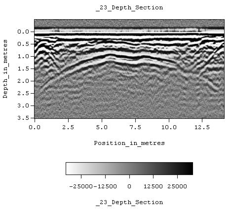

.. _GPR_index:

Ground Penetrating Radar
========================

.. figure:: images_new/GPR_picture_example.jpg
		:align: right
		:figwidth: 25%

                Archaelogical GPR survey in Jordan. `Image source <https://commons.wikimedia.org/wiki/File:Radarsurvey.jpg>`__ . Licensed under `CC BY 3.0`_.

Ground penetrating radar (GPR) is an electromagnetic method used for very near surface exploration; i.e. depths on the order of a few meters.
It is sometimes referred to as echo-sounding.
GPR exploits contrasts in the Earth's electromagnetic properties in order to define the physical boundaries of shallow structures.
Physical properties important to GPR include: dielectric permittivity, electrical conductivity and magnetic permeability.
Ground penetrating radar is used for a variety of applications.
These include:

	- Investigating concrete structures and roads
	- Mapping the thickness of peat-bogs and other sedimentary layers
	- Obtaining the depth to groundwater or permafrost
	- Locating buried infrastructure such as irrigation pipes, tunnels and electrical wires
	- Finding landmines and unexploded ordnance

.. figure:: images_new/GPR_schematic_example.jpg
		:align: right
		:figwidth: 55%

                Schematic of a zero-offset GPR setup.

During GPR surveys, a source (:math:`Tx`) is used to send a pulse of high-frequency electromagnetic waves (radiowaves) into the ground.
As the radiowaves propagate through the Earth, they are distorted as a result of the Earth's electromagnetic properties.
At boundaries where the Earth's electromagnetic properties change abruptly, radiowave signals may undergo transmission, reflection and/or refraction.
Because of this, much of the understanding of seismic methods can be applied to ground penetrating radar.

                Radargram example. Gray-scale shows the amplitude of the returning signal. `Image source <https://commons.wikimedia.org/wiki/File:Calvary_line_23.jpg>`__ . Licensed under `CC BY 3.0`_.

Sensors (:math:`Rx`) at the Earth's surface measure the amplitudes and travel times of the distorted radiowave signals that return to the surface.
These data are amalgamated and represented using a radiogram.
It is from radiograms that we will do the majority of our interpretation of GPR data.

                

**Contents**

.. toctree::
   :maxdepth: 1
 
   
   GPR_physical_properties
   GPR_fundamental_principles
   GPR_sources
   GPR_concepts_and_examples
   