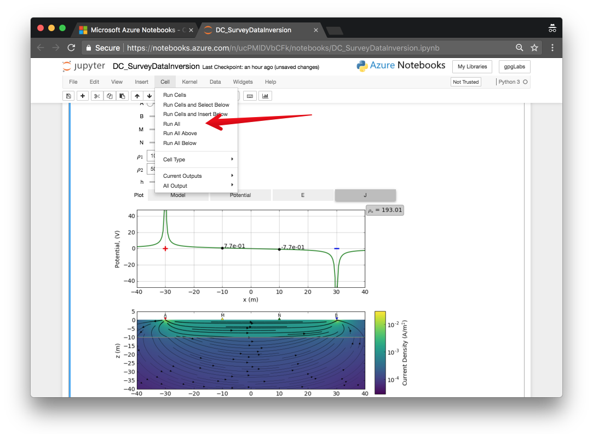
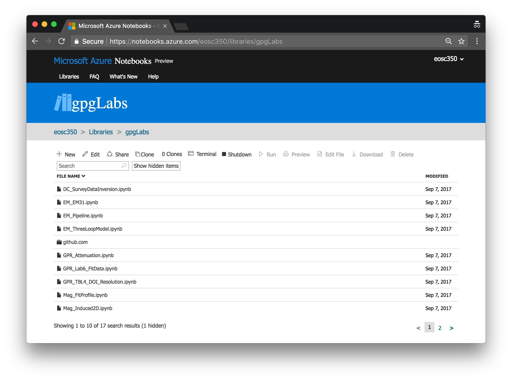

.. _apps:

Apps
====

.. image:: https://mybinder.org/badge.svg
    :target: https://mybinder.org/v2/gh/geoscixyz/gpgLabs/main?filepath=notebooks%2Findex.ipynb
    :align: center

There are apps available as Jupyter_ notebooks that accompany the GPG. We recommend using :ref:`binder` to access the apps.

.. _jupyter_notebooks:

Jupyter Notebooks
-----------------

Within the Jupyter Notebook environment, you can use :code:`shift + enter` to run
each cell of code, or from the menu, select :code:`cell, run all`

.. _binder:

Binder
------

.. image:: https://mybinder.org/badge.svg
    :target: https://mybinder.org/v2/gh/geoscixyz/gpgLabs/main?filepath=notebooks%2Findex.ipynb
    :align: center

1. Launch the binder by clicking on the badge above or going to: https://mybinder.org/v2/gh/geoscixyz/gpgLabs/main?filepath=notebooks%2Findex.ipynb
   This can sometimes take a couple minutes, so be patient...

2. Select the notebook of interest from the contents

3. :ref:`Run the Jupyter notebook <jupyter_notebooks>`

.. image:: https://em.geosci.xyz/_images/binder-steps.png
    :alt: binder-steps
    :width: 100%
    :align: center

Azure Notebooks
---------------

They can also be run online through

- https://notebooks.azure.com/eosc350/libraries/gpgLabs

Installing locally
------------------

If you
are familiar with python and github, you can install them via
https://github.com/geoscixyz/gpgLabs

.. _Jupyter: http://jupyter.org

