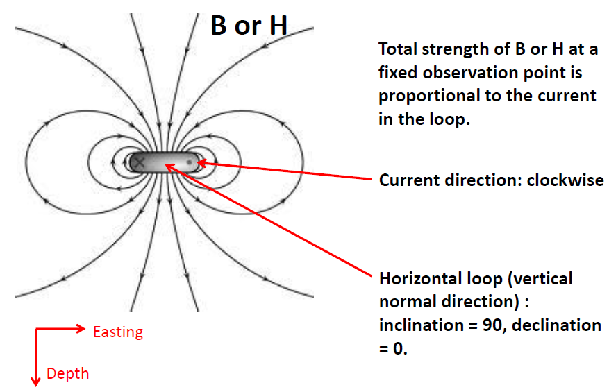
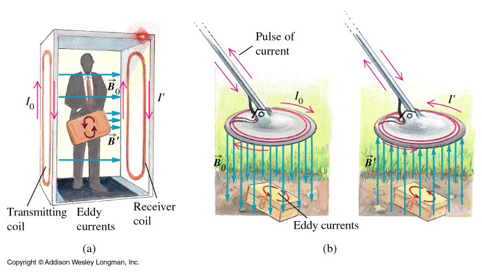
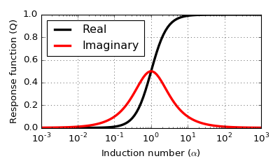
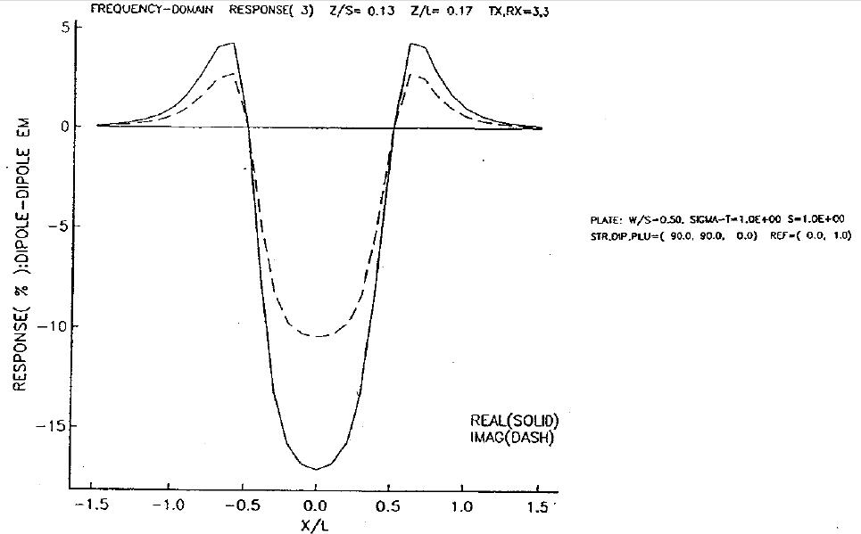
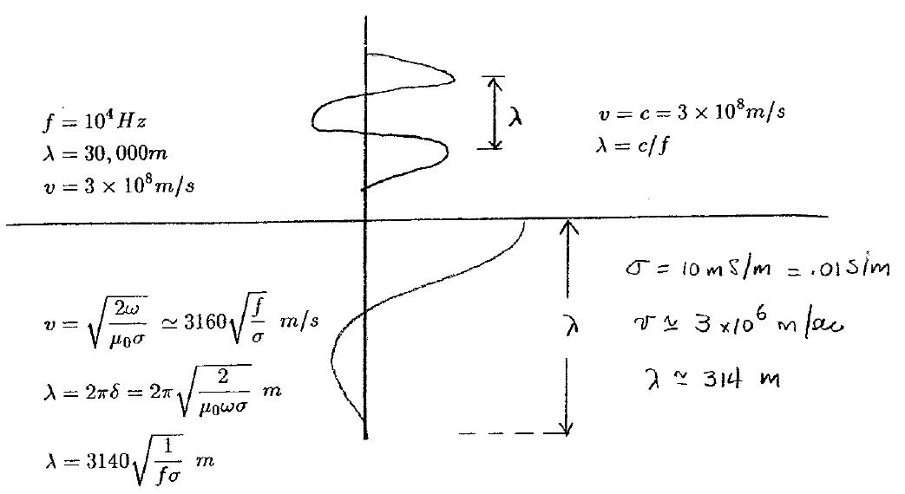

.. _electromagnetic_basic_principles:

Basic Principles
****************

.. Purpose: This section provides the key components to understand the electromagnetic experiment. As briefly summarized in the :ref:`Introduction<electromagnetic_introduction>` section, theelectromagnetic survey requires a magnetic or electric source. Rocks inside the earth respond to the electric and magnetic field and give rise to secondary fields. Electrical force can be generated, in two ways:

.. 1. Battery (Each terminal of the battery can be thought of as storing a
..    positive or negative charge. The "voltage" of the battery is directly
..    proportional to the amount of stored charge). Upon completion of the circuit
..    there will be an electric field :math:`\vec{E}` (volts/m) set up in the body.
..    The electric field is a vector: it has both direction and magnitude. The force
..    that any charge :math:`q` feels is given by :math:`\vec{F} = q \vec{E}`. Unit
..    positive or negative charges will feel the same magnitude of force but
..    directions will be opposite. Since like charges repel and unlike charges
..    attract, the negative charges will be attracted to the positive terminal of
..    the battery and the positive charges will be attracted to the negative
..    terminal.
..
.. .. figure:: ./images/grounded-source.svg
..     :align: center
..     :scale: 60 %

Electromagnetic survey methods are based on two fundamental principles: Faraday's law of electromagnetic induction and the fact that electric currents generate magnetic fields, expressed in Ampère's law. In its simplest form Faraday's law states that the electromotive force (EMF) in a closed circuit is proportional to the rate of change of magnetic flux through the circuit, or in even simpler terms: a changing magnetic field will induce an EMF.

.. In a typical EM experiment, a time varying electric current is passed through a wire loop to generate a time-varying magnetic field.

The magnetic flux :math:`\phi_B` which crosses a closed loop is given by

.. math::
    \phi_B = \int_{area} \vec{B} \cdot \hat{n} \; d\vec{a}

where :math:`\hat{n}` is the outward pointing normal vector for the loop and :math:`\vec{B}` is the magnetic flux density, which is proportional to the magnetic field in free space. This is illustrated in the diagram below

.. figure:: ./images/IntFaradayDiagram-emf-version.svg
     :align: center
     :figwidth: 100%
..     :scale: 30 %

Faraday's law relates the magnetic flux through the surface bordered by the loop to the induced EMF in the loop

.. math::
  V = - \frac{d \phi_B}{dt}.

Recall that the current :math:`I` flowing in the wire is related to the EMF through Ohm's law

.. math::
  V = IR,

where :math:`R` is the electrical resistance of the circuit.

We can start to develop an intuition about Faraday's law using the example of a permanent magnet moving through a coil of wire. The electric field generated by the moving magnet creates an electric force on the charges in the wire, causing current to flow. You can explore this example interactively using the applet below from `PhET <https://phet.colorado.edu/en/simulations/faraday>`__.

.. raw:: html

  <iframe src="https://phet.colorado.edu/en/simulations/faraday" width="700" height="525" scrolling="no" allowfullscreen></iframe>

We can observe several characteristics of EM induction using the applet:

1) The voltmeter only registers a signal when the magnet is moving, regardless of its absolute position.
2) The sign of the induced voltage changes depending on the direction of motion and orientation of the magnet
3) The magnitude of the voltage depends on how quickly the magnet is moving
4) All else being equal, the voltage induced in the four coil loop is larger than in the two coil loop.

.. .. figure:: ./images/induced_field.jpg
..     :align: center
..     :scale: 70 %
..
.. In the above example the changing the magnetic field was produced by a moving
.. magnet. There are other ways in which we can generate a magnetic field. A
.. current in a wire produces a magnetic field outside the wire. It follows that
.. a changing magnetic field outside the wire can be achieved by changing the
.. current in the wire. This can be done by:
..
.. a. having the wire connected to a generator which produces a sinusoidal
..    current. This leads to Frequency Domain methods.
..
.. .. figure:: ./images/sinusoidal_current.jpg
..     :align: center
..     :scale: 70 %
..
.. b. having a steady-state current and then switching it off. This leads to Time
..    Domain methods.
..
.. .. figure:: ./images/steady_state_current.jpg
..     :align: center
..     :scale: 70 %

**Lenz's Law**:The direction of the induced current in Faraday's law is such that its magnetic field opposes the change in flux. That is, nature does not like changing magnetic fields. This is the reason for the minus sign in Faraday's law. The following video from the Technical Services Group at MIT's physics department shows Lenz's law in action.

.. raw:: html

    
<iframe width="560" height="315" src="https://www.youtube.com/embed/N7tIi71-AjA?rel=0" frameborder="0" allowfullscreen></iframe>

The magnetic fields of various current sources
==============================================

The shape of the magnetic field due to an electric current in a wire depends on the shape of the wire. The magnetic field of a closed loop source will be approximately that of a perfect magnetic dipole when observed far enough from the loop. A good rule of thumb is that we can use the dipole approximation when the distance from the loop is more than five times its diameter. Put mathematically, the approximation holds when :math:`r\, >>\, a` where :math:`r` is the distance from the observer to the center of the loop and :math:`a` is the radius of the loop. The magnetic moment from a loop is :math:`\vec{m} = IA \hat{n}`, where :math:`I` is the current in the loop, :math:`A` is its area, and :math:`\hat{n}` is the unit vector perpendicular to the plane of the loop. In this course we will consider frequency domain transmitters. These are transmitters driven by a harmonic current, that is, a current that varies sinusoidally in time. The magnetic field of a dipole is given by the magnetization multiplied by a geometric factor, which implies that the primary magnetic field due to the transmitter will be harmonic in time: :math:`\vec{H}_p = \vec{H}_0 \cos(\omega t)`.

    : Magnetic field do to a circular current loop

If you're interested in a more detailed discussion of the field of a magnetic dipole, please see the `Wikipedia page <https://en.wikipedia.org/wiki/Magnetic_dipole>`__.

See the following video from the University of Sydney to help visualize the fields of various current loop configurations

.. raw:: html

  <iframe width="560" height="315" src="https://www.youtube.com/embed/V-M07N4a6-Y?rel=0" frameborder="0" allowfullscreen></iframe>

.. Comment: If the input source is a battery or generator which has electrode terminals connected to the earth then this is called a "grounded" source. It forms the input for many geophysical experiments (DC resistivity, IP, CSAMT).

.. If the source is a loop of wire then this is an "inductive source". The EM-31 experiment falls into this category. Inductive experiments are generally less labor intensive (no electrodes need be pounded into the ground) and they can be flown in aircraft so large amounts of data can be acquired quickly and (fairly) cheaply.

Everyday examples of EM induction
=================================

EM induction is at work in everyday devices as well as in geophysics. A common example is the metal detector. Figure :numref:`metal_detectors` shows metal detectors at work at airport security and searching for a buried object.

    : Electromagnetic fields used in metal detectors.

In both cases we see that a current :math:`I_0` flowing in a transmitter coil generates a magnetic flux density :math:`\mathbf{B}_0`. As :math:`\mathbf{B}_0` changes in time, eddy currents are generated in metallic objects. These eddy currents oscillate in time with the same periodicity as the transmitter current and generate a secondary magnetic field :math:`\mathbf{B}'`. The primary and secondary fields both pass through the receiver coil (in the handheld metal detector the transmitter and receiver coils are concentric) generating a secondary current :math:`I'` that can be measured.

Circuit model for EM induction
==============================

Consider the goal of using an inductive EM source to locate a conductive body buried in a relatively non-conductive (also called resistive) host material. The basic picture is shown in :numref:`3loops_conductor_loop`.

.. figure:: ./images/Concepts_3loops-conductor-and-loop.png
    :align: center
    :scale: 70 %
    :name: 3loops_conductor_loop

    : Conceptual diagram for three loops

Eddy currents are generated in the buried body by changing magnetic flux passing through the body. We can learn a lot about the coupling between the transmitter, buried body and receiver by approximating the buried body by a wire coil with resistance :math:`R` and inductance :math:`L`. The resistance approximates the electrical resistivity of the earth and the inductance is a geometrical quantity that depends on the shape of the loop. The following discussion of the circuit model will be mostly conceptual. For a more detailed and quantitative discussion please see the `em.geosci <http://em.geosci.xyz/content/maxwell3_fdem/circuitmodel_for_eminduction/index.html>`__ resource--(not required for eosc 350.

Transmitter and primary field
-----------------------------

In this course we will consider small loop transmitters with current varying sinusoidally in time. These are known as harmonic or frequency domain transmitters. We will only consider transmitters small enough that the primary magnetic fields they generate are approximately dipolar, as illustrated in figure :numref:`loop_dipole_field` above. Electromagnetic induction transmitters operate over range of frequencies---roughly :math:`10^1` Hz - :math:`10^4` Hz. Note that this is a much lower frequency band than is used in GPR surveys, which can range from :math:`10^6` Hz - :math:`10^9` Hz.

.. The direction of the field depends on the orientation of the transmitter loop.

Receiver
--------

The receiver is most often also a wire coil The voltage recorded in the receiver coil will be proportional to the rate of change of magnetic flux through the loop. One could also measure the magnetic field directly using a magnetometer but this is not common practice.

Coupling between transmitter and buried loop
--------------------------------------------

Recall that current is only generated in a loop by the normal component of the changing magnetic flux passing through it. The magnetic flux is vector quantity. The closer the direction of the primary magnetic flux is to the normal of the buried loop, the better the coupling, as illustrated in figure :numref:`coupling_effects` below

.. figure:: ./images/CouplingEffects.png
    :align: center
    :scale: 50 %
    :name: coupling_effects

    : Couppling effects.

The effect on the secondary field of the relative positions and orientations of the transmitter, receiver, and buried loop can be summarized by a coupling coefficient, which we will denote :math:`C` . The ratio of the secondary field to the primary field is the product of coupling coefficient and an inductive response function :math:`Q` that depends on the frequency of the transmitter and the resistance and inductance of the target loop:

.. math::
  \frac{H_s}{H_p} = CQ(\alpha) = \frac{\alpha^2 + i\alpha}{1 + \alpha^2}

where :math:`\alpha = \omega L/R` is called the induction number. See `em.geosci <http://em.geosci.xyz/content/maxwell3_fdem/circuitmodel_for_eminduction/understanding_harmonicEMresponse.html#>`__ for full derivations of the coupling coefficient and inductive response function.

The secondary field will have a much smaller amplitude than the primary field (units of field measurements are often parts per million) and also a phase shift. We can decompose the signal into a component in phase with the transmitter and another component one quarter period out of phase, called the quadrature component. These components can be represented as a complex number whose real part is the in-phase secondary field and whose imaginary part is the quadrature signal.

For a given coupling constant, the character of the secondary field can vary considerably as a function of the induction number :math:`\alpha`, as illustrated in the following plot

Measured responses
------------------

.. .. figure:: ./images/Hp_Hs_schematic.jpg
..     :align: center
..     :scale: 80 %

The basic understanding of the different coupling between the source and receiver that is due to geometry allows us to sketch the expected responses that arise from a frequency domain horizontal loop survey taken over a conductor which is buried in a resistive host. This is a two-stage process.

1. Use the geometries of the source and receiver to sketch the characteristic
   curve.
2. Use the response diagram and the knowledge of whether you are
   dealing with a good conductor or poor conductor to determine the relative
   amplitude of the in-phase and out-of-phase parts.

**Part I:** Consider the basic geometry shown in the figure below

 .. figure:: ./images/Coupling_3loops.png
    :align: center

There is a time-varying magnetic field due to the transmitter passing through the buried loop and hence induced currents in the buried loop. Those currents generate secondary magnetic fields. The primary field is shown in grey in the left-hand image and the secondary field due to that transmitter is shown in red on the right. Note that the primary and secondary fields point in opposite directions as they pass through the receiver loop.

We adopt the convention that if the secondary field is in the same direction as the primary field then the response will be plotted as a positive value. Alternatively, when the two fields are in opposition the response will be negative. The distance between the transmitter and receiver loops is held fixed and the-datum is plotted at the midpoint between the coils. When both loops are to the left, or to the right, of the buried loop then the response is positive. The response will be zero when either coil is over the buried loop. When the receiver, which is a horizontal coil, is over the loop, then no magnetic flux is passing through the coil. There will be zero voltage induced. When the transmitter is directly over the buried loop, there is no flux crossing the loop, hence no currents will be generated in it and the secondary magnetic field is zero.

..  .. figure:: ./images/source_receiver_signal.jpg
..     :align: center
..     :scale: 70 %

**Part II:** The basic sketch for the shape of the anomalous signal is
determined from the geometry of the coils and the relative locations of
transmitter, receiver and the conductive body. In practice we measure both an
in-phase and an out-of-phase component. Each of these curves will have the same general shape as the one plotted above. We need only establish their relative amplitudes. From the general response curve we find that the in-phase (or real component) is larger than the out-of-phase (imaginary) component when :math:`\omega \sigma`
(or :math:`\omega L / R`) is large.

Below we plot the responses for a survey taken over a buried loop

Because the body is conductive and the frequency of the survey is high, the
value of :math:`\omega L / R` is large and the in-phase response is larger than
the quadrature response.

Conductive Host
===============

The sketches regarding EM responses were derived under the simplifying
assumptions that the buried body was in a very resistive medium. Consequently,
the response depended only upon the relative orientations of the source coil
and the body (the coupling effect), the conductivity of the body and the
frequency of the transmitter, and the coupling effect of the secondary
magnetic fields with the receiver.

In more realistic situations the object of interest in buried in a conductive
medium.

.. figure:: ./images/buried_object.jpg
    :align: center
    :scale: 80 %

The laws of EM induction require that there be eddy currents that are also set
up in the host. But any conductive material in which currents are flowing is a
"lossy" medium. That is, there are :math:`I^2R` losses which convert the
electromagnetic energy to heat. As a consequence the energy from the source
does not propagate to arbitrarily large depths in the earth. The amplitude of
the EM fields thus decrease due to geometrical spreading and attenuation.

Primary field in a conductive earth
-----------------------------------

We have gained insight in the material above by ignoring the background earth and assuming the EM induction happens only in an isolated target of interest. In that setting, the primary field propagates through the background earth as if it was free-space. In reality the earth has some non-zero electrical conductivity, which will cause it to decay more quickly than it would in free-space. The strength of the primary field in the earth will depend upon:

#. frequency of the transmitter
#. conductivity of the background material
#. geometry of the source

Considerable insight can be obtained by ignoring the geometry of the
source and observing how a plane electromagnetic wave decays as it propagates
into the earth. An incoming sinusoidal wave with frequency :math:`\omega = 2 \pi
f` travels in the atmosphere at the speed of light :math:`c = 3 \times 10^8`
m/s and has a wavelength :math:`\lambda = c/f`. When the wave enters the
conducting earth it still propagates as a sinusoid but it travels much slower
and attenuates rapidly. An example, with numbers for speed and wavelength is
given below.

The wave attenuates so fast that it only propagates about a wavelength into
the earth. Because the amplitude diminishes so rapidly and the waves travel so
slowly, we generally talk about the EM wave "diffusing" into the earth. The
amplitude of the field decays exponentially with depth according to the
diagram given below.

.. figure:: ./images/field_decay.jpg
    :align: center
    :scale: 70 %

.. math::
        H  &= H_0 e^\frac{-(1-i)z}{\delta}\\[0.4em]
       \mid H \mid &= H_0 e^\frac{-z}{\delta}

**Skin Depth:** This is the depth by which the amplitude has decayed to
:math:`1/e` of its surface value. We have already encountered the concept of skin depth in the GPR unit. For a uniform halfspace of conductivity
:math:`\sigma`, and at the low frequencies used in EM induction surveys, the skin depth :math:`\delta` may be approximated as

.. math::
        \delta \approx \sqrt{\frac{2}{\mu_0 \omega \sigma} } \approx 500\sqrt{\frac{\rho}{f}}

where :math:`\rho = 1/\sigma` is resistivity and :math:`\omega/(2\pi)` is frequency.

At the Buried Body
------------------

There is a time varying magnetic field impinging upon the conductor. This sets
up an electric force which causes currents to flow. The strength of the
current is determined by Ohm's law:

.. math::
        \vec{J} = \sigma \vec{E}

where :math:`\vec{J}` is current density in :math:`A/m^2` (amperes per meter
squared) and :math:`\vec{E}` is the electric field with units of Volts/meter. This is the version of Ohm's law for extended three-dimensional bodies, analogous to Ohm's law for circuits: :math:`I=V/R`, where :math:`R` is the electrical resistance of the circuit.

The currents in the body produce their own magnetic fields just as in the case of a loop. These currents will also vary with time and their magnetic field can be measured at the transmitter. We refer to these fields as the "secondary" magnetic field, :math:`\vec{H_s}`. Note that the secondary field may be out of phase with the primary field.

**Summary**

1. A time varying current in a transmitter produces a time varying magnetic
   field which impinges upon a conductor in the ground.
2. The changing flux generates and electric field everywhere.
3. The electric field generates currents via Ohm's Law, :math:`\vec{J} = \sigma \vec{E}` .
4. The currents produce their own magnetic fields.
5. The receiver measures the sum of the primary and secondary fields,
   (or it measures associated voltages.)
