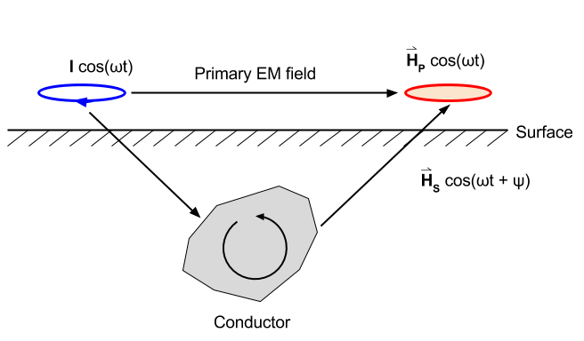

.. _electromagnetic_data:

Frequency Domain Data
**********************

Nature of the total field
=========================

Consider a frequency domain source. This could be a loop on the ground or in
the air.

1. The primary field is harmonic :math:`\cos(\omega t)`. At the receiver, the
   primary field can be written as :math:`\vec{H}_p \cos(\omega t)`.

2. The currents induced in the conductor will also be harmonic with the same
   frequency :math:`\omega`. They will, however, have a different phase. The
   resultant secondary field from these currents must also have the same
   frequency dependence. Hence, the secondary field can be written as :math:`\vec{H}_s \cos(\omega
   t + \psi)`, where :math:`\psi` is a phase angle.

At the receiver, we observe the sum of the primary and secondary fields, which
is given by

.. math::
        \vec{H}_{total} = \vec{H}_p \cos (\omega t) + \vec{H}_s \cos (\omega t + \psi)

The Phase of the Secondary Field
================================

If the primary field is harmonic with frequency :math:`\omega` then the
secondary field is also harmonic. The secondary field will have a different
phase than the primary; it will lag the primary field by angles between 90°
and 180°. The amount of phase difference is diagnostic of the conductivity of
the body.

1. The primary current varies as :math:`\cos(\omega t)` and hence the primary
   magnetic field also has this same dependence. (The primary field is in-phase
   with the current).

2. At the conductive body the EMF (induced voltage) is

.. math::
        \mathcal{E} = - \frac{d \phi_B}{dt}

If the primary current varies as :math:`\cos(\omega t)`  then the flux,
:math:`\phi_B` also varies as :math:`\cos(\omega t)`, while :math:`\mathcal{E}`
varies with :math:`\sin(\omega t)`. That is, the EMF lags the primary by
:math:`\pi/2`.

3. The body in which the induction is occurring can be represented as a
   circuit element with self-inductance :math:`L` and a resistance :math:`R`. Through
   the laws of electromagnetic induction, the time varying currents that are set
   up in the conductor suffer a further lag

.. math::
        \phi = \tan^{-1} \left( \frac{\omega L}{R} \right)

4. As a result the secondary field lags the primary by a total amount

.. math::
        \psi = \frac{\pi}{2} + \tan^{-1} \left( \frac{\omega L}{R} \right)

Note:

1. For a resistive body (or for very low frequency) :math:`\phi \rightarrow 0`
   so the secondary field is only :math:`\pi/2` out of phase with the primary
   field. The response from a weak conductor will be in the out-of-phase
   component of the measured signal.

2. For very conductive bodies (or for very high frequency) the secondary field
   becomes nearly :math:`\pi`  (180°) out of phase with the primary. Since
   :math:`\cos(\omega t + \pi ) = -\cos(\omega t)`, the response due to a good
   conductor will be in phase with the primary but reversed in sign.

Measurement of Secondary Fields
===============================

The easiest quantity to measure is some component of the total field. However, from an
interpretation viewpoint, we are interested in the secondary field
produced by the body. Unfortunately the primary field is generally very much
larger than the secondary field and hence if we measure their sum then we are
faced with finding, and interpreting, a small signal in the presence of a
large signal. It would be more advantageous to measure the secondary field
directly. This can be done in two ways:

1. One can have a ":ref:`bucking" coil<electromagnetic_bucking_coil>` or "compensator" that provides a magnetic
   field at the receiver, which has the same amplitude and phase as the primary
   field but is in the opposite direction. As a result :math:`\vec{H}_p` is
   annihilated at the receiver, (eg. aircraft systems. Lab systems, EM-31).

2. There can be a direct link between the transmitter and receiver through a
   connecting cable. This allows for a phase reference and hence the field,
   which is adjusted for amplitude loss due to geometrical spreading, can be subtracted
   from the measured signal.

In-Phase and Quadrature Phase
-----------------------------

With the removal of the primary field the reading at the receiver pertains to
the secondary field. What is generally presented as data is the ratio of the
secondary field to primary field for a particular component of the field.
(Remember that data could be magnetic fields measured with a magnetometer or
voltages measured with a coil.) The data will be ratio of the secondary field
to the primary field. Let the primary field be :math:`H_p \cos(\omega t`).
The secondary field is :math:`H_s \cos(\omega t + \psi)` and can be written
as

.. math::
        H_s \cos(\omega t + \psi)
        = H_s [ \cos(\omega t) \cos(\psi) - \sin(\omega t) \sin(\psi) ] \\
        = [H_s \cos(\psi)] \cos(\omega t)  - [H_s \sin(\psi)] \sin(\omega t)

The first term has the same phase as the primary field and is referred to as
the "in-phase" response. This is also sometimes referred to as the "real" part
of the response. Such terminology is used due to derivations are made in terms of
complex quantities.

In-phase:

.. math::
        \frac{H_s \cos(\psi)}{H_p}

The second term is the "out-of-phase" part or quadrature phase.

Out-of-phase:

.. math::
        \frac{H_s \sin(\psi)}{H_p}

This term is also referred to as the "imaginary" part of the response.
Unfortunately, different words refer to the same thing. Don't be confused.
Similar terminology is summarized as follows:

+-----------------------+-----------------------+
|  **In-Phase**         | **Out-of-Phase**      |
+=======================+=======================+
|   Real                |    Imaginary          |
+-----------------------+-----------------------+
|                       |    Quadrature         |
+-----------------------+-----------------------+

Since both in-phase and out-of-phase quantities are small, their values are
usually given in ppm (parts per million). Insight regarding the expected value
of the In-phase and Out-of-phase components can be obtained by examining the
response of a single loop of wire (of resistance :math:`R` and inductance
:math:`L`. The ratio :math:`H_{secondary} / H_{primary}` or ( :math:`V_s/V_p` if
the receiver is a coil) is given by

.. math::
    \frac{H_S}{H_P} = \text{(Coupling Coefficients)} \cdot f(\alpha)

where :math:`\alpha = \omega L / R`. A plot of :math:`f(\alpha)` provides
considerable insight into electromagnetic data. Such a plot is probably one of the most
important plots in electromagnetic induction. :math:`f(\alpha)` is a complex
number and has real and imaginary parts.

.. figure:: ./images/response_parameter_function.jpg
    :align: center
    :scale: 100 %

.. This plot needs to be revised

Remark: for those familiar with complex numbers, the coupling coefficients are
given by:

.. math::
    f(\alpha) = \frac{\alpha^2 + i \alpha}{1 + \alpha^2}

The coupling coefficients depend upon the orientation of the transmitter and
receiver as well as the geometry of the target body.

