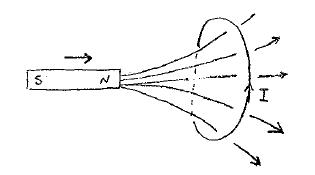
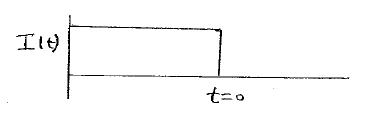

.. _electromagnetics_concepts:

Electromagnetic Concepts
************************

Electrical forces, currents, and conductivity
=============================================

Electromagnetic methods are sensitive principally to electrical conductivity \\(\\sigma\\) (units are S/m
or Siemens/meter). We sometimes work with the inverse of conductivity which is electrical
resistivity \\(\\rho\\) which has units \\(\\Omega m\\) (ohm-meters). Electrical conductivity characterizes the ease
that current flows through the material when an electrical force is applied. Electric current (units
of Amperes) quantifies the amount of charge that is moving by an observer in one second.

Electrical force can be generated, in two ways:

1. battery (Each terminal of the battery can be thought of as storing a positive or negative charge. The "voltage" of the battery is directly proportional to the amount of stored charge). Upon completion of the circuit there will be an electric field \\(\\vec{E}\\) (volts/m) set up in the body. The electric field is a vector: it has both direction and magnitude. The force that any charge \\(q\\) feels is given by \\(\\vec{F} = q \\vec{E}\\). Unit positive or negative charges will feel the same magnitude of force but directions will be opposite. Since like charges repel and unlike charges attract, the negative charges will be attracted to the positive terminal of the battery and the positive
charges will be attracted to the negative terminal.

.. figure:: ./images/circuit.jpg
	:align: center
	:scale: 100 %

2. A time varying magnetic field can generate or "induce" an electric field in a conductor. Consider the simple example of a permanent magnetic moving toward a loop of wire. A current is observed and hence there must have been an electrical force which has caused the charges to move.

In the above example the changing the magnetic field was produced by a moving magnet.
There are other ways in which we can generate a magnetic field. A current in a wire produces a magnetic field outside the wire. It follows that a changing
magnetic field outside the wire can be achieved by changing the current in the wire. This
can be done by:

a. having the wire connected to a generator which produces a sinusoidal current. This leads
to Frequency Domain methods.

.. figure:: ./images/sinusoidal_current.jpg
	:align: center
	:scale: 100 %

b. having a steady-state current and then switching it off. This leads to Time Domain
methods.

**Magnetic Flux**: In discussing the phenomena of EM induction it is important to have a concept
of magnetic flux. We had previous defined the magnetic flux density \\(\\vec{B}\\). The magnetic flux \\(\\phi_B\\) which crosses a closed loop is given by

.. math::
		\phi_B = \int_{area} \vec{B} \cdot \hat{n} \; d\vec{a}

where \\(\\hat{n}\\) is the outward pointing normal vector for the loop.

**Faraday's Law**: A lime varying magnetic field impinging upon a conductor induces an
electromotive force (or voltage) in the conductor.

.. math::
		V = - \frac{d \phi_B}{dt}

This would be the voltage measured in a loop of wire if \\(\\phi_B\\) is the magnetic flux crossing the
wire loop.

**Lens' Law**:The direction of the induced current in the conductor is such that its magnetic field
opposes the changing field across the conductor. That is, nature does not like to have changing
magnetic fields. This is the reason for the minus sign in the above equation.

Comment: If the input source is a battery or generator which has electrode terminals connected
to the earth then this is called a "grounded" source. It forms the input for many geophysical
experiments (DC resistivity, IP, CSAMT).

If the source is a loop of wire then this is an "inductive source". The EM-31 experiment falls into this category. Inductive experiments are generally less labor intensive (no electrodes need be pounded into the ground) and they can be flown in aircraft so large amounts of data can be acquired quickly and (fairly) cheaply.

Principles of Electromagnetic (EM) Induction
============================================

Consider the goal of using an inductive EM source to locate a conductive body buried in a
relatively non-conducting (or resistive) host material. The basic picture is shown below

.. figure:: ./images/Tx_Rx_schematic.jpg
	:align: center
	:scale: 100 %

Transmitter
-----------

The transmitter may be a loop of wire connected to a generator which outputs a sinusoidal current. For examples, the current is \\(I_0 \\cos(\\omega t) \\) where \\( \\omega = 2 \\pi f\\).

Primary EM field:
-----------------

The current in the transmitter loop produces a magnetic field. In air (sometimes referred to
as free space) this magnetic field travels at the speed of light \\(c = 3.0 \\times 10^8\\) m/s and therefore reaches the receiver "instantaneously." The magnetic field observed at the receiver is called the "primary field." Mathematically, the magnetic field would be written as \\(\\vec{H}_p = \\vec{H}_0 \\cos(\\omega t) \\). The direction of the field would depend upon the orientation of the wire. When we discussed magnetism we showed that the magnetic field from a loop source was identical to that of a permanent bar magnet at the center of the loop provided that the observer is "far" from the loop. That is, this approximation holds when \\( r\\, >>\\, a\\) where \\(r\\) is the distance from the observer to the center of the loop and \\(a\\) is the radius of the loop. The magnetic moment from a loop is \\(\\vec{m} = IA \\hat{n}\\), where \\(I\\) is the current in the loop, \\(A\\) is its area, and \\(\\hat{n}\\) is the unit vector perpendicular to the plane of the loop. 

Receiver
--------

This is an instrument which measures the magnetic field. The receiver could be a magnetometer oriented to record one component of the field or it could possibly measure multiple components of the magnetic field. It could also be a coil . In this case, a voltage is measured and the voltage is related to the rate of change of magnetic flux crossing the loop.

At the Buried Body
------------------

There is a time varying magnetic field impinging upon the conductor. This sets up an electric force which causes currents to flow. The strength of the currents is governed by Ohm's law:

.. math::
		\vec{J} = \sigma \vec{E}

where \\(\\vec{J}\\) is current density in \\(A/m^2\\) (amperes per meter squared) and \\(\\vec{E}\\) is the electric field with units of Volts/meter. 

The currents in the body produce their own magnetic field (This is known as Ampere's Law or Biot Savart Law). These currents will also vary with time and their magnetic field can be measured at the transmitter. We refer to these fields as the "secondary" magnetic field, \\(\\vec{H_s}\\).

**Observation**: The receiver measures the sum of the primary and secondary fields or it measures
the associated voltages that are induced in a coil caused by the time varying magnetic flux.

Summary
-------

1. A time varying current in a transmitter produces a time varying magnetic field which impinges upon a conductor in the ground.
2. The changing flux generates and electric field everywhere.
3. The electric field generates currents via Ohm's Law, \\( \\vec{J} = \\sigma \\vec{E} \\).
4. The currents produce their own magnetic fields. 
5. The receiver measures the sum of the primary and secondary fields, (or it measures associated voltages.)

