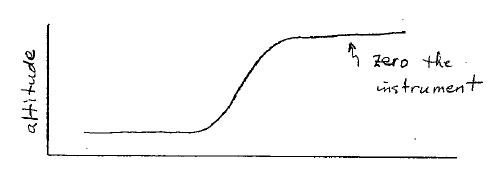
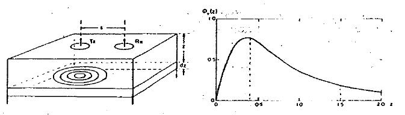

.. _electromagnetics_fk_domain_systems:

Frequency-domain Systems
************************

Nature of the total field
=========================

Consider a frequency-domain source. This could be a loop on the ground or in
the air.

.. figure:: ./images/Hp_Hs_schematic.jpg
	:align: center
	:scale: 100 %

1. The primary field is harmonic \\( \\cos(\\omega t) \\). At the receiver, the
   primary field can be written as \\( \\vec{H}_p \\cos(\\omega t) \\).

2. The currents induced in the conductor will also be harmonic with the same
   frequency \\(\\omega\\). They will, however, have a different phase. The
   resultant secondary field from these currents must also have the same
   frequency dependence and hence can be written as \\( \\vec{H}_s \\cos(\\omega
   t + \\psi) \\), where \\(\\psi\\) is a phase angle.

At the receiver, we observe the sum of the primary and secondary fields, written as:

.. math::
		\vec{H}_{total} = \vec{H}_p \cos (\omega t) + \vec{H}_s \cos (\omega t + \psi)

The Phase of the Secondary Field
================================

If the primary field is harmonic with frequency \\(\\omega\\), then the
secondary field is also harmonic. The secondary field will have a different
phase than the primary; it will lag the primary field by angles between 90°
and 180°. The amount of phase difference is diagnostic of the conductivity of
the body.

1. The primary current varies as \\(\\cos(\\omega t)\\) and hence the primary
   magnetic field also has this same dependence (The primary field is in-phase
   with the current).

2. At the conductive body the EMF (induced voltage) is

.. math::
		\mathcal{E} = - \frac{d \phi_B}{dt}

If the primary current varies as \\(\\cos(\\omega t)\\), then the flux
\\(\\phi_B\\) also varies as \\(\\cos(\\omega t)\\), while \\( \\mathcal{E}\\)
varies with \\(\\sin(\\omega t) \\). That is, the EMF lags the primary by
\\(\\pi/2\\).

3. The body in which the induction is occurring can be represented as a
   circuit element with self-inductance \\(L\\) and resistance \\(R\\). Through
   the laws of electromagnetic induction, the time varying currents that are set
   up in the conductor suffer a further lag

.. math::
		\phi = \tan^{-1} \left( \frac{\omega L}{R} \right)

4. As a result, the secondary field lags the primary by a total amount

.. math::
		\psi = \frac{\pi}{2} + \tan^{-1} \left( \frac{\omega L}{R} \right)

Note:

1. For a resistive body (or for very low frequency), \\(\\phi \\rightarrow 0\\)
   so the secondary field is only \\(\\pi/2\\) out of phase with the primary
   field. The response from a weak conductor will be in the out-of-phase
   component of the measured signal.

2. For very conductive bodies (or for very high frequency), the secondary field
   becomes nearly \\(\\pi\\)  (180°) out of phase with the primary. Since
   \\(\\cos(\\omega t + \\pi ) = -\cos(\\omega t)\\), the response due to a good
   conductor will be in phase with the primary but reversed in sign.

Measurement of Secondary Fields
===============================

The easiest quantity to measure is some component of the total field. From an
interpretation viewpoint however we are interested in the secondary field
produced by the body. Unfortunately the primary field is generally very much
larger than the secondary field and hence if we measure their sum then we are
faced with finding, and interpreting, a small signal in the presence of a
large signal. It would be more advantageous to measure the secondary field
directly. This can be done in two ways:

1. One can have a "bucking" coil or "compensator" which provides a magnetic
   field at the receiver which has the same amplitude and phase as the primary
   field but is in the opposite direction. As a result \\(\\vec{H}_p\\) is
   annihilated at the receiver, (eg. aircraft systems. Lab systems, EM-31).

2. There can be a direct link between the transmitter and receiver through a
   connecting cable. This allows for a phase reference and hence the field,
   adjusted for amplitude loss due to geometrical spreading, can be subtracted
   from the measured signal.

In-Phase and Quadrature Phase
-----------------------------

With the removal of the primary field the reading at the receiver pertains to
the secondary field. What is generally presented as data is the ratio of the
secondary field to primary field for a particular component of the field.
(Remember that data could be magnetic fields measured with a magnetometer or
voltages measured with a coil.) The data will be ratio of the secondary field
to the primary field. Let the primary field be \\( H_p \\cos(\\omega t \\).
The secondary field is \\( H_s \\cos(\\omega t + \\psi) \\) and can be written
as

.. math::
		H_s \cos(\omega t + \psi) &= H_s { \cos(\omega t) \cos(\psi) - \sin(\omega t) \sin(\psi)   }\\
								  &= [H_s \cos(\psi)] \cos(\omega t)  - [H_s \sin(\psi)] \sin(\omega t)   

The first term has the same phase as the primary field and is referred to as
the "in-phase" response. This is also sometimes referred to as the "real" part
of the response. That terminology because derivations are made in terms of
complex quantities.

In-phase:

.. math::
		\frac{H_s \cos(\psi)}{H_p}

The second term is the "out-of-phase" part or quadrature phase.

Out-of-phase:

.. math::
		\frac{H_s \sin(\psi)}{H_p}

This term is also referred to as the "imaginary" part of the response.
Unfortunately, different words refer to the same thing. Don't be confused.
Similar terminology is summarized as follows:

+-----------------------+-----------------------+
|  **In-Phase**         | **Out-of-Phase**      |
+=======================+=======================+
|   Real                |    Imaginary          | 
+-----------------------+-----------------------+
|                       |    Quadrature         | 
+-----------------------+-----------------------+

Since both in-phase and out-of-phase quantities are small, their values are
usually given in ppm (parts per million).Insight regarding the expected value
of the In-phase and Out-of-phase components can be obtained by examining the
response of a single loop of wire (of resistance \\(R\\) and inductance
\\(L\\). The ratio \\( H_{secondary} / H_{primary} \\) or ( \\(V_s/V_p\\) if
the receiver is a coil) is given by

.. math::
	\frac{H_S}{H_P} = \text{(Coupling Coefficients)} \cdot f(\alpha)

where \\( \\alpha = \\omega L / R \\). A plot of \\(f(\\alpha)\\) provides
considerable insight into electromagnetic data is probably one of the most
important plots in electromagnetic induction. \\(f(\\alpha)\\) is a complex
number and has real and imaginary parts.

.. figure:: ./images/response_parameter_function.jpg
	:align: center
	:scale: 100 %

.. This plot needs to be revised

Remark: for those familiar with complex numbers, the coupling coefficients are
given by:

.. math::
		f(\alpha) = \frac{\alpha^2 + i \alpha}{1 + \alpha^2}

The coupling coefficients depend upon the orientation of the transmitter and
receiver as well as the geometry of the target body.

Horizontal Loop Responses from a Conductor in Free Space
--------------------------------------------------------

The above plots, and the basic understanding of the different coupling between
the source and receiver that is due to geometry, allows us to sketch the
expected responses that arise from a frequency domain horizontal loop survey
taken over a conductor which is buried in a resistive host. This is a two-
stage process.

1. Use the geometries of the source and receiver to sketch the characteristic
   curve. 
2. Use the response diagram and the knowledge of whether you are
   dealing with a good conductor or poor conductor to determine the relative
   amplitude of the in-phase and out-of-phase parts.

**Part I:** Consider the basic geometry given below. For any placement of the
transmitter there will be a varying magnetic field crossing the plate and
hence induced currents. Those currents generate secondary magnetic fields.
Adopt a convention that if the secondary field is in (he same direction as
the primary field then the response will be plotted as a positive value.
Alternatively, when the two fields are in opposition the response will be
negative. The distance between the transmitter and receiver loops is held
fixed and the-datum is plotted at the midpoint between the coils. When both
loops are to the left, or to the right, of the plate then the response is
positive. The response will be zero when either coil is over the plate. When
the receiver, which is a horizontal coil, is over the plate, then no
magnetic flux is passing through the coil. There will be zero voltage
induced. When the transmitter is directly over the thin conducting plate,
there is no flux crossing the plate, hence no currents will be generated in
the plate and the secondary magnetic field is zero.

 .. figure:: ./images/source_receiver_signal.jpg
	:align: center
	:scale: 100 %

**Part II:** The basic sketch for the shape of the anomalous signal is
determined from the geometry of the coils and the relative locations of
transmitter, receiver and the conductive body. In practice we measure both an
in-phase and an out-of-phase component. Each of these curves will look like
the basic curve (given above). We need only establish relative amplitude. From
the general response curve we find that the in-phase (or real component) is
larger than the out-of-phase (imaginary) component when \\(\\omega \\sigma \\)
(or \\(\\omega L / R\\)) is large.

Below we plot the responses for a horizontal loop survey taken over a vertical
conductive plate in which:

1.  strike length of the plate: S = 1.0 units
2.  width of the plate W= 0.5 units (length in vertical extent)
3.  depth of burial Z=0.13 units
4.  L=distance between source and transmitter coil L=0.76 units (Z/L=0.17)
5.  conductivity-thickness product = 1.0

Because the body is conductive and the frequency of the survey is high, the
value of \\(\\omega L / R\\) is large and the in-phase response is larger than
the quadrature response.

.. figure:: ./images/dipole_response.jpg
	:align: center
	:scale: 80 %

The Conductive Host
===================

The sketches regarding EM responses were derived under the simplifying
assumptions that the buried body was in a very resistive medium. Consequently,
the response depended only upon the relative orientations of the source coil
and the body (the coupling effect), the conductivity of the body and the
frequency of the transmitter, and the coupling effect of the secondary
magnetic fields with the receiver.

In more realistic situations the object of interest in buried in a conductive
medium.

.. figure:: ./images/buried_object.jpg
	:align: center
	:scale: 80 %

The laws of EM induction require that there be eddy currents that are also set
up in the host. But any conductive material in which currents are flowing is a
"lossy" medium. That is, there are \\(I^2R\\) losses which convert the
electromagnetic energy to heat. As a consequence the energy from the source
does not propagate to arbitrarily large depths in the earth. The amplitude of
the EM fields thus decrease due to geometrical spreading and attenuation.

Strength of the Primary Field in the Earth
==========================================

The strength of the primary field depends upon:

#. frequency of the transmitter
#. conductivity of the host material
#. geometry of the source

Considerable insight can be obtained by first ignoring the geometry of the
source and observing how a plane electromagnetic wave decays as it propagates
into the earth. An incoming sinusoidal wave with frequency \\(\\omega = 2 \\pi
f\\) travels in the atmosphere at the speed of light \\(c = 3 \\times 10^8\\)
m/s and has a wavelength \\(\\lambda = c/f\\). When the wave enters the
conducting earth it still propagates as a sinusoid but it travels much slower
and attenuates rapidly. An example, with numbers for speed and wavelength is
given below.

.. figure:: ./images/EM_diffusion.jpg
	:align: center
	:scale: 80 %

The wave attenuates so fast that it only propagates about a wavelength into
the earth. Because the amplitude diminishes so rapidly and the waves travel so
slowly, we generally talk about the EM wave "diffusing" into the earth. The
amplitude of the field decays exponentially with depth according to the
diagram given below.

.. figure:: ./images/field_decay.jpg
	:align: center
	:scale: 100 %

.. math::
		H  &= H_0 e^\frac{-(1-i)z}{\delta}\\[0.4em]
	   \mid H \mid &= H_0 e^\frac{-z}{\delta}

**Skin Depth:** This is the depth by which the amplitude has decayed to
\\(1/e\\) of its surface value. For a uniform halfspace of conductivity
\\(\\sigma\\) the skin depth \\(\\delta\\) is

.. math::
		\delta = \sqrt{\frac{2}{\mu_0 \omega \sigma} } \simeq 500 \sqrt{\frac{1}{\omega f}} = 500 \sqrt{\frac{\rho}{f}} \text{meters}

Depth of Penetration
====================

A maximum depth of investigation is provided by the skin depth rule, however
for controlled source surveys we also need to take into account the source and
receiver geometry. This generally reduces the depth of penetration. A rule of
thumb for loop-loop systems is that the depth of penetration is about twice
the separation of the source and receiver, but this is very approximate and is
easily violated. Also, a necessary condition for this to happen is that the
source/receiver separation \\(s << \\delta\\) (coil separation is less than
the skin depth).

The justification for the above statement is based upon the following.
Consider a homogeneous halfspace on the surface of which is located a
horizontal coplanar coil (HCP) system (e.g. EM31) or a vertical coplanar (VCP)
system (EM34). Let the depth \\(z\\) in the earth be normalized by the coil
spacing \\(s\\). (True depth in meters is \\(zs\\).) The time varying fields
in the transmitting coils will induce eddy currents in the earth. For a
homogeneous earth, these currents flow in horizontal planes. This is true even
for the vertically oriented coils. It is possible to calculate the
contribution to the secondary field as measured from the surface from any thin
layer of thickness \\(dz\\) at some depth \\(z\\). Let \\(\\phi_V(z)\\) denote
this contribution from the vertical magnetic dipole source and receiver. The
subscript \\(V\\) denotes that the magnetic fields are vertical. A horizontal
loop of current acts like a vertical magnetic dipole. A plot of this function
is shown below:

	Relative response versus depth for vertical dipoles. \\(\\phi_V(z)\\) is the relative contribution to \\(H_s\\). from material in a thin layer dz located at (normalized) depth \\(z\\).

Note that the vertical magnetic dipole has zero sensitivity at the surface,
has a maximum at about \\(z = 0.4\\) and is substantially diminished by \\(z =
2.0\\). It is this type of diagram which says that the maximum depth of
investigation is limited to about twice the coil separation. This rule of
thumb however is valid only when the coil separation is much less than the
skin depth.

The response function from the horizontal magnetic is very different. Let
\\(\\phi_H (z)\\) denote the relative contribution that arises from a
horizontal magnetic dipole source and receiver. It has a maximum at the
surface, so it is sensitive to the conductivity there, and it decreases
monotonically with depth.

 .. figure:: ./images/horizontal_dipole_response.jpg
	:align: center
	:scale: 100 %

We therefore notice how two coil configurations couple differently with the
ground and have different sensitivities with respect to the conductivity
structure.

Cumulative Response Functions
=============================

We often have a multi-layer earth (e.g. a thin resistive layer overlying a
more conductive stratum, or vice versa) and we would like to estimate the
thickness of the layer and the two conductivities. Cumulative response curves
are useful for carrying out computations. Define
 
.. math::
		R_V (z) &= \int_{z}^{\infty} \phi_V (z) dz \\[0.8em]
		R_H (z) &= \int_{z}^{\infty} \phi_H (z) dz

to be the relative contribution to the secondary magnetic field obtained from
all of the material below a depth \\(z\\). The diagrams are plotted below:

 .. figure:: ./images/cumulative_response.jpg
	:align: center
	:scale: 100 %

A depth of investigation might be defined as that depth below which only 25%
of the signal arises. According to this rule the depth of investigation for
the vertical dipole is about 2.0 s while the depth for the horizontal dipole
is only half that amount.

Target Detectability
====================

If we are attempting to find a conducting target then the ability to see the
target depends upon the coil orientation and coil separation. It must also
take into account the fact that the:

1. primary field is attenuated before it reaches the target
2. the secondary fields are attenuated as they travel from the target to the receiver.

EM-31
=====

Loop-loop system mounted on a 4 meter boom. The transmitting coil operates at
a frequency of 9.8 kHz and the receiving coil is located 3.66 meters from the
transmitter. The instrument measures both the in-phase and quadrature fields.
The in-phase component is diagnostic of high conductivity bodies (metal pipes,
drums, etc.) and the quadrature component can be converted into an apparent
conductivity which is read out in mS/m. Such readings arc valid only if the
ground is laterally uniform on a scale length equal to the source-receiver
separation and that \\(s << \\delta\\). The instrument and coils can be
rotated by 90° so that loops are vertical. This provides data estimating the
conductivities and thickness. The effective depth of exploration is about 6
meters for the vertical dipole mode and about 3 meters for the horizontal
dipole mode. Data can be acquired with the device held at hip level or it can
be put on the ground.

EM-34
=====

This uses two vertical or horizontal coplanar coils that are not attached to
each other. The coils and analysis system are designed so that different coil
separations operate at different frequencies:

1. 10 meters at 6.4 kHz
2. 20 meters at 1.6 kHz
3. 40 meters at 0.4 kHz

This allows greater penetration into the ground and hence is used to delineate
vertical geologic anomalies and for groundwater exploration in fractured,
faulted and weathered bedrock zones.

Apparent Conductivity from the Quadrature Component
===================================================

If the spacing \\(s\\) between the coils is much less than the skin depth,
that is, \\(s << \\delta\\) then the ratio of secondary to primary field is
approximately

.. math::
		 \left| \frac{H_s}{H_p} \right| \simeq \frac{\omega \mu_0 \sigma s^2}{4}  

The response is purely imaginary or is found in the quadrature component. The
constant conductivity which gives rise to the observed response can be found
from the above formula. It is referred to as the apparent conductivity
\\(\\sigma_a\\).

.. math::
		\sigma_a = \frac{4}{\omega \mu_0 \sigma s^2} \left| \frac{H_s}{H_p} \right| 

Further insight about the apparent conductivity is obtained by incorporating
the response curves \\(\\phi_V(z)\\) and \\(\\phi_H(z)\\). We have

.. math::
		\sigma_a &= \int_{0}^{\infty} \phi_V (z) \sigma (z) dz \\[0.8em]
		\sigma_a &= \int_{0}^{\infty} \phi_H (z) \sigma (z) dz

respectively for the vertical and horizontal dipoles.

Multilayer Earth Structures
===========================

Under the assumption that \\( s << \\delta \\)  then the above formulae can be
used to predict the apparent conductivity from a multilayered earth, or to
used measured apparent conductivities to estimate the individual layer
thickness and conductivities. For instance if we coplanar coils on the earth's
surface given below

.. figure:: ./images/coplanar_coils.jpg
	:align: center
	:scale: 100 %

The apparent conductivity would be

.. math::
		\sigma_a &= \int_{0}^{h} \sigma_1 \phi_V (z) dz	+ \int_{h}^{\infty} \sigma_2  \phi_H (z) dz \\[0.8em]
				 &= \sigma_1 (1-R_V(h)) + \sigma_2 R_V(h)	

Either the curves shown previously or the following formulae are therefore useful:

.. math::
		\phi_V (z) &= \frac{4z}{(4z^2 + 1)^{3/2}} \\[0.8em]
		\phi_H (z) &= 2- \frac{4z}{(4z^2 + 1)^{1/2}} \\[0.8em]	
		       R_V &= \frac{1}{(4z^2 + 1)^{1/2} }\\[0.8em]
		       R_H &=  (4z^2 + 1)^{1/2} - 2z \\[0.8em]	

