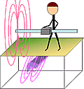

.. _electromagnetics_index:

Electromagnetic Methods
=======================

In this section we will study electromagnetic (EM) methods. In applied geophysics, the term is usually used to refer to methods that use a low frequency time-varying magnetic field as a source to excite electrical currents in the ground through the principle of electromagnetic induction. These methods are sensitive to the electrical conductivity of the subsurface. The GPR, DC resistivity and induced polarization methods are also governed by the laws of electromagnetism but excite the earth differently enough that they are classified separately.

.. The source in an electromagnetic survey is a transmitter that generates a time-varying current. The receiver measures the magnetic field generated by this current as well as secondary fields induced by objects in the field of the source. There are several important concepts and physical laws involved in understanding EM methods, including apparent conductivity, magnetic flux, Lens’ Law, Faraday’s Law, and Ohm’s Law. The first section below explains the basic principles in an EM survey, and the second section focuses on frequency domain techniques.

Contents:

.. toctree::
   :maxdepth: 1

   electromagnetic_introduction
   electromagnetic_physical_properties
   electromagnetic_basic_principles
   electromagnetic_survey
   electromagnetic_data
   electromagnetic_processing
   electromagnetic_interpretation
   electromagnetic_applet
