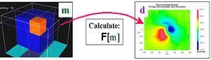

.. _foundations_seeing_underground_inversion:

Seeing underground: Inversion Outline
*************************************

The problem of estimating a reasonable earth model (i.e. a quantitative distribution of one or more physical properties based upon recorded data) is known as the geophysical inverse problem. Various methodologies for performing geophysical inversion have been developed. There are two broad classes of inversion: "Parametric" methods and "Generalized" inversion methods. 

.. figure:: ./images/inv2.gif
	:align: center
	:scale: 100 %

	Inversion: estimating a model based upon measured data and some understanding of the setting		

	Forward modelling: calculating data based upon a known earth model

Parametric methods
==================

These inversion methods involve finding a model of the earth which is described using only a few parameters. The solutions require that there be fewer parameters than there are data values so that the problem is formally "over-determined." A few examples of parametric models are:
 - **Buried object:** parameters could be depth to a sphere (or cylinder), a radius of a sphere or radius and length of a cylinder, and the physical property contrast between the object and host rocks. 
 - **Layered earth:** parameters are layer thicknesses and physical property values.
 - **A buried sheet:** parameters might be depth to the top of sheet, it's dip, strike, thickness, and the physical property contrast between the sheet and host rocks.

Generalized inversion methods
=============================

This second class of inversion methods allows the earth's model to be more realistically complex, which means that more parameters than data points are permitted. Such problems are mathematically referred to as "under-determined". Most solutions to this more general form of the geophysical inversion problem involve three steps, which can be explained as follows: 

1.Represent the earth with many cells so that complex distributions of physical properties can be simulated. In practice, the earth is divided into thousands or millions of cells of fixed geometry. Each cell has a constant, but unknown, value. The parameters we seek are the physical property values for these cells.

2.Design a model objective function. This is a mathematical quantity which measures the "size" of any solution. It is a single number. A priori information about the earth can be incorporated into the objective function. Usually the model objective has different components. One will make it "close" to a supplied reference model, others may control "smoothness" in various spatial directions. Mathematical optimization theory is used to find a solution that minimizes the objective function. The resultant solution will have minimum structure. This will be a good choice since it will tend to show large scale important features rather than a great deal of extraneous structure that can result from noisy observations.

3.The final solution must also acceptably reproduce the field observations. Our final optimization problem is to find that model which minimizes our model objective function subject to the constraint that the measured data are adequately reproduced.

.. figure:: ./images/inv-1.jpg
	:align: center
	:scale: 100 %

	The earth model is a fixed distribution of cells, each with an adjustable value of the physical property. Measured data are shown on top. 
		
.. figure:: ./images/inv-3.jpg
	:align: center 
	:scale: 100 %

	An acceptible model can cause the data, and simultaneously produces a minimum value for the "model objective function". 

In practice a number of inversions, with different reasonable objective functions, should be carried out so the interpreter has some insight about the range of earth models that can acceptably reproduce the field data. Error statistics about the data will determine how closely the reproduced data matches the real measured data. The fact that these error statistics are often poorly known is a second good reason for performing several inversions before settling upon a preferred model. 