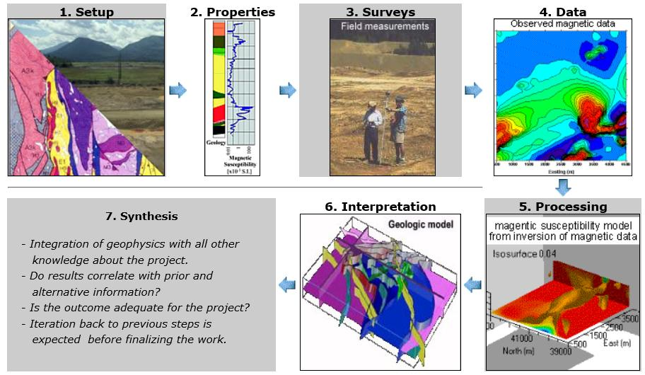

.. _foundations_sevensteps:

.. sidebar:: Seven Steps

    .. figure:: ./images/icon_whats-there.gif
    	:align: center

A seven-step framework for applied geophysics
*********************************************

Geophysics can play an important role in helping solve resource exploration,
environmental, or geotechnical problems. The application of geophysics is most
effectively carried out by following a seven-step framework. Careful thought
and due diligence at each step is important to achieve a final outcome.

1. **Setup:** *What is the Problem?*
   
   Establish the geoscience objectives, consider conventional practice, and
   identify how geophysics might contribute.  This could include:

    - Mapping geology
    - Locating buried objects
    - Obtaining 3D images of the subsurface

 Assemble prior information that might be relevant. Details for using the seven-step procedure will depend upon what information is sought and what is available.

2. **Properties:**  Understand how geologic and human-made materials of
   relevance to the problem can be characterized by physical properties. The key
   is to find a physical property of the sought object/geology that is different
   from that of the surrounding material. This is a crucial component needed to
   link geophysics with the geoscience problem being investigated. Important
   physical properties are:

    - Density   
    - Compressional wave and shear wave velocities  
    - Magnetic susceptibility  
    - Electrical conductivity (or resistivity) 
    - Electrical chargeability
    - Dielectric permittivity

3. **Surveys:** Select a geophysical survey that is sensitive to the physical
   property of relevance to the problem.  Design an effective and efficient
   methodology for collecting the field data. This will involve forward modelling
   and processing of the simulated data as well as addressing issues of noise and
   data quality. This builds realistic expectations for what information can be
   expected from the analysis of the geophysical data and the overall suitability of
   the chosen survey.

\

4. **Data:** Carry out the field survey, taking all necessary actions to ensure
   complete, high-quality, and cost-effective data sets. Geophysical data can be
   acquired in boreholes, on the surface, or in the air using aircraft. Field
   procedures must permit the acquisition of high-quality data, yet they must be
   economical and safe to obtain.

\

5. **Processing:** Interpretations from the data require that the data be
   processed. This can range from simply making maps of the data to inverting
   data to obtain 3D images of the subsurface.

\

6. **Interpretation:** Interpret results in terms of geological or
   geotechnical objectives. The goal is to draw conclusions or make decisions
   based on geophysical data. There are two distinct components to
   interpretation. The first involves estimating how physical properties are
   distributed. The second involves gaining some geological understanding based
   on those physical property distributions. Like much of the geosciences,
   non-uniqueness is a ubiquitous and  persistent characteristic of most
   geophysical interpretations.

\

7. **Synthesis:** Correlate the interpretations with prior and alternative
   information, and decide if your results are adequate for the particular
   problem. Synthesis means making sure geophysical results agree with everything
   else that is known about the problem. Also, a judgement must be made about the
   effectiveness and completeness of the geophysical results and their impact
   on the initial geological, engineering, or geophysical question.

This sequence of images summarizes the framework visually.

All tasks in the seven-step process are interrelated, so the distinction
between the steps can become blurred. For example, the geoscience problem will
determine an appropriate interpretation procedure, which will constraints the survey design and the choice of processing steps. Also, data
processing, interpretation and synthesis are often tightly related. However,
it is useful to think in terms of these seven steps because they form a
framework which can be employed for any application of geophysical work to
applied geoscience problems.

Summary for the seven-step framework
====================================

 1. **Setup:** Establish the geoscience objectives, consider conventional practice, and identify how geophysics might contribute.
 2. **Properties:** Characterize materials that can be expected and establish the likely physical property contrasts.
 3. **Surveys:** Determine a suitable geophysical survey and design an effective and efficient field survey. Identify possible sources of error, noise and misinterpretation.
 4. **Data:** Carry out the field survey, taking all necessary actions to ensure complete, high-quality, and cost-effective data sets.
 5. **Processing:** Plot the data and apply appropriate processing and analysis. 
 6. **Interpretation:** Interpret results in terms of physical property distribution and then in terms of the original geoscience objectives.
 7. **Synthesis:** Combine interpretations with prior knowledge about the problem and other relevant information. Decide if your results are adequate for the particular problem. Iteration is usually necessary.

