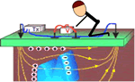
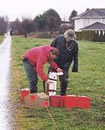
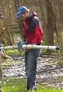
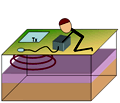
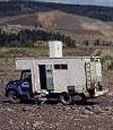

.. _foundations_survey_methods:

Survey method summaries
***********************

The following one-paragraph summaries do not replace more complete coverage when learning about geophysical survey methods; they are simply reminders. Each paragraph attempts to remind the reader about the measurements, the relevant physical properties, typical surveying configurations, and styles of interpretation. 

Magnetics
=========

.. figure:: ./images/men-mag.jpg
	:align: right
	:scale: 90 %
.. figure:: ./images/icon_mag.gif
	:align: right
	:scale: 90 %

Measurements of Earth's magnetic field will reveal subsurface variations in **magnetic susceptibility**. The measurements record the sum of Earth's field and fields induced in magnetic materials. More magnetic (i.e. susceptible) materials have stronger induced fields. If the natural field can be removed so that only induced fields remain in the data, results reveal where magnetic material lies, and to some extent, how magnetic it is. Surveys are done from all conceivable platforms (ground, vehicle, air, marine, satellite, in boreholes) and results are usually presented as maps or profiles. Raw data may be interpreted directly, significant processing may be applied, and inversion to estimate models of subsurface susceptibility distribution can be carried out. This is one of the most versatile applied geophysics methods available. 
  
Gradient Magnetics
==================

.. figure:: ./images/icon_maggrad.gif
	:align: right
	:scale: 90 %

Measurements of *gradient* of Earth's magnetic field are sometimes preferred over the field's total strength. Measured anomalies are smaller, but resolution is higher. Instruments for horizontal and vertical gradient measurements are used. They use the same sensors as instruments that measure the total field, but there are two sensors in the relevant direction so that the difference between field strength in the Z, X or Y directions can be measured. Surveys are conducted on the ground, by fixed-wing aircraft, and by helicopter. As for magnetic surveys, gradient magnetic measurements are interpreted in terms of variations in **magnetic susceptibility.**

Gravity
=======

.. figure:: ./images/man-grav.jpg
	:align: right
	:scale: 90 %
.. figure:: ./images/icon_grav.gif
	:align: right
	:scale: 90 %

Careful measurements of Earth's gravitational field can reveal subsurface variations in density because gravitational attraction depends upon the mass of materials. The measurements also depend upon latitude, elevation, topography, and these need to be recorded very accurately for every measurement. Measurements require meticulous care, but it is now common to carry out surveys on land, on ships, using airborn platforms, within boreholes, and by observing satellite orbit perturbations. Results are interpreted and managed using procedures similar to magnetics, but data sets are necessarily much sparser than magnetic surveys. Since the mid 1990's, it has become feasible to measure gravity gradients.

DC resistivity
==============

.. figure:: ./images/pwr-stake-b.jpg
	:align: right
	:scale: 90 %

**Electrical resistivity** of subsurface materials is measured by causing an electrical current to flow in the earth between one pair of electrodes while the voltage across a second pair of electrodes is measured. The result is an "apparent" resistivity which is a value representing the weighted average resistivity over a volume of the earth. Variations in this measurement are caused by variations in the soil, rock, and pore fluid electrical resistivity. Surveys require contact with the ground, so they can be labour intensive. Results are sometimes interpreted directly, but more commonly, 1D, 2D or 3D models are estimated using inversion procedures. When the survey is conducted in order to obtain a 1D model, it is called a sounding. Profiles are used to build 2D models of the earth. Multiple lines, or more complex electrode arrangements are used to obtain 3D interpretations. Soundings and profiles are defined as follows: 

.. figure:: ./images/1d-interp.gif
	:align: right
	:scale: 100 %

**Soundings** are surveys that are arranged so that measurements reveal vertical variations in resistivity under one location. The earth is interpreted in terms of flat lying layers. Results are often displayed rather like a drill core. 

.. figure:: ./images/2d-assumption.gif
	:align: right
	:scale: 100 %

**Profiles** are surveys that are arranged in order to be interpreted in terms of vertical and lateral variations under a line of measurements. Results are interpreted as a plane under the line. This is the 2D result. The assumption is that the structures extend without change either side of the survey line. 

Induced polarization 
====================

.. figure:: ./images/icon_ip.gif
	:align: right
	:scale: 90 %

Induced polarization (or IP) is a secondary measurement that can be made at the same time as DC resistivity if the correct equipment is included. IP measurements respond to variations in the capacity for subsurface materials to retain electric charge. This physical property is referred to as **chargeability.** The principal materials that exhibit this property are clays, graphite, and sulphide minerals. However, small changes in chargeability can be detected when groundwater is contaminated with salt, hydrocarbons, or other materials. 

Seismic reflection
==================

.. figure:: ./images/man-seis.jpg
	:align: right
	:scale: 90 %
.. figure:: ./images/icon_refl.gif
	:align: right
	:scale: 90 %

An impulse of compressional or shearing energy will travel from its source (such as a hammer strike on a metal plate, and explosion, or an earthquake) through the ground. This energy will be reflected and refracted (bent) by changes in the ground's elastic properties and density. Reflection surveys are designed to record signals with differing seismic velocities (which is related to density and elasticity) that have been reflected from boundaries between materials within the ground. Data require significant processing before results are usable but seismic reflection surveying represents over 90% of the geophysics done in support of exploration for oil and gas. Results can be interpreted in terms of subsurface layering if interfaces between layers are with roughly 10 or 20 degrees of horizontal. Contacts between geologic units that are nearly vertical are difficult to image with seismic reflection, although breaks in horizontal features can often be found. Petroleum exploration work may involve investigating the ground to a few kilometers of depth. Engineering-scale surveys may involve studying only the first few 10's of meters depth. 

Seismic refraction
==================

.. figure:: ./images/icon_refrac.gif
	:align: right
	:scale: 90 %

Refraction surveys are designed to record signals that have been bent within the ground so that they arrive back at the surface. The bending or refraction occurs due to increasing seismic velocity in the ground, which in turn is related to the ground's **elastic properties** and **density**. The method is popular for mapping sub-horizontal structure, but is not very effective at characterizing features that are nearly vertical. Instruments are similar to those used for seismic reflection surveys, but field layouts are different. Like reflection surveying, results cannot be used without significant processing. Surveys can be carried out at almost any scale from lines a few 10's of meters long to lines many kilometers long. 

GPR (ground penetrating radar)
==============================

.. figure:: ./images/gpr-c.jpg
	:align: right
	:scale: 90 %
.. figure:: ./images/icon_gpr.gif
	:align: right
	:scale: 90 %

GPR is similar to seismic reflection, but using electromagnetic energy instead of acoustic energy. Pulses of radio energy are emitted from one antenna and echoes are received at a second antenna. Results are plotted and sometimes processed, similar to seismic reflection, although data processing is usually much less intensive compared to that required for seismic reflection work. The ground's **electrical resistivity** controls the depth of signal penetration. Penetration is usually less than 10 meters. Signals echo at boundaries where **electrical resistivity** and/or **dielectric permittivity** change abruptly. **Dielectric permittivity** is a quantity related to the ease with which materials become polarized in the presence of an electric field.  It is mainly affected by the amount of water in materials.

Electromagnetic (EM) terrain conductivity
=========================================

.. figure:: ./images/icon_em31.gif
	:align: right
	:scale: 90 %

Electromagnetic methods involve using oscillating electromagnetic energy which penetrates the ground and causes (induces) secondary EM fields in regions of elevated electrical conductivity (i.e.reduced electrical resistivity). Terrain conductivity surveys usually involve a handheld instrument operating at a single frequency. Some systems estimate terrain conductivity at several frequencies. One transmitter coil generates the EM energy and a second receiver coil detects EM fields caused by the transmitter, as well as fields induced in subsurface conductive regions. Large data sets can be collected efficiently, but results cannot be used directly to learn about variations with depth. Data are usually plotted as maps or line profiles of apparent conductivity and interpreted to find the ground positions directly above conductive features. 

Frequency domain EM 
===================

.. figure:: ./images/man-maxmin.jpg
	:align: right
	:scale: 90 %
.. figure:: ./images/icon_fem.gif
	:align: right
	:scale: 90 %

EM terrain conductivity discussed above is one form of frequency domain EM (FEM). More sophisticated forms of FEM involve using more than one frequency and/or coil configuration. Surveys can be carried out from the ground or from airborne platforms (fixed wing or, more commonly, systems towed by a helicopter). Results can be interpreted in terms of one to four or five layers of varying **electrical resistivity** directly under sensor. Each set of measurements at one location using a range of frequencies and/or coil configurations represents a "sounding" (see DC methods above). Information about the ground can be obtained from very shallow to 100 or so meters deep. 

Time domain EM
==============

Time domain EM (TEM) is conceptually similar to FEM methods, except that instead of a fixed frequency (or multiple fixed frequencies), the energy source is a transient EM signal. The measurements involve recording secondary fields that exist in the few micro- or milli-seconds following the source signal's transition. Like FEM surveys, each TEM measurement is usually treated as a sounding; many measurements must be carried out to produce many soundings, which may then be interpreted as a collection of soundings. TEM surveys can be carried out on the ground or from airborne platforms, and borehole TEM surveys are common for mineral exploration. Some TEM systems can produce information about ground as much as 300 or 400 meters deep, but most TEM surveys involve investigating only the first few 100 meters. As for all electrical and electromagnetic methods, TEM measurements yield information about variations in the earth's **electrical resistivity.**

VLF electromagnetics (EM)
=========================

.. figure:: ./images/man-vlf.jpg
	:align: right
	:scale: 90 %
.. figure:: ./images/icon_vlf.gif
	:align: right
	:scale: 90 %

The VLF (Very Low Frequency) band is a portion of the electromagnetic spectrum that was used for very long distance communications between the 1920's and 1990's. Some transmitters are still operational, and these signals interact with shallow materials (within the top 20 to 50 meters) in ways that can be measured. Results are useful for detecting buried metallic objects, and (less reliably) for mapping variations in **electrical resistivity.**

RCPTU 
=====

RCPTU stands for "resistivity cone penetrometer testing unit." This is a push-cone technology involving a system that pushes an instrumented cone into the ground. The electrical resistivity of the ground is measured using a small scale 4-electrode system mounted just behind the cone, which yields in-situ measurements of materials directly adjacent to the instrument. Various other geotechnical and geophysical parameters of the materials can be measured, including shear strength, tip stress, fluid permeability, pore pressure, friction, shear wave velocity (using a surface source), and others. The image shows a CPTU truck operated by the University of British Columbia Department of Civil Engineering.

Other surveys 
=============

Survey methods not discussed on this page include:
 - Borehole geophysical methods
 - Radiometric methods, which involve investigating the radioactivity of ground materials
 - Natural source and controlled source magnetotelluric methods (which involve low frequency EM sources)
 - Spontaneous Potential methods, which involve measuring natural voltages that occur in the ground due to movement of fluids or chemical reactions between fluids and minerals
