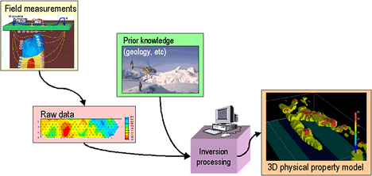

.. _foundations_index:

Foundations
===========

The purpose of this section is to provide an overview about
how geophysics can be used to help solve applied problems and
to introduce ideas, and methodologies, that will be used
throughout the gpg resource.  Background to the use of geophysics, as
well as a couple of examples,
are provided in "Seeing Underground". The Seven-Step
procedure provides a practical framework for using geophysics. Some
of the more common survey methods, and the physical properties to
which they are sensitive, are presented, followed by some general
descriptions about "models" and what is meant by inversion.

Contents:

.. toctree::
   :maxdepth: 1

   seeing_underground/index
   foundations_sevensteps
   foundations_survey_methods
   foundations_model_types
   foundations_inversion

