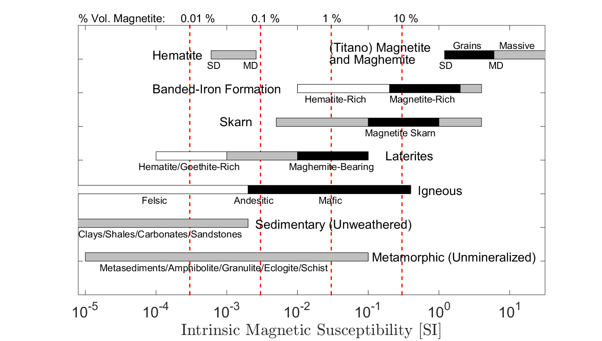

.. _magnetics_susceptibility_duplicate:

Susceptibility
**************

Magnetic susceptibility (:math:`\kappa`) is the diagnostic physical property in magnetic surveys.
Magnetic susceptibility quantifies the magnetization (:math:`\vec M`) a rock or mineral experiences when it is subjected to an applied magnetic field (:math:`\vec H`). This relationship takes the form:

.. math::
	\vec M = \kappa \vec H

**Magnetization**

Individual particles, minerals, and magnetic domains within rocks each have a net magnetic moment (:math:`\vec m`) and behave like small bar magnets.
Magnetization (:math:`\vec M`) defines the dipole moment per unit volume within a material. 
Let :math:`\vec m_i` be the magnetic moment of the :math:`i^\textrm{th}` particle or magnetic domain.
Within a volume (:math:`V`), the total magnetic moment is the sum of all individual magnetic moments, thus:

.. math::
	\vec{m}= \sum_i \vec m_i

Since magnetization is the dipole moment per unit volume:

.. math::
	\vec M = \frac {\vec m}{V} = \frac {1}{V} \sum_i \vec m_i	
	
where the units for magnetization are Am :math:`\! ^2`/m :math:`\! ^3` = A/m.

**Magnetic Field** 

The magnetic field :math:`\vec H` is responsible for applying a magnetic force to a material.
Magnetic dipoles subjected to magnetic fields will attempt to align in the direction of :math:`\vec H`. 
The magnetization process is illustrated in the following interactive figure.

When there is no external magnetic field, individual magnetic moments :math:`\vec m_i` within a volume are generally disordered and hence don't produce a net magnetic field.
However, when the material is subjected to an external magnetic field, :math:`\vec H`, the magnetic moments try to re-orient themselves along the direction of the field. 
This results in a net magnetization which produces a secondary magnetic field.
The following interactive figure illustrates this process:

.. raw:: html
	:file: susceptibility_duplicate.html

For many materials, the strength of the alignment of the magnetic moments increases linearly with the strength of the applied field.
The magnetic susceptibility therefore defines a constant of proportionality. 

**Magnetic Permeability**

In magnetic problems, a more fundamental physical property is the magnetic permeability (:math:`\mu`).
Magnetic permeability relates the magnetic field (:math:`\vec H`) to the magnetic flux density (:math:`\vec B`). 
This constitutive relationship is written as follows:

.. math::
	\vec B = \mu \vec H

The magnetic flux density depends on the magnetization within the material and can be written as:

.. math::
	\vec B = \mu_0 \big ( \vec H + \vec M \big )
	
	
where :math:`\mu_0 = 4\pi \times 10^{-7}` H/m is the permeability of free-space.
The permeability of free-space represents the relationship between :math:`\vec B` and :math:`\vec H` when the material is non-magnetic.
For materials in which :math:`\vec M = \kappa \vec H`,  the magnetic permeability can be defined in terms of the magnetic susceptibility as follows:

.. math::
	\mu = \mu_0 (1 + \kappa )

**Relative Permeability**

Relative permeability (:math:`\mu_r`) defines the ratio between the magnetic permeability of the material and the permeability of free-space:

.. math::
	\mu_r = \frac{\mu}{\mu_0}

According to the above definitions, both magnetic susceptibility and magnetic permeability are diagnostic physical properties associated with the magnetic characteristics of materials.
In the literature, it is common to see physical property tables which use :math:`\mu`, :math:`\mu_r`, or :math:`\kappa`.
For most rocks, the susceptibility is small and charcterizing the magnetic properties in terms of :math:`\kappa` is convenient.
Parameters used to define magnetic properties and their associated units are tabulated below.

+--------------------------+----------------+-----------+
| **Property**             | **Symbol**     | **Units** |
+==========================+================+===========+
| Magnetic Field Intensity | :math:`\vec H` | A/m       |
+--------------------------+----------------+-----------+
| Magnetic Flux Density    | :math:`\vec B` | T         |
+--------------------------+----------------+-----------+
| Magnetization            | :math:`\vec M` | A/m       |
+--------------------------+----------------+-----------+
| Magnetic Susceptibility  | :math:`\kappa` | *Unitless |
+--------------------------+----------------+-----------+
| Magnetic Permeability    | :math:`\mu`    | H/m       |
+--------------------------+----------------+-----------+
| Relative Permeability    | :math:`\mu_r`  | *Unitless |
+--------------------------+----------------+-----------+

Some useful conversions for units are:

- 1 T = Weber per meter squared
- 1 T = 10 :math:`\! ^9` nT
- 1 nt= gamma   

The above units (with the exception of gamma) are all SI units; which can always be expressed using meters, kilograms, and seconds. 
Historically, units of cgs (centimeter, grams, seconds) were used to define the magnetic susceptibilities for rocks. 
Although it is unitless, the value of susceptibility is different when given in cgs as opposed to SI.
The translation between cgs and SI units is:

.. math::
	\kappa \; \textrm{(SI)} = 4 \pi \kappa \; \textrm{(cgs)}
	
The SI system is the current preferred standard among most geophysicists, but you will find cgs used in older references and texts.
This can cause great confusion so be careful!

Susceptibility Measurements
===========================

**KT-10 Magnetic Susceptibility Meter**

The KT-10 magnetic susceptibility meter is a widely used tool for measuring magnetic susceptibilities in the field.
Within the KT-10, there is an electrical circuit which produces a magnetic field.
When held next to a rock, the magnetic field causes a magnetization within the rock.
This magnetization changes the resonance frequency of the current within the circuit.
Therefore, the KT-10 measures a change in resonance frequency, and uses it to approximate the susceptibility of the rock.

.. figure:: 
	./images/images_duplicates/magnetic_susceptibility_measurement_KT10.jpg
	:align: center
	:width: 50%

**Laboratory Measurements**

Laboratory measurements are based on the same physical principles as the KT-10.
However, the circuit and sample holder used in laboratory measurements are more sophisticated, resulting in more accurate susceptibility values.

Susceptibility of Common Rocks
==============================

A chart showing the range of magnetic susceptibility values for common rock types is shown below.
Note that the scale is logarithmic, indicating a large variability in magnetic susceptibility among rocks.
From this chart we can infer several things:

- Rocks with a high magnetite content are by far the most susceptible (see red vertical red lines denoting \% magnetite content).
- Although hematite and magnetite are both iron-oxide minerals, only magnetite is particularly susceptible.
- Igneous and metamorphic rocks tend to be more susceptible than sedimentary rocks. However, there is a very wide range of overlap.
- Mafic igneous rocks are more susceptible than felsic igneous rocks.
- Mineralized rocks such as skarns and banded-iron formations are generally more susceptible than the surrounding country rock.

A more detailed analysis of rock magnetic properties can be found in Clark and Emerson (1991).

Factors Impacting Magnetic Susceptibility
=========================================

**Magnetic Minerals**

The magnetic susceptibility of a rock depends on the type and abundance of magnetic minerals it contains.
Magnetic minerals are generally part of the iron-titanium-oxide or iron-sulphide mineral groups.
The most important magnetic mineral in rock magnetism is magnetite.
This mineral is common in igneous and metamorphic rocks, and is present at least in trace amounts in most sediments.
Ore-bearing sulphides are frequently susceptible due to minerals such as pyrite and pyrrhotite.
The magnetic susceptibilities of notable magnetic minerals are shown below.

+-----------------------+--------------------------+------------------------------+
|  **Mineral**          | **Chemical formula**     |  Average susceptibility (SI) |
+=======================+==========================+==============================+
| Magnetite             |:math:`Fe_3 O_4`          | 5.8                          |
+-----------------------+--------------------------+------------------------------+
| Ilmenite              |:math:`FeTiO_3`           | 1.8                          |  
+-----------------------+--------------------------+------------------------------+
| Hematite              |:math:`Fe_2O_3`           |  :math:`6.5 \times 10^{-3}`  | 
+-----------------------+--------------------------+------------------------------+
| Maghemite             |:math:`Fe_2O_3`           | 5.8                          |
+-----------------------+--------------------------+------------------------------+
| Pyrite                |:math:`FeS_2`             |  :math:`1.5 \times 10^{-3}`  | 
+-----------------------+--------------------------+------------------------------+
| Pyrrhotite            |:math:`Fe_{1-x}S(Fe_7S_8)`|  1.5                         |   
+-----------------------+--------------------------+------------------------------+

xxxxxxxxxxxxxxxxxxxxxxxxxxxxxxxxxxxxxxxxxxxxxxxx

For magnetic surveys, the relevant physical property is *magnetic susceptibility*, or less commonly the related property *magnetic permeability*. 

Some Definitions
================

.. math::
	&\vec{B} \quad &&\textrm{magnetic flux density, } W/m^2=T \text{ (Teslas)} \\[0.3em]
	&\vec{H} \quad &&\textrm{magnetic field intensity, } A/m  \\[0.3em]
	&\mu \quad &&\textrm{magnetic permeability, } H/m  \\[0.3em]
	&\mu_0 = 4 \pi 10^{-7} \quad &&\textrm{the permeability of free space, } H/m  \\[0.3em]
	&\vec{B} = \mu \vec{H} \quad &&\textrm{the constitutive relation between } \vec{B} \text{ and } \vec{H} \\[0.3em]
	&\mu = \mu_0(1+\kappa) \quad &&\textrm{where } \kappa \textrm{ is magnetic susceptibility} A/m \\[0.3em]
	&\vec{M}=\kappa \vec{H} \quad &&\textrm{where } \vec{M} \textrm{ is magnetization} \\[0.3em]
	&\vec{m} \quad &&\textrm{dipole moment, } Am^2 \\[0.3em]
	& \text{1 Tesla} = 10^9 \text{nT} \\[0.3em]
	& \text{1 nT} =   \gamma \ (gamma)

**What is susceptibility?** Individual particles, minerals, and magnetic domains
within rocks often have a net magnetic moment. That is, they behave like
small magnets. When there is no external magnetic field, these particles are
generally randomly oriented  oriented and hence don't produce a net magnetic
field. However, when the material is in the presence of an external magnetic
field such as Earth’s field, the individual magnetic particles become more
aligned, resulting in a net magnetic field. This secondary field is distinct
from, but caused by, the Earth’s field. The following interactive figure
illustrates:

.. raw:: html
    :file: susceptibility_duplicate.html
	
.. DWO:  remove m from last line in box (wrong units) Substitute a magnetic fields from a bar magnet on the body

The strength of the induced magnetisation, :math:`M`, the "dipole moment per
unit volume", has units :math:`\text{A/m}`. It is related to the causative
field's strength, :math:`H`, by

.. math::
		\vec{M}=\kappa \vec{H}

Susceptibility :math:`\kappa` is a dimensionless number related to the number
of individual magnetic dipoles in the medium that can be aligned with the main
field. Note that as the field increases the number of dipoles that align
themselves with the field also increases.

Each magnetic particle has it's own magnetic moment. Let :math:`\vec{m_i}` be
the magnetic moment of the :math:`i'\text{th}` particle. This has an amplitude
and direction, exactly the same as a small bar magnet.  Consider a volume
:math:`V`. The total magnetic moment, which is the sum of the individual
magnetic moments, is

 .. math::
	\vec{m}= \sum_i \vec{m_i}	

The magnetization :math:`\vec{M}` :math:`(\text{A/m})` is the dipole moment per
unit volume. It is given by

.. math::
	\vec{M} = \frac {\vec{m}}{V} = \frac {1}{V} \sum_i \vec{m_i}	

Although unit-less, the value of susceptibility is different in the cgs and SI
systems of measurement because of the way electromagnetic derivations proceed
within the two systems. Translation between cgs and SI systems of units is
done via :math:`\kappa \text{(SI)} = 4 \pi \kappa \text{(cgs)}` . The SI
system is the current preferred standard among most geophysicists, but you
will find cgs used in older references and texts.  

.. For more details, see the sub-section on units in the "Geophysical Surveys" chapter, "Magnetics" section.

	

Susceptibility of materials
===========================

Minerals
--------

Geologically significant magnetic minerals are either in the iron-titanium-
oxygen group or in the iron-sulfur group. In the iron-titanium-oxygen group
there are five main minerals, and in the iron-sulfur group there are two main
minerals. There is apparently much more known about the first group. Grant and
West, 1965, has an excellent summary, with a great deal of information about
magnetism of minerals. The following table gives a simple indication of
susceptibilities for specific magnetic minerals.

+-----------------------+--------------------------+------------------------------+
|  **Mineral**          | **Chemical formula**     |  Average susceptibility (SI) |
+=======================+==========================+==============================+
| Magnetite             |:math:`Fe_3 O_4`          | :math:`6000 \times 10^{-3}`  |
+-----------------------+--------------------------+------------------------------+
| Ulvospinel            |:math:`Fe_2 TiO_4`        |   :math:`\sim 0`             |
+-----------------------+--------------------------+------------------------------+
| Ilmenite              |:math:`FeTiO_3`           | :math:`1800 \times 10^{-3}`  |  
+-----------------------+--------------------------+------------------------------+
| Hematite              |:math:`Fe_2O_3`           |  :math:`6.5 \times 10^{-3}`  | 
+-----------------------+--------------------------+------------------------------+
| Maghemite             |:math:`Fe_2O_3`           |    similar to magnetite      |
+-----------------------+--------------------------+------------------------------+
| Pyrite                |:math:`FeS_2`             |  :math:`1.5 \times 10^{-3}`  | 
+-----------------------+--------------------------+------------------------------+
| Pyrrhotite            |:math:`Fe_{1-x}S(Fe_7S_8)`|  :math:`1500 \times 10^{-3}` |   
+-----------------------+--------------------------+------------------------------+

Rocks
-----

In rocks, susceptibility is mainly dependent on the volume percent of
magnetite. This mineral is common in igneous and metamorphic rocks, and is
present at least in trace amounts in most sediments. The chart below shows the
ranges of magnetic susceptibility and magnetite volume for common rock types.
Note that the susceptibility scale is logarithmic, so there is a huge range of
susceptibilities in geological materials. Some relevant remarks are:

* Magnetite is by far the most common geologic magnetic material. The magnetic properties of most rocks depend on the proportion of magnetite within the rocks. See the approximate percent of magnetite by volume, highlighted by the red lines.
* Igneous rocks tend to be more magnetic than sedimentary rocks, but there is a very wide range of overlap.
* Magnetic minerals include metallic iron, nickel, cobalt, magnetite, pyrrhotite, and ulvospinel.
* Magnetite (SG ≈ 5) is heavy and often accumulates in sediments and alluvial environments in the same way that other heavy minerals form placer deposits. So, for example, ancient or hidden stream paths can sometimes be mapped because magnetite deposition will depend upon water flow rates. 
* Maghemite, a magnetic form of hematite, is produced in highly organic soils. Surface soils can acquire a remanent magnetization that is stronger than the induced magnetization, often as a result of human interference with fires or other disturbances. Implications are important for archeology.

 .. figure:: ./images/images_duplicates/susceptibility_chart.gif
	:align: center
	:scale: 100%	

A table summarizing typical susceptibilities of common materials follows:

+-----------------------+---------------------------------------------------------+
|  **Material**         | **Susceptibility (SI units, :math:`\times 10^{-3}` )**  |
+=======================+=========================================================+
| Air                   |       about 0                                           |
+-----------------------+---------------------------------------------------------+
| Quartz                |       -0.01                                             |
+-----------------------+---------------------------------------------------------+
| Rock Salt             |       -0.01                                             | 
+-----------------------+---------------------------------------------------------+
| Calcite               |      -0.001 to 0.01                                     |
+-----------------------+---------------------------------------------------------+
| Sphalerite            |       0.4                                               |
+-----------------------+---------------------------------------------------------+
| Pyrite                |       0.05 to 5                                         |
+-----------------------+---------------------------------------------------------+
| Hematite              |       0.5 to 35                                         |
+-----------------------+---------------------------------------------------------+
| Illmenite             |       300 to 3500                                       |
+-----------------------+---------------------------------------------------------+
| Magnetite             |       1200 to 19200                                     |
+-----------------------+---------------------------------------------------------+
| Limestones            |       0 to 3                                            |
+-----------------------+---------------------------------------------------------+
| Sandstones            |       0 to 20                                           |
+-----------------------+---------------------------------------------------------+
| Shales                |       0.01 to 15                                        |
+-----------------------+---------------------------------------------------------+
| Schist                |       0.3 to 3                                          |
+-----------------------+---------------------------------------------------------+
| Gneiss                |       0.1 to 25                                         |
+-----------------------+---------------------------------------------------------+
| Slate                 |       0 to 35                                           |
+-----------------------+---------------------------------------------------------+
| Granite               |       0 to 50                                           |
+-----------------------+---------------------------------------------------------+
| Gabbro                |       1 to 90                                           |
+-----------------------+---------------------------------------------------------+
| Basalt                |       0.2 to 175                                        |
+-----------------------+---------------------------------------------------------+
| Peridotite            |       90 to 200                                         |
+-----------------------+---------------------------------------------------------+

Bulk susceptibility of rocks depends, of course, on what magnetic minerals are
present, although there is no simple relationship. For example anisotropy is
often present in metamorphic rocks, with smaller susceptibility in the
direction normal to the textural trends (schistosity or gneissosity) than in a
direction parallel to it. Banded magnetite or pyrrhotite are the most
significant examples of rocks with anisotropic susceptibility. Magnetite is by
far the most significant contributor to a rock's magnetic properties. There
are several empirical relations between magnetite content and bulk
susceptibility. Three such relations listed below (Grant and West, 1965)
represent bulk susceptibility, :math:`\kappa`, as a function of magnetite
content by percent volume, :math:`V`.

1. :math:`\kappa = 2.89 \times10^{-3} \; V^{1.01}`
2. :math:`\kappa = 2.6 \times10^{-3} \; V^{1.11}`
3. :math:`\kappa = 1.16 \times10^{-3} \; V^{1.39}`

Differences between the three formulae are probably due to the differences in
the sample sets and separation process. Separation tends to overestimate the
ferrimagnetic mineral content, while visual or microscopic examination tends
to underestimate it.

Soils
-----

(Summarized from Breiner, 1973) Magnetic susceptibility of soils might be
expected to be related to the magnetite content of parent rocks. However
magnetite is more resistant to weathering than other minerals. It is also
denser than average materials and therefore subject to dispositional
concentration. In addition, organic action is thought to be responsible for
the formation of maghemite from other non-magnetic forms of iron oxide. For
all these reasons, soils have very variable susceptibilities, and may have
higher susceptibilities than suggested by the parent rocks. In any case, soil
susceptibility can significantly impact ground-based surveys, creating noisy
results that are often difficult to explain, or mitigate.

Buried metal
------------

(Summarized from Breiner, 1973) For most iron or steel objects, the
susceptibility, k, falls between 10 and 200 in SI units. However, predicting
the response of a magnetometer survey over metal is complicated for several
reasons. Remanent magnetisation is likely to be strong, and pointing in
different directions in the various components of a buried object. For
example, a buried pipe will often show up as a linear set of anomalies with
variable character because each segment will have it's own magnetic
signature. It should also be remembered that stainless steel is not magnetic,
and that many potential targets may not even be ferrous (for example, aircraft
frame parts are often some alloy with no magnetic properties).

The maximum induced magnetic field strength (i.e. the maximum anomaly),
:math:`T`, of a 3D object can be roughly estimated using :math:`T = M/r^3` (or
:math:`T = 2M/r^3` for latitudes greater than :math:`60^\circ`, where :math:`M` is
the magnetic moment estimated from :math:`M = \kappa F V` (:math:`\kappa` is
susceptibility, :math:`F` is ambient field strength,:math:`V` is volume), and
:math:`r` is the distance to the target. For a 2D object, :math:`T = M/r^2` is
appropriate.

Organically derived susceptibility
----------------------------------

Organic chemistry can be important in understanding magnetic survey results
for petroleum exploration applications. Under certain conditions magnetic
anomalies caused by organic chemical activity can provide indicators of
petroleum reservoir in underlying rocks. This is described in a supplementary
article (Stone et al, 2004).

Field measurements of magnetic susceptibility using a KT10
----------------------------------------------------------

 .. figure:: 
	./images/images_duplicates/magnetic_susceptibility_measurement_KT10.jpg

References cited on this page 
-----------------------------

**Rock Physics and Phase Relations:** An AGU online reference, © by the American Geophysical Union, 1995.

**Blakely, R.J.** , *Potential Theory in Gravity and Magnetic Applications*, Cambridge University Press 1995.

**Breiner, S, 1973**, *Applications manual for portable magnetiometers*, published by Geometrics.

**Emerson, D. W., and The Australian Society Of Exploration Geophysicists**, *The Geophysics of the Elura Orebody, Cobar, New South Wales: the Proceedings of the Elura Symposium, Sydney, 1980: a Collection* ..., Australian Society of Exploration Geophysicists, 1980, ISBN: 0959413103.

	* Adams, R.L. and Schmidt, B.L. (1980), "Geology of the Elura Zn-Pb-Ag Deposit" , in Emerson, D.W., pp1-4.
	* Blackburn, G. (1980), "Gravity and Magnetic Surveys - Elura Orebody", in Emerson, D.W., pp17-24.
	* Emerson, D.W. (1980), "Discussion on exploration, geology, gravity and magnetics- Elura symposium, Sydney, 1980", in Emerson, D.W., pp188 - 193.
	* Gidley, P.R. and Stuart, D.C. (1980), "Magnetic property studies and magnetic surveys of the Elura prospect, Cobar, NSW", in Emerson, D.W., pp25-30.

**Grant, F.S. and West, G.F.**, 1965, *Interpretation Theory in Applied Geophysics*, McGraw-Hill Book Co.

**Stone, V.C.A., J. Derek Fairhead, W. Heiko Oterdoom, and Petronas Carigali**, *Micromagnetic seep detection in the Sudan*, The Leading Edge, 2004, Vol.23, #8, p. 734, The Society of Exploration Geophysicists. (See also the same authors at the Getech website under education or publications.

