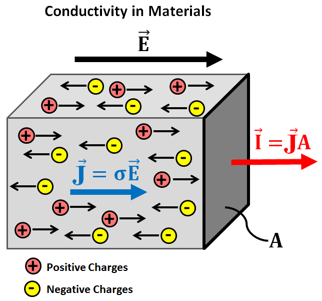
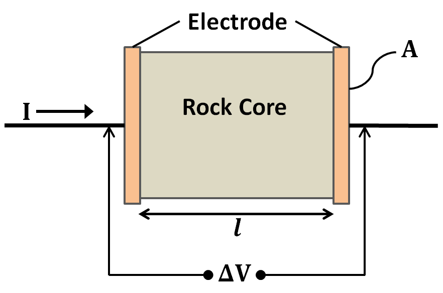

.. _physical_properties_conductivity:

Electrical Conductivity
***********************

	
	
Electrical conductivity (:math:`\sigma`) is the diagnostic physical property in DC resistivity and electromagnetic surveys.
It also plays an important role in ground-penetrating radar and induced polarization surveys.
Electrical conductivity defines the ratio between the density of electrical current (:math:`\vec J`) within a material, and the electric field (:math:`\vec E`) responsible for producing it:

.. math::
	\vec J = \sigma \vec E

Within rocks and other materials, there are free electrical charges.
When an electric field is applied to a material, these charges experience an electrical (Coulomb) force.
This force causes the free charges to move through the material along the direction of the applied field; with positive charges moving parallel to the field and negative charges moving in the opposite direction.
The size of the flow of electrical charges through a material is known as electrical current (:math:`\vec I`). 
Current density represents the amount of current flowing per unit cross-sectional area (:math:`A`), where:

.. math::
	\vec J = \frac{d\vec I}{dA}
	

In essence, the electrical conductivity defines how easy it is for current to flow though a particular material when subjected to an electric field.
In conductive materials (larger :math:`\sigma`), free charges move quite easily and strong currents may be induced by a relatively weak electrical field.
In contrast, resistive materials (smaller :math:`\sigma`) require strong electrical fields in order to produce any significant current.

**Resistivity**: An equivalent physical property to the conductivity is the resistivity (:math:`\rho`).
By definition, the resistivity of a material is the reciprocal of its conductivity:

.. math::
	\rho = \frac{1}{\sigma}

Resistivity therefore defines how difficult it is for current to flow though a particular material when subjected to an electric field.
Both the electrical conductivity and resistivity are acceptable for describing the conductive properties of rocks, however, one should avoid confusing the two terms.
Parameters used to define the conductive properties and their associated units are summarized below.

+------------------+----------------+-------------------------+
| **Property**     | **Symbol**     | **Units**               |
+==================+================+=========================+
| Electric Field   | :math:`\vec E` | F/m                     |
+------------------+----------------+-------------------------+
| Current Density  | :math:`\vec J` | A/m :math:`\!^2`        |
+------------------+----------------+-------------------------+
| Electric Current | :math:`\vec I` | A                       |
+------------------+----------------+-------------------------+
| Conductivity     | :math:`\sigma` | S/m or mS/m             |
+------------------+----------------+-------------------------+
| Resistivity      | :math:`\rho`   | :math:`\Omega\cdot\!` m |
+------------------+----------------+-------------------------+

Conductivity Measurements
=========================

Measuring a rock's conductivity/resistivity is fairly straightforward.
First, a cylindrical core sample is taken from the rock.
The core sample is then placed in a sample holder between two copper/graphite electrodes where it acts as a resistive element for a circuit.

Next, a source is used to drive direct current (:math:`I`) through the core sample.
By measuring the voltage drop (:math:`\Delta V`) accross the length of the sample, Ohm's law can be used to determine the circuit resistance (:math:`R`) caused by the rock:

.. math::
	R = \frac{\Delta V}{I}

The measured resistance increases proportional to the length of the core sample.
We expect this given that the current must flow through more of the resistive material.
The measured resistance is also inversely proportional to the cross-sectional area of the sample.
This relationship can be understood by comparing the net resistance of two identical resistors in parallel to a single resistor in series.

Ultimately, the resistivity of the sample can be obtained from the measured resistance, the length of the core (:math:`l`) and its cross-sectional area (:math:`A`) using Pouillet's law:

.. math::
	\rho = \frac{R A}{l}

Conductivities of Common Rocks
==============================

A chart showing the range of electrical conductivity/resistivity values for common rock types is shown below.
Note that the scale is logarithmic, indicating a huge variability in conductivity/resistivity among rocks.
From this chart we can infer several things:

- Massive sulphides and graphite-bearing rocks are by far the most conductive.
- Carbonate rocks and unconsolidated sediments are very resistive
- Weathered igneous and metamorphic rocks are more conductive than unweathered igneous and metamorphic rocks.
- Sedimentary rocks containing clays are generally more conductive.
- Salt water is more conductive than fresh water.

.. figure:: ./images/images_duplicates/resistivity_table.png
	:align: center
	:scale: 100%

Factors Affecting Rock Conductivity
===================================

**Porosity, Pore Saturation and Pore Fluid**

Most rocks contain pore-spaces which are at least partially saturated with ionic fluids.
These fluids include: fresh water, brackish water, ocean water and brine.
Because pore fluids have a higher conductivity than most rock-forming minerals, electrical current generally prefers to flow through the pore-space whenever possible.
As a result, the bulk conductivity of the rock depends significantly its porosity, fluid saturation and the type of fluid contained within the pore-space.

For rocks which are unsaturated, the pore space is occupied solely by air.
Because air is infinitely resistive, it forces the current to flow through the minerals comprising the rock.
As a result, unsaturated rocks are poorly conductive.
When a sufficient percentage of the pore-space is saturated, the pore fluid is able to offer a more efficient pathway for the current.
Thus, the bulk conductivity of rocks generally increases as fluid saturation increases.

Current flows through a rock's pore-fluid via ionic conduction.
As a result, the conductivity of the pore-fluid depends on the concentration of dissolved ions.
Pore-fluid conductivity increases as the concentration of dissolved ions increases.
This implies rock's containing more brackish pore fluid are more conductive than rocks containing fresh-water.

**Tortuosity**

Tortuosity defines the connectivity and complexity of a rock's pore-space network.
For rocks with low tortuosities, the current's path through the pore space is simple; resulting in efficient conduction of electrical charges.
For rocks with high tortuosities, the path the current must take to get through the rock is very indirect.
As a result, conduction is inefficient, and the rock is more resistive.

**Mineralization**

Electrical current within a rock will choose not to flow through the pore-space if the rock forming minerals are more conductive.
This occurs frequently in ore-bearing rocks due to the presence of metal-oxides (magnetite, illmenite, specular hematite), metal-sulphides (pyrite, pyrrhotite, galena) and native metals (gold, silver, copper). 
One exception is graphite, which despite being entirely comprised of carbon, is very conductive.
As expected, the conductivity increases as the concentration of conductive minerals within the rock increases.

xxxxxxxxxxxxxxxxxxxxxxxxxxxxxxxxxxxxxxxxxxxxxx

 .. figure:: ./images/images_duplicates/cube.gif
	:align: right
	:scale: 100 %

Electrical conductivity (or resistivity) is a bulk property of material
describing how well that material allows electric currents to flow through it.
Consider current flowing through the unit cube of material shown to the right:

**Conductivity**, :math:`\sigma`, is the inverse of resistivity: :math:`\sigma =
1/\rho`. Conductivity is given in units of Siemens per meter, or S/m.
Millisiemens per meter (mS/m) are often used; 1000 mS/m = 1 S/m. So 1 mS/m =
1000 Ohm-m.

The electrical conductivity of Earth's materials varies over many orders of
magnitude. It depends upon many factors, including: rock type, porosity,
connectivity of pores, nature of the fluid, and metallic content of the solid
matrix. An indication of the range of conductivity for rocks and minerals is
in the following figure:

 .. figure:: ./images/images_duplicates/resistivity_table.png
	:align: center
	:scale: 100%

Soils and rocks are composed mostly of silicate minerals, which are
essentially insulators. Exceptions include magnetite, specular hematite,
carbon, graphite, pyrite, and pyrrhotite. Therefore conduction is largely
electrolytic, so conductivity depends mainly upon:

	- porosity;
	- hydraulic permeability, which describes how pores are interconnected;
	- moisture content;
	- concentration of dissolved electrolytes;
	- temperature and phase of pore fluid;
	- amount and composition of colloids (clay content).

Detailed discussion of geologic factors affecting this important physical property are provided in a separate location.

	