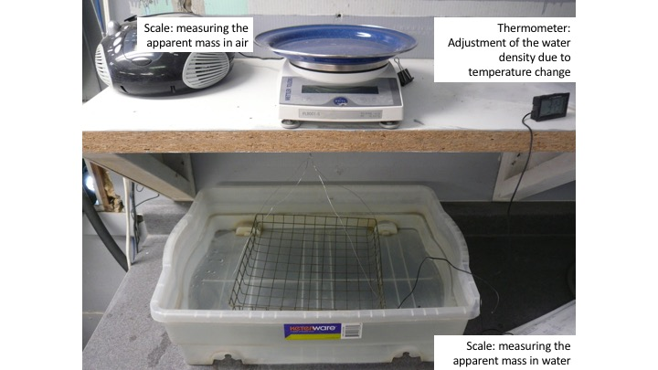
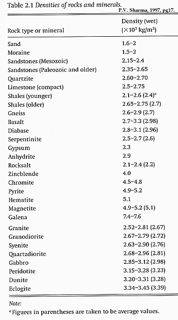

.. _physical_properties_density:

Density
*******

Density (:math:`\rho`) is the diagnostic physical property used in gravity surveys.
Density is defined as the mass (:math:`m`) contained within a material per unit volume (:math:`V`):

.. math::
	\rho = \frac{m}{V}
	
Please note that mass (the quantity of matter within an object) should not be confused with weight (the downward force exerted by an object due to gravity).

**Specific Gravity**: 

In some cases, the density of a material is represented instead by its specific gravity.
Specific gravity defines the ratio of a material's density to that of water:

.. math::
	S.G. = \frac{\rho}{\rho_w}
	
where the density of water :math:`\rho_w` = 1,000 kg/m :math:`\!^3` (or 1 g/cm :math:`\!^3`).
Parameters used to define density and their associated units are summarized below.
	

+------------------+--------------+----------------------------------------+
| Property         | Symbol       | Units                                  |
+==================+==============+========================================+
| Density          | :math:`\rho` | g/cm :math:`\!^3` or kg/m :math:`\!^3` |
+------------------+--------------+----------------------------------------+
| Mass             | :math:`m`    | g or kg                                |
+------------------+--------------+----------------------------------------+
| Volume           | :math:`V`    | cm :math:`\!^3` or m :math:`\!^3`      |
+------------------+--------------+----------------------------------------+
| Specific Gravity | :math:`S.G.` | *Unitless                              |
+------------------+--------------+----------------------------------------+

Density Measurements
====================

Acquiring the density of a material requires an appropriate method of measurement.
Below are four common ways to measure density. These are ordered from more basic to more sophisticated.

**Basic Method**

The most basic method for measuring a rock's bulk density can be performed in two steps.
First, the mass (M) of the rock is obtained using a weight scale.
Next, the rock is fully immersed into a volume of water contained in a graduated cylinder.
The amount of water which is displaced by the rock is equal to the volume (:math:`V`) of the sample.
The density of the rock is obtained from

.. math::
	\rho = \frac{m}{V}

This method is simple but it is often not sufficiently accurate for geophysical purposes. 

**Hydrostatic Weighting**

For this method, the mass of the rock (:math:`m_{a}`) is first measured using a conventional scale.
The rock is then immersed into a bath of water, where its underwater weight is measured and used to obtain an apparent mass (:math:`m_{w}`).
Where :math:`\rho_w` = 1000 kg/m :math:`\!^3` is the density of water, the density of the rock is given by:

.. math::	
	\rho = \frac{m_a}{m_a - m_w} \times \rho_w									

This method if satisfactory for unless the rock is unconsolidated or porous.
Unconsolidated rocks tend to break apart when immersed in water.
The pore-space within porous rocks becomes partially filled, resulting in an overestimation of the rock's density.

**Pycnometer Measurements**

Pycnometer measurements are generally used on porous rocks and sediments.
Using a pycnometer, we can obtain a rock's skeletal density; that is, the average density of all solid material within the rock.
Bulk density is not recovered using this method, as we are not accounting for the rock's pore space.

Pycnometers typically consist of a hollow chamber with a known initial volume (:math:`V_c`).
Once a rock has been placed in the chamber, the volume of the chamber is changed, resulting in a change in gas pressure around the rock.
The change in gas pressure is used to determine how much of the chamber is filled with gas (:math:`V_s`).
The difference between :math:`V_c` and :math:`V_s` represents the volume of solid material comprising the rock.
The skeletal density of the rock is therefore:

.. math::
	\rho_{sk} = \frac{m}{V_c - V_s}
	

**Gamma-Gamma Density Logging**

Gamma-gamma density logging is used to continuously record the bulk density of rock formation along a borehole.
For these measurements, gamma rays are emmitted by a radioactive source.
While transmitting through the adjacent rock, the gamma rays interact with electrons and undergo Compton scattering.
A detector within the borehole measures the intensity of the scattered gamma rays.
Gamma rays experience a higher level of Compton scattering in denser materials.
Therefore, the intensity scattered signal can be used to obtain the bulk density of the rocks within the borehole. 

Density of Common Rocks
=======================

Every rock type has a range of densities which overlap with different rocks. The densities for some common rocks, minerals, and other materials are summarized below.
Some general comments pertaining to densities are:

- Igneous and metamorphic rock are generally more dense than sedimentary rocks.
- Mafic igneous rocks are generally more dense than felsic igneous rocks.
- Higher metamorphic grade rocks such as eclogite and amphibolite are more dense than low grade metamorphic rocks such as slate and phyllite.
- Metal ore-bearing rocks are generally much denser than other rock types. One exception is bauxite.

To see the range of densities for specific rock types, click the links in the table.

+------------------------------------------------------+-----------------------------------+
| Material                                             | Density Range (g/cm :math:`\!^3`) |
+======================================================+===================================+
| Air                                                  |           0.001225                |
+------------------------------------------------------+-----------------------------------+
| Water                                                |           1.00                    |
+------------------------------------------------------+-----------------------------------+
| Ice                                                  |           0.917                   |
+------------------------------------------------------+-----------------------------------+
| Petroleum                                            |           0.60 - 0.90             |
+------------------------------------------------------+-----------------------------------+
| :ref:`Sedimentary  Rocks<table_density_sedimentary>` |           1.50 -3.30              |
+------------------------------------------------------+-----------------------------------+
| :ref:`Igneous Rocks<table_density_igneous>`          |           2.35 -3.50              |
+------------------------------------------------------+-----------------------------------+
| :ref:`Metamorphic Rocks<table_density_metamorphic>`  |           2.52- 3.54              |
+------------------------------------------------------+-----------------------------------+
| :ref:`Ore-Bearing Rocks<table_density_ore_bearing>`  |           2.30- 7.60              |
+------------------------------------------------------+-----------------------------------+

Factors Impacting Rock Density
==============================

There are many factors which impact the bulk density of a rock.
Below are several important factors which you should be familiar with.

**Composition**

Composition impacts the density of all rock types.
Most common rocks are made up of sillicate minerals due to the abundance of silicon and oxygen in the Earth's crust.
The distinct densities of these rocks, however, are dictated by the abundances of other elements such as: aluminum, iron, calcium, sodium, potassium and magnesium.

In igeneous rocks, density generally decreases with respect to the \% abundance of silica (Si0 :math:`\!_2`) contained within the rock.
Using this relationship, igeneous rocks are classified as being felsic, intermediate, mafic or ultramafic.
Rocks with lower silica content (mafic) tend to contain higher abundances of heavier elements like magnesium and iron; making them denser than rocks with a higher silica content (felsic).
This explains why the oceanic crust (mafic) is typically more dense than the continental crust (felsic).
The classification of igeneous rocks based on \% silica content can be seen below:

+-------------------+------------------------------+----------+
| Igneous Rock Type | \% Silica (SiO :math:`\!_2`) | Density  |
+===================+==============================+==========+
| Felsic            | 65\% <                       | Lowest   |
+-------------------+------------------------------+----------+
| Indermediate      | 55\% - 65\%                  | Moderate |
+-------------------+------------------------------+----------+
| Mafic             | 45\% - 55\%                  | High     |
+-------------------+------------------------------+----------+
| Ultramafic        | < 45\%                       | Highest  |
+-------------------+------------------------------+----------+

Similar relationships between composition and density are much harder to obtain for sedimentary and metamorphic rocks.
For sedimentary rocks, the density depends on the rock's parent material, which can be highly variable.
For metamorphic rocks, the density depends on the parent rock and the metamorphic alteration it has experienced.

The oxide and sulphide minerals contained in ore-bearing rocks are much denser than typical rock forming minerals.
This is because ore-bearing rocks contain large quantities of heavy elements such as gold, silver, copper, lead and iron.

**Porosity**

Porosity primarily impacts the density of sedimentary and extrusive volcanic rocks, as the porosity of other rock types is generally very small.
Pore fluids, whether it be air, water, brine or petroleum, have much less density than rock forming minerals.
As a result, rock density decreases as porosity increases.
Because air, water, brine and petroleum have measureably different densities, the type of pore fluid also impacts the density of the rock.

**Pressure**

Sedimentary rocks can experience significant pressure from overlying geological units.
In sedimentary rocks, compressional forces are responsible for reducing the pore space.
The reduction in pore space ultimately results in a higher density for the rock.
This is explains why sediments at the bottom of a basin are typically denser than those at the top.

xxxxxxxxxxxxxxxxxxxxxxxxxxxxxxxxxxxxxxxxxxxxxxxxxxxxxxxxxx

Some Definitions
================

For gravity survey, the physical property of concern is density. A densier
buried object would create an higher attraction than the background. A hole,
with a density of 0, would create a lower attraction than the background.
Difference of densities in the subsurface can be mapped by measuring the
variations of the earth gravity field.

Density is defined as the ratio between the mass m of an object and its volume
V.

.. math::											
	\rho = \frac{m}{V} \quad &&\textrm{Volumetric mass density,}\ (g/cm^3)\ or \ (kg/m^3)

Densities of geologic materials vary from :math:`880 ~\text{kg/m}^3` (ice) (or
:math:`0` for air) to over :math:`8000 ~{\text{kg/m}}^3` for some rare minerals.
Rocks are generally between :math:`1600 ~\text{kg/m}^3` (sediments) and :math:`3500
~\text{kg/m}^3` (gabbro). Table 2.1 from PV Sharma is reproduced below.

It is important to recall the difference between mass, density and weight.
Density is the physical property - it is mass (kilograms) per unit volume.
Weight is the force experienced by that mass in the presence of a
gravitational field. Your weight on the Moon is 1/6th of your weight on Earth,
but your mass (and density) is the same wherever you are.

Specific gravity is also often used and is defined as a relative density in
comparaison with a reference substance (usually water, whose density is
approximated to :math:`1 ~\text{g/cm}^3`.

.. math::
	SP=\frac{\rho}{\rho_{{\omega}}}

Density Measurements 
====================

There are several ways to measure the density of differents materials.

Hydrostatic wieghting for compact samples
-----------------------------------------

The idea of this measurement is too measure with a scale the apparent mass of
an object in air :math:`M_{air}` and then immersed in a fluid (usually water)
:math:`M_{\omega}`. (for more details, see ASTM norm C127)

.. math::	
	\rho_{\text{i}}=\frac{M_{\text{air}}}{M_{\text{air}}-M_{\omega}} \times \rho_{{\omega}}										
	

Non compact materials
---------------------

Measuring non compact materials density (as sand for example) requires a
pycnometer, which is basically a glass with a known volume. By filling the
pycnometer with a known mass of material and then filling the gaps with water
up to the known volume marked on the pycnometer, we are able to estimate the
density of the grains. (for more details, see ASTM norm D857).

However this will not inform you about the porosity and the macroscopic
density on field.

Gamma-Gamma density logging
---------------------------

This type of measurement allows to record continuously the bulk density of a
formation along a borehole. The probe is composed of one radioactive
transmitter of gamma rays and one receiver that measures the proportion of
rays scattered by the wall material by Compton effects. This proportion can
then be related to the formation's density.

