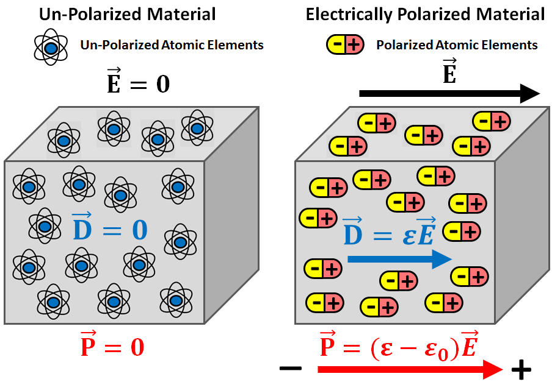

.. _physical_properties_dielectric_permittivity:

Dielectric Permittivity
***********************

Dielectric permittivity (:math:`\varepsilon`) represents an important diagnostic physical property for ground-penetrating radar.
This physical property impacts the attenuation, wavelength and velocity of electromagnetic waves as they propagate through a material.
Dielectric permittivity is defined as the ratio between the electric field (:math:`\vec E`) within a material and the corresponding electric displacement (:math:`\vec D`):

.. math::
	\vec D = \varepsilon \vec E

When exposed to an electric field, positive and negative charges within individual atoms and molecules try to separate from one another.
For example, the electron clouds of atoms will shift in position relative to their nuclei.
The extent of electrical charge separation within a material is represented by the electric polarization (:math:`\vec P`).
The electric field, electric displacement and electric polarization are related by the following expression:

.. math::
	\vec D = \varepsilon_0 \vec E + \vec P
	

where the permittivity of free-space (:math:`\varepsilon_0 = 8.8541878176 \times 10^{-12}` F/m) defines the relationship between :math:`\vec D` and :math:`\vec E` if the material is non-polarizable.
Therefore, the dielectric permittivity and the electric displacement define how strongly a material becomes electrically polarized under the influence of an electric field.
The electrical polarization within the material can be defined in terms of the electric field as follows:

.. math::
	\vec P = (\varepsilon - \varepsilon_0 ) \vec E = \chi_e \varepsilon_0 \vec E

where :math:`\chi_e` is known as the electric susceptibility.
The electric susceptibility should not be confused with the magnetic susceptibility, as they describe different physical processes.

**Relative Permittivity**: The dielectric properties of materials are generally expressed using the relative permittivity (:math:`\varepsilon_r`).
The relative permittivity defines the dielectric properties of a material relative to that of free-space:

.. math::
	\varepsilon_r = \frac{\varepsilon}{\varepsilon_0}
	

Parameters used to define the dielectric properties of materials and their associated units are tabulated below.

+-------------------------+-----------------------------------+------------------+
| **Property**            | **Symbol**                        | **Units**        |
+=========================+===================================+==================+
| Electric Field          | :math:`\vec E`                    | N/C or V/m       |
+-------------------------+-----------------------------------+------------------+
| Displacement Current    | :math:`\vec D`                    | A/m :math:`\!^2` |
+-------------------------+-----------------------------------+------------------+
| Electric Polarization   | :math:`\vec P`                    | A/m :math:`\!^2` |
+-------------------------+-----------------------------------+------------------+
| Dielectric Permittivity | :math:`\varepsilon`               | F/m              |
+-------------------------+-----------------------------------+------------------+
| Electric Susceptibility | :math:`\chi_e`                    | *Unitsless       |
+-------------------------+-----------------------------------+------------------+
| Relative Permittivity   | :math:`\varepsilon_r`             | *Unitless        |
+-------------------------+-----------------------------------+------------------+

Measurements for Dielectric Permittivity
========================================

There are a host of methods for measuring the dielectric permittivity of a material.
Here, we will describe two basic experiments.

**Transmission Time Measurements**

Electrical Permittivity for Common Rocks
========================================

A table containing the relative permittivities for common rocks, soils and other materials is shown below (Martinez and Byrnes, 2001).
Rocks within a certain classification vary significantly in composition.
As a result, the relative permittivities of rock types are given as a range of values.
By examining this table, several things can be inferred:

- Water has a much higher dielectric permittivity than rock forming minerals.
- Water saturated rocks have larger dielectric permittivities than dry rocks.
- Saturated sediments generally have larger dielectric permittivities than hard rocks.
- The variation in dielectric permittivity for sediments is larger than it is for hard rocks.

+-----------------------------+------------------------+
| **Rock/Soil Type**          |:math:`\varepsilon_r\;` |
+=============================+========================+
| Air                         | 1                      |
+-----------------------------+------------------------+
| Fresh Water                 | 80                     |
+-----------------------------+------------------------+
| Sea Water                   | 80                     |
+-----------------------------+------------------------+
| Ice                         | 3 - 4                  |
+-----------------------------+------------------------+
| Snow                        | 8 - 12                 |
+-----------------------------+------------------------+
| Permafrost                  | 4 - 8                  |
+-----------------------------+------------------------+
| **Sediments**               |                        |
+-----------------------------+------------------------+
| Silt                        | 5 - 30                 |
+-----------------------------+------------------------+
| Sand (dry)                  | 3 - 6                  |
+-----------------------------+------------------------+
| Sand (wet)                  | 10 - 30                |
+-----------------------------+------------------------+
| Sandy Soil (dry)            | 4 - 6                  |
+-----------------------------+------------------------+
| Sandy Soil (wet)            | 15 - 30                |
+-----------------------------+------------------------+
| Loamy Soil (dry)            | 4 - 6                  |
+-----------------------------+------------------------+
| Loamy Soil (wet)            | 10 - 20                |
+-----------------------------+------------------------+
| Clayey Soil (dry)           | 4 - 6                  |
+-----------------------------+------------------------+
| Clayey Soil (wet)           | 10 - 15                |
+-----------------------------+------------------------+
| Clay (dry)                  | 2 - 6                  |
+-----------------------------+------------------------+
| Clay (wet)                  | 15 - 40                |
+-----------------------------+------------------------+
| **Rocks**                   |                        |
+-----------------------------+------------------------+
| Shales                      | 5 - 15                 |
+-----------------------------+------------------------+
| Sandstones (dry)            | 2 - 3                  |
+-----------------------------+------------------------+
| Sandstones (wet)            | 5 - 10                 |
+-----------------------------+------------------------+
| Limestones                  | 4 - 8                  |
+-----------------------------+------------------------+
| Granite                     | 4 - 6                  |
+-----------------------------+------------------------+
| Coal (dry)                  | 3.5                    |
+-----------------------------+------------------------+
| Coal (wet)                  | 8                      |
+-----------------------------+------------------------+
| **Minerals**                |                        |
+-----------------------------+------------------------+
| Calcite                     | 6.4                    |
+-----------------------------+------------------------+
| Gypsum                      | 6.5                    |
+-----------------------------+------------------------+
| Halite                      | 5.9                    |
+-----------------------------+------------------------+
| Kaolinite                   | 11.8                   |
+-----------------------------+------------------------+
| Mica                        | 6.4                    |
+-----------------------------+------------------------+
| Olivine                     | 7.2                    |
+-----------------------------+------------------------+
| Orthoclase Feldspar         | 5.6                    |
+-----------------------------+------------------------+
| Plagioclase Feldspar        | 7                      |
+-----------------------------+------------------------+
| Pyroxene                    | 8.5                    |
+-----------------------------+------------------------+
| Quartz                      | 4.5                    |
+-----------------------------+------------------------+

Factors Impacting Electric Permittivity
=======================================

**Porosity and Water Saturation**:

By far the most important factors in determining a rock's dielectric permittivity are porosity and water saturation.
Air has a relative permittivity of 1 whereas common rock forming minerals have much higher relative permittivities.
This means that for dry samples, the rock's bulk dielectric permittivity decreases as the porosity increases.

When rock samples are saturated with water, their dielectric permittivities can increase drastically.
This is because water has a relative permittivity of 80, which is much higher than the relative permittivities of rock forming minerals.
As a result, the bulk dielectric permittivity of a rock increases as pore water saturation increases.

The relationship between a rock's bulk dielectric permittivity, porosity and water saturation is given by:

.. math::
	\sqrt{\varepsilon} = (1 - \phi ) \sqrt{\varepsilon_m} + \phi \big [ S_w \sqrt{\varepsilon_w} + (1-S_w) \sqrt{\varepsilon_a} \big ]

where

- :math:`0 \leq \phi \leq 1` is the porosity
- :math:`0 \leq S_w \leq 1` is the factional volume of the pore space saturated by water.
- :math:`\varepsilon_m` is the dielectric permittivity of rock forming minerals.
- :math:`\varepsilon_a` is the dielectric permittivity of air (equal to free-space).
- :math:`\varepsilon_w` is the dielectric permittivity of water.

**Frequency**: 

For hard rocks and unsaturated sedimentary samples, the dielectric permittivity can be considered constant for all intents and purposes.
At sufficiently low frequencies, the same can be said about water-saturated sedimentary rocks and soils (Kaatze, 1989; Meissner and Wentz, 2004).
At high frequencies however ( > 1 GHz), the electric polarization within water-saturated samples depends on the frequency of the electric field.
As a result, these samples are sometimes characterized using a frequency-dependent dielectric permittivity:

.. math::
	\varepsilon (\omega) = \varepsilon^\prime (\omega) + i \varepsilon^{\prime\prime} (\omega)

where :math:`i = \sqrt{-1}`.
The real component of the dielectric permittivity (:math:`\varepsilon^\prime`) represents energy stored through electrical polarization whereas the imaginary component (:math:`\varepsilon^{\prime\prime}`) represents a measure of energy loss.
The significance of the real and imaginary components of the dielectric permittivity will be discussed in more detail when learning about ground-penetrating radar (link).

.. figure:: ./images/cole_cole_permittivity.png
	:align: right
	:scale: 40%

A widely used model for describing the frequency-dependent dielectric permittivity is the Cole-Cole model:

.. math::
	\varepsilon (\omega) = \varepsilon_\infty + \frac{\varepsilon_{DC} - \varepsilon_\infty}{1 + (i\omega \tau)^\alpha}

where :math:`\varepsilon_{DC}` is the DC or zero-frequency permittivity, and :math:`\varepsilon_\infty` represents a limit as frequency goes to infinity.
Parameters :math:`\tau` and :math:`\alpha` define the span of frequencies in which the dielectric permittivity changes with respect to frequency.
As we can see from this model:

- Frequency-dependence only occurs over a finite span of frequencies.
- The magnitude of the dielectric permittivity decreases with respect to an increase in frequency.
- At sufficiently low frequencies, the dielectric permittivity is constant and real-valued.

xxxxxxxxxxxxxxxxxxxxxxxxxxxxxxxxxxxxxxxxxxxxx

**Dielectric permittivity  :math:`(\epsilon)`:** This physical property
quantifies how easily material becomes polarized in the presence of an
electric field. The permittivity of free space is :math:`\epsilon_0 =
8.8541878176 10^{-12} F/m`, a "Farad" (F) is the unit of capacitance,
named after Michael Faraday. If free space did not have finite permittivity,
electromagnetic waves (light, radio, etc) could not propagate in free space.

**Relative dielectric permittivity :math:`(\epsilon_R)`:** Relative dielectric
permittivity is a ratio: since dielectric permittivity :math:`\epsilon =
\epsilon_R \epsilon_0`, relative dielectric permittivity :math:`\epsilon_R
= \epsilon / \epsilon_0`.

 
Relative dielectric permittivity is the parameter usually referred to in GPR
work. It is 1 (one) for free space or air, and 80 for water. Because it is a
number that compares true value to free space value, it has no units.

Dielectric permittivity is in fact a complex value, often written :math:`
\epsilon_R = \epsilon_R^{\prime} - i\epsilon_R^{\prime\prime}` . It can
be considered as a measure of the extent to which charge distribution can be
distorted or polarized by an applied electric field.

The so-called "real" part, :math:`\epsilon_r^{\prime}` , is the *relative
dielectric constant* , often introduced in electronics or physics
courses in the context of capacitors. It is a storage component measured as
capacitance per unit length. (Capacitance is "the amount of charge a material
can hold" for a given applied voltage.) At different frequencies, polarization
occurs at different scales: at very high frequencies, only subatomic particles
can be polarized. At GPR frequencies, the reorientation of dipolar molecules
is the largest contribution, hence water's importance in determining the
velocity of EM waves in a material. Note that :math:`\epsilon_R = 80` for
water, whereas :math:`\epsilon_R < 10` for most other common materials.

 .. figure:: ./images/images_duplicates/dielectric_responses.jpg
	:align: center
	:scale: 100 %

	A dielectric permittivity spectrum over a wide range of frequencies, for real (top curve) and "imaginary" (bottom curve) components. Borrowed from `Wikipedia Dielectric Permittivity Article`_.

The so-called "imaginary" part, :math:`\epsilon_r^{\prime\prime}`,  is a loss
component that generally indicates how much energy is dissipated at the
transition from one polarization mechanism to another. The behaviour of both
is shown in the figure. Values are relatively constant for GPR frequencies of
:math:`10^6` through :math:`10^9` , ensuring that wave behaviour is not
dispersive; i.e. all frequency components of a broad band signal travel at the
same speed.

The dielectric permittivity of most geological materials is closely dependent
upon the amount of water (free or otherwise) in the material. Values of
:math:`\epsilon_R` for geologic materials range from 1 to 80, as seen in the
table above.

.. _Wikipedia Dielectric Permittivity Article: https://en.wikipedia.org/wiki/Permittivity
