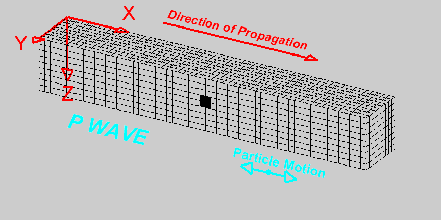
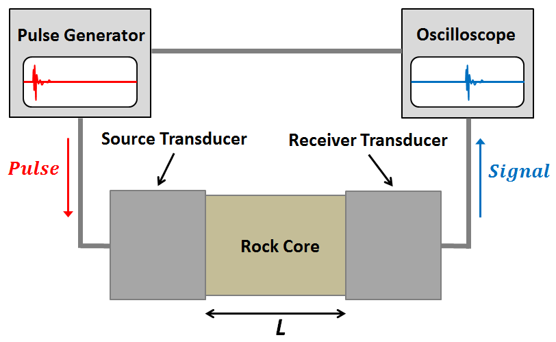

.. _seismic_velocity_duplicate:

Seismic Velocity
****************

Elastic energy propagates through the earth in different ways and at different velocities.
The main wave types are body waves (P and S waves) and surface waves (Rayleigh and Love waves).
Body waves travel through a medium whereas surface waves travel along surfaces or interfaces.
Each wave has its own particle motion and speed of propagation.
The speed of propagation depends upon the bulk modulus, shear modulus and density of the medium.

Body Waves
==========

In seismology, there are two fundamental types of waves that travel through a medium: pressure waves ("P-waves") and shear-waves ("S-waves").

**P-waves**

P-waves are compressional waves in which particle motion is in the direction of the wave propagation.
The compression and extension of the medium, and the propagation of the wave, can be seen in the diagram on the right.
As we can see, cells change volume as the wave passes through.
The P-wave velocity is related to the elastic properties of the medium by the following expression:

.. math::
	v_p = \sqrt{\frac{K+4/3\mu}{\rho}} 
	

where :math:`K` is the bulk modulus, :math:`\mu` is the shear modulus and :math:`\rho` is the density.

**S-waves**

.. image:: images/Swave.gif
	:scale: 40%
	:align: right

S-waves are shear waves in which the particle motion is perpendicular to the direction of wave propagation.
The shearing action and the propagation of the wave can be seen in the diagram on the right.
Cells change shape but do not change volume as the wave passes through.
When there is a reference interface, such as the surface of the earth, S-waves are labelled as SH (horizontal shear) and/or SV (vertical shear).
This is used to indicate the direction of particle motion with respect to the surface.
In isotropic media, SH and SV waves travel at the same speed.
The S-wave velocity can be related to the elastic properties of the medium by the following expression:

.. math::
	v_s = \sqrt{\frac{\mu}{\rho}}

Surface Waves
=============

**Rayleigh waves**

.. image:: images/Rayleighwave.gif
	:scale: 40%
	:align: right

**Love waves**
    

.. image:: images/Lovewave.gif
	:scale: 40%
	:align: right
    

Material Elastic Properties
===========================

**Bulk Modulus**

The bulk modulus (:math:`K`) defines the resistance of a material to elastic compression.
As a result, it is sometimes referred to as the modulus of incompressibility.
When a block of material is subjected to compressional forces, its volume decreases and it becomes more dense (see figure).
Once the compressional force is removed, the block of material returns to its original size if the deformation is elastic.
The bulk modulus characterizes the compressional deformation as follows:

.. math::
	K = - V_0 \frac{\Delta V}{\Delta P}

where :math:`V_0` is the original volume of material, :math:`\Delta P` represents the pressure being applied to the material and :math:`\Delta V` is the resulting change in volume.

**Shear Modulus**

The shear modulus (:math:`\mu`) defines how resistant a material is to shear stress.
As a result, it is sometimes referred to as the modulus of rigidity.
When a block of material is subjected to a shear stress, it experiences a shear strain (see figure).
The shear modulus defines the ratio of shear stress to shear strain:

.. math::
	\mu = \frac{Stress}{Strain} = \frac{F}{\Delta x l A}

where the shear stress is represented by a force (:math:`F`) per unit area (:math:`A`).
Shear strain represents a tangent angle between the shear deformation (:math:`\Delta x`) of the material along the direction of force and the perpendicular demension (:math:`l`) of the block of material.

Symbols used to define P-wave and S-wave velocities, as well as the elastic properties on which they depend, are summarized in the following table:

+----------------------------------------------+--------------+----------------------------------------+
| Property                                     | Symbol       | Units                                  |
+==============================================+==============+========================================+
| P-Wave Velocity                              | :math:`v_p`  | m/s or km/s                            |
+----------------------------------------------+--------------+----------------------------------------+
| S-Wave Velocity                              | :math:`v_s`  | m/s or km/s                            |
+----------------------------------------------+--------------+----------------------------------------+
| Bulk Modulus(Incompressibility)              | :math:`K`    | Pa or GPa                              |
+----------------------------------------------+--------------+----------------------------------------+
| Shear Modulus (Rigidity)                     | :math:`\mu`  | Pa or GPa                              |
+----------------------------------------------+--------------+----------------------------------------+
| Density                                      | :math:`\rho` | kg/m :math:`\!^3` or g/cm :math:`\!^3` |
+----------------------------------------------+--------------+----------------------------------------+

P-Wave and S-Wave Velocity Measurements
=======================================

**Ultrasonic Elastic Wave Velocity Measurements**

To measure the P-wave and S-wave velocities for a given rock, a core sample is taken.
The core sample is then held in place between two piezometric transducers.
Piezometric transducers contain materials which contract and expand in response to an applied voltage.

The measurement apparatus works by generating a short current pulse.
As a result of the incoming current pulse, materials within the source transducer undergo elastic deformation.
This elastic deformation is then transferred to the rock core where it propagates as elastic waves.
On the other side of the rock, a receiver transducer registers the elastic waves and transforms the corresponding energy back into a current signal.
This current signal is then measured by an oscilloscope.

Using the oscilloscope, we can determine the amount of time (:math:`\Delta t`) it took for the elastic waves to propagate through the rock core.
Given that we know the length of the rock core (:math:`L`), the seismic velocity is given by:

.. math::
	V = \frac{L}{\Delta t}

In practice, the user may control whether they are measuring P-wave or S-wave velocities by specifying the direction of elastic deformation within the source transducer.
Elastic deformation parallel to the length of the core results in P-wave velocity measurements, whereas elastic deformation perpendicular to the length of the core results in S-wave velocity measurements.

P-Wave and S-Wave Velocities in Common Rocks
============================================

P-waves and S-waves travel at different speeds depending on the media they are propagating through; P-waves travel faster than S-waves.
P-waves are able to propagate through solids and fluids, however, S-waves can only propagate through solid materials.
Given that there are so many factors which impact the velocity of seismic waves, it is impossible to assign a single value to a particular rock type.
Therefore, the seismic velocities of rocks are generally defined over a range.
The range of P-wave and S-wave velocities for common materials are shown below:

+---------------------------------+--------------+--------------+
|      **Material**               | P-wave (m/s) | S-wave (m/s) |
+=================================+==============+==============+
| Air                             |  343         | N/A          |
+---------------------------------+--------------+--------------+
| Water                           | 1450 - 1500  | N/A          |
+---------------------------------+--------------+--------------+
| Ice                             | 3400 - 3800  | 1700 - 1900  |
+---------------------------------+--------------+--------------+
| Oil                             | 1200 - 1250  | N/A          |
+---------------------------------+--------------+--------------+
| Vegetal Soil                    |  300 - 700   |  100 - 300   |
+---------------------------------+--------------+--------------+
| Dry Sands                       |  400 - 1200  |  100 - 500   |
+---------------------------------+--------------+--------------+
| Wet Sands                       | 1500 - 2000  | 400 - 600    |
+---------------------------------+--------------+--------------+
| Saturated Shales and Clays      | 1100 - 2500  | 200 - 800    |
+---------------------------------+--------------+--------------+
| Porous and Saturated Sandstones | 2000 - 3500  | 800 - 1800   |
+---------------------------------+--------------+--------------+
| Marls                           | 2000 - 3000  | 750 - 1500   |
+---------------------------------+--------------+--------------+
| Chalk                           | 2300 - 2600  | 1100 - 1300  |
+---------------------------------+--------------+--------------+
| Coal                            | 2200 - 2700  | 1000 - 1400  |
+---------------------------------+--------------+--------------+
| Salt                            | 4500 - 5500  | 2500 - 3100  |
+---------------------------------+--------------+--------------+
| Anhydrites                      | 4000 - 5500  | 2200 - 3100  |
+---------------------------------+--------------+--------------+
| Limestones                      | 3500 - 6000  | 2000 - 3300  |
+---------------------------------+--------------+--------------+
| Dolomites                       | 3500 - 6500  | 1900 - 3600  |
+---------------------------------+--------------+--------------+
| Granite                         | 4500 - 6000  | 2500 - 3300  |
+---------------------------------+--------------+--------------+
| Basalt                          | 5000 - 6000  | 2800 - 2400  |
+---------------------------------+--------------+--------------+
| Gneiss                          | 4400 - 5200  | 2700 - 3200  |
+---------------------------------+--------------+--------------+

Factors Impacting the Seismic Velocity
======================================

Given that P-wave and S-wave velocities both depend on the shear modulus and density of the material, many of the factors which impact the P-wave velocity will affect the S-wave velocity in a similar manner.
Below are some of the factors which are known to affect the seismic velocities in materials.

**Lithology**

The mineralogy and structure of a rock determines its bulk modulus, shear modulus and density; which define the P-wave and S-wave velocities.
In general, igneous, metamorphic, carbonate and anhydrite rocks have relatively large seismic velocities compared to soils and most sedimentary rocks.
This is because the aforementioned rocks only deform under extreme compressional and shear stresses, and are therefore characterized by larger bulk and shear moduli.
In sandstones and soils, clays have a tendency to present in load-bearing positions.
As a result, seismic velocities are heavily influenced by clay content.
Even in small abundances, clays have been shown to significantly reduce the seismic velocity by reducing the shear modulus.

**Porosity**

The most significant factor affecting seismic wave velocities is porosity.
In the above table, we saw that seismic waves travel faster in solids than they do in fluids; with S-waves being unable to propagate through fluids.
Thus as the porosity of a rock increases, both the P-wave and S-wave velocities will decrease.
This is because seismic wave propagation becomes less efficient when forced through a fluid.
Although it will not be explained here, the pore structure also plays an important role in reducing the efficiency of seismic wave propagation within rocks.

**Pore Fluid and Saturation**

Pore fluid determines the elastic properties of the pore space.
Since P-wave velocity is larger in water and oil than it is in air, the P-wave velocity of a rock is less impacted by porosity if the pore-space is saturated.
Additionally, the S-wave velocity has been shown to depend on the density of the pore fluid.
As a result, P-wave and S-wave velocities increase as pore saturation increases.
This can be described in a rudimentary manner using Wyllie's equation:

.. math::
	V_{bulk} = \Bigg [ \frac{\phi}{V_{fluid}} + \frac{1-\phi}{V_{matrix}} \Bigg ]^{-1}

where :math:`0 \leq \phi \leq 1` is the fractional \% fluid saturation, :math:`V_{fluid}` is the seismic velocity of the fluid, :math:`V_{matrix}` is the seismic velocity of the solid material within the rock, and :math:`V_{bulk}` is the bulk seismic velocity for the rock.

**Lithification**

Lithification describes the geological process in which unconsolidated sediments become consolidated through compaction and cementation.
When subject to tectonic compression, or under the weight of overlying geological units, sediments and soils become compacted.
This compaction reduces the pore-space which ultimately increases the P-wave and S-wave velocities.
As a result, the seismic velocities of sedimentary units frequently increase with depth.

Cementation refers to chemical fluid processes in which pore space is replaced by a precipitate and mineral grains become fused to one another.
Cementation increases the incompressibility and rigidity of the sedimentary rock, thus increasing its bulk and shear moduli.
Ultimately, this process is responsible for increasing the seismic velocities.

xxxxxxxxxxxxxxxxxxxxxxxxxxxxxxxxxxxxxxxxxxxxxxxxxxxxxxx

Relating geology to velocity
============================

Mechanic waves travel at different speed depending on the material they go
through. For example if in the air at 20°C they travel at around 343 m/s (it
is a sound), in water at 20°C they travel at 1480 m/s. Similarly the
velocities of various rock types vary rather widely, so it is usually
difficult to determine rock type based only upon velocities. The table to the
below shows rough ranges of velocities in units of kilometers per second for
several types of earth materials.

+--------------------------------+-----------+
| **Unconsolidated Materials**   |    km/s   |
+================================+===========+
| Sand (dry)                     |  0.2-1.0  |
+--------------------------------+-----------+
| Sand (water saturated)         |  1.5-2.0  |
+--------------------------------+-----------+
| Clay                           |  1.0-2.5  |
+--------------------------------+-----------+
| Glacial Till (water saturated) |  1.5-2.5  |
+--------------------------------+-----------+
| Permafrost                     |  3.5-4.0  |
+--------------------------------+-----------+
| **Sedimentary Rocks**                      |
+--------------------------------+-----------+
| Sandstones                     |  2.0-6.0  |
+--------------------------------+-----------+
|  > Tertiary sandstone          |  2.0-2.5  |
+--------------------------------+-----------+
|  > Pennant sandstone           |  4.0-4.5  |
+--------------------------------+-----------+
|  > Cambrian quartzite          |  5.5-6.0  |
+--------------------------------+-----------+
| Limestones                     |  2.0-6.0  |
+--------------------------------+-----------+
|  > Cretaceous Chalk            |  2.0-2.5  |
+--------------------------------+-----------+
|  > Jurassic oolites            |  3.0-4.0  |
+--------------------------------+-----------+
|  > Bioclastic limestones       |  3.0-4.0  |
+--------------------------------+-----------+
|  > Carboniferous limestones    |  5.0-5.5  |
+--------------------------------+-----------+
| Dolomites                      |  2.5-6.5  |
+--------------------------------+-----------+
| Salt                           |  4.5-5.0  |
+--------------------------------+-----------+
| Anhydrite                      |  4.5-6.5  |
+--------------------------------+-----------+
| Gypsum                         |  2.0-3.5  |
+--------------------------------+-----------+
| **Igneous/Metamorphic Rocks**              |
+--------------------------------+-----------+
| Granite                        |  5.5-6.0  |
+--------------------------------+-----------+
| Gabbro                         |  6.5-7.0  |
+--------------------------------+-----------+
| Ultramafic rocks               |  7.5-8.5  |
+--------------------------------+-----------+
| Serpentine                     |  5.5-6.5  |
+--------------------------------+-----------+
| **Pore Fluids**                            |
+--------------------------------+-----------+
| Air                            |  0.3-0.3  |
+--------------------------------+-----------+
| Water                          |  1.4-1.5  |
+--------------------------------+-----------+
| Ice                            |  3.4-3.4  |
+--------------------------------+-----------+
| Petroleum                      |  1.3-1.4  |
+--------------------------------+-----------+
| **Other Materials**                        |
+--------------------------------+-----------+
| Steel                          |    6.1    |
+--------------------------------+-----------+
| Iron                           |    5.8    |
+--------------------------------+-----------+
| Aluminum                       |    6.6    |
+--------------------------------+-----------+
| Concrete                       |    3.6    |
+--------------------------------+-----------+

Seismic surveys are most effective at delineating structure, .i.e boundaries
where rock type changes.

The relations between elastic properties and velocity, introduced under
"Fundamentals", are given again here.

.. <<editorial comment>> link here!

.. math::
	v_p = \sqrt{\frac{K+4/3\mu}{\rho}} \quad v_s = \sqrt{\frac{\mu}{\rho}}
	:label: vpvs

The two elastic constants and density each depend on the properties that
geologists or engineers use to characterize the rock. These are the "secondary
properties", including porosity, fluid saturation, texture etc. Many of these
relationships are empirical - velocities are found to be related to certain
rock units in a given locale by actual laboratory measurements on core samples
of the rock or soil.

One generally applicable rule is that seismic velocities generally increase
with depth. However densities also increase with depth, so it must be that the
bulk and shear modulii ( :math:`K` and :math:`\mu` respectively) increase faster
than the density. There are many empirical relationships between velocity and
depth of burial and geologic age, and different publications will present
these relationships in various graphical or tabular ways. In the next section,
general expectations for how porosity, lithification, pressure and fluid
saturation affect velocity are summarized.

Porosity
--------

A very rough rule is the so called Wyllie's time average relationship (in
which :math:`\phi` is the porosity):

.. math::
    \frac{1}{V_{\text{bluk}}} = \frac{\phi}{V_{\text{fluid}}} + \frac{1-\phi}{V_{\text{matrix}}}

This is not based on theory but is roughly right when the effective pressure
is high and the rock is fully saturated. It is used extensively in the oil
industry to convert data from "sonic logs" (which measure formation velocities
directly) into porosity.

Lithification (or cementation)
------------------------------

The degree to which grains in a sedimentary rock are cemented together by post
depositional, usually chemical, processes, has a strong effect on the values
of elastic modulii. Also, by filling pore space with minerals of higher
density than fluids, the bulk density is increased. The combination of
porosity reduction and lithification contributes towards the observed increase
of velocity with depth of burial and age.

Pressure
--------

Compressional wave velocity is strongly dependent on effective stress. For a
rock buried in the earth, the **confining (or "lithostatic") pressure** is the
pressure of the overlying rock column, and the **pore water pressure** may be
greater than, less than, or (if there is connected porosity to the surface)
equal to the confining pressure. The **effective pressure** is the difference
between the confining and pore pressure.

In general velocity rises with increasing confining pressure and then levels
off to a “terminal velocity” when the effective pressure is *high*. The effect
is probably due to crack closure. At *low* effective pressure, cracks are open
and easily closed with an increase in stress. This is the equivalent of saying
there is large strain for low increase in stress, hence small :math:`K` and low
velocity. As the effective pressure increases the cracks are all closed,
:math:`K` goes up and the velocity increases.

Finally even at depth, as the pore pressure increases above hydrostatic, the
effective pressure decreases as does the velocity. Therefore, over-pressured
zones may be detectable in a sedimentary sequence by their anomalously low
velocities.

All this seems a bit complicated, and the take-home message is that there are
several contributing factors to velocity, some of which may be counter-
intuitive.

Fluid saturation
----------------

Theoretical and empirical studies have shown that the compressional wave
velocity *decreases* with *decreasing* fluid saturation. As the fraction of
gas in the pores increases, :math:`K`, and hence velocity, decreases. Less
intuitive is the fact that :math:`V_s` also decreases with an increase in gas
content. The seismic reflection coefficient is strongly affected if one of the
contacting media is gas saturated because the impedance is lowered by
decreases in both the density and velocity.

Velocity in unconsolidated near surface soils (the weathered layer)
-------------------------------------------------------------------

The effects of high porosity, less than 100% water saturation, lack of
cementation, low effective pressure and the low bulk modulus (due to the ease
with which native minerals can be rearranged under stress) combine to yield
very low compressional and shear wave velocities in the weathered layer.
:math:`V_p` can be as low as 200 m/sec in the unsaturated zone (vadose zone) –
which is less that the velocity of sound in air!

Attenuation
-----------

Attenuation is the reduction in amplitude (strength) of the seismic signal as
it travels through the material. Seismic waves decrease in amplitude due to
spherical spreading and due to mechanical or other loss mechanisms in the rock
units that the wave passes through. The attenuation for a sinusoidal
propagating wave is defined formally as the energy loss per cycle (wave
length) Δ E/E where E is the energy content of the wave.

There are many theories for explaining attenuation in rocks. Friction is a
contributor, but does not explain laboratory measurement alone. Various other
damping mechanisms such as viscous flow have more success but much important
work remains to be done in this area, especially for unconsolidated material
where the attenuation is very high. Some of the theories predict attenuation
as well as dispersion (which means the variation of velocity with frequency).

Experimentally it is found that attenuation depends on frequency, but velocity
does not (much). Quantitatively, at one Hertz the amplitude decays by roughly
two thirds in 10 km, whereas at 1000 Hz it decays by that same about in 10 m.
This reflects the fact that the wavelength at 1 Hz is 1000 times larger than
the wavelength at 1000 Hz. Also, attenuation may be as much as 10 times
greater in unconsolidated sediments.

Another important attenuation mechanism is the reduction in amplitude of a
wave by the scattering of its energy by objects whose dimensions are on the
order of the wavelength. For example, attenuation of a 1000 Hz signal in a
shallow unconsolidated medium with a velocity of 250 m/sec can result in the
signal being reduced to two thirds is original amplitude after traveling only
157 m. Therefore, it is reasonable to expect that the very high attenuation
observed in near surface unconsolidated sediments is due to scattering.

