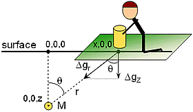
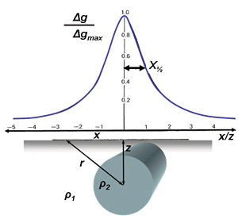

.. _gravity_basics:

Gravity measurements
********************

.. figure:: ./images/gravity_table.gif
    :align: right

The physical property: density
==============================

Gravity surveys are usually done to find subsurface variations in density
(kg/m\ :sup:`3`\  or g/cm\ :sup:`3`\). Densities of geologic materials vary
from 880 kg/m\ :sup:`3`\  (ice) (or 0 for air) to over 8000 kg/m\ :sup:`3`\
for some rare minerals. Rocks are generally between 1600 kg/m\ :sup:`3`\
(sediments) and 3500 kg/m\ :sup:`3`\  (gabbro). Table 2.1 from PV Sharma is
reproduced to the right.

It is important to recall the difference between mass, density and weight.
Density is the physical property - it is mass (kilograms) per unit volume.
Weight is the force experienced by that mass in the presence of a
gravitational field. Your weight on the Moon is 1/6th of your weight on Earth,
but your mass (and density) is the same wherever you are.

Fundamentals
============

We want to show that a mass above the earth experiences an attraction force
due to Earth's gravitational field. The phenomenon is described with very
simple equations that were discovered empirically by Sir Isaac Newton in the
17\ :sup:`th`\  century.

Newton's equation describing the force between two masses (Earth and Moon, or
Earth and you) is

.. math::
		F = G \frac{Mm}{r^2} \qquad \text{(Eq1)}

where the force :math:`F` points from one mass to the other, :math:`M` and :math:`m`
are two masses, and :math:`G=6.67*10^{-11}` Nm\ :sup:`2`\/Kg\ :sup:`2`\. You
should recall that another of Newton's relations characterizes the force on an
object experiencing acceleration:

.. math::
		F=ma \qquad \text{(Eq2)}

Comparing these two equations, it should be clear that most of Eq1 represents
an acceleration: :math:`a = GM/r^2`. In fact this is gravitational
acceleration, and we call it :math:`g`. This gravitational acceleration :math:`g`
is nominally approximately 9.8 m/s\ :sup:`2`\  on Earth's surface at the
equator. Local variations in :math:`g` will be caused by local variations in
:math:`M` and/or in :math:`r`.

Units
=====

What are the units for this acceleration, or :math:`g`? Acceleration is in m/s\
:sup:`2`\, but another name for g = 1 cm/s\ :sup:`2`\  is 1 Gal (short for
Galileo). Usually geophysicists work in units of milliGals (0.001 Gal). You
will also see the "gravity unit," or *gu*, where 1 gu = 0.1 mGal. Some
authors, especially in Europe, use gu's instead of Gals. Earth's gravitational
acceleration in these units (converted from the more common m/s\ :sup:`2`\) is
9.8 m/s\ :sup:`2`\ = 978 Gal, or 978,031.85 mGal, or 9,780,318.5 gu at the
equator.

Measuring gravity
=================

Measurable geophysical gravity anomalies generally range between 0.1 and
0.00001 Gal. This means we must measure accelerations of 
1 part in 10 \ :sup:`8`\  or 10 \ :sup:`9`\; not a trivial task! 
How is this done?

If a mass hangs on a spring, a force on the mass :math:`(F = ma)` will stretch
the spring. Hooke's law states that the extension of a spring is proportional
to force, or

.. math::
		m(dg)=k(ds)

where :math:`k` is the "elastic spring constant," :math:`dg` :math:`` a small
change in gravitational acceleration, and :math:`ds` is a small change in spring
length. So, if we measure :math:`ds`, we can get

.. math::
		dg = ds \frac{k}{m}

To summarize:

- The *measured* parameter is the force on a mass, :math:`m`, due to the presence of another mass, :math:`M`.
- The *recorded* parameter is acceleration, with units of milliGals (compared to m/s\ :sup:`2`\ ).
- The *interpreted* parameter is usually density of causative buried materials and structures.		

To carry out a gravity survey, you must measure this change in spring length
all over the field site (or along a line). Then you can produce a map (or
profile) of relative differences in gravitational acceleration, :math:`g`.
Finally, this result must be interpreted in terms of variations in buried mass
(integrated all over the volume), and/or in terms of the distance, :math:`r`, to
the buried mass.

There are other fundamental measurements that do not involve springs. There
are instruments that measure the time it takes for a mass to fall through a
vacuum, and the period of a pendulum can be observed carefully. There are more
details about these less common methods of measuring gravity in most text
books about applied geophysics.

What is actually measured?
==========================

Instruments actually measure the vertical component of the gravitational
effect of the target, :math:`\Delta g_z`. However, the formula :math:`Gm/r^2`
gives acceleration experienced in line with two masses, where r is the
distance between center of masses (sensor and target mass). Since we measure
:math:`\Delta g_z` along the surface over the target, we must resolve this
geometry. Using the figure to the right, :math:`\Delta g_z` at location :math:`(x,0
,0)` is

.. math::
		\Delta g_z = \Delta g_r \cos(\theta) = \Delta g_r \frac{z}{r}

and since

.. math::
		\Delta g_r = G \frac{M}{r^2}

then 

.. math::
		\Delta g_z = G \frac{M}{r^3} = G \frac{Mz}{(x^2+z^2)^{3/2}}

If the mass, :math:`M`, is a sphere centered at :math:`(0,0,x)`, then this
equation describes the pattern of gravitational acceleration that would be
measured along a traverse that crosses over the sphere. For a sphere with
radius, :math:`R`, the mass and its density are related according to :math:`4/3(\pi
R^3)dρ` where :math:`dρ` is **density contrast**; that is, density of host
rocks minus the density of anomalous mass.

This relation (profile) is plotted (figure to the right) 
assuming the survey crosses over a 2D “point” mass - i.e. 
a “line mass," or horizontal cylinder. The pattern would be similar 
but slightly narrower if the buried feature was a point mass or sphere.

- Note that the “mass” must involve the density *contrast*. In other words, the difference between host and target densities.
- An estimate of vertical depth to the center of mass can be obtained by equating amplitude at :math:`x=0` to twice the amplitude at :math:`x`.
- The result is a half-width rule giving depth to center of a sphere :math:`z=1.3 x_{1/2}`, where :math:`x_{1/2}` is half the width of the measured gravity anomaly at half of its maximum amplitude. You can prove this by recognizing that at the maximum amplitude (directly over the sphere), :math:`x=0` so :math:`g_Z=GM/z^2`. Then :math:`x` in terms of :math:`z` at the location where :math:`g_Z` is half of its maximum amplitude, or 

.. math::
		\frac{GM}{2z^2}=\frac{GMz}{(x^2 + z^2)^{3/2}}

- For the infinite horizontal cylinder, the half-width rule is :math:`z=1.0 x_{1/2}`, giving depth to the center of the cylinder. 

Factors affecting gravity
=========================

Gravitational acceleration measured at any point depends on five factors, all
related to either :math:`M` or :math:`r` or both (in Eq2 above). The effects are
as follows, and corrections for these effects must be applied to data sets.
The section on data reduction explains further.

#. **Latitude**: From equator to pole, gravity varies by roughly 5000 mGal
   (greater at poles). The gradient (i.e. rate of change with respect to
   latitude) is maximum at 45° latitude, where it is about 0.8 mGal/km.

#. **Elevation**: The effect of changing the elevation (changing the :math:`r`
   of Eq2) of a measurement is quite significant. For modern instruments, a
   change of only a few centimeters can be detected, and between sea level
   and the top of Mt. Everest, the difference is roughly 2000 mGal.

#. **Slab effect**: Going up in elevation rarely means up into air (except for
   airborne surveys). If we are "up," there are rocks and soils between us
   and where we were. The attraction of these materials counteracts the
   effect of going up in elevation. Therefore, the elevation correction is
   counteracted by subtracting a factor of :math:`0.0419 \times h \times d`
   mGal, where h is elevation in metres, :math:`d` is density of intervening
   materials in g/cc. This is called the *Bouguer correction*.

#. **Topography**: Effects due to nearby topographic relief (hills or valleys)
   may be significant, but are rarely more than 1.0 mGal. These effects are
   rather tedious to apply, but are important when there is steep topography
   near the measurement locations.

#. **Earth tides**: Tidal effects are as much as 0.3 mGal, and these are
   usually accounted for by recording several measurements at a single
   station (a base station) throughout the course of a survey.

#. **Lateral density variations**: Large scale structural anomalies (basin and
   range geology) may be 100 - 500 mGal. Good targets for oil exploration (a
   salt dome) may be ~ 10 mGal. In mineral exploration, ore bodies may cause
   anomalies of around 1 mGal. A geotechnical application may involve
   anomalies of 20 microGal.

#. **Effects of a moving platform**: If the instrument is in motion while a
   measurement is made, the acceleration caused by motion on a rotating
   sphere must be accounted for. These contributions to measured
   acceleration can be very large, especially in aircraft. Even the slight
   rotational motion of a ship resting on a sea with mild swells will have
   significant effects on measurements.

As noted above, all data sets must be corrected for these effects, and this is
discussed in a later section.
