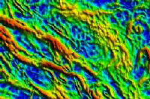
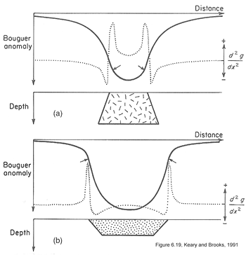
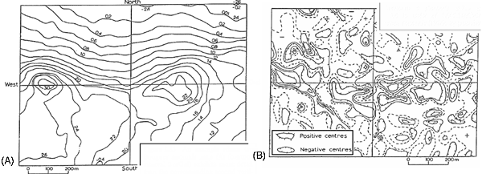

.. _gravity_gradients:

Gravity gradients
*****************

Introduction
============

This page is an overview of this rapidly growing aspect of gravity surveying.
Important goals are to recognize what spatial derivatives are and what the
total horizontal derivative is good for, understand the idea behind "second
spatial derivatives," and recognize that direct measurement of all vectoral
components of the spatial gradients of both gravity and magnetics is the
latest really new capability in the geophysics industry. Is it useful? Much
money has been spent on inventing this capability and yes, it is useful for
larger scale problems associated with oil and gas and to some extent minerals
exploration.

Measured gravity is :math:`g_z`
===============================

.. figure:: ./images/grav_diag.gif
    :align: right

Normally the vertical component of gravity :math:`g_z` is measured. This was
illustrated using the profile over a sphere or cylinder (right) in the section
:doc:`gravity_basics`. The horizontal components of gravity, :math:`g_x`, and
:math:`g_y`, are small and not measured.

The spatial derivative (rate of change) of :math:`g`
====================================================

The spatial rate of change of gravity (in the x-direction) is written
mathematically as :math:`\partial g/ \partial x`. This horizontal derivative
can help map edges of buried changes in density. However, when data were
gathered over an area, it is more common to employ the so called *total
horizontal derivative*, which is the square root of the sum of squared x- and
y- horizontal derivatives. This is a conceptually simple idea, but challenging
to actually calculate if data are not on a survey grid that is uniform. Its
result is illustrated in the following figures:

.. figure:: ./images/Bouger.jpg
    :align: center

    Bouguer gravity, contour map plotted using "shading."

    Total horizontal derivative of the adjacent gravity

One way to think of spatial derivatives is to simply look at the change in
"value" between adjacent stations. Another better approach for real data is to
look at slopes over several stations. A least squares fit to data at several
stations will yield a slope. The magnitude of this slope is a horizontal
derivative. This can be done along a profile (line survey) or using a matrix
of points on a map. For maps, the horizontal derivative at one location is
then simply the magnitude of the slope of a plane found by least squares fit
to a set of points surrounding that location.

The second spatial derivative
=============================

The rate of change of gradients (written as :math:`\partial^2 g / \partial
x^2` also can be estimated. Inflection points on the graph of :math:`\partial^2
g / \partial x^2` reveal the location of maximum rate of change of the
gradient. The adjacent images show how this can help reveal the difference
between a basin and an intrusion. Maps can also be processed to generate
images of the second horizontal derivatives.

The second vertical derivative is often considered useful. But what is the
first vertical derivative? It is the vertical rate of change of gravity, and
it is not easy to find unless you measure gravity everywhere at two
elevations. However, gravity (a potential field) follows Laplace's equation,
which states that squared gradient of gravity equals 0:

.. math::
		\frac{\partial^2 g}{\partial x^2} + \frac{\partial^2 g}{\partial y^2}  + \frac{\partial^2 g}{\partial y^2} =0

The :math:`\partial^2 g / \partial x^2`  and :math:`\partial^2 g / \partial
y^2`  terms can be obtained directly from a Bouguer anomaly map, so the
:math:`\partial^2 g / \partial z^2`  term can be derived. This last term
describes how fast the "vertical rate of change in gravity" is changing.
However the success of this process depends upon adequate data spacing. These
types of calculations are very efficient in the Fourier domain - something
beyond the scope of this presentation.

Making these types of processed maps is sometimes useful, but not always
worthwhile. Two examples are given below: 1) salt domes where the process was
beneficial, 2) a mineral exploration setting where it was not so useful.

.. figure:: ./images/2ndvertsalt.gif
    :align: center

    Observed, residual after removing a regional component, and second
    vertical derivative calculated using horizontal derivatives measured from
    the data set. Details about the salt domes are clearer in the second
    vertical derivative map.

    The Bouguer anomaly map (A) exhibits more useful information than the
    corresponding second vertical derivative map (B).

An example
==========

One recommended short example describes contributions of gravity to
hydrocarbon exploration in the complicated foothills environment, just
southwest of Calgary, Alberta. The take home message from that example is that
sparse data forces less-than-optimal results. Gravity has always suffered from
this problem (fewer measurements than desirable) because of the care required
for gravity, location and elevation measurements at each station. With the
invention of airborne gravity surveys, this problem can be reduced, so long as
the lower sensitivity of airborne measurements is sufficient for the task.
Currently airborne surveys are sensitive enough for most oil and gas
exploration problems, and for some large mineral exploration problems, but not
sensitive enough for engineeri & environmentalng scale work. If you are
interested (it is short and easy) see `Turner Valley`_ , Canada – A Case
History in Contemporary Airborne Gravity (links to the Sander Geophysics
Limited (SGL) website), by J.W. Peirce1, S. Sander2, R.A. Charters1, and V.
Lavoie, presented at the EAGE 64th Conference & Exhibition — Florence, Italy,
27 - 30 May 2002.

Measuring gradients
===================

We are talking now about measuring how gravity varies spatially - that is
:math:`\partial g / \partial x` or :math:`\partial g / \partial y` or
:math:`\partial g / \partial z`. In fact, there are units for gravitational
gradient - the Eotvos Unit (EU) which is :math:`10^{-6}` mGal/cm.

However, if you think about it, we should really be more careful about what we
are measuring. We are familiar with measuring the vertical component of
gravity, :math:`g_z`. However, it would be theoretically possible to measure
:math:`g_x` and :math:`g_y`. In fact, one could consider how each of these three
components of gravity vary in all three directions. That represents nine
different "gradient" measurements. Given what you know about measuring
:math:`g_z`, measuring the other two components should sound like a very
difficult task. Well, you are right. It is very difficult. In fact, it turns
out to be easier to measure the gradients than the fields themselves. And, as
of roughly 1998 - 2001, there are systems that can make these measurements.
Are they useful measurements? Yes. Oil and mineral exploration companies would
not have spent millions of dollars developing the capacity if it were not
useful. But there is much research needed to learn how best to make use of the
results.

Maps showing what measurements of gravitational gradients look like are given
on `a separate page of images`_ . Evidently, different components emphasize
different aspects of a buried density contrast or target. Look at these
figures and consider these questions:

#. Which emphasizes the feature's location? (answer = :math:`T_{zz}`)

#. Which emphasize lineations in one or another direction? (answer =
   :math:`T_{xx}`, :math:`T_{yy}`)?

#. Which emphasize the feature's edges? (answer = :math:`T_{xz}`, :math:`T_{yz}`)?

#. What does the remaining component emphasize? (answer = edges)?

Consider some practical questions: How useful is this type of work? What kinds
of targets can be detected?

#. The answers are usually expressed in terms of anomaly size, sampling rate,
   and noise level of instruments.

#. Current systems can just see very large mineral targets.

#. Many oil and gas and structural geology targets can be imaged.

#. Anticipated limit for future systems is a little better.

.. Two (somewhat complex) figures summarizing the limits of detectability for
.. various ore bodies (mostly in Australia) are provided separately `here<http://www.eoas.ubc.ca/courses/eosc350/content/methods/meth_4/assets/g-limits.pdf>`_
.. (PDF). Keep in mind that questions about structures associated with oil and
.. gas are often larger targets than those associated with mineral exploration,
.. so these types of cutting edge procedures are so far more directly useful to
.. the hydrocarbons industry.

Other forms of processing for maps
==================================

In the present version of this module we do not have time to include a section
that pursues other aspects of deriving alternative forms of images from
gravity (and magnetics) maps. It is true, however, that there are many forms
of processing that are used. Two excellent introductions can be found at the
following locations:

- If you are interested, there are some interactive figures on frequency
  domain filtering at
  http://www.geoexplo.com/airborne_survey_workshop_filtering.html.

- There is a good summary of Advanced Processing of Potential Fields by Getech
  (Houston, and Leeds). See the tutorial on-line at Getech via Advanced
  Processing of Potential Field Data.

.. The Getech home page is at https://getech.com/gravity-magnetic-data-services/.

.. _a separate page of images: http://www.eoas.ubc.ca/courses/eosc350/content/methods/meth_4/assets/gravgrad-figs.pdf
.. _Turner Valley: http://www.sgl.com/technicalpapers/EAGEabst-final-TV.pdf

