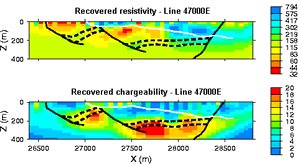

.. _induced_polarization_measurements_data:

Measurements and Data
*********************

Introduction
============

There are four techniques for observing chargeability: two using a charging current that is turned abruptly off so that discharging can be observed in the time domain, and two in which the dispersive nature (or effect as a function of frequency) of the phenomenon is observed in the frequency domain.

Two types of time domain data
=============================
Consider the experiment illustrated in the following figure. Current, \\(I\\), is injected into the ground at the source electrodes and voltage, \\(V\\), is measured at the potential electrodes. The source is DC (direct current) in the sense that when it is on, there is no variation. However, in this case it is turned on and off with a duty cycle as shown in the figure. Two methods of measuring chargeability in the time domain are described below. 

.. figure:: ./images/IP_source.gif
	:align: center
	:scale: 100 %

.. figure:: ./images/potentials.gif
	:align: right
	:scale: 100 %

1. The following is a definition of chargeability but it is not possible to measure it exactly in the field. The figure to the right shows voltage measured when the transmitter is first turned on and then turned off some time later. Using parameters from this figure, one definition of chargeability is \\(M = V_S / V_P\\) where \\(V_S\\) and \\(V_P\\) are the steady state and "secondary" potentials, respectively. 

- The leading edge potential \\(V_{\\sigma}\\) is what would be measured in the absence of chargeability. This potential would yield the ground's resistivity.
- The steady state, \\(V_P\\) (with a subscript *m* in the figure above), often referred to as the primary potential, is the combined effect of current flowing in the ground and charges built up under the influence of the imposed electric field. 
- The secondary potential is entirely due to the charge imbalance resulting from the build-up of charge.
- Using this form, chargeability \\(M\\) will be \\(0 ≤ M < 1\\). If \\(M = 0\\) the measured potential will follow the input current waveform exactly with no charging or discharging involved, as shown in the first column of the figure above.

2. The most commonly measured form of time domain IP is the normalized area under the decay curve. It can be represented by the following equation, using parameters specified in the adjacent figure. The decaying potential that follows \\(V_s\\) is written as \\(V_s (t)\\).

Chargeability, \\(M\\), is essentially the red area under the decay curve, normalized by the source voltage. 

 .. math::
  			M = \frac{1}{V_P} \int  \! V_S(t) \, \mathrm{d}t

.. figure:: ./images/source_and_measured_V.gif
	:align: center
	:scale: 100 %

Two types of frequency domain data
==================================

An oscillating source current can be employed to observe chargeability. The measurements are often still referred to as "DC resistivity" because the frequencies are relatively low. The resulting data will include (i) a "DC resistivity" based upon the voltages measured with the lowest source frequency, and (ii) a chargeability based upon the measurements explained next. Two methods of measuring chargeability in the frequency domain are described below.

1. If the amplitude of the potential is measured at two frequencies, a measure of chargeability is acquired, and it can be expressed as units of "*percent frequency effect*" or PFE. Since the ground has less time to respond at higher frequencies, the signal is expected to be smaller at the higher frequency. Expressions for PFE are shown in the equations below. The data used in this calculation are illustrated in the figure below. Recall that \\(\\rho_a= K \\mid V \\mid / I \\) , where \\(K\\) is the geometric factor based upon electrode geometry (see the Geophysical surveys chapter, "DC resistivity" section), \\(V\\) is the measured potential, and \\(I\\) is the source current.

.. figure:: ./images/PFE.gif
	:align: center
	:scale: 100 %
	
.. math::
		PFE= 100 \left( \frac{\rho_{a1} - \rho_{a2}}{\rho_{a2}}  \right)

Alternatively:

.. math::
		FE = \frac{V(f_1) - V(f_2)}{V(f_2)}

If the voltage version is used, the Frequency Effect (FE) can easily be converted to a percent frequency effect by multiplying by 100.

2. Data with units of phase are gathered by transmitting a sinusoidal source current. Then the phase difference between this source and measured potentials is recorded as a measure of chargeability. Units are usually milliradians. The following figure illustrates:

.. figure:: ./images/sinusoids.gif
	:align: center
	:scale: 100 %

Relating the four types of data
===============================

The different IP responses all result from the build up of polarizing charges, but they do not produce the same numbers. In fact, the units of the various measurements are different. Nevertheless, the following approximate rule of thumb allows conversion between the different data sets: 

										+------------+------------+-----------+
										| A chargeability of \\(M = 0.1\\) is |
										+============+============+===========+
										|               10 PFE                |
										+------------+------------+-----------+
										|               70 mrad               |
										+------------+------------+-----------+
										|               70 msec               |
										+------------+------------+-----------+

Data acquisition
================

Time domain IP
--------------

As noted above, when time domain IP is recorded, chargeability is measured as the area under the decay curve normalized by "primary" voltage \\(V_P\\),  using

.. math::
  		M = \frac{1}{V_P} \int_{t_1}^{t_2}   \! V_S(t) \, \mathrm{d}t

The \\(t_1\\) and \\(t_2\\) times may be any limits within the off-time, and there are not really any standards, so comparison of different surveys can be difficult.

Source (input) current is a square wave with 50% duty cycle (equal on and off times) as per resistivity (repeated cycles of +on, off, -on, off). The use of positive and negative cycles in transmitter current is very important for time-domain IP work. The correct area under the decay curve will be measured only if the potential decays exactly to zero. This will not occur when there is a superimposed spontaneous potential (SP), which is usually the case. If only one polarity was used, the inevitable SP could not be detected and removed. Recording both positive and negative cycles allows the "off-time" potential (i.e. voltages recorded when the transmitter is off) to be estimated, and any non-zero component removed.

Many instruments record measured voltage, \\(V_P\\), just before the transmitter is turned off, and then again 10 times while voltages decay during the off times. The results can then provide a calculated chargeability and an estimated spontaneous potential. The adjacent figure illustrates each measured parameter. Note that if the transmitter is not on for a long enough time, \\(V_P\\) will be measured before the charging time is finished, resulting in a voltage that is smaller than the actual \\(V_P\\).

.. figure:: ./images/transmitter_on_off.gif
	:align: center
	:scale: 100 %

Other instruments use alternative time windows, and some newer instruments digitize the whole waveform, but the fundamental concepts are the same for all time domain systems.

Frequency domain IP
-------------------

The percent frequency effect was defined above as either 

.. math::
	  PFE= 100 \left( \frac{\rho_{a1} - \rho_{a2}}{\rho_{a2}}  \right) \quad \textrm{or} \quad
	  FE = \frac{V(f_2) - V(f_1)}{V(f_1)}

Where \\(f_1\\) is the DC or very low frequency, and \\(f_2\\) is a higher frequency (a few tens to hundreds of Hertz) the second type of resistivities can be measured at frequencies on the order of a few tens to hundreds of Hertz.

Phase IP
--------

When the phase of voltage with respect to input current is measured directly, the impedance of the ground can be determined based on the material. This requires careful synchronization between the receiver and the transmitter.

Choice of time, frequency or phase measurements 
===============================================

The following lists a few factors affecting whether to choose time domain or frequency domain survey types:

- Time domain methods are the most common since the IP signal is measured directly. The decay signals are small, such as millivolts or microvolts, so the signal-to-noise ratio can be a problem. Stacking many repeat measurements is required.
- Frequency domain methods require significantly smaller source currents and are less sensitive to some sources of noise. However the effects of EM coupling can be severe, and need to be removed. ("EM coupling" is an unwanted signal which arises from inductive interactions (like a transformer) between conductive near-surface ground and the wires carrying transmitter current. It can completely hide IP effects when it is severe). 
- See Smith, 1980, for a comparison of time domain and frequency domain results recorded using three different instruments over the same ore body. Such studies are rare because of the cost, so this is an interesting examination of the pros and cons of various ways of measuring IP.

Examples of inverted field data 
===============================

The data sets shown (below) were gathered simultaneously at the Century Deposit in Australia. Clearly they are exhibiting responses to different materials within the ground. However, this presentation of the raw data (plots called pseudosections) is deceptive, and does not represent true distribution of material properties in the ground. After inverting these data, the resulting resistivity model reveals information about rocks overlying the deposit, while the resulting chargeability model shows the deposit itself and underlying shale units. 

.. figure:: ./images/raw_data.gif
	:align: center
	:scale: 120 %

	Raw data (pseudosections)

	Inversion results (resistivity top, chargeability bottom)

Measuring conductivity and chargeability on a core sample with a GDD SCIP Tester
================================================================================

The Sample Core Induced Polarization (SCIP) Tester from GDD Inc. is a portative instruements that allows to estimate the resistivity and the IP response of core samples.

.. figure:: 
	../physical_properties/images/conductivity_chargeability_measurement.jpg

References
==========

    Smith, M.J., 1980, *Comparison of induced polarization measurements over the Elura orebody, The Geophysics of the Elura Orebody, Cobar NSW*, ASEG, 1980, 77-80.
