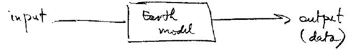
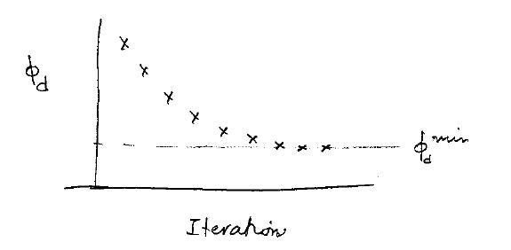
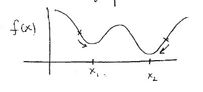
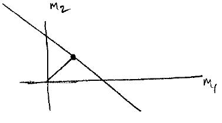

.. _inversion_basics:

Inverse Theory
**************

- Linear Problems
- Non-linear problems
- Parametric inversion
- Linear inverse problems

Geophysical Inversion
=====================

Basic geophysical experiment:

Input: geophysical survey

Output: data

Earth model: 

- physical property values, e.g. density, magnetic susceptibility,
  conductivity, elastic properties, etc.

- parameters (e.g. magnetics :math:`(x,y,z,m,\theta,\rho)`, :math:`
  (m,\theta,\gamma)` are the strength and orientation of a dipole)

General notation: 

.. math::
		d = F(m)

:math:`d`: data

:math:`m`: model (e.g. :math:`\rho, \kappa`)

:math:`F[]`: forward modeling operator

e.g. gravity:

.. math::
		g_z(x,y,z) = -\gamma \int_{vol} \frac{\rho(x',y',z')(z-z')}{( (x-x')^2+(y-y')^2 + (z-z')^2)^{3/2}} dx' dy' dz'

To solve this problem numerically we divided the earth into cells, each with a
constant :math:`\rho`, and wrote the data as

.. math::
		g_z(x_i, y_i, z_i) = \sum_{j=1}^M G_{ij} \rho_j \qquad i=1,...,N

where 

.. math::
		G_{ij} = - \int_{j^{th} cell} \gamma \frac{(z-z')}{r^3} dv

Writing the :math:`j^{th}` datum as :math:`g_i` we have

.. math::
		g_z(x_i, y_i, z_i): g_i = \sum_{j=1}^M G_{ij} m_j \qquad 	i=1,...,N, \quad (1)

We also wrote magnetic data in the same way:

.. math:: 
		\vec{B}(\rho) = \frac{\mu_0}{4 \pi} \int_{R} \vec{m}(Q) \cdot \nabla_{\rho} \nabla_{\rho}(\frac{1}{r}) dv		

after meshing, we wrote:

.. math::
		b_i = \sum_{j=1}^M G_{ij} \kappa_j \qquad (2)		

where:

.. math::	
		G_{ij} = \mu_0 \hat{l} \cdot \tau_i^j \cdot \hat{H_0}

In both (1) and (2) we can write the relationship between the data and model as

.. math::
	&	\vec{d} = G \vec{m} \ \
	&   \text{where:} \
	&	\vec{d} \in \mathbb{R}^N \qquad (d_1, ..., d_N) \
	&	\vec{m} \in \mathbb{R}^M \qquad (m_1, ..., m_M) \
	&	G \quad \text{is an} \quad N \times M \quad \text{matrix}

In other cases, the general notation :math:`d=F(m)` can t be written as a simple
vector-matrix product. As we shall see in DC resistivity, the governing
equation is:

.. math::
		\nabla \cdot \sigma \nabla \phi = - I \delta(r-r_s) \qquad (3)

where :math:`\sigma` is the electrical conductivity. In the notation :math:`d=F[m]`		

- :math:`d`: measured voltages
- :math:`m`: electrical conductivity
- :math:`F[]`: involves the solution of (3) done through finite element or finite volume

Lastly, we can have situations where the earth model is a set of parameters.

.. figure:: ./images/cube.jpg
    :align: right

Suppose we wanted to find a best fit dipole that generated surfaces magnetic
response.

.. math::
		& \vec{B} = \frac{\mu_0 (m)}{4 \pi r^3} (3 (\hat{m} \cdot \hat{r}) \hat{r} - \hat{m}) \ \
		& \vec{m} = |m| \hat{m}

The parameters are :math:`(x_0, y_0, z_0, \|m\|, \theta, \gamma)` where the
first three define location and the last three are amplitude and orientation
of the dipole.    So general representation :math:`d = F[m]`, the model would be
the set of parameters.

Remark: The ability to generate data, :math:`d`, given a "model" is called "forward modeling."

Inverse Problem
===============

Given observed data :math:`d_i` with :math:`i = 1, ..., N` and an estimate of the
data errors, and the forward modeling relationship :math:`d=F[m]` what is the
model :math:`m` that produced the data?

There are two solution strategies with :math:`N` as the number of data and
:math:`M` the number of model parameters.

**Case 1:** when :math:`N>M`, that is, when there is more data than unknowns,
(e.g., finding the magnetic dipole parameters) We can post the inverse
problem as one of the finding the best fitting model

**Case 2:** when :math:`M>N`, that is, when there are more unknowns than data,
(e.g. 3D inversion of gravity or magnetics). This is a non-unique problem.
We need to incorporate additional information about the model into the
inversion.

Remark: Case 1, finding a few parameters is simpler, so we will deal with that first. 

Inverse Problem 1: Find a few parameters
========================================

Let :math:`d_i^{obs}` from :math:`i=1,...,N` be the observed data. 

Let :math:`\sigma_i` be an estimated standard deviation for the ith datum.
Assume that data errors are Gaussian with zero mean and a standard deviation
of :math:`\sigma_c`

Define the misfit (this is an appropriate misfit function for Gaussian statistics):

.. math::
		\phi_d = \sum_{i=1}^N \left(  \frac{d_i^{obs} - F[m]}{\sigma_i} \right)^2

Goal: find the model that minimizes :math:`\phi_d`.

Remark: In general, the solution of the problem requires:

#. A starting model :math:`\m^{(0)} = (x^{(0)}, y^{(0)}, z^{(0)}, ...)`

#. Finding how each datum changes when a parameter changes (sensitivity): :math:`J_{ij} = \partial d_i /  \partial m_j`

#. Computing a perturbation :math:`\partial m = (\partial x, \partial y, ...)`

#. Forming a new model estimate :math:`m^{(i)} = m^{(0)} + \partial m`

#. Continue steps 2 to 4 until a minimum has been found. 

Remarks: final results can depend upon the starting model. Consider minimizing
a function of a single variable. In the figure below :math:`x_2` is a better
solution.

Inverse problem II: finding a function
======================================

Consider the simple case where we write:

.. math::
		d = Gm 

with :math:`G` as an :math:`N \times M` matrix. There are infinitely many
solutions. For example, consider the case where there are two unknowns
:math:`m_1` and :math:`m_2` and one datum:

.. figure:: ./images/line.jpg 		
    :align: right

.. math::
 		m_1 + m_2 = 1 		

and the solution is

.. math::
		m_2 = 1 - m_1

Any point along the line is a viable solution. To find a particular solution
we need to have additional information (a priori knowledge) about the
solution. For example, suppose we knew that the earth model was one where
:math:`\||m\||^2` was small. Then let

.. math::
		\phi_m = \||m\||^2 = \sum m_i^2	

For our toy example this gives :math:`\phi_m = m_1^2 + m_2^2`. Question: what
is the :math:`m` that minimize :math:`\phi_m` and still fits the data constraint?

.. math::
		& \text{min } \phi_m = m_1^2 + m_2^2 \
		& \text{subject to } m_1 + m_2 = 1

The answer is :math:`m = (m_1, m_2) = (1/\sqrt{2},1/\sqrt{2} )`

So this is a way to get a single solution that also includes additional
information about the earth model.

For a general problem in 3D, we introduce a model objective function 

.. math::
		\phi_m = \alpha_s \int_{vol} (m-m_{ref})^2 dv + \alpha_x \int_{vol} \left(\frac{dm}{dx} \right)^2 dv + \alpha_y \int_{vol} \left(\frac{dm}{dy} \right)^2 dv + \alpha_z \int_{vol} \left(\frac{dm}{dz} \right)^2 dv

The first term makes a solution close to a reference model (which can be
zero); the second term minimizes structure in the x-direction, the third term
in the y-direction, and the fourth term in the z-direction. The parameters
:math:`\alpha_s, \alpha_x, \alpha_y, \alpha_z` are constants that control
the relative wighting of the different penalty terms.

Again, to solve the problem numerically we need to divide the earth into cells
(as done in the forward modeling)

.. math::
	 \phi_m & = \alpha_s \|W_s (m-m_{ref}) \|^2 + \alpha_x \|W_x (m-m_{ref}) \|^2  + \alpha_y \|W_y (m-m_{ref}) \|^2 +\alpha_z \|W_z (m-m_{ref}) \|^2  \
	& = (m-m_{ref}) \left( \alpha_s W_s^T W_s  + x W_x^T W_x \alpha_y W_y^T W_y + \alpha_z W_z^T W_z \right) (m-m_{ref}) \
	 \phi_m & = \|W_m(m-m_{ref})\|^2

where :math:`W_m` is an :math:`M \times M` matrix (:math:`W_s, W_x, W_y,W_z`	are alos matrices). 

So our prior knowledge about what kind of solution we want is encoded into
:math:`\phi_m`. This is extremely important. If we followed the ideas in the
toy example we would be led to formulate our problem as

.. math::
		& \text{minimize } \phi_m \|W_m(m-m_{ref})\|^2 \\[0.4em]
		& \text{subject to } d^{obs} = F[m]

But the observation :math:`d^{obs}` have errors. We don't want to find a
solution that fits the inaccurate data exactly (then we would be guaranteed to
have the wrong model). Rather, we define the misfit as

.. math::
		\phi_d = \sum \left( \frac{d_i^{obs} - F[m]}{\sigma_i}\right)^2

If the data are contaminated with Gaussian error then, if are at the solution
:math:`m`,

.. figure:: ./images/obs_pred.jpg	
    :align: right

Solve the inverse problem by 

.. math::
		\text{minimize } \phi = \phi_d + \beta \phi_m

where :math:`\beta \in [0,\infty)` is a regularization parameter. As
:math:`\beta` changes from zero to infinity

.. figure:: ./images/phi_d_phi_m.jpg	
    :align: center

As :math:`\beta \rightarrow 0`, min :math:`\phi = \phi_d \rightarrow` small
misfit (:math:`\phi_d`), large model norm (:math:`\phi_m`).

As :math:`\beta \rightarrow \infty`, min :math:`\phi = \phi_m \rightarrow`
small model norm (:math:`\phi_m=0`), large misfit (:math:`\phi_d`).

Putting these together yields the Tikhonov curve

.. figure:: ./images/tikhonov.jpg	
    :align: center

When we minimize :math:`\phi = \phi_d + \beta \phi_m` every value of
:math:`\beta` gives a difference solution. We can experiment and find that
value of :math:`\beta` for which the misfit is equal to some desired target
level :math:`\phi_d^*`.
