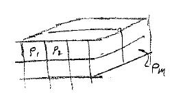
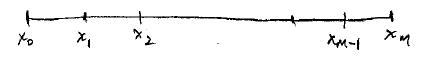
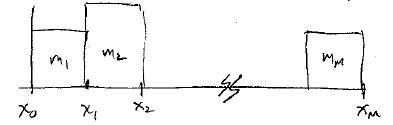
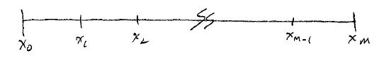
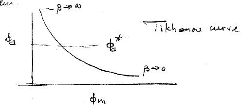

.. _inversion_discretization:

Discretizing the inverse problem
********************************

We have already shown how the problem

.. math::
		g_z(r_i) = - \gamma \int_R \frac{\rho(r') (z-z')}{|r_i-r'|^3} dv

is

.. math::
		g_z(r_i) = \sum_{j=1}^M G_{ij} \rho_j

where the volume is divided into \\(M\\) cells with the density constant in each cell.

.. math::
		G_{ij} = - \gamma \int_{R_j} \frac{(z_i - z')}{|r_i - r'|^3} dv

is the response of the ith observation location due to a cell of constant
density in the jth cell. (Remember the cell can be 1D (layer), 2D or 3D).

The above discretization allows the data to be written in matrix form:

.. math::
		d=Gm

The next task is to get a matrix representation of our model objective
function. In 1D we had a combination

.. math::
		\phi(m) = \alpha_s \int m^2 (x) dx + \alpha_x \int \left(\frac{dm}{dx}\right)^2 dx

Suppose the region on which the model is defined is divided into \\(M\\) cells

and we assume the model is constant on each cell.

Discretizing the data equations
===============================

Given data of the form

.. math::
		d_j = \int_{x_0}^{x_M} g_j(x) m(x) dx \qquad j=1, ..., N

then there are a number of ways to write this in vector/matrix form.

Method 1
--------

Let \\(m(x)\\) be represented by "cells" where the model is constant in each cell. 

For example on the kth cell \\( x_{k-1} \\leq x \\leq x_k \\)  , \\(m(x) = m_k\\)

.. math::
		d_j = \int_{x_0}^{x_k} g_j (x) m(x) dx = \sum_{k=1}^M \int_{x_{k-1}}^{x_k} g_j(x) m(x) dx = \sum_{k=1}^M m_k \left(\int_{x_{k-1}}^{x_k} g_j (x) dx \right) 		

so

.. math::
		d_j = \sum_{k=1}^M G_{ij} m_k

where \\(G_{jk} = \\int_{x_{k-1}}^{x_k} g_j (x) dx \\) is the integral of the
jth kernel function over the kth cell. In matrix vector form this becomes

.. math::
		d=Gm

Method 2: Quadrature formulation
--------------------------------

.. math::
		\int_{x_0}^{x_M} f(x) dx = \sum_{i=1}^{M} w_k f(x_k)

where \\(w_k\\) are known weights. For example, we could evaluate this with a
midpoint rule

.. figure:: ./images/midpointrule.jpg
    :align: center	

Let \\(h_k = x_k x_{k-1}\\) be the width of the kth cell, and let
\\(x_{k-1/2}\\) denote the center of the kth cell, then

.. math::
		\int_{x_0}^{x_M} f(x) dx = \sum_{i=1}^{M} h_k f(x_{k-1/2})	

In our case

.. math::
		d_j = \int_{x_0}^{x_M} g_j(x) m(x) dx = \sum_{k=0}^M g_j (x_{k-1/2}) m(x_{k-1/2}) h_k \equiv \sum G_{jk} m_k

In this case the model vector \\(\\vec{m}\\)

.. math::
		\vec{m} = \left( m(x_{1/2}), m(x_{3/2}), ... , m(x_{M-1/2}) \right)

is generally written as \\( \\vec{m} = ( m_1, ..., m_M) \\) so the model
parameters are the values of the model at the cell centers. The elements of
\\(G\\) are

.. math::
		G_{jk} = g_j (x_{k-1/2}) h_k

then 

.. math::
		d=Gm

Discretizing the model objective function
=========================================

A general objective function in 1D is 

.. math::
		\phi_m = \alpha_s \int m^2(x) dx + \alpha_x \int \left(\frac{dm}{dx}\right)^2 dx

We use the same discretization as we did in the forward problem. Divide the
region on which the model is defined into \\(M\\) cells and assume the model
is constant in each cell.

Consider the first term

.. math::
		\phi_0 = \int_{x_0}^{x_M} m^2(x) dx = \sum_{i=1}^M \int_{x_{i-1}}^{x_i} m_i^2 dx = \sum_{i=1}^M m_i^2 x \Big|_{x_i}^{x_{i-1}} = \sum_{i=1}^M m_i^2 (x_i-x_{i-1})

For convenience, let \\(l_i\\) denote the length if the ith element. Then

.. math::
		\phi_s = \sum_{i=1}^M m_i^2 l_i = m^T W_s^T W_s m = \|W_s m \|^2

where

.. math::
		\begin{equation}
		\begin{split}
		W_s = 
		\begin{bmatrix}
    		\frac{1}{\sqrt{l_1}} & 0 & 0 & \cdots & 0\\
    		0 & \frac{1}{\sqrt{l_2}} & 0 & \cdots & 0\\
    		0 & 0 & \frac{1}{\sqrt{l_3}} & \cdots & \vdots\\
    		0 & 0 & 0 & \ddots & \frac{1}{\sqrt{l_M}}\\    
		\end{bmatrix}
		\end{split}
		\end{equation}				

The term that penalizes variation in the x-direction is similarly derived.

.. math::
		\phi_x = \int \left( \frac{dm(x)}{dx}  \right)^2

We want to find a numerical approximation

.. figure:: ./images/Xcells.jpg
    :align: center	

Let \\(d_k\\) be the distance between the center f the cells. A discrete
approximation to the integral is had by evaluating the derivative of the model
based upon how much it changes between cell centers.

.. math::
		\phi_x \approx \sum_{k=1}^{M-1} \left( \frac{M_{k+1}-M_k}{d_k} \right)^2 d_k

Note that there are only \\(M-1\\) terms in the sum. The \\(
\\frac{M_{k+1}-M_k}{d_k} \\) part represents the average gradient between the
kth and k+1th cell. Now this can be written as

.. math::
		\phi_x = \sum_{k=1}^{M-1} \left( \frac{M_{k+1}-M_k}{d_k} \right)^2 d_k = m^T W_x^T W_x m = \|W_x m\|^2

where 

.. math::
		\begin{equation}
		\begin{split}
		W_x = 
		\begin{bmatrix}
    		-\frac{1}{\sqrt{d_1}} & \frac{1}{\sqrt{d_1}} & 0 & \cdots & 0\\
    		0 & -\frac{1}{\sqrt{d_2}} & \frac{1}{\sqrt{d_2}}  & \cdots & 0\\
    		0 & 0 & \ddots & \ddots & \vdots\\   
    		0 & 0 & 0 & -\frac{1}{\sqrt{d_{M-1}}} & \frac{1}{\sqrt{d_{M-1}}}\\ 
    		0 & 0 & 0 & 0 & 0\\   
		\end{bmatrix}
		\end{split}
		\end{equation}	

If \\(W_x\\) is written as an \\(M \\times M\\) matrix, then its last row is
zero. The reason for a row to be zero is that there are only \\(M-1\\)
segments on which linear gradients have been defined. Effectively the two
\\(1/2\\) cells on each end have been neglected.

So we have:

.. math::
	&	\phi_s = \int_{x_0}^{x_M} m^2(x) dx \approx \|W_s m\|^2\\[0.4em]
	&	\phi_x = \int_{x_0}^{x_M} \left( \frac{dm}{dx}^2 \right) \approx \|W_x m\|^2	

If we discretize a combination of these with a reference model, then

.. math::
		\phi_m  & = \alpha_s \int \left(m(x) - m_0(x) \right)^2 dx + \alpha_x \int \left( \frac{d}{dx}(m(x)-m_0(x))\right)^2 dx \\[0.2em]
		& = \alpha_s \|W_s (m-m_0) \|^2 + \alpha_x \|W_x(m-m_0) \|^2 \\[0.2em]		
		& = \alpha_s (m-m_0)^T W_s^T W_s (m-m_0) + \alpha_x (m-m_0^T) W_x^T W_x (m-m_0) \\[0.2em]
		& = (m-m_0)^T \left(\alpha_z W_s^T W_s + \alpha_x W_x^T W_x \right) (m-m_0) \\[0.2em]
		& = (m-m_0)^T W_m^T W_m (m-m_0) \\[0.2em] 
		& = \|W_m (m-m_0) \|^2

where \\(W_m^T W_m = \\alpha_s W_s^T W_s + \\alpha_x W_x^T W_x\\) is an \\(M \\times M\\) matrix.

So our inverse problem in which we minimize

.. math::
		\phi= \phi_d + \beta \phi_m

becomes

.. math::
		\text{minimize} \qquad \phi = \|W_d (Gm-d^{obs}) \|^2 + \beta \|W_m (m-m_0)\|^2		

Now we only need how to solve this (see notes on the UBCGIF website). Before I
reproduce only the basic equation, first, take the gradient:

.. math::
		\frac{\partial \phi}{\partial m} = 	0 = 2G^T W_d^T W_d (Gm-d^{obs}) + 2 \beta W_m^T W_m (m-m_0)	

so

.. math::
		(G^T W_d^T W_d G + \beta W_m^T W_m) m = G^T W_d^T W_d d^{obs} + \beta W_m^T W_m m_0		

and 

.. math::
		m = (G^T W_d^T W_d G + \beta W_m^T W_m)^{-1} (G^T W_d^T W_d d^{obs} + \beta W_m^T W_m m_0)	
			
This is an \\(M \\times M\\) system of equations solved for \\(m\\). Solve
this for many values of \\(\\beta\\) and model \\(m\\) that reproduces the
data to the desired value.

Vector differentiation
======================

.. math::
		A &: N \times M \quad \text{matrix} \\[0.4em]
		x &: M \quad \text{vector} \\[0.4em]
		y &: M \quad \text{vector} \\[0.4em]
		b &: N \quad \text{vector} \\[0.4em]

Consider \\(\\phi=x^Ty=\\sum x_i y_i\\)	

.. math::
		\begin{equation}
		\frac{\partial \phi} {\partial x} = 
		\begin{bmatrix}
		    \frac{\partial \phi}{\partial x_1} \\
		    \vdots  \\
		    \frac{\partial \phi}{\partial x_M}\\ 
		\end{bmatrix}
		=
		\begin{bmatrix}
		    y_1 \\
		    \vdots  \\
		    y_M\\ 
		\end{bmatrix}
		= y
		\end{equation}

Similarly, 

.. math::
		\begin{equation}
		\frac{\partial \phi} {\partial y} = 
		\begin{bmatrix}
		    \frac{\partial \phi}{\partial y_1} \\
		    \vdots  \\
		    \frac{\partial \phi}{\partial y_M}\\ 
		\end{bmatrix}
		=
		\begin{bmatrix}
		    x_1 \\
		    \vdots  \\
		    x_M\\ 
		\end{bmatrix}
		= x
		\end{equation}

Consider

.. math::
		\frac{\partial}{\partial x} (x^T A x) & = \frac{\partial}{\partial x} \left( x^T(Ax) + (A^T x)^T x\right) \\[0.2em]
		& = Ax + A^Tx \\[0.2em]
		& = (A+A^T)x

If \\(A\\) is symmetric then \\(A^T=A\\) so

.. math::
		\frac{\partial}{\partial x}	(x^T A x) = 2Ax

Now do the procedure on 

.. math::
		\|W_d (Gm-d)\|^2 & = (Gm-d)^T W_d^T W_d (Gm-d) \\[0.2em]
		\frac{\partial}{\partial m} \|W_d (Gm-d)\|^2 & = G^T W_d^T W_d (Gm-d) + [(Gm-d)^T W_d^T W_d G]^T \\[0.2em]
		\frac{\partial}{\partial m} \|W_d (Gm-d)\|^2 & = 2 G^T W_d^T W_d (Gm-d)