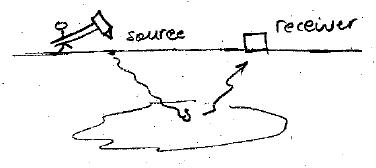
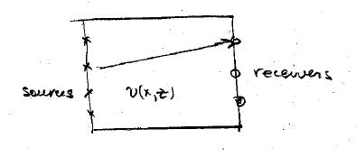
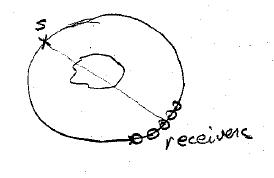
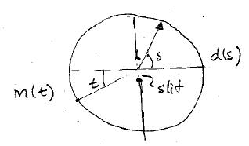

.. _inversion_overview:

Overview of linear inverse theory
*********************************

- Forward problem
- Inverse problem
- Fundamental challenges for inverse problems

Overview of linear inverse theory
=================================

The geophysical experiment
==========================

Geophysicists are continually faced with a genuine type of problem. Our goal
is to extract quantitative information about the earth (or a physical system)
without directly sampling. To carry the task out, the geophysicist sets up an
experiment (sensitive to particular physical properties that are diagnostic of
the study).

The experiment that is designed depends upon what information is sought

- large scale (whole earth, find \\(\\rho,v_p,v_s\\))

- exploration (oil, gas, minerals, find \\(\\sigma, \\mu, \\eta,\\rho\\))

- environmental (utilities, salt water intrusion, \\(\\mu, \\sigma, \\epsilon\\))

Experiment
==========

- energy is input into the earth

- propagation of the energy depends upon physical laws.

- initial primary energy interacts with substructure to generate scattered
  (secondary) energy which is returned to a receiver.

- receiver outputs a (set) if numbers which constitute our data.

Knowledge of (1) the data, (2) physics about how energy propagates through the
earth, and (3) the physical experiment (sources/receivers geometry, ...) must
somehow be combined to reveal information about the earth. This is the goal of
inverse theory. It provides a set of mathematical tools by which to extract
quantitative answers to specific questions.

Examples
========

**Cross-well tomography**. We measure the travel time and want to know the velocity \\(v(x,z)\\).

**DC Surveys**. We measure voltage and want \\(\\sigma(x,y,z)\\) and need many sources.

.. figure:: ./images/dc_survey.jpg
    :align: center

**Medical imaging**: 

- CAT 
- X-ray
- Detectors record amplitude
- find \\(\\eta\\) (effectively an absorption coefficient)
- need to rotate source/receivers to get good coverage
- note the difference with the geophysics problem where we only have sources and receivers on the surface.

**Optics: Shaw problem.** Each ray (incident angle\\(t\\)) scatters into a
region of \\(\\pi\\). The goal is to measure the intensity on the right hand
side and determine the strength of the source on the left hand side.

