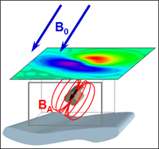

.. _magnetics_index:

Magnetics
=========

   : Schematic representation of a magnetically susceptible object buried at depth. Secondary magnetic fields can be observed from the surface.

This section covers some basic information for magnetic surveys. The physical
property of concern is magnetic susceptibility, which is a measure of how
magnetized a material becomes in the presence of a magnetic field. The source
for a magnetic  survey is the natural magnetic field of the earth. The physics behind the magnetic experiment is shown in :numref:`mag_cover`.  Receivers measure either the
amplitude of the magnetic field or one or more of its components. The earth's
field changes with latitude and longitude and hence magnetic surveys, carried
out over the same  geologic structure or buried object, will generate
different data at different locations on the earth. In this module we present
basic material for understanding the magnetic survey, how the data are
processed and how they can be interpreted.

Contents:

.. toctree::
   :maxdepth: 1

   magnetics_introduction
   magnetics_physical_property
   magnetics_basic_principles
   magnetics_survey
   magnetics_data
   magnetics_processing
   magnetics_interpretation

..  magnetics_IGRF
..  magnetics_three_figures
..   magnetics_buried_dipole
..  magnetics_extended_bodies
..   magnetics_line_profiles   
..   magnetics_complex_structures
   
      
   
