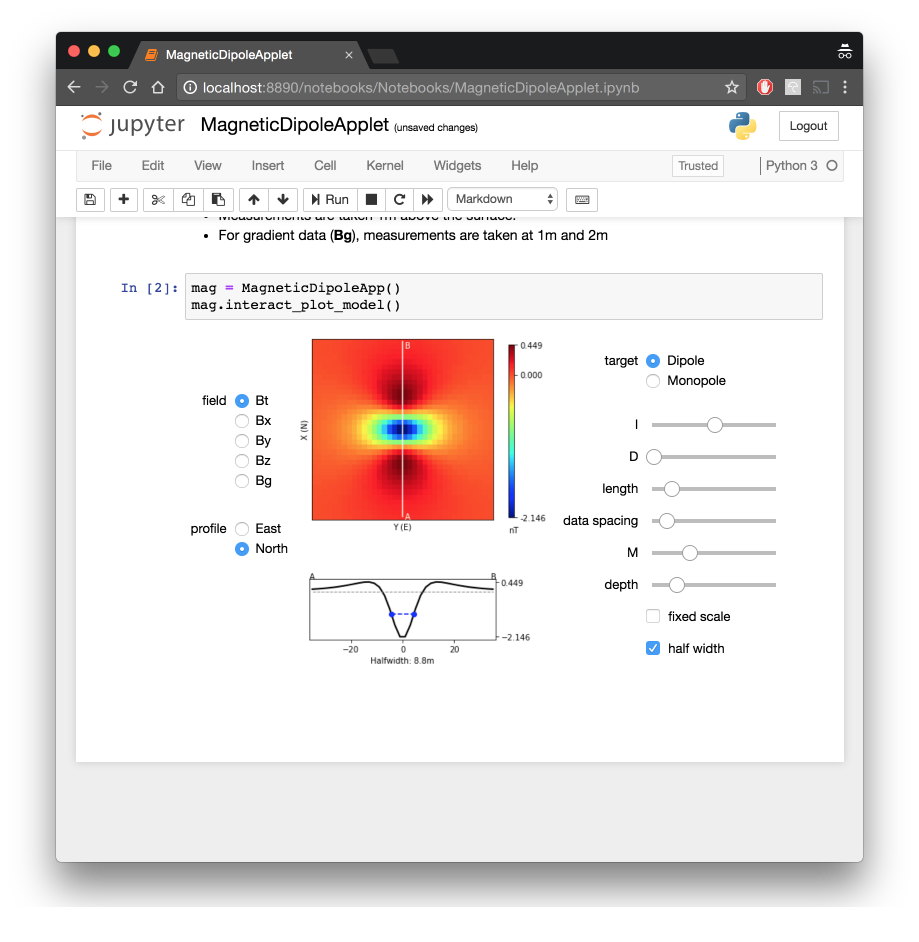

.. _magnetics_applet:

Magnetic dipole applet
----------------------

Purpose
=======

The objective is to learn about the magnetic field observed at the ground's surface, caused by a small buried dipolar magnet. In geophysics, this simulates the observed anomaly over a buried susceptible sphere that is magnetized by the Earth's magnetic field. By clicking below binder badge, you can run this app!

.. image:: https://mybinder.org/badge.svg
    :target: https://mybinder.org/v2/gh/geoscixyz/gpgLabs/main?filepath=notebooks%2Fmag%2FMagneticDipoleApplet.ipynb
    :align: center

Background summary
==================

- The :ref:`link<earth_s_field>` shows the earth’s field that is the result of a large magnet at the center.

- At any point on the earth the magnetic field is characterized by :math:`|B_0|`, :math:`I`, :math:`D`.

- A magnetizable body (with susceptibility kappa), located anywhere on the earth, becomes magnetized. It’s field is like that of a magnetic dipole oriented in the direction of the earth’s field at that location.

.. math::

    \mathbf{B} = \frac{\mu_0}{4\pi}\Big(\frac{3\mathbf{r}(\mathbf{m}\cdot \mathbf{r})}{r^5}-\frac{\mathbf{m}}{r^3}\Big)

- The strength of the magnet is :math:`\mathbf{m}=\kappa\mathbf{H_0}` Volume

- The plots show various data: Bt is the projection of the anomalous field onto the direction of the earth’s field

- Bx,By,Bz are projections in the x (northing), y (easting) and z (vertically down) directions

- Bg: is a vertical gradient

- For the app, the observation is 1 meter above the earth’s surface. The depth relates to how far beneath the surface the dipole is situated. A depth of 10 means the dipole is 11m below the sensor.

Learning with the Magnetic Dipole Applet
========================================

For many of the questions that follow you should use pencil and paper to draw field lines so that you can sketch projections of the field onto various directions. Do that first and then click on the profile button.

Testing the formula for a dipole (link)
^^^^^^^^^^^^^^^^^^^^^^^^^^^^^^^^^^^^^^^

- The field should drop of :math:`1/r^3`. Does it?

- The field should depend linearly on m. Does it?

Bodies at the pole: Earth’s field is vertical
^^^^^^^^^^^^^^^^^^^^^^^^^^^^^^^^^^^^^^^^^^^^^

- What is the inclination required to simulate a field that is vertically downward?

- Think what the data should like like in plan view. Before you click buttons, Sketch on a piece of paper what you are anticipating for Bt, Bx, By and Bz

- How does Bt compare with Bz? Why?

- Why is Bx negative towards the north but positive towards the south?

- Why does By look like a rotated version of Bx?

- What happens when you change the declination of the inducing field? Why?

- From the default settings, with depth=10 m, try to estimate the depth using

    - half width of the Bt anomaly estimated from the color map
    - the profile provided at the bottom.
    - How do these compare with the value provided by the app when you click half-width?

- Change the “depth” to be 1m.

    - Attempt to carry out the same depth of burial analysis
    - What do you need to alter to obtain a well-sampled anomaly and good estimates of the depth?

Bodies at the equator: Earth’s field is horizontal
^^^^^^^^^^^^^^^^^^^^^^^^^^^^^^^^^^^^^^^^^^^^^^^^^^

Suppose I=0 (equivalent to having an object buried at the equator.

- What is the inclination and declination required to simulate a field that is horizontal and pointing north?

- Think what the data should like  in plan view. Before you click buttons, Sketch on a piece of paper what you are anticipating for

    - Bt, Bx, By and Bz

- Bt looks like one of the components, {Bx, By, Bz}. Which one? Why?

- Now change the declination to D=90.

    - If you are facing north, which way is the earth’s field pointing? To your right, or to your left?

    - Why is the Bt magnetic anomaly negative on the positive east side.

    - The By anomaly is interesting.

        - What is the name for that type of pattern?

        - Usually, if you collect data along two perpendicular lines directly over the top of the object you are looking for, you will see signal from the body. Why do we not see anything in this example?

Learning with the Monopole window of the applet
===============================================

In reality the isolation of a single magnetic charge (monopole) is not possible. In practise however it can be emulated by placing a magnetizable cylinder in the direction of the Earth’s field. One end of the cylinder will have a negative charge, the other end will have a positive charge. The app allows you to experiment with these situations.

For almost all questions that follow you should use pencil and paper to draw field lines so that you can sketch projections of the field onto various directions. Do that first and then click on the profile button. Many of the questions are similar to what you did with a dipole but the fact that we now have a monopole changes many of the diagrams.

Testing the formula for a monopole (:ref:`link<magnetics_charges>`)
^^^^^^^^^^^^^^^^^^^^^^^^^^^^^^^^^^^^^^^^^^^^^^^^^^^^^^^^^^^^^^^^^^^

- The field should drop of :math:`1/r^2`. Does it?

- The field should depend linearly on m. Does it?

A vertical pipe in a vertical field
^^^^^^^^^^^^^^^^^^^^^^^^^^^^^^^^^^^

- What values of I and D will you use to conduct this simulation?

- Think what the data should like  in plan view. Before you click buttons, sketch on  paper what you are anticipating for:

    - Bt, Bx, By and Bz

- How does Bt compare with Bz? Why?

- Why is Bx negative towards the north but positive towards the south?

- Why does By look like a rotated version of Bx?

- From the default settings, with depth=10 m, try to estimate the depth using halfwidths estimated by different techniques. The relationship between halfwidth and depth for a monopole can be found in the GPG (:ref:`link<half_width>`);

    - half width of the Bt anomaly estimated from the color map

    - the profile provided at the bottom.
    - How do these compare with the value provided by the app when you click half-width?

- Change the “depth” to be 1m.

    - Attempt to carry out the same depth of burial analysis

    - What do you need to alter to obtain a well-sampled anomaly and good estimates of the depth?

A horizontal pipe at the equator
^^^^^^^^^^^^^^^^^^^^^^^^^^^^^^^^

- What values of I and D will you use to conduct this simulation?

- Sketch a plan view of the fields {Bt, Bx, By and Bz} and compare with the maps generated by the app

- Bt looks like one of the components, {Bx, By, Bz}. Which one? Why?
