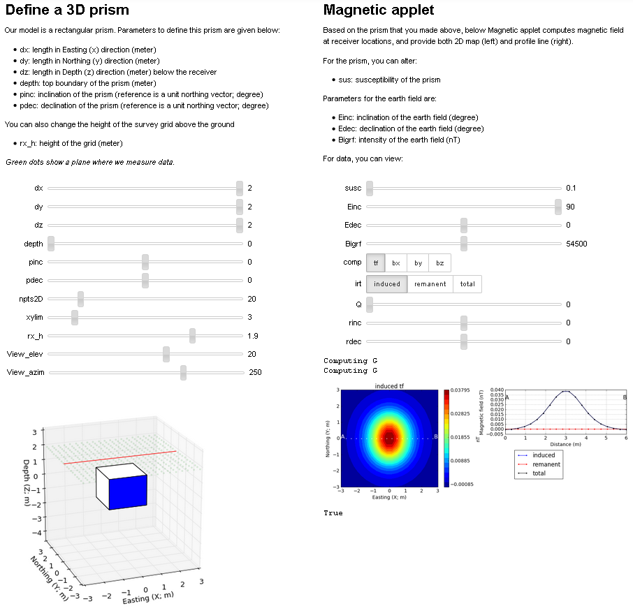

.. _magnetics_basic_principles:

Basic Principles
****************

.. _earth_s_field:

Magnetic Method
===============

.. figure:: ./images/ironfilings.gif
	:align: right
	:figclass: float-right-360
	:scale: 110%
	:name: iron_filling

Most people are familiar with the magnetic field that exists around a dipolar
or "bar" magnet as the pattern of iron filings on paper over a bar magnet
(:numref:`iron_filling`). To a first approximation, Earth's magnetic field does
look a lot like a large dipolar source, with its north pole tilted about
:math:`11.5^\circ` from the spin axis.
Near the surface however, the magnetic field gets much more complicated.

There are in fact three different components to the observed magnetic field:

 - :ref:`The main dipolar field<magnetics_dipolar_field>` of the Earth produced internally by large currents in the fluid outer core of the earth. This is also refered to as the *inducing field*, and it is the main magnetic source for the magnetic geophysical surveys.

 .. figure:: ./images/Earth_Field.png
	:align: center
	:figwidth: 40%

 - :ref:`External variations<magnetics_variability>` caused by currents flowing in the ionosphere. For magnetic surveys, these *diurnal variations* and considered to be source of noise and removed from the observed data.

 .. figure:: ./images/fig_2a.jpg
    :align: center
    :figwidth: 40%

 - :ref:`Anomalous fields<magnetics_buried_dipole>` due to rocks or buried bodies that are the objective of geophysical surveys. These fields are the *signals* we have to work with, and they may be either permanent (always present, regardless of the ambient local field) or induced (caused by Earth's field).

 .. figure:: images/TMA_Calsberg.PNG
   :align: center
   :figwidth: 50%

   Anomalous magnetic field over the Indian Ocean

The focus of magnetic methods is to make sense of the observed magnetic field and infer knowledge about the sub-surface.

Coordinate System
=================

In order to represent the magnetic field of Earth :math:`\mathbf{B}` as a
vector in three dimensions, we need to define a coordinate system. The field
at any location on (or above or within) the Earth can be described in either
of three ways (see :numref:`coord_sys`):

 - **Grid** : B = (:math:`B_E`, :math:`B_N`, :math:`B_D`). These are grid coordinates with X pointing to geographic north (N), Y pointing east (E) and Z pointing vertically down.

 - **UTM** : B = (:math:`B_X` , :math:`B_Y` , :math:`B_Z`). These are the usual Cartesian coordinates with X ponting east, Y pointing north and Z pointing vertically up.

 - **Polar** : B = (:math:`D`, :math:`I`, :math:`\mid B\mid` ). These are the commonly used spherical coordinates which include two angles and a magnitude: I=inclination, D=declination, and :math:`\mid B \mid` =total field strength.

.. figure:: ./images/components.gif
    :align: center
    :scale: 100%
    :name: coord_sys

    : Sketch of coordinates used to describe magnetic fields.

* **B** is the vector representing Earth's magnetic field. Its length
* **X** is the projection of the field, **B**, onto the eastern **E** direction.
* **Y** is the projection of the field, **B**, onto the northern **N** direction.
* **Z** is the projection of the field, **B**, onto the vertical direction.
* **D**: declination is the angle that *H* makes with respect to geographic north.
* **I**: inclination is the angle between **B** and the horizontal. It can vary between -90° and +90°.

The details of Earth's field at any location on Earth are described using a
formula based upon a spherical harmonic decomposition of the field called the
:ref:`IGRF<magnetics_IGRF>` or International Geomagnetic Reference Field.

.. _magnetics_dipolar_field:

Earth's Dipolar Field
======================

.. figure:: ./images/earthfield.gif
	:align: right
	:figwidth: 40%
	:name: earth_mag_vectors

	: Earth's magnetic field orientation

The convention for drawing magnetic field lines is that they flow outward from
a positive pole and inward to a negative pole. The Earth's field behaves like
there is a negative pole in the northern hemisphere and a positive pole in the
southern hemisphere as shown in :numref:`earth_mag_vectors`. This field has a
strength of approximately 70,000 nanoTeslas (nT) at the magnetic poles and
approximately 25,000 nT at the magnetic equator.

Field orientation and strength varies around the world, as presented in
:numref:`IGRF_three_figures` based upon the :ref:`IGRF<magnetics_IGRF>` for
2003. The images were generated using data obtained from the `NOAA`_ National
Data Center. In 2004, Earth's north magnetic pole was close to Melville Island
(Nunavut) at (Latitude, Longitude)=(79N, 70W). In Vancouver (BC), the current
field is orientated at D ~ 20°N,  ~ 70° Inclination.

.. _magnetics_three_figures:

.. list-table::
   :header-rows: 0
   :widths: 10 10
   :stub-columns: 0
   :name: IGRF_three_figures

   *  - .. figure:: ./images/earth-decl.gif

          Earth's declination.
      - .. figure:: ./images/earth-incl.gif

		  Earth's inclination.

   *  - .. figure:: ./images/earth-strength.gif

   		  Earth's field strentgh
      -

.. _magnetics_variability:

Variability of Earth's field
============================

Earth's main (nearly dipolar) field varies over time, causing
changes in strength, declination and inclination of the field. These
variations occur over different time scales depending on the physics behind
them.

Slow changes in the exact location of the magnetic north pole occur over long
periods (months-years). These changes are thought to be caused by internal
changes in mantle convection. Knowing the acquisition date of a magnetic
survey is important in order to understand the observed magnetic anomalies.
The Geological Survey of Canada is actively collecting and archiving
information about the parameters of the field across Canada and can be queried
with the `magnetic field calculator`_.

The second component of Earth's field involves external contributions due
primarily to currents in the ionized upper atmosphere. These changes vary over much shorter periods (hours-day) and are due to two major phenomenon:

 .. figure:: ./images/solar_wind.jpg
	:align: right
	:figwidth: 50%

* Daily variations (on the order of 20 - 50 nT in size) are due to solar wind
  action on the ionosphere and magnetosphere. The image shows an artist's
  rendition of the charged particles interacting with Earth's magnetic field.
  An overview of Earth's magnetic field (with good images, graphs, etc.) can
  be found on the British Geological Survey's `geomagnetics website`_.

.. _geomagnetics website: http://www.geomag.bgs.ac.uk/

* Magnetic storms are correlated with sunspot activity, usually on an 11-year
  cycle. These variations can be large enough to cause damage to satellites
  and north-south oriented power distribution systems. They are also the cause
  of the Aurora Borealis or Australis (northern or southern lights
  respectively). See the GSC's "Geomagnetic Hazards" web page for more.

Temporal variations are often larger than geophysical anomalies. They must be
accounted for in all surveys and this is usually done by acquiring data at a
fixed base-station. Another alternative is to acquire :ref:`gradient
data<magnetics_gradient_data>` that use two fixed sensors.
:numref:`space_weather` shows an example of magnetic noise that may be
encountered as a result of a geomagnetic storm. These temporal variations have
an impact on magnetic data measured over time scales of several days, hours,
or minutes.

The Geological Survey of Canada has a web page, which can provide graphs of
diurnal variations observed at any of 11 magnetic observatories in Canada, for
any day in the most recent 3 years. Find this facility by starting at the`GSC
Geomagnetic data page`_. This resource is also a link to other information
about magnetics.

.. figure:: ./images/pipe3_timelapse_edit.gif
    :align: center
    :scale: 75%
    :name: space_weather

    : Adapted from `NRC`_

.. _GSC Geomagnetic data page: http://www.geomag.nrcan.gc.ca/index-eng.php
.. _NRC: http://www.spaceweather.gc.ca/tech/se-pip-en.php

.. _magnetics_buried_dipole:

Anomalous Field
===============

Variations in the magnetic field become important when measuring near the
Earth's surface. Local changes in :ref:`physical
property<magnetic_physical_property>` may give rise to secondary fields
measurable from a distance. For geological or engineering problems, these
*anomalous fields* are the data to be interpreted.

The basic ideas behind the magnetic problem are illustrated in
:numref:`mag_object`.

(a) An object with magnetic susceptibility :math:`\kappa` is buried in the
    earth.

(b) At the location of burial, the earth's field magnetic field is :math:`\vec{H}` and the magnetization in the object is :math:`\vec{M} = \kappa \vec{H}`.

(c) If the object is "small", that is all of the object's dimensions are several times smaller than the depth to its center, then  the object acts as a :ref:`magnetic dipole<fields_magnetic_dipole>` -- that is, a little bar magnet with strength and direction caused by the inducing field. The  dipole moment of the object is :math:`\vec{m} = \text{Volume} * \vec{M}`

(d) The magnetic field of the object is referred to as the "secondary" field or sometimes the "anomalous" field :math:`\vec{B_A}`. This is what we seek to measure.

The pattern recorded at the surface arises by measuring
the field strength everywhere on the surface, removing the Earth's field, and
then plotting the results as a contour map of anomalous field strength. In the
third figure, regions of blue anomalous field are "negative" because at those
surface locations, the **anomalous** field crossing that surface points in the
opposite direction for Earth's field.

.. list-table:: : Buried magnetized object.
   :header-rows: 0
   :widths: 10
   :stub-columns: 0
   :name: mag_object

   *  - .. raw:: html
            :file: buried_dipole.html

.. _fields_magnetic_dipole:

Fields due to a magnetic dipole
-------------------------------

Understanding the magnetic fields of a buried dipole, and the resultant
observations, is crucial because all real scenarios can be thought of as a
combination (superposition) of dipoles (see the "Buried structures" section).
More advanced applets will be used to look at the responses of some of these
bodies.

In the accompanying :ref:`applet<magnetics_applet>`, observations of individual components :math:`(B_x,B_y,B_z)` can be displayed. The projection of :math:`\vec{B_A}` onto the direction of Earth's field :math:`\hat{B_0}` is called the *total field* (:math:`B_t`).

In addition the vertical gradient of the field, obtained if measurements were
acquired with a gradiometer, are listed as :math:`B_g`.  Sign conventions must
be adopted when data are plotted. For magnetic surveying the coordinate system
used is: {:math:`x` is northing, :math:`y` is easting, and :math:`z` is downward}.
The sign convention will be that horizontal fields are positive if they point
in the :math:`\hat{x}` direction for :math:`B_x`, in the :math:`\hat{y}` direction
for :math:`B_y` and vertical fields are positive if they point downward. For
:math:`B_t` the anomaly is positive if it points in the same direction as the
earth's field and negative if it is the opposite direction.

.. _magnetics_applet:

Magnetic dipoles: a Jupyter Notebook
------------------------------------

The response that will be measured at points on a surface overlying a buried
magnetic dipole can be explored using the UBC-GIF magnetic dipole notebook. Be sure to read the documentation provided in the notebook before using it. This tool allows you to vary the location and shape of a buried 3D prism and get the surface map of the anomalous magnetic. The app also allows to include a remanent  (permanent magnet) component to the total magnetization model. Changing the size and location of the prism allows the simulation of a wide range of scenarios, from vertical pipe <add case study here> to various kinds of :ref:`plate models<magnetics_extended_bodies>`.

As noted in the :ref:`dipole animation<magnetics_dipole_demo>`, a real buried feature will look like a magnetic dipole if its
physical dimensions are much smaller than the depth to the feature's center.

.. _magnetics_dipole_demo:

 .. list-table:: : Rotating magnetic dipole and secondary magnetic field response (:math:`b_z`) as observed from the surface
   :header-rows: 0
   :widths: 10
   :stub-columns: 0

   *  - .. raw:: html
            :file: ./images/rotating_prism_demo.html

.. _magnetics_extended_bodies:

.. Fields from extended bodies
.. ===========================

Approximating targets using magnetic charges
--------------------------------------------

 .. figure:: ./images/buried_bodies1.gif
	:align: right
	:figclass: float-right-360
	:scale: 100%

If :math:`L` denotes the scale length of a buried object and the distance from
the observer to the body, :math:`R` is :math:`\gg` :math:`L`, then the magnetic
field of the body will look like that due to a simple dipole. If the buried
object has a complicated structure or the observer is very close to the
magnetized object then it can no longer be represented as a single dipole.  In
:ref:`magnetics_complex_structures<magnetics_complex_structures>`, we will present a general method for
computing the magnetic response from an arbitrary object but here we look at
objects that have a uniform magnetic susceptibility. We introduce the concept
of magnetic charge and show how this can be used to compute the response for
some simple objects like a pipe or sheet.

First we begin with the concept of magnetic charges or poles. They can't be
generated in practise. If you cut a small magnet in half, you will have two
smaller dipole magnets. Let :math:`Q` be a magnetic charge. It has units of
Webers. The charge creates a magnetic field, :math:`B` that is given by

 .. math::
	\vec{B} =  \frac{ \mu_0 Q \hat r}{4 \pi r^2}
	:label: B_from_Q

If :math:`Q` is positive the field lines of :math:`\vec{B}` extend radially
outward in all directions as indicated by the drawing. If :math:`Q` is negative
the field lines have the same shape but they point toward the source.

 .. figure:: ./images/Positive_magnetic_pole.png
	:align: center
	:scale: 75%
	:name: Positive_magnetic_pole

	Magnetic field lines generated by a postive magnetic pole.

 .. figure:: ./images/Negative_magnetic_pole.png
	:align: center
	:scale: 75%
	:name: Negative_magnetic_pole

	Magnetic field lines generated by a negative magnetic pole.

If a positive and negative charge are put in proximity they form a dipole and
the field lines look like the diagram below.

 .. figure:: ./images/Magnetic_dipole.png
	:align: center
	:scale: 75%
	:name: Magnetic_dipole

	Magnetic field lines generated by a postive and negative pole which form a dipole.

If the distance between the two charges is :math:`s` then the dipole has a
magnetic moment :math:`m=Qs` (units: :math:`\text{Amp m}^2`). As seen in the above
figure the magnetic field inside of the body points from the positive pole to the
negative pole. The dipole moment on the other hand extends from the negative(south)
pole to the positive(north) pole. Formulae for the magnetic field in cylindrical
or cartesian coordinates can be found in standard texts.

------

As an aside we notice that magnetic charges behave exactly as point electric
charges. An important distinction is that electric particles can exist by
themselves whereas magnetic charges always occur in pairs. The reason for this
is that all magnetic fields fundamentally arise from currents.

Consider a magnetic field impinging upon a body of arbitrary shape and uniform
susceptibility. In the interior of the body, the magnetic elements align
themselves with the inducing field. The sketch below illustrates the process.
Each cell becomes a dipole which can be represented by a plus and minus
magnetic charge. At the interior boundaries, the effects of positive and
negative charges cancel and the net result is that the magnetic field away
from the body is effectively due to the negative magnetic charges on the top
surface and the positive charges on the bottom. This greatly simplifies both
computations and understanding.

.. figure:: ./images/magnetic_charges.gif
	:align: center
	:scale: 100%

The resultant anomalous magnetic field can be thought of as being due to a
distribution of magnetic poles on the surface of the body. Conceptually, a
picture of the large scale effect can be drawn as shown here:

.. figure:: ./images/magnetic_poles.gif
	:align: center
	:scale: 100%

Working with magnetic charges
-----------------------------

The magnetization in a body of constant magnetic susceptibility :math:`\kappa`
is :math:`\vec{M} = \kappa \vec{H_0}`. As illustrated in the above diagram,
the magnetic field outside the body can be represented as fields due to
charges on the surface of the body. The surface charge density is given by

.. math::
	\tau_s= \vec{M} \cdot \hat n

So the strength of the magnetic charges on the surface depends upon how the
direction of the magnetic field is aligned with the boundary of the object. In
the image above, there are charges on the top and bottom of the prism but
there are no charges on the sides where the magnetic field is parallel to the
boundary.

There are some circumstances in which the concept of magnetic charge greatly
simplifies the problem. Consider a pipe, or vertical prism, and an incident
magnetic field that is pointing down. The magnetization points vertically
downward and :math:`\vec{M} \cdot \hat{n}` is zero except at the two ends. At
the top the charge density is :math:`\left|M\right| \text{W/m}^2` and at the
bottom it is :math:`-\left|M\right| \text{W/m}^2`. Suppose the pipe has a
radius :math:`a` and thus an area :math:`\pi a^2`. If the radius of the pipe is
small compared to the distance from the observer then the effect is the same
as if all of the charge was sitting at the top of the pipe at its center. The
total charge on the face is the area (units :math:`\text{m}^2`) times the
charge density :math:`\text{W/m}^2`.

.. math::
	Q = \kappa H_0 \pi a^2

and the magnetic fields are like those given in equation :eq:`B_from_Q` and
shown in :numref:`Positive_magnetic_pole`.

The same phenomenon is happening at the bottom of the pipe but there the
charge is :math:`-Q`. At the surface the magnetic field is the sum of fields due
to the two charges, but if the pipe is very long, then the contribution from
the bottom of the pipe becomes negligible. The resultant observed field is
effectively that due to a monopole, or point charge, of strength :math:`Q`.
This handy simplification often arises in practise.

The equation :eq:`B_from_Q` provides the anomalous magnetic field due to a charge of
strength :math:`Q`. This is a vector. When we measure the magnetic anomaly we
measure one or more individual components of this field. The total field
anomaly is the projection of the anomalous field onto the direction of the
earth's field :math:`\hat{z}` so the magnetic field anomaly over the pipe is

.. math::
	B_t= \frac{\mu_0}{4 \pi} \frac{Q z}{r^3}

where :math:`z` is the depth of burial. Equivalently, if we substitute for the
magnetic charge and write the expression using the earth's magnetic field
:math:`B_0` then

.. math::
	B_t = \frac{\kappa \pi a^2 B_0}{4 \pi} \frac{z}{r^3}

Geologic Features and representation for modeling
-------------------------------------------------

Some simplified geologic features that can be detected (and sometimes
characterized) using magnetic data are shown below. They represent models of
the true Earth, which provide useful first order understanding about
structures and rock type distributions, in spite of being simplifications of
the real earth.

.. figure:: ./images/geomods.gif
	:align: center
	:scale: 100%

For each model, the concept of surface magnetic charges then permits
evaluation of the fields; here are examples.

.. figure:: ./images/modrep.gif
	:align: center
	:scale: 100%

As seen in the figures, for these types of features the responses can
represented as monopoles, dipoles, lines of dipoles, sheets of charges etc.
This can help us understand what the magnetic response of such objects are.
For instance a buried cylinder or rebar can be thought of as a line of
dipoles. Sometimes field data are interpreted using these simple
approximations. There are numerous parametric inversion algorithms that have
been generated to accomplish this.

Some images on this page adapted from "Applications manual for portable
magnetometers" by S. Breiner, 1999, Geometrics 2190 Fortune Drive San Jose,
California 95131 U.S.A.

.. _magnetics_IGRF:

The IGRF
========

Here are a few remarks about the IGRF or International Geomagnetic Reference Field.

The IGRF is a mathematical model that describes the field and its secular
changes as a spherical harmonic expansion. It is updated every five years, and
**later** versions may re-define the field at **earlier** times. This is
important to remember if you are comparing old maps to new ones. The IGRF is a
product of the International Association of Geomagnetism and Aeronomy (IAGA_),
and the original version was defined in 1968.

.. _IAGA: http://www.ngdc.noaa.gov/IAGA/vmod/

Every five years, the IAGA issues a contemporary main field model that
predicts the field for the next five years. These models have names that are
prefixed with "IGRF." Each new model updates the model that was used to
predict the previous five (or more) years. Updated models are called **DGRF**
for **Definitive Geomagnetic Reference Field**. Major updates since 1980 use
data from MAGSAT, consisting of measurements of vector components and total
intensity of the geomagnetic field between 350 and 560 km altitude.

To correct data sets which had older versions of reference fields removed, add
:math:`(F_0 - F_n)` to each data point, where the two parameters are total
intensity values computed from the old and new reference fields respectively.
See Peddie N.W. 1982, 1983, and 1986 for details. Charts of many types are
available on-line, as downloadable postscript files, and for sale (less than
$5.00 each) from the USGS, NOAA, GSC, and just about any other government
geoscience agency. For example, you could use either the NOAA Geomagnetism
page_, or the Canadian National Geomagnetism Program's homepage_.

Details about Earth's field
can be found at government geoscience websites such as the `NOAA`_ geomagnetism home page, or the `Canadian National Geomagnetism Program`_ home
page.

**Other resources**
 - Earth's `magnetic field calculator`_.

.. _NOAA: http://www.ngdc.noaa.gov/geomag/geomag.shtml
.. _Canadian National Geomagnetism Program: http://www.geomag.nrcan.gc.ca/index-eng.php
.. _magnetic field calculator: http://www.ngdc.noaa.gov/geomag-web/
.. _page: http://www.ngdc.noaa.gov/ngdc.html
.. _homepage: http://www.geomag.nrcan.gc.ca/index-eng.php

.. References:

.. * Peddie, N. W., 1986, Report on International Geomagnetic Reference Field revision 1985 by IAGA Division I Working Group 1: *Geophysics*, 51, no. 4, 1020-1023.
.. * Peddie, N. W., 1983, International Geomagnetic Reference Field - its evolution and the difference in total field intensity between new and old models for 1965-1980 (short note): *Geophysics*, 48, no. 12, 1691-1696.
.. * Peddie, N. W., 1982, Report on International Geomagnetic Reference Field 1980 by IAGA Division I Working Group 1: *Geophysics*, 47, no. 5, 841-842.
