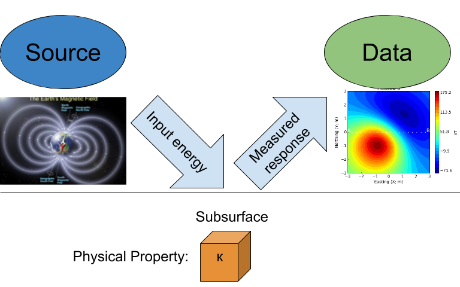
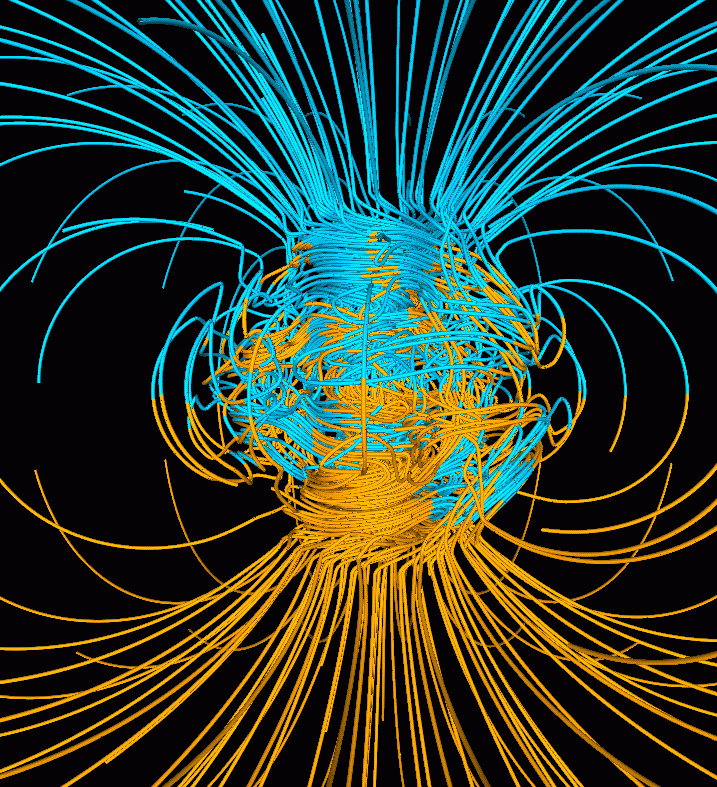
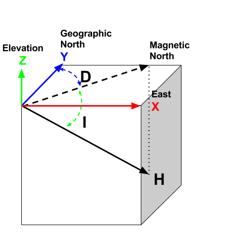
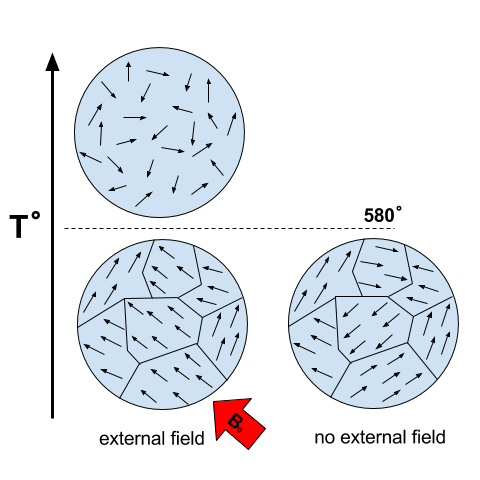
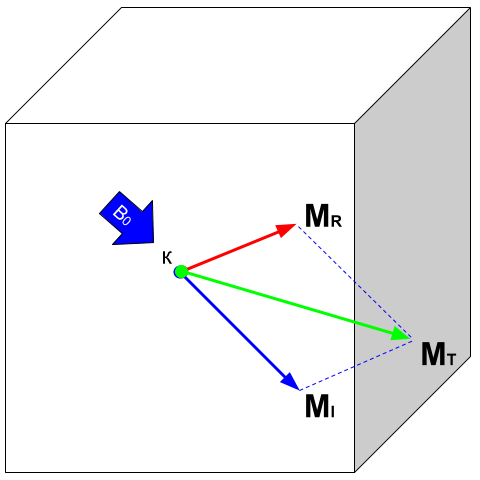
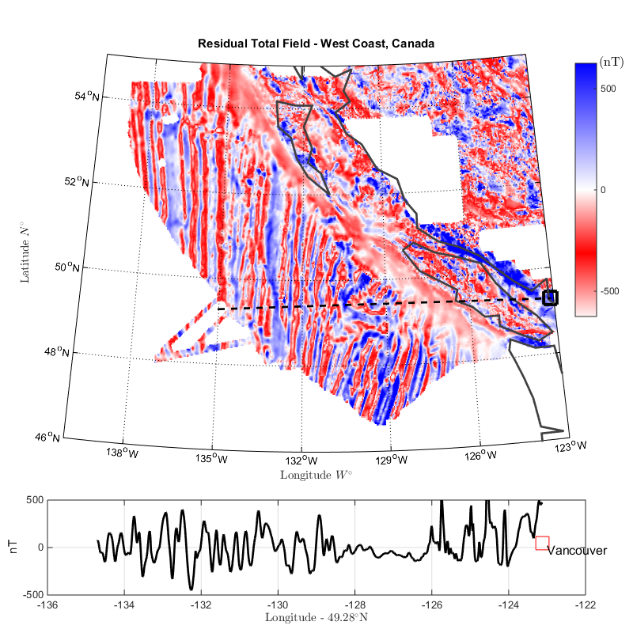

.. _magnetics_basic_principles:

Basic Principles
****************

Purpose: This section provides the key components to understand the geophysical magnetic experiment. As briefly summarized in the :ref:`Introduction<magnetic_physical_property>` section, the magnetic survey requires a magnetic :ref:`source<earth_s_field>`. Rocks inside the earth become magnetized and they produce an anomalous magnetic field :ref:`data<magnetics_responses>`. A receiver records the sum of all magnetic fields.

    Simplified magnetic target and receiver

Important topics are:
 - :ref:`Source<earth_s_field>`
 - :ref:`Magnetization<magnetics_magnetization>`
 - :ref:`Data<magnetics_responses>`
 - Other important items
	- :ref:`Remanence<magnetics_remanent>`
	- :ref:`Magnetic Charges<magnetics_charges>`

.. _earth_s_field:

Earth's magnetic field (Source)
===============================

  The Earth's dynamo

All magnetic fields arise from currents. This is also true for the magnetic
field of the earth. The outer core of the earth is molten and in a
state of convection and a geomagnetic dynamo creates magnetic fields. Close
to the surface of the core the magnetic fields are very complicated but
as we move outward the magnetic field resembles that of a large
bar magnetic which is often referred to as a magnetic dipole.

.. figure:: ./images/earthfield.gif
  :align: left
  :figwidth: 40%
  :name: earth_mag_vectors

  Direction of the Earth's field at the surface.

To a first approximation, Earth's magnetic field resembles a large
dipolar source with a negative pole in the northern hemisphere and a positive
pole in the southern hemisphere (:numref:`earth_mag_vectors`). The dipole
is offset from the center of the earth and also tilted. The north
magnetic pole at the surface of the earth is approximately at
Melville Island.

  Terms for the coordinate system used in magnetics

The field at any location on (or above or within) the Earth are generally described in terms described of magnitude (:math:`\mathbf{|B|}`), declination (:math:`\mathbf{D}`) and inclination (:math:`\mathbf{I}`) as illustrated in :numref:`coord_sys`.

* :math:`\mathbf{|B|}`: The magnitude of the vector representing Earth's magnetic field.
* :math:`\mathbf{D}`: Declination is the angle that *H* makes with respect to geographic north (positive angle clockwise).
* :math:`\mathbf{I}`: Inclination is the angle between **B** and the horizontal. It can vary between -90° and +90° (positive angle down).

.. _magnetics_IGRF:

The IGRF
--------

Earth's field at any location is approximately  that provided by a
global reference model called the :ref:`IGRF<magnetics_IGRF>` or International
Geomagnetic Reference Field. The IGRF is a mathematical model that describes
the field and its secular changes, that is, how it changes with time. The
IGRF is a product of the International Association of Geomagnetism and
Aeronomy (IAGA_), and the original version was defined in 1968. It is
updated every five years, and **later** versions may re-define the field at
**earlier** times. This is important to remember if you are comparing old maps
to new ones.

Earth's field has a strength of approximately 70,000 nanoTeslas
(nT) at the magnetic poles and approximately 25,000 nT at the magnetic
equator. Field orientation and strength varies around the world, as presented
in :numref:`IGRF_three_figures` based upon the IGRF from 2003 (NOAA_).

.. _IAGA: http://www.ngdc.noaa.gov/IAGA/vmod/

.. _magnetics_three_figures:

.. list-table:: 2003 IGRF Magnetic Field
   :header-rows: 0
   :widths: 10 10
   :stub-columns: 0
   :name: IGRF_three_figures

   *  - .. figure:: ./images/earth-decl.gif

          Earth's declination.
      - .. figure:: ./images/earth-incl.gif

          Earth's inclination.

   *  - .. figure:: ./images/earth-strength.gif

          Earth's field strentgh
      -

Slow changes in the exact location of the magnetic north pole occur over long
periods (months-years). These changes are thought to be caused by internal
changes in mantle convection. Knowing the acquisition date of a magnetic
survey is important in order to understand the observed magnetic anomalies. In
2004, Earth's magnetic north pole was close to Melville Island (Nunavut) at
(Latitude, Longitude)=(79N, 70W). In Vancouver (BC), the current field is
orientated at D ~ 20°N,  ~ 70° Inclination. Various governmental agencies are
actively collecting and archiving information about the parameters of the
field worldwide and can be queried with the `magnetic field calculator`_.

Details about Earth's field can be found at government geoscience websites
such as the `NOAA`_ geomagnetism home page, or the `Canadian National
Geomagnetism Program`_ home page. An overview of Earth's magnetic field (with
good images, graphs, etc.) can be found on the British Geological Survey's
`geomagnetics website`_.

.. _magnetics_external_sources:

Magnetic fields from External Sources
-------------------------------------

When we record a magnetic observation we measure the field that exists at
that location. Most of that field comes from inside the earth and it can
be from the geomagnetic dynamo or from crustal rocks that have become
magnetized. In addition there are also magnetic fields that come from outside
the earth. The solar wind interacts with Earth's magnetic field and creates
a magnetosphere that is "tear-dropped" shape as shown in the figure
below

 .. figure:: ./images/Magnetosphere_rendition.jpg
  :align: center
  :figwidth: 75%

  The image shows an artist' rendition of the charged particles interacting with Earth's magnetic field. The volume containing Earth's field is called the magnetosphere (by_NASA_).

.. _by_NASA: https://commons.wikimedia.org/w/index.php?curid=192450

The interaction between Earth's field and the solar wind allows charge
particles to flow in the ionsphere which is a zone of ionized particles about
110 km above the earth's surface. These currents produce magnetic  fields. The
time-scales for these changes can be very short, in the order  of micro-
seconds, to large, in the order of days. Daily variations can  typically be on
the order of 20 - 50 nT in size.  Large scale variations  are caused by
magnetic storms and they may be 1000's of nT in size.  Magnetic storms are
correlated with sunspot activity, usually on an 11-year cycle. These
variations can be large enough to cause damage to satellites   and power
distribution systems. They are also the cause   of the Aurora Borealis or
Australis (northern or southern lights   respectively). See the GSC's
"Geomagnetic Hazards" web page for more.

.. _magnetics_magnetization:

Magnetization
=============
When the source field is applied to earth materials it causes the to become
magnetized. :ref:`Magnetization<physprop_magnetization>` is the dipole moment
per unit volume. This is a vector quantity because a dipole has
a strength and a direction. For many cases of interest the relationship between
magnetization :math:`\mathbf{M}` and the source
:math:`\mathbf{H}` (earth's magnetic field) is given by

.. math:: \mathbf{M} = \kappa \mathbf{H}.
  :label: MkappaH

where :math:`\kappa` is the magnetic susceptibility. Thus the magnetization has the
same direction as the earth's field. Because Earth's field is different
at different locations on the earth, then the same object gets magnetized
differently depending upon where it is situated. As a consequence, magnetic
data from a steel drum buried at the north pole will be very  different
from that from a drum buried at the equator.

The final magnetization of a rock or man-made object can be the result
of a number of contributing factors. In the case of the metal drum, it can
made of steel and it has complicated structure. It's walls are thin, it
is hollow on the inside, and the steel has a very high magnetic
susceptibility. The geometry and high susceptibility causes the
induced magnetic field of the drum to be in a different direction
than the inducing earth's field and the relationship :eq:`MkappaH`
is no longer valid. Also, the drum was manufactured by molding melted
steel. When that material cooled through its Curie temperature it
acquired a permanent, or remanent,  magnetization. It's net magnetization,
when it is buried at any location on the earth will be the sum of
the induced and remanent magnetizations. This is an important topic
and it is further investigated :ref:`here<magnetics_remanent>`.

.. _magnetics_responses:

Responses (Data)
================

The magnetic field that results from the magnetized earth is evaluated
with the equation

.. math:: \mathbf{B}_A = \frac{\mu_0}{4\pi}  \int_{V}   \mathbf{M} \cdot \nabla \nabla \left(\frac{1}{r}\right) \; dV \;,
  :label: integral

where :math:`\mu_0` is the :ref:`magnetic
permeability<physprop_mag_permeability>` of free space, :math:`\mathbf{M}` is the
magnetization per unit volume :math:`\mathbf{V}`, and :math:`r` defines the
distance between the object and the location of the observer. This magnetic
field is referred to as the "secondary" field or sometimes the
"anomalous" field :math:`\mathbf{B}_A`. For geological or engineering
problems, these anomalous fields are the *data* to be interpreted, and this is
what we seek to measure.

When the magnetization is governed by the linear relationship :eq:`MkappaH`
then the above anomalous field can be written as:

.. math:: \mathbf{B}_A = \frac{\mu_0}{4\pi}  \int_{V}   \kappa \mathbf{H}_0 \cdot \nabla \nabla \left(\frac{1}{r}\right) \; dV \;.
  :label: integral_induced

It is important to note that the left hand side of this equation is a magnetic
field that is a vector. For simplicity, and for the remainder of this section,
we shall drop the subscript "A" and remember that we are talking about
anomalous fields. A vector in three dimensional space requires three numbers
to specify it. These could be component values (:math:`B_x,\;B_y,\;B_z`) or an
amplitude and angles ( :math:`|B|,\;D,\;I`).
Generally a geophysical datum is a measurement of a component. For instance,

.. math:: B_x = \mathbf{B} \cdot \mathbf{\hat x} \;,

where (:math:`\cdot`) is a vector inner product. This means that :math:`B_x`
is the projection of the vector :math:`\mathbf{B}` onto a unit vector in the
:math:`\mathbf{\hat x}` direction. Similar understandings exist for
:math:`B_y` and :math:`B_z`. When plotting magnetic field data over an object
it is therefore usual to plot maps of a particular component. A special datum
that is particularly important for magnetics is the projection of the
anomalous field onto a unit vector that is in the direction of the earth's
field. Let this be :math:`\mathbf{\hat B_0}`. Then the datum
:math:`\mathbf{B_t}` is

.. math:: \mathbf{B_t} = \mathbf{B} \cdot \mathbf{\hat B_0}

The basic ideas behind the induced magnetization process, going
from source to data, are illustrated below.
The image of the data, corresponds to :math:`\mathbf{B_t}`.

 .. raw:: html
    :file: buried_dipole.html

From :eq:`integral_induced`, we note that the induced response of the field will vary both in magnitude and orientation with respect to the inducing magnetic field :math:`\mathbf{H}_0`. Therefore, the magnetic response of an object buried in Canada may look a lot different if buried near the equator as demonstrated in the :ref:`dipole animation<magnetics_induced_demo>` below. This is an important point to keep in mind when interpreting magnetic data.

.. _magnetics_induced_demo:

 .. list-table:: : Changing magnetic response (:math:`B_z`) of a buried magnetic prism as a function of inducing field orientation.
   :header-rows: 0
   :widths: 10
   :stub-columns: 0

   *  - .. raw:: html
            :file: ./images/induced_prism_demo.html

**Student exercise** (magnetic_app_):

Generate a block and bury it at a depth that is somewhat greater than its size.
The block will produce a magnetic field that is like a dipole. Locate the block
at:

(a) the north pole
(b) mid-latitude
(c) the equator.

Before you simulate the
data with the applet, sketch the explected magnetic field.  Also, sketch the
expected profile along a E-W transect, at the surface,  over the middle of the
buried target. Do this for all possible data types; :math:`B_x,\;B_y,\;B_z,\;B_t`.

In addition to components in the cartesian framework, or projections
onto the direction of the inducing field, the vertical gradient of the field,
can be plotted. These data are those that would be
acquired with a gradiometer, and are listed as :math:`B_g`.

Note that when plotting any datum, sign conventions must be adopted. For the
applet the coordinate system used is UTM: :math:`\mathbf{\hat x}` is east,
:math:`\mathbf{\hat y}` is north, and :math:`\mathbf{\hat z}` is elevation
which is positive up.

The sign convention will be that :math:`B_x` is positive if it points
in the :math:`\mathbf{\hat x}` direction, :math:`B_y` is positive if it points
in the :math:`\mathbf{\hat y}` direction
and :math:`B_z` is positive if it  points upward. For
:math:`B_t` the anomaly is positive if it points in the same direction as the
earth's field and negative if it is the opposite direction.

*Note that traditionally in magnetics the coordinate system is 'x' is
northing, 'y' is easting and 'z' is positive down. To mitigate confusion
we refer to these 'northing', 'easting' and 'down'*.

Unfortunately, for a field survey we measure the anomalous field
plus Earth's field. (More correctly it is the anomalous field
plus any other magnetic fields that are present, but we ignore that
complexity for the present).
Thus the observed field is

.. math:: \mathbf{B}^{obs} = \mathbf{B}_0 + \mathbf{B}_A\;,

where :math:`\mathbf{B}^{obs}` is the combined signal from the Earth's field :math:`\mathbf{B}_0` and from the ground :math:`\mathbf{B}_A`. The details about how the anomalous field is extracted from the observations is explained in the :ref:`Data<magnetics_data>` section.

.. _magnetics_remanent:

Remanent Magnetization
----------------------

  Magnetization acquired by cooling below the Curie temperature

A toy bar magnetic is a quintessential example of an object that has a
remanent magnetization. If taken to outer space where there is no inducing
field, it still posesses a magnetic field like that of a dipole. The
acquisition of remanence occurs when a body with magnetic minerals cools
through its Curie temperature. Above the Curie temperature thermal agitation
prevents the elementary dipoles from aligning with the ambient magnetic field.
As the material cools the magnetic particles can stay aligned and eventually
lock into place in a domain structure. Each domain has all of its constituent
dipoles locked into a single direction. This structure stays in place after
the ambient field is removed and the object will have a net remanent
magnetism. Some elements of the process are portrayed in :numref:`magnetic_domains`.

        Components of magnetization

Remanent magnetization is very common in man-made objects and in rocks. :numref:`UXO` shows the magnetic signature of multiple UXO buried in a proving
ground. Each has the signature of a dipole yet the data could not have been
explained by induced magnetization of a set of compact objects. The
orientation of the dipoles is too variable to be explained by that process.
The proper understanding is that the magnetization of each UXO is composed of
two parts: (a) An induced portion (:math:`\mathbf{M_I}`)  and (b) remanent portion  (:math:`\mathbf{M_R}`). The
net magnetization is:

.. math::   \mathbf{M = M_I + M_r} \;.
  :label: total_magnetization

as depicted in :numref:`magnetization_components`.
The magnetic field due to the UXO must be evaluated with :eq:`total_magnetization`.

  .. figure:: ./images/intro_paramEstim.png
      :align: center
      :scale: 100 %
      :name: UXO

      : (a) A typical UXO site.  There is no surface indications of ordnance items. (b) Typical ordance items (c) Magnetic field data over a  site contaminated with UXO.

    : Residual Total Field map over the West Coast of Canada. Profile data along the parallel :math:`49^\circ` N shows multiple reversal in crustal magnetism.

Rocks are also frequently magnetized. This is particularly true of magnetic rocks.
An example that had large consequences in understanding our dynamic earth is
shown in :numref:`remanent_BC_coast`. The is total field magnetic survey data off of
the coast of British Columbia. The striped pattern of reversed polarity fields
is the result of basaltic lavas erupting on the ocean bottom, cooling and
aquiring a magnetization in the direction of Earth's field at that
time. The fact that Earth's field periodically reverses in polarity, and
that this was captured by the cooling lava, played a crucial role in
the development of the theory of plate tectonics.

Similar to the previous animation, we now add a remanent component oriented east (x-axis) as presented in the :ref:`dipole animation<magnetics_remanent_demo>` below. Note that the remanent component is independent of the inducing direction and it substantially distorts the magnetic data compared to the purely induced response. Interpreting magnetic data affected by remanence remains a key challenge in exploration geophysics.

.. _magnetics_remanent_demo:

 .. list-table:: : Changing magnetic response (:math:`B_z`) of a buried magnetic prism as a function of inducing field orientation with an added remanent component oriented along the x-axis (:math:`I:0^\circ,\; D:90^\circ`).
   :header-rows: 0
   :widths: 10
   :stub-columns: 0

   *  - .. raw:: html
            :file: ./images/remanent_prism_demo.html

Student exercise: Use the applet to explore the complicating effects of remanent magnetization
on your prismatic body worked with previously.

Approximating the response
==========================

Solving the integral in :eq:`integral` can be challenging for objects with complicated geometry as expected for geological structures. In many cases however the magnetic response of objects can be approximated by a dipole or summation of monopoles and dipoles. We elaborate upon these below.

.. _fields_magnetic_dipole:

Fields due to a magnetic dipole
-------------------------------

Understanding the magnetic fields of a buried dipole, and the resultant
observations, is crucial because all real scenarios can be thought of as a
combination (superposition) of dipoles (see :ref:`Geological Features<magnetics_geological_feature>` section).

If the object is "small", that is all of the object's dimensions are several times smaller than the depth to its center, then  the object acts as a :ref:`magnetic dipole<fields_magnetic_dipole>` -- that is, a bar magnet. If the magnetization is purely induced then the direction of the dipole will be aligned with the inducing field. In fact, this is the reason why, when one gets sufficiently distant from the center of the earth, Earth's field looks like a dipole.

.. _magnetics_dipole_demo:

 .. list-table:: : Changing magnetic response (:math:`B_z`) of a buried magnetic prism as a function of depth. The field is compared to a dipole with equivalent dipole moment and depth. Both responses are converging as the depth of burial increases.
   :header-rows: 0
   :widths: 10
   :stub-columns: 0

   *  - .. raw:: html
            :file: ./images/Magnetic_dipole.html

.. _magnetics_extended_bodies:

.. Fields from extended bodies
.. ===========================

Approximating targets using magnetic charges
--------------------------------------------

.. add depth of burial of pipe
.. screenshot of buried pipe (pole anomaly)

.. add remament

 .. figure:: ./images/buried_bodies1.gif
	:align: right
	:figclass: float-right-360
	:scale: 100%

If the buried
object has a complicated structure or the observer is very close to the
magnetized object then it can no longer be represented as a single dipole.  In
:ref:`magnetics_complex_structures<magnetics_complex_structures>`, we will present a general method for
computing the magnetic response from an arbitrary object but here we look at
objects that have a uniform magnetic susceptibility. We introduce the concept
of magnetic charge and show how this can be used to compute the response for
some simple objects like a pipe or sheet.

First we begin with the concept of magnetic charges or poles. They can't be
generated in practice. If you cut a small magnet in half, you will have two
smaller dipole magnets. Let :math:`Q` be a magnetic charge. It has units of
Webers. The charge creates a magnetic field, :math:`B` that is given by

 .. math::
	\vec{B} =  \frac{ \mu_0 Q \hat r}{4 \pi r^2}
	:label: B_from_Q

If :math:`Q` is positive the field lines of :math:`\vec{B}` extend radially
outward in all directions as indicated by the drawing. If :math:`Q` is negative
the field lines have the same shape but they point toward the source.

 .. figure:: ./images/Positive_magnetic_pole.png
	:align: center
	:scale: 75%
	:name: Positive_magnetic_pole

	Magnetic field lines generated by a positive magnetic pole.

 .. figure:: ./images/Negative_magnetic_pole.png
	:align: center
	:scale: 75%
	:name: Negative_magnetic_pole

	Magnetic field lines generated by a negative magnetic pole.

If a positive and negative charge are put in proximity they form a dipole and
the field lines look like the diagram below.

 .. figure:: ./images/Magnetic_dipole.png
	:align: center
	:scale: 75%
	:name: Magnetic_dipole

	Magnetic field lines generated by a postive and negative pole which form a dipole.

If the distance between the two charges is :math:`s` then the dipole has a
magnetic moment :math:`m=Qs` (units: :math:`\text{Amp m}^2`). As seen in the above
figure the magnetic field inside of the body points from the positive pole to the
negative pole. The dipole moment on the other hand extends from the negative(south)
pole to the positive(north) pole. Formulae for the magnetic field in cylindrical
or cartesian coordinates can be found in standard texts.

------

As an aside we notice that magnetic charges behave exactly as point electric
charges. An important distinction is that electric particles can exist by
themselves whereas magnetic charges always occur in pairs. The reason for this
is that all magnetic fields fundamentally arise from currents.

Consider a magnetic field impinging upon a body of arbitrary shape and uniform
susceptibility. In the interior of the body, the magnetic elements align
themselves with the inducing field. The sketch below illustrates the process.
Each cell becomes a dipole which can be represented by a plus and minus
magnetic charge. At the interior boundaries, the effects of positive and
negative charges cancel and the net result is that the magnetic field away
from the body is effectively due to the negative magnetic charges on the top
surface and the positive charges on the bottom. This greatly simplifies both
computations and understanding.

.. figure:: ./images/magnetic_charges.gif
	:align: center
	:scale: 100%

The resultant anomalous magnetic field can be thought of as being due to a
distribution of magnetic poles on the surface of the body. Conceptually, a
picture of the large scale effect can be drawn as shown here:

.. figure:: ./images/magnetic_poles.gif
	:align: center
	:scale: 100%

.. _magnetics_charges:

Working with magnetic charges
-----------------------------

The magnetization in a body of constant magnetic susceptibility :math:`\kappa`
is :math:`\vec{M} = \kappa \vec{H_0}`. As illustrated in the above diagram,
the magnetic field outside the body can be represented as fields due to
charges on the surface of the body. The surface charge density is given by

.. math::
	\tau_s= \vec{M} \cdot \hat n

So the strength of the magnetic charges on the surface depends upon how the
direction of the magnetic field is aligned with the boundary of the object. In
the image above, there are charges on the top and bottom of the prism but
there are no charges on the sides where the magnetic field is parallel to the
boundary.

There are some circumstances in which the concept of magnetic charge greatly
simplifies the problem. Consider a pipe, or vertical prism, and an incident
magnetic field that is pointing down. The magnetization points vertically
downward and :math:`\vec{M} \cdot \hat{n}` is zero except at the two ends. At
the top the charge density is :math:`\left|M\right| \text{W/m}^2` and at the
bottom it is :math:`-\left|M\right| \text{W/m}^2`. Suppose the pipe has a
radius :math:`a` and thus an area :math:`\pi a^2`. If the radius of the pipe is
small compared to the distance from the observer then the effect is the same
as if all of the charge was sitting at the top of the pipe at its center. The
total charge on the face is the area (units :math:`\text{m}^2`) times the
charge density :math:`\text{W/m}^2`.

.. math::
	Q = \kappa H_0 \pi a^2

and the magnetic fields are like those given in equation :eq:`B_from_Q` and
shown in :numref:`Positive_magnetic_pole`.

The same phenomenon is happening at the bottom of the pipe but there the
charge is :math:`-Q`. At the surface the magnetic field is the sum of fields due
to the two charges, but if the pipe is very long, then the contribution from
the bottom of the pipe becomes negligible. The resultant observed field is
effectively that due to a monopole, or point charge, of strength :math:`Q`.
This handy simplification often arises in practise.

The equation :eq:`B_from_Q` provides the anomalous magnetic field due to a charge of
strength :math:`Q`. This is a vector. When we measure the magnetic anomaly we
measure one or more individual components of this field. The total field
anomaly is the projection of the anomalous field onto the direction of the
earth's field :math:`\hat{z}` so the magnetic field anomaly over the pipe is

.. math::
	B_t= \frac{\mu_0}{4 \pi} \frac{Q z}{r^3}

where :math:`z` is the depth of burial. Equivalently, if we substitute for the
magnetic charge and write the expression using the earth's magnetic field
:math:`B_0` then

.. math::
	B_t = \frac{\kappa \pi a^2 B_0}{4 \pi} \frac{z}{r^3}

.. _magnetics_geological_feature:

Geologic Features and representation for modeling
-------------------------------------------------

Some simplified geologic features that can be detected (and sometimes
characterized) using magnetic data are shown below. They represent models of
the true Earth, which provide useful first order understanding about
structures and rock type distributions, in spite of being simplifications of
the real earth.

.. figure:: ./images/geomods.gif
	:align: center
	:scale: 100%

For each model, the concept of surface magnetic charges then permits
evaluation of the fields; here are examples.

.. figure:: ./images/modrep.gif
	:align: center
	:scale: 100%

As seen in the figures, for these types of features the responses can
represented as monopoles, dipoles, lines of dipoles, sheets of charges etc.
This can help us understand what the magnetic response of such objects are.
For instance a buried cylinder or rebar can be thought of as a line of
dipoles. Sometimes field data are interpreted using these simple
approximations. There are numerous parametric inversion algorithms that have
been generated to accomplish this.

Some images on this page adapted from "Applications manual for portable
magnetometers" by S. Breiner, 1999, Geometrics 2190 Fortune Drive San Jose,
California 95131 U.S.A.

.. links:
.. _NOAA: http://www.ngdc.noaa.gov/geomag/geomag.shtml
.. _Canadian National Geomagnetism Program: http://www.geomag.nrcan.gc.ca/index-eng.php
.. _magnetic field calculator: http://www.ngdc.noaa.gov/geomag-web/
.. _page: http://www.ngdc.noaa.gov/ngdc.html
.. _homepage: http://www.geomag.nrcan.gc.ca/index-eng.php
.. _geomagnetics website: http://www.geomag.bgs.ac.uk/
.. _magnetic_app: https://mybinder.org/v2/gh/geoscixyz/gpgLabs/main?filepath=notebooks%2Fmag%2FMag_Induced2D.ipynb
.. _geodynamo: https://commons.wikimedia.org/w/index.php?curid=1712490
