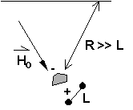

.. _magnetics_buried_structures:

Fields from extended bodies
***************************

Approximating targets as dipoles
================================

If \\(L\\) denotes the scale length of a buried object and the distance from the observer to the body, R is >> \\(L\\), then the magnetic field of the body will look like that due to a simple dipole. If the buried object is essentially "two dimensional" (such as a buried pipe), then the resulting anomalous field will look like that of a line of dipoles.

When a dipole approximation does not work
=========================================

Consider a magnetic field impinging upon a body of arbitrary shape. In the interior of the body, the magnetic elements align themselves with the inducing field. The sketch below illustrates the process. Each cell becomes a dipole which can be represented by a plus and minus magnetic charge. At the interior boundaries, the effects of positive and negative charges cancel and the net result is that the magnetic field away from the body is effectively due to the negative magnetic charges on the top surface and the positive charges on the bottom. This greatly simplifies both computations and understanding. 

.. figure:: ./images/magnetic_charges.gif
	:align: center
	:scale: 100% 

The resultant anomalous magnetic field can be thought of as being due to a distribution of magnetic poles on the surface of the body. Conceptually, a picture of the large scale effect can be drawn as shown here:

.. figure:: ./images/magnetic_poles.gif
	:align: center
	:scale: 100% 

Geologic Features and representation for modeling 
=================================================

Some geologic features that can be detected (and sometimes characterized) using magnetics data are shown below. They represent models of the true Earth, which provide useful first order understanding about structures and rock type distributions, in spite of being simplifications of the real earth.

.. figure:: ./images/geomods.gif
	:align: center
	:scale: 100% 

For each model, the concept of surface magnetic poles then permits evaluation of the fields; here are examples.	

.. figure:: ./images/modrep.gif
	:align: center
	:scale: 100% 

For these types of features, the magnetic anomalies measured along lines crossing perpendicular to them (or over their centres) usually can be directly interpreted in terms of the feature's geometry. In addition, sophisticated techniques for estimating models based upon survey data can be used when more quantitative information is needed. These and other aspects of interpretation are beyond the scope of this discussion on the basics of magnetics.

Images on this page adapted from "Applications manual for portable magnetometers" by S. Breiner, 1999, Geometrics 2190 Fortune Drive San Jose, California 95131 U.S.A.	
