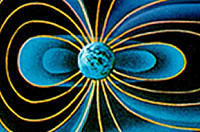

.. _magnetics_earths_field:

Background: Earth's Field
*************************

.. figure:: ./images/ironfilings.gif
	:align: right
	:figclass: float-right-360
	:scale: 110% 

Most people are familiar with the magnetic field that exists around a dipolar or "bar" magnet (shown to the right as the pattern of iron filings on paper over a bar magnet). To a first approximation, Earth's magnetic field looks like that of a dipolar source within the Earth, which is tilted about 11.5 degrees from the spin axis and is slightly off center. This field has a strength of approximately 70,000 nanoTeslas (nT) at the magnetic poles and approximately 25,000 nT at the magnetic equator.The figure below-left illustrates a cross-section of the field as it could be imagined from space. Below-right is a sketch of the directions of the field at Earth's surface.

.. figure:: ./images/earthfield.gif
	:figclass: center
	:align: left
	:scale: 155 %

There are, in fact, three different components to Earth's field:

1. **The main dipolar field** of the earth (produced internally by large currents in the fluid outer core of the earth).
2. **External variations** caused by currents flowing in the ionosphere. For magnetic surveys, this is a source of "noise", and is the reason the field in the left-hand image above appears asymmetric.
3. **Magnetic fields due to rocks or buried bodies** that are the objective of geophysical surveys. These fields are the "signals" we have to work with, and they may be either permanent (always present, regardless of the ambient local field) or induced (caused by Earth's field).

Describing Earth's field
------------------------

The convention for drawing magnetic field lines is that they flow outward from a positive pole and inward to a negative pole. The Earth's field behaves like there is a negative pole in the northern hemisphere and a positive pole in the southern hemisphere. Therefore, the magnetic field on Earth's surface looks approximately like that given in the  figure above. Using B to represent the magnetic field of Earth as a vector in three dimensions, the field at any location on (or above or within) Earth can be described in either of three ways (refer to the next figure below):

 B = (\\(B_x\\), \\(B_y\\), \\(B_z\\)) = (X, Y, Z) in the figure. These are Cartesian coordinates with X pointing to true (geographic) north, Y pointing east and Z pointing vertically down.

 B = (\\(B_h\\) , \\(B_z\\) , \\(D\\)) = (H, Z, D) in the figure. These are horizontal and vertical components, plus declination (angle with respect to true north). 
    
 B = (\\(D\\), \\(I\\), \\(\\mid B\\mid\\) ). These are the commonly used polar coordinates which include two angles and a magnitude: D=declination, I=inclination, and \\(\\mid B \\mid \\)=total field strength.

In 2004, Earth's north magnetic pole was close to Melville Island at (Latitude, Longitude)=(79N, 70W). At Vancouver D ~ 20° east, I ~ 70° down from horizontal.

.. figure:: ./images/components.gif
	:align: center
	:scale: 130% 

Sketch of coordinates used to describe magnetic fields.

* **B** is the vector representing magnetic field of the earth. Its length represents its magnitude of field strength (sometimes referred to as F).
* **H** is the projection of the field, **B**, onto the surface.
* **Z** is the projection of the field, **B**, onto the vertical direction.
* **X** is the projection of the field, **B**, onto the northward direction.
* **Y** is the projection of the field, **B**, onto the eastward direction.
* D: declination is the angle that *H* makes with respect to geographic north.
* I: inclination is the angle between **B** and the horizontal. It can vary between -90° and +90°. 

The details of Earth's field at any location on Earth are described using a formula based upon a spherical harmonic decomposition of the field called the IGRF or International Geomagnetic Reference Field. Details about Earth's field can be found at government geoscience websites (listed below) such as the NOAA Geomagnetism home page, or the Canadian National Geomagnetism Program's home page. Resources about Earth's global magnetic field are:

* A page describing the International Geomagnetic Reference Field: :doc:`magnetics_IGRF`.
* Three figures show how declination, inclination and field strength varies around the world, see: :doc:`magnetics_three_figures`.
* `NOAA Geomagnetism home page`_ , and the Canadian National Geomagnetism Program's `home page`_ websites.
* Find parameters describing Earth's field at a specific location (specified using date, latitude, longitude and elevation) at the NOAA National Geophysical Data Center's online `magnetic field calculator`_.

.. _NOAA Geomagnetism home page: http://www.ngdc.noaa.gov/ngdc.html
.. _home page: http://www.geomag.nrcan.gc.ca/index-eng.php
.. _magnetic field calculator: http://www.ngdc.noaa.gov/geomag-web/

Variability of Earth's field
----------------------------

The source of the main (nearly dipolar) field varies slowly, causing changes in strength, declination and inclination over time scales of months to years. Changes in the exact location of the magnetic north pole are caused by this effect. See the Geological Survey of Canada's website for a conversational history of the location of the Magnetic North pole. Declination varies very widely in Canada. The correct value of declination can be found by entering your latitude, longitude and year at the GSC's website.

.. figure:: ./images/solar_wind.jpg
	:align: right
	:figclass: float-right-360
	:scale: 110% 

The second component of Earth's field involves external contributions due primarily to currents in the ionized upper atmosphere. 

* Daily variations (on the order of 20 - 50 nT in size) are due to solar wind action on the ionosphere and magnetosphere. The image shows an artist's rendition of the charged particles interacting with Earth's magnetic field. An overview of Earth's magnetic field (with good images, graphs, etc.) can be found on the British Geological Survey's `geomagnetics website`_.

.. _geomagnetics website: http://www.geomag.bgs.ac.uk/

* Magnetic storms are correlated with sunspot activity, usually on an 11-year cycle. These variations can be large enough to cause damage to satellites and north-south oriented power distribution systems. They are also the cause of the Aurora Borealis or Australis (northern or southern lights respectively). See the GSC's "Geomagnetic Hazards" web page for more.

Temporal variations are often larger than geophysical anomalies. They must be accounted for in all surveys and this is usually done by acquiring data at a fixed base-station. Another alternative is to acquire gradient data that use two fixed sensors. Three figures are given in a sidebar showing examples of different types of magnetic noise that may be encountered at time scales of several days, hours, and minutes.

.. DWO: I didn't find these pictures but we should have some photos of time variation of the fields at different time scales.

The Geological Survey of Canada has a web page, which can provide graphs of diurnal variations observed at any of 11 magnetic observatories in Canada, for any day in the most recent 3 years. Find this facility by starting at the `GSC Geomagnetic data page`_. This resource is also a link to other information about magnetics.

.. _GSC Geomagnetic data page: http://www.geomag.nrcan.gc.ca/index-eng.php