.. _magnetics_interpretation:

Interpretation
**************

In this we focus on various techniques used to interpret the magnetic data.
From an applied geoscientists standpoint, this is where most of the data
integration and decision making steps are made. In some cases :ref:`direct
data interpretation <direct_data_interpretation>` can be used. In others, in
particular when a 3D geologic interpretation is needed, an :ref:`inversion
<mag_inversion>` is required. On this page, we discuss these techniques and
illustrate common interpretation techniques on a
:ref:`mineral exploration example <tkc_primer>`.

.. _direct_data_interpretation:

Direct Data Interpretation
==========================

We begin with direct data interpretation techniques. Informations about the
sub-surface are inferred directly from the data, either through filtering
methods or by analyzing the shape and amplitude of magnetic field anomalies.

.. _half_width:

Estimating Depth of Burial from Half-Width
------------------------------------------

For simple targets, a depth to the target can be estimated using the half-
width. Most geologic setting are more complex and thus require more advanced
interpretation.

As discussed in :ref:`magnetics_basic_principles`, in simple
scenarios, the target of a survey can be approximated:

- as a :ref:`dipole<fields_magnetic_dipole>` if it is a compact body
- or as a :ref:`monopole <magnetics_extended_bodies>` if it is an extended body .

Consider a vertical inducing field (or alternatively, a data set that has been
:ref:`reduced to pole <magnetics_rtp>`), and a profile line of data over a target
located at the origin. The total field anomaly is expected to take a shape similar
to that show in figure :numref:`halfwidth`.

We define the **half-width**, :math:`x_{1/2}`, as the width of the anomaly at half
its maximum (note that this is the **anomaly**, the background field has been removed).

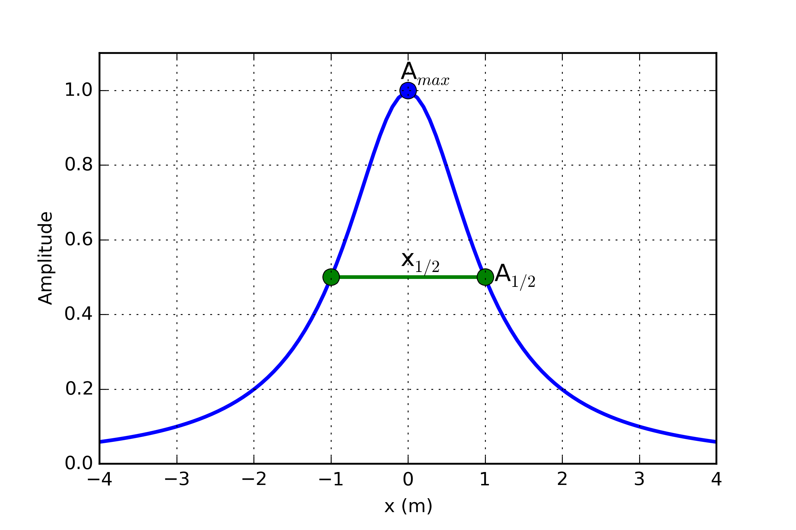

    Definition of half-width.

For a **dipole** target, the depth of burial(to the top of the target), :math:`z`,  is
approximately equal to the half-width

.. math::
    z \sim x_{1/2}

while for a **monopole** target, the depth of burial is

.. math::
    z \sim \frac{1}{2} x_{1/2}

You can explore this concept further with the :ref:`Jupyter Notebook app <magnetics_applet>`.

.. _magnetics_filters:

Derivative Maps
---------------

While the data itself can be informative, image filtering techniques are commonly used by industry to further highlight important features present in the data. These filters a generally done in the frequency_domain_ and require the data to be interpolated on a regular grid.
Let :math:`M(x,y,0)` be a grid of magnetic data taken at some reference elevation :math:`z=0`.
Here are few filters applied to a simple 1x1x0.1 m block anomaly (:numref:`Data_Filters`):

- **Upward Continuation (UC)**: Magnetic data are synthetically moved vertically such that:

  .. math:: UC = M(x,y,\delta z)

 Upward continuation is commonly used to remove the effects of very nearby (or shallow) susceptible material. High frequency information decays rapidly, leaving only the broad features. Downward continuation is also possible in order to accentuate the high frequency content, but comes at the risk of enhancing noise in the gridded data.

- **First vertical derivative (1VD)**: Quantifies the change in signal as a function of survey height.

  .. math:: 1VD = \frac{\partial M}{\partial z}

  1VD maps are commonly used to enhance the shorter wavelength signal.
  Notice how well the linear features are defined compared to the Total Field profile.

- **Total horizontal derivative (THDR)**: Measures the lateral rate of change of the measured field.

  .. math:: THDR = \sqrt{\frac{\partial M}{\partial x}^2+\frac{\partial M}{\partial y}^2}

  This filter is most useful to highlight edges and delineate boundaries. Notice that the peak values occur over the edges of the block at -1 and 1 m.

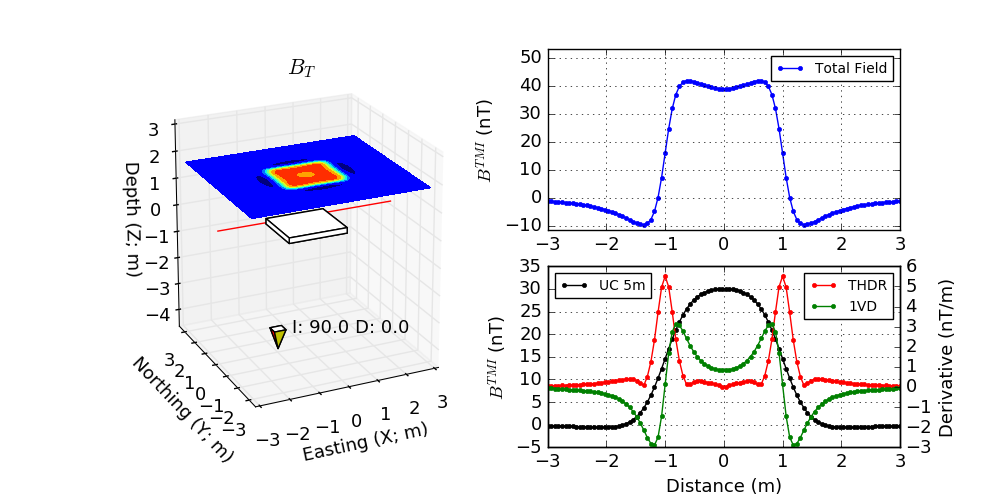

  Magnetics derivative based filters

Call for contributors
^^^^^^^^^^^^^^^^^^^^^

.. raw:: html

   

      <a href="http://github.com/ubcgif/em"><i class="fa fa-wrench fa-4x" aria-hidden="true"></i></a>
   

There are many other filters published in the literature. Please contact us if you would like to contribute to this page.

.. _tkc_primer:

Tli Kwi Cho (TKC): *A primer*
=============================

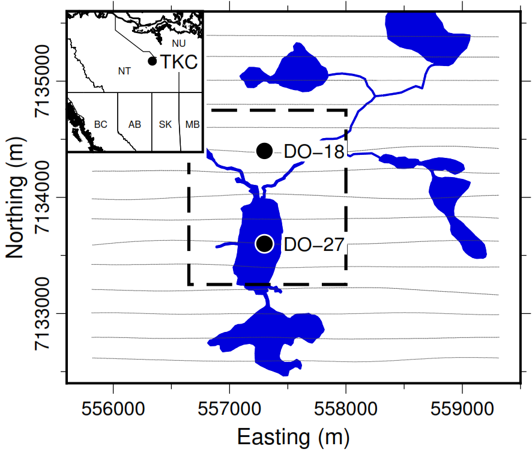

    Aquisition locations for TKC

We demonstrate the various interpretation techniques on a mineral exploration case study, the Tli Kwi Cho diamond deposit.
Tli Kwi Cho (TKC) is a kimberlite complex in the Northwest Territories,  Canada.
The Northwest Territories have been surveyed extensively for diamondiferous kimberlites since the early 1980s. The Lac de Gras region has been particularly productive, and hosts two of the largest Canadian deposits: the Ekati and Diavik mines.

.. figure:: ./images/TKC_Kimbs.png
  :align: left
  :figwidth: 30%
  :name: TKC_Sketch

  Simplified sketch of expected TKC kimberlite deposit

A common geophysical fingerprint for a kimberlite pipe is a circular strong magnetic anomaly, with a gravitational low and an anomalous electromagnetic (EM) response.
A generic model for kimberlite pipes found in the Lac de Gras region is presented in :numref:`TKC_Sketch`. The main rock types associated with kimberlites are summarized in :numref:`TKC_rocks`.

.. list-table:: : Common rock types associated with kimberlites found in the Lac de Gras region
   :header-rows: 1
   :widths: 1 1 1
   :stub-columns: 0
   :name: TKC_rocks

   *  - Rock Type
      - Description
      - Susceptibility
   *  - Pyroclastic Kimberlite (PK)
      - Extrusive, violent, post-eruption
      - Moderate-low
   *  - Volcaniclastic Kimberlite (VK)
      - Extrusive, fragmental, main body
      - Moderate-low
   *  - Hypabyssal Kimberlite (HK)
      - Intrusive, igneous, coherent
      - High
   *  - Glacial till
      - Sedimentary
      - Low

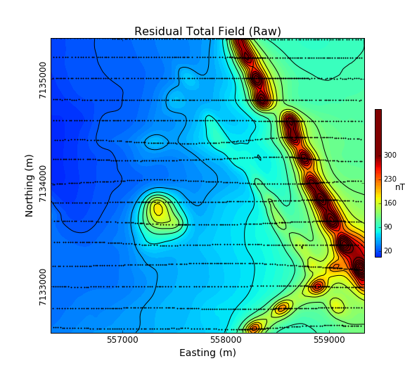

  Airborne magnetic data of TKC

The TKC kimberlite complex was identified from an airborne magnetic and frequency-domain electromagnetic DIGHEM survey in 1992 (:numref:`DIGHEM_survey`).
Geophysics had been used during the discovery phase of TKC, but little had been done to model the deposit prior to drilling. As we will later discover, the TKC deposit differ from the standard kimberlite model found in the region.
Consequently, the geological model used to explain the deposit underwent several revisions over the following decades.

In this section, we will attempt to extract as much information as possible about the deposit strictly from the original airborne magnetic survey.

Data map
--------

2D plots of magnetic data, often referred to as maps, can provide insight
about the geologic units, contacts, and the horizontal location of structures.
What is presented, and how it is presented can greatly alter interpretations
obtained by visually analyzing the maps. Raw data are not usually presented
directly. Choices of contour plotting parameters must be made; features not
related to targets might be removed; and data or image enhancement processing
might be employed. Here we introduce some aspects of these topics.

The first and simplest analysis can be done directly on the :ref:`Total Field Anomaly<magnetics_field_data>` data as shown below. The survey parameters are provided in :numref:`DIGHEM_param`.

**Note**: The highest values observed on the gridded magnetic map are strongly correlated with the survey line locations. This is strictly an interpolation bias and should be ignore during the interpretation process.

.. list-table:: : Airborne DIGHEM (1992) magnetic survey.
   :header-rows: 0
   :widths: 1 1
   :stub-columns: 0
   :name: DIGHEM_param

   *  - Inducing field
      - :math:`Inc:\;83.8^\circ,\;Dec:\;25.4^\circ,\;Strength:\;60308\;nT`
   *  - Line spacing
      - 200 m
   *  - Instrument
      -  Optical pump cesium vapor

From the raw data, we notice a regional trend coming from the east of the survey area. In order to enhance the local anomalies, we first proceed with a :ref:`regional trend removal<magnetics_regional_trend>`. A :math:`1^{th}` Order polynomial is subtracted from the raw data.

.. raw:: html
    :file: TKC_Data_Processing.html

Having isolated the local anomalies, we can now look at various :ref:`filtering techniques<magnetics_filters>` as shown below:

.. raw:: html
    :file: TKC_Data_Filters.html

The derivative maps were useful in identifying at least two important features :numref:`1th_interp`).

 - Two sets of elongated magnetic anomalies striking :math:`315^\circ` N and :math:`45^\circ` N. From the shape and strength of the magnetic field, they may correspond to intrusive dykes emplaced during separate events. From the THDR map, these dykes should be between 20 to 50 m in width.

 - Possible sinistral faulting post-intrusion striking at :math:`\approx 40^\circ`

 - Two compact, near circular anomaly that could resemble a kimberlite pipes. These are features of interest in diamond exploration.

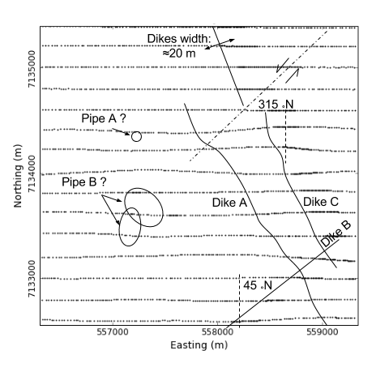

  Important features identified from the derivative maps

.. _frequency_domain: https://en.wikipedia.org/wiki/Frequency_domain

Parametric Simulation
---------------------

From the data map, we have targeted two features of interest with different
geometries: a narrow elongated anomaly and a compact body. In order to test
these hypothesizes, we first attempt to approximate these magnetic features
with simple parametric objects using the :ref:`magnetic
app<magnetics_applet>`.

.. _plate_model:

Plate model
^^^^^^^^^^^

 :numref:`TKC_param_dyke` compares the observed and simulated magnetic data across an elongated magnetic anomaly. The parameter used for the plate model are presented in :numref:`Param_dyke`. This result seems to confirm the presence of thin, shallow dipping magnetic dykes.Turns out that these dykes are part of the Mackenzie dyke swarm that runs through out the Lac de Gras region. These intrusive dykes are related to major tectonic events, and although interesting scientifically, they are of little interest in diamond exploration.

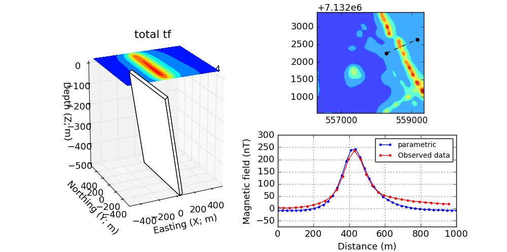

  Parametric dyke model of TKC area

.. list-table:: : Parameter used to model the dykes
   :header-rows: 0
   :widths: 1 1
   :stub-columns: 0
   :name: Param_dyke

   *  - Dimensions
      - 50 x 800 x 500 m
   *  - Dip
      - :math:`20^\circ`
   *  - Susceptibility
      - 0.1 SI

.. _pipe_model:

Pipe model
^^^^^^^^^^

Second, we look at the compact, near circular magnetic anomaly in the center of the survey area. This feature may be of interest as it resemble the typical signature of a kimberlite pipe.
:numref:`TKC_param_pipe` compares the magnetic data over the compact anomaly and the parametric pipe model (:numref:`Param_dyke`). This result seems to confirm the presence of a compact magnetic block SE dipping. The shape of the anomaly is surprisingly different than the expected shape of a vertical pipe. This result requires additional work for validation, hence the need to invert the data.

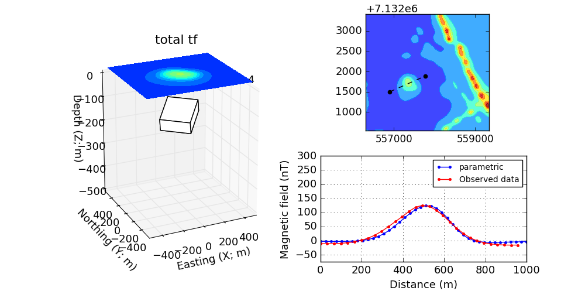

  Circular pipe model of the TKC area

.. list-table:: : Parameters used to model the pipe
   :header-rows: 0
   :widths: 1 1
   :stub-columns: 0
   :name: Param_pipe

   *  - Dimensions
      - 300 x 200 x 50 m
   *  - Dip
      - :math:`20^\circ`
   *  - Susceptibility
      - 0.05 SI

.. _mag_inversion:

Inversion
---------

The parametric forward simulation was helpful in understanding the shape and susceptibility contrast associated with the main magnetic anomalies. Modeling the Earth with simple parametric objects rapidly becomes prohibitive however for large and complicated susceptibility distributions. For this reason, we must adopt a more mathematical approach.

The inverse problem is illustrated in :numref:`mag_inverse`. Similar to a medical imaging problem, the goal is to recover a 3D representation of the Earth from the magnetic data. Several commercial and open-source algorithms are available to solve the inverse problem. We here used the SimPEG_ open-source package. We present the various input parameters required for the inversion. More technical details regarding the inversion algorithm are provided in this tutorial_

.. figure:: ./images/Intro_Inverse.png
    :align: center
    :figwidth: 50 %
    :name: mag_inverse

    Conceptual inverse problem

Inverse Problem
^^^^^^^^^^^^^^^

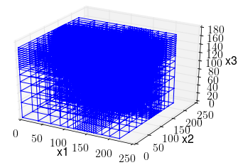

    Mesh used to discretize the subsurface for inversion

In its simplest form, the inverse problem attempts to image the Earth from the observed data. To do this, we need to *approximate* the continuous Earth with a set of *discrete* parameters that a computer can understand. A picture taken with a digital camera is a great analogy. The quality of the picture largely depends on the resolution of the camera, or the number of pixels used to capture the image. The higher the resolution, the larger the file size. Similarly for 3D inversion, we need to choose an appropriate *mesh* resolution to capture the right level of details, without getting too large for a computer to handle it. The chosen mesh parameters for this problem are shown in :numref:`Inversion_param`.

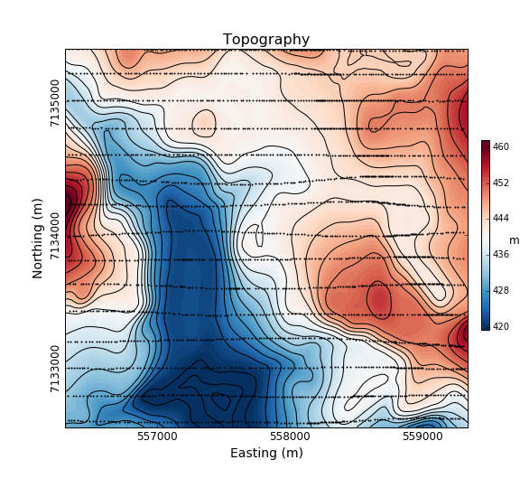

    Topography of the TKC area

Secondly, we need a topographic surface that defines the relative distance between the observation point and the discrete Earth. A Digital Elevation Model (DEM) is downloaded from the NRCan Geogratis_ website as shown in :numref:`TKC_topo`.

.. list-table:: : Inversion parameters
   :header-rows: 0
   :widths: 1 1
   :stub-columns: 0
   :name: Inversion_param

   *  - Cell size
      - 25 x 25 x 25 m
   *  - Number of cells (X, Y, Z)
      - 120 x 130 x 35 = 546,000 cells
   *  - Number of data
      - 1092
   *  - Data uncertainties
      - 10 nT

.. _Geogratis: https://maps.canada.ca/czs/index-en.html

3D Solution
^^^^^^^^^^^

From the inversion algorithm, we recover a 3D model of magnetic susceptibility.
We note the following features:

- The inversion successfully recovered thin dipping planes similar to our :ref:`parametric model<plate_model>`. Despite getting smooth and broad at depth, the vertical length of these magnetic planes appear to extend from the surface down to over 500 m (:numref:`TKC_susc` ).

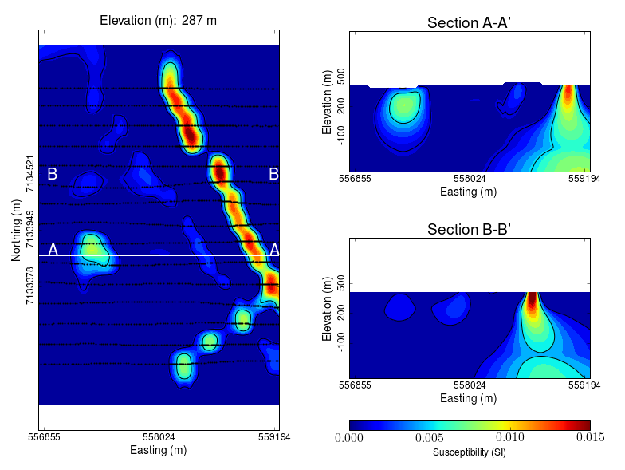

    Inverted TKC susceptibility model

- Two nearly vertical compact bodies are imaged west of the magnetic dykes (:numref:`TKC_DO27`). Susceptibility values vary greatly between the two anomalies. The largest (South) anomaly seems to dip slightly toward SW has predicted by our :ref:`parametric model<pipe_model>` and appears deeper than the northern anomaly.

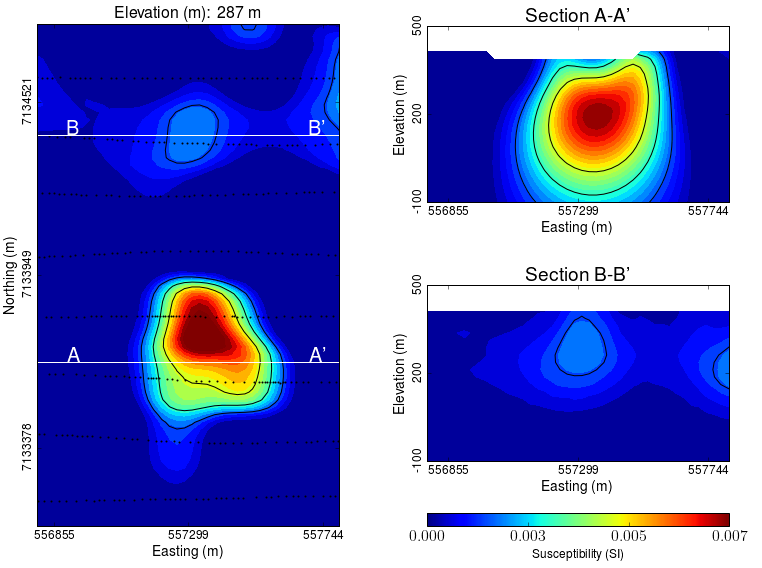

    Vertically compact bodies identified with inversion

.. image:: https://img.shields.io/badge/powered%20by-SimPEG-blue.svg
    :target: http://simpeg.xyz
    :alt: SimPEG</pre>

.. _Simpeg: http://simpeg.xyz

.. _tutorial: http://computation.geosci.xyz/case-studies/PF/TKC_PF.html

Validation
^^^^^^^^^^

A key component to asses the validity of our 3D model is to verify that the given solution honors the data. The figures below compares the true and predicted magnetic data. The residual map confirms that our model captures most of the signal contained in the airborne data set.

.. raw:: html
    :file: TKC_Data_Inverted.html

Final Interpretation
====================

.. raw:: html

   

      <a href="http://github.com/ubcgif/em"><i class="fa fa-wrench fa-4x" aria-hidden="true"></i></a>
   

.. Old Material
.. ============

.. .. _separate sidebar: http://www.eos.ubc.ca/courses/eosc350/content/methods/meth_3/blakely/blakely.html

.. 2D plots of magnetic data, often referred to as maps, can provide insight
.. about the geologic units, contacts, and the horizontal location of structures.
.. What is presented, and how it is presented can greatly alter interpretations
.. obtained by visually analyzing the maps. Raw data are not usually presented
.. directly. Choices of contour plotting parameters must be made; features not
.. related to targets might be removed; and data or image enhancement processing
.. might be employed. Here we introduce some aspects of these topics.

.. The most common form of magnetic survey data involves "total field"
.. measurements. This means that the field's magnitude along the direction of the
.. earth's field is measured at every location. To the right is a total field
.. strength map for the whole world (a full size version is in the sidebar_).

.. .. _sidebar: http://www.eos.ubc.ca/courses/eosc350/content/methods/meth_3/sidebar-fields.html

.. At the scale of most exploration or engineering surveys, a map of total field
.. data gathered over ground with no buried susceptible material would appear
.. flat. However, if there are rocks or objects that are magnetic (susceptible)
.. then the secondary magnetic field induced within those features will be
.. superimposed upon the Earth's own field. The result would be a change in total
.. field strength that can be plotted as a map. A small scale example is given
.. here:

.. Large data sets are commonly gathered using airborne instruments. They may
.. involve :math:`10^5` to :math:`10^6` data points to show magnetic variations over many square
.. kilometers. An example of a large airborne data set is shown to the right,
.. with a larger version, including alternative colour scale schemes, `shown in a
.. sidebar`_.

.. .. _shown in a sidebar: http://www.eos.ubc.ca/courses/eosc350/content/methods/meth_3/sidebar-airmaps.html

.. .. figure:: ./images/map-cust.gif
..   :figclass: float-right-360
..   :align: right
..   :scale: 40%

.. Such data sets were once too large to invert directly, but they still provide
.. extremely valuable information about geology and structure, especially if some
.. processing is applied to enhance desirable features and/or suppress noise or
.. unwanted features. With recent advancements in computational power and
.. inversion methodologies these large scale problems are becoming easier to
.. invert.

.. Derivative Map
.. --------------

.. There are numerous options for processing potential fields data in general,
.. and magnetics data specifically. One example is shown below. The processing was applied in
.. this case in order to emphasize geologic structural trends.

.. .. raw:: html
..   :file: Airborne_magnetics_example.html

.. Other examples of magnetic data processing techniques include:

.. - Upward continuation is commonly used to remove the effects of very nearby
..   (or shallow) susceptible material.

.. - Second vertical derivative of total field anomaly is sometimes used to
..   emphasize the edges of anomalous zones.

.. - Reduction to the pole rotates the data set so that it appears as if the
..   geology existed at the north magnetic pole. This removes the asymmetry
..   associated with mid-latitude anomalies.

.. - Calculating the pseudo-gravity anomaly converts the magnetic data into a
..   form that would appear if buried sources were simply density anomalies
..   rather than dipolar sources.

.. - Horizontal gradient of pseudo-gravity anomaly: gravity anomaly inflection
..   points (horizontal gradient peaks) align with vertical body boundaries;
..   therefore, mapping peaks of horizontal gradient of pseudo-gravity can help
..   map geologic contacts.

.. The effects of these five processing options are illustrated in a `separate
.. sidebar`_ on processing of magnetics data.
