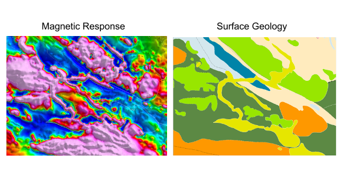

.. _magnetics_introduction:

Introduction
************

Magnetic surveys
================

In geophysical magnetic surveying the Earth's magnetic field causes, or
induces, subsurface materials to become magnetized. Magnetic methods are used in wide range on problems: from geological mapping :numref:`mag_visual` and mineral exploration, to engirneering and reclamation work (UXO).

 - Visualization blbla

.. flip order from data to geol

 - parameter estimation to find location and size

 - 3D inversion for mineral exploration

As summarized in :numref:`mag_response`, all applied geophysics
problems can be discussed in terms of (a) a source of energy that is put into the
ground, (b) the effects of that energy has on the subsurface due to variations in the
relevant physical property and (c) the measurements that detect those changes to
the input energy.
Signals are interpreted in terms of the subsurface
distribution of the physical property, which in the case of magnetic surveys
is magnetic susceptibility.

.. figure:: ./images/Intro_Response.png
    :align: center
    :scale: 100 %
    :name: mag_response

The concept of magnetic surveying is illustrated in :numref:`mag_survey`
Using the same colour scheme as the figure above, Figures 2a - 2e illustrate
how this concept applies to magnetic surveys. In this case, the **energy
source** is Earth's global magnetic field (Figure 2a) which has a strength and
direction at every location on the Earth (Figure 2b). Subsurface materials
(Figure 2c) become magnetized by this field (Figure 2d), and the data (Figure
2e) are measurements of the magnetic field at the Earth's surface, in the air,
in space, or within boreholes. The measured magnetic field will be a
superposition of Earth's field and the induced secondary fields caused by
magnetization of buried materials.

.. raw:: html
    :file: intro.html
    :name: mag_survey
