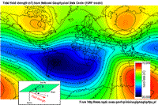

.. _magnetics_plotting_processing:

Processing and plotting magnetic data
****************************************

Removal of time variations
==========================

We saw in section :doc:`magnetics_earths_field` that the magnetic field at
any point on the earth changes with time. These temporal variations are also
referred to as diurnal variations. Our magnetometers record the Earth's inducing field as well
as the secondary or anomalous fields induced in susceptible bodies. If the changes in earth's
field have an amplitude that is significant compared to our anomalous signal,
then we need to correct for the observed temporal variations. The general procedure 
is to establish a "base-station" which is fixed in location and continually measures 
the magnetic field. Each datum acquired by the roving sensor is also time-stamped. The assumption 
is then made that the changes in the Earth's magnetic field caused by these natural sources have a
long enough spatial wavelength that they are same at any point on the survey grid. 
Field data, corrected for these time variations, is obtained through the following
subtraction process

.. math::
	\Delta \textbf{B}(t) = \textbf{B}_{obs}(t) - \textbf{B}_{base}(t)

.. The graphs below indicate the procedure.

.. DWO: same graphs as used in the lecture

Two things happen with this procedure

- Time variations are removed.

- Earth's field, associated with the location of the base-station, is removed. 

The residual data would be similar to that in which the IGRF
(:doc:`magnetics_IGRF`) has been removed.

The residual field, :math:`\Delta B`, contains the sought anomalous field but
it may also have some broad-scale background or "regional field". Thus

.. math::
	\Delta \textbf{B} = \textbf{B}_a + \textbf{B}_{regional}

The "regional field" is a smoothly varying field which characterizes the
magnetic response of large scale background structures. If our primary
interest is in the anomalous field produced by the taget body, we may want to
remove this regional field.

Removal of regional trends
==========================

In order to interpret magnetic data in terms of features and structures at
depth, the anomalous field caused by buried features of interest must be
isolated. In other words, we must try to remove the contribution to the
measurements made by the earth's field and also from geologic features larger
than the actual survey area. That is, we want to remove a regional field. If
we designate magnetic fields as **B**, then we want to perform the following

.. math::
	\textbf{B}_{a} = \Delta \textbf{B} - \textbf{B}_{regional}

Estimates of the regional field may be obtained using:

- the IGRF (International Geomagnetic Reference Field) discussed in
  :doc:`magnetics_earths_field`;

- a constant value selected by the interpreter (when survey areas are small);

- a more sophisticated polynomial (map) generated by a computer using least
  squares (or other) analysis of data;

- it is also possible to use inversion at a large scale to define a regional
  field.

To illustrate the process, when data are collected along a line, the removal
of a regional trend can be managed graphically, as shown here:

.. figure:: ./images/regional.gif
	:align: center
	:scale: 110%	

Clearly this process involves some degree of subjectivity and will depend upon
how you draw a line that separates the desired "signal" from the background.
The situation becomes more complicated for  magnetic maps (data collected over
an area) where the causative bodies have complicated shapes and variable
dimensions. Nevertheless, removing an approximate regional field can be of
critical importance in isolating an anomaly for further processing as maps or
input into an inversion. The following is an example showing the regional
magnetic map and a local anomalous field taken from a survey in central
British Columbia. The area is Mt. Milligan, which has recently opened up as a
mine. In the large-scale map the dominant feature is the magnetic signature of
the mountain. Of interest is a (2km x 2km) segment of that map. A large-scale
regional field is estimated, subtracted from the observed data, and the
results are shown in a second  window. The magnetic feature observed in that
map is related to the ore body.

.. raw:: html
    :file: data_plotting2.html

Plotting Data
=============

2D plots of magnetic data, often referred to as maps, can provide insight
about the geologic units, contacts, and the horizontal location of structures.
What is presented, and how it is presented can greatly alter interpretations
obtained by visually analyzing the maps. Raw data are not usually presented
directly. Choices of contour plotting parameters must be made; features not
related to targets might be removed; and data or image enhancement processing
might be employed. Here we introduce some aspects of these topics.

The most common form of magnetic survey data involves "total field"
measurements. This means that the field's magnitude along the direction of the
earth's field is measured at every location. To the right is a total field
strength map for the whole world (a full size version is in the sidebar_
mentioned in the section :doc:`magnetics_earths_field`).

.. _sidebar: http://www.eos.ubc.ca/courses/eosc350/content/methods/meth_3/sidebar-fields.html

At the scale of most exploration or engineering surveys, a map of total field
data gathered over ground with no buried susceptible material would appear
flat. However, if there are rocks or objects that are magnetic (susceptible)
then the secondary magnetic field induced within those features will be
superimposed upon the Earth's own field. The result would be a change in total
field strength that can be plotted as a map. A small scale example is given
here:

.. raw:: html
    :file: data_plotting1.html

Large data sets are commonly gathered using airborne instruments. They may
involve :math:`10^5` to :math:`10^6` data points to show magnetic variations over many square
kilometers. An example of a large airborne data set is shown to the right,
with a larger version, including alternative colour scale schemes,`shown in a
sidebar`_.

.. _shown in a sidebar: http://www.eos.ubc.ca/courses/eosc350/content/methods/meth_3/sidebar-airmaps.html

.. figure:: ./images/map-cust.gif
	:figclass: float-right-360
	:align: right
	:scale: 40%	

Such data sets were once too large to invert directly, but they still provide
extremely valuable information about geology and structure, especially if some
processing is applied to enhance desirable features and/or suppress noise or
unwanted features. With recent advancements in computational power and
inversion methodologies these large scale problems are becoming easier to
invert.

Processing Magnetic Maps
========================

.. DWO:   this section can benefit with additional development and figures. 

.. figure:: ./images/airmag1-s.jpg 
	:figclass: float-right-360
	:align: right
	:scale: 100%	

There are numerous options for processing potential fields data in general,
and magnetics data specifically. One example (figure shown here) is provided
in`a sidebar`_. The processing was applied in this case in order to emphasize
geologic structural trends.

.. _a sidebar: http://www.eos.ubc.ca/courses/eosc350/content/methods/meth_3/sidebar-mageg1.html

Other examples of magnetic data processing techniques include:

- Upward continuation is commonly used to remove the effects of very nearby
  (or shallow) susceptible material.

- Second vertical derivative of total field anomaly is sometimes used to
  emphasize the edges of anomalous zones.

- Reduction to the pole rotates the data set so that it appears as if the
  geology existed at the north magnetic pole. This removes the asymmetry
  associated with mid-latitude anomalies.

- Calculating the pseudo-gravity anomaly converts the magnetic data into a
  form that would appear if buried sources were simply density anomalies
  rather than dipolar sources.

- Horizontal gradient of pseudo-gravity anomaly: gravity anomaly inflection
  points (horizontal gradient peaks) align with vertical body boundaries;
  therefore, mapping peaks of horizontal gradient of pseudo-gravity can help
  map geologic contacts.

The effects of these five processing options are illustrated in a`separate
sidebar`_ on processing of magnetics data.

.. _separate sidebar: http://www.eos.ubc.ca/courses/eosc350/content/methods/meth_3/blakely/blakely.html
.. _next section: 
