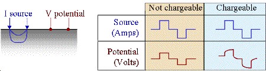
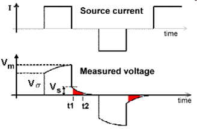
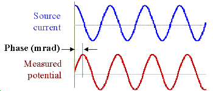
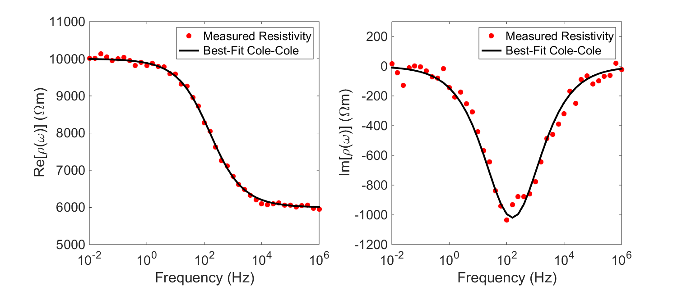

.. _induced_polarization_physical_properties_duplicate:

Chargeability
*************

Chargeability is a physical property related to conductivity. As we learned
previously, ionic charges within a rock's pore water begin to move under the
influence of an electric field, resulting in electrical current. However, some
of the pore ions do not move uninhibited through the rock and begin to
accumulate at impermeable boundaries. This build-up of ionic charges is
commonly referred to as induced polarization (IP), as it is responsible for
generating electric dipole moments within the rock. We use chargeability to
characterize the formation and strength of the induced polarization within a
rock, under the influence of an electric field.

The physical explanation for causes of chargeabilty are complex and not
completely understood. Certainly the effects are dependent upon the
microscopic nature the material and specifically upon the surface to
volume ratio of pore material and the types of fluids in the rock. The
two images below offer some insight into the complexity.

 .. figure:: images/images_duplicates/illite.gif
    :align: center
    :scale: 120 %

    Illite (a clay mineral) with surface area-to-volume ratio of :math:`100m^2/g` (1000 times greater than sandstone)

 .. figure:: images/images_duplicates/quartz.gif
    :align: center
    :scale: 120 %

    Quartz overgrowths in sandstone with surface area-to-volume ratio of :math:`0.1m^2/g`

Despite the complexity are two primary phenomenological mechanisms which are
insightful in characterizing the chargeable
behaviour of rocks: membrane polarization and electrode polarization.

**Membrane Polarization**

Membrane polarization occurs when the pore space narrows to a within several
ion widths.

 .. figure:: images/images_duplicates/memb1.gif
    :align: center
    :scale: 100 %

Because ionic charges cannot be forced through the pore throat, they
accumulate on either side when an electric field is applied; with positive
charges accumulating on one side of the pore throat and negative charges
accumulating on the other. The accumulation of charges eventually stops
because the electric fields from the blocked charges becomes large enough
that it prevents other ions of the same sign from joining the group.

 .. figure:: images/images_duplicates/memb2.gif
    :align: center
    :scale: 100 %

The net separation of positive and negative charges across narrow pore spaces
generates a set of electric dipole moments which is ultimately responsible for
the voltages measured in induced polarization survey.

 .. figure:: images/images_duplicates/memb3.gif
    :align: center
    :scale: 100 %

**Electrode Polarization**

Electrode polarization occurs when the pore space is blocked by metallic
particles. When an electric field is applied, the metallic particles become
electrically charged and attract nearby ions.

 .. figure:: images/images_duplicates/elec_pol_1.gif
    :align: center
    :scale: 100

The attraction of the ions to the surface forms a primary layer of fixed ionic
charges, followed by a secondary diffuse layer of opposing charges. This is
known as an electric double layer.

 .. figure:: images/images_duplicates/elec_pol_3.gif
    :align: center
    :scale: 100

Each electric double layer results in an electric dipole moment which
contributes towards the induced polarization within the rock.

 .. figure:: images/images_duplicates/elec_pol_2.gif
    :align: center
    :scale: 100

Effects of IP on Geophysical Measurements
-----------------------------------------

To demonstrate the effects of induced polarization on geophysical
measurements, consider a specific example where a current generator,
hooked to the ground as in a DC survey, is turned on.
At some location, the electric
potential (:math:`V`) is measured. In non-chargeable rocks, an instantaneous
increase in the measured potential occurs when the source is switched
on. When the source is switched off, the current through the Earth returns
immediately to zero and
so is the measured potential. This is illustrated in the figure below.

If the ground is chargeable, there will also be an instantaneous jump in the
measured potential when the source is switched on; we denote as
:math:`V_\sigma`. However, the subsequent build-up of ionic charges during the
on-time results in a corresponding increase in the measured potential; which
is sometimes referred to as the over-voltage. Eventually, the build-up of
ionic charges reaches saturation, resulting in a final measured potential
(:math:`V_m`). In general, the measured potential after the source is switched
(:math:`V_{on}`) can be expressed as:

.. math::
    V_{on}(t) = V_\sigma + V_s \Big[ 1 - e^{-t/\tau } \Big]

where :math:`V_s` is the amplitude of the over-voltage and :math:`\tau` is a
constant which determines the rate at which the induced polarization forms.

When the source is switched off, there is an instantaneous drop in the
measured potential equal to :math:`V_\sigma`. Subsequently, the accumulated
charges begin to diffuse, resulting in a measured potential which decays
according to:

.. math::
    V_{off}(t) = V_s \, e^{-t/\tau}

This decaying off-time potential is commonly called the discharge curve.
We use the discharge curve to characterize the chargeable properties of the Earth.

Definitions for Chargeability
=============================

It is convenient to consider "chargeabilty" as an independent physical property but
in reality it is an integral component of the electrical conductivity. It describes
how the conductivity changes with frequency. If :math:`\sigma_0` denotes the conductivity
at zero  frequency and if :math:`\sigma_\infty` is the conductivity at infinite frequency
then the chargeability is

.. math::
	\eta = \frac{\sigma_\infty -\sigma_0}{\sigma_\infty}

This is a dimensionless number varying between 0 < :math:`\eta` < 1. It is
often referred to as the intrinsic chargeability.  The above definition
is equivalent to defining the
intrinsic chargeability as the ratio between the amplitude of the over-voltage (:math:`V_s`)
and the DC voltage (:math:`V_m`):

.. math::
	\eta = \frac{V_s}{V_m}

The intrinsic chargeability for materials is rarely provided in tables. Rather, numbers
based upon laboratory measurements of some characteristic of the induced polarization
response is provided. Those measurements can be in time or frequency and the units
of the "chargeability" are inherited from the data. We outline below:

.. ToDo: Integrate the material currently in Induced polarization
.. http://gpg.geosci.xyz/en/physprops/content/induced_polarization/induced_polarization_measurements_data.html
.. so that go through each type of datum and hence the meanings and units for each of the
.. associated chargeabilities.

Two types of time domain data
-----------------------------

1. The following is a definition of chargeability but it is not possible to
   measure it exactly in the field. The figure to the right shows voltage
   measured when the transmitter is first turned on and then turned off some time
   later. Using parameters from this figure, one definition of chargeability is
   :math:`M = V_S / V_P` where :math:`V_S` and :math:`V_P` are the steady state and
   "secondary" potentials, respectively.

    - The leading edge potential :math:`V_{\sigma}` is what would be measured in
      the absence of chargeability. This potential would yield the ground's
      resistivity.

    - The steady state, :math:`V_P` (with a subscript *m* in the figure above),
      often referred to as the primary potential, is the combined effect of
      current flowing in the ground and charges built up under the influence of
      the imposed electric field.

    - The secondary potential is entirely due to the charge imbalance resulting
      from the build-up of charge.

    - Using this form, chargeability :math:`M` will be :math:`0 ≤ M < 1`. If :math:`M =
      0` the measured potential will follow the input current waveform exactly
      with no charging or discharging involved, as shown in the first column of
      the figure above.

2. The most commonly measured form of time domain IP is the normalized area
   under the decay curve. It can be represented by the following equation, using
   parameters specified in the adjacent figure. The decaying potential that
   follows :math:`V_s` is written as :math:`V_s (t)`.

Chargeability, :math:`M`, is essentially the red area under the decay curve,
normalized by the source voltage.

 .. math::
            M = \frac{1}{V_P} \int  \! V_S(t) \, \mathrm{d}t

.. figure:: ../induced_polarization/images/source_and_measured_V.gif
    :align: center
    :scale: 100 %

**Integrated Chargeability**

The integrated chargeability (:math:`M`) characterizes the quantity of potential energy stored within a chargeable rock due to the accumulation of ionic charges.
The integrated chargeability is defined as the area under the discharge curve normalized by the DC voltage (:math:`V_m`):

.. math::
    M = \frac{1}{V_m} \int_{t_1}^{t_2} V_{off}(t) \, dt

Numerical values for the integrated chargeability are typically given in ms.

.. figure:: images/electrode_conductivity_measurements.png
    :align: right
    :scale: 35%

Two types of frequency domain data
----------------------------------

An oscillating source current can be employed to observe chargeability. The
measurements are often still referred to as "DC resistivity" because the
frequencies are relatively low. The resulting data will include (i) a "DC
resistivity" based upon the voltages measured with the lowest source
frequency, and (ii) a chargeability based upon the measurements explained
next. Two methods of measuring chargeability in the frequency domain are
described below.

1. If the amplitude of the potential is measured at two frequencies, a measure
   of chargeability is acquired, and it can be expressed as units of "*percent
   frequency effect*" or PFE. Since the ground has less time to respond at higher
   frequencies, the signal is expected to be smaller at the higher frequency.
   Expressions for PFE are shown in the equations below. The data used in this
   calculation are illustrated in the figure below. Recall that :math:`\rho_a= K
   \mid V \mid / I` , where :math:`K` is the geometric factor based upon
   electrode geometry (see the Geophysical surveys chapter, "DC resistivity"
   section), :math:`V` is the measured potential, and :math:`I` is the source
   current.

.. figure:: ../induced_polarization/images/PFE.gif
    :align: center
    :scale: 100 %

.. math::
        PFE= 100 \left( \frac{\rho_{a1} - \rho_{a2}}{\rho_{a2}}  \right)

Alternatively:

.. math::
        FE = \frac{V(f_1) - V(f_2)}{V(f_2)}

If the voltage version is used, the Frequency Effect (FE) can easily be
converted to a percent frequency effect by multiplying by 100.

2. Data with units of phase are gathered by transmitting a sinusoidal source
   current. Then the phase difference between this source and measured potentials
   is recorded as a measure of chargeability. Units are usually milliradians. The
   following figure illustrates:

Relating the four types of data
-------------------------------

The different IP responses all result from the build up of polarizing charges,
but they do not produce the same numbers. In fact, the units of the various
measurements are different. Nevertheless, the following approximate rule of
thumb allows conversion between the different data sets:

                                        +------------+------------+------------+
                                        | A chargeability of :math:`M = 0.1` is|
                                        +============+============+============+
                                        |               10 PFE                 |
                                        +------------+------------+------------+
                                        |               70 mrad                |
                                        +------------+------------+------------+
                                        |               70 msec                |
                                        +------------+------------+------------+

Chargeability Measurements
==========================

For integrated and intrinsic chargeability measurements, a core sample is taken from the rock.
The core sample is then placed in a sample holder between two copper/graphite electrodes where it acts as an impedence element for a circuit.

**Integrated Chargeability Measurements**

For integrated chargeability measurements, a source is used to drive direct current (:math:`I`) through the rock core.
During the on-time, the voltage (:math:`V_m`) is measured across the sample.
Next, the source is switched off.
During the off-time, the potential across the rock is measured as it decays.
The off-time measurements are used to define the discharge curve for the sample, which is then used to obtain the integrated chargeability according to:

.. math::
	M = \frac{1}{V_m} \int_{t_1}^{t_2} V_{off}(t) \, dt

For practical measurements, we do not integrate over the entire discharge curve.
Instead, a finite interval of integration is chosen.
For example, the Newmont standard chargeability integrates from t = 0.15 s to 1.1 s.

**Intrinsic Chargeability Measurements**

Intrinsic chargeability measurements are very similar to conductivity/resistivity measurements.
In this case, the source is used to drive alternating current (:math:`I`) through the core sample.
By measuring the voltage drop (:math:`\Delta V`) accross the length of the sample, Ohm's law can be used to determine the circuit impedence (:math:`Z`) caused by the rock:

.. math::
    Z(\omega ) = \frac{\Delta V (\omega)}{I (\omega)}

In chargeable rocks, the measured voltage drop depends on the frequency of the alternating current.
So in order to characterize the resistive properties of the rock, we need to determine the impedence over a spectrum of frequencies.

The resistivity of the sample at each frequency can be obtained from the impedence, the length of the core (:math:`L`) and its cross-sectional area (:math:`A`) using Pouillet's law:

.. math::
    \rho (\omega) = \frac{Z(\omega) A}{L}

In order to characterize the rock's chargeable properties, we fit the experimentally acquired resistivity values to a mathematical model (illstrated below).
A well-established model for explaining the resistivities of chargeable rocks is the Cole-Cole model:

.. math::
    \rho (\omega) = \rho_0 \Bigg [ 1 - \eta \Bigg ( 1 - \frac{1}{1 + (i\omega\tau )^C} \Bigg ) \Bigg ]

where :math:`\rho_0` is the DC resistivity and :math:`\eta` is the intrinsic chargeability.
Parameters :math:`\tau` and :math:`C` define the rate at which ionic charges accumulate when an electric field is applied.

Assuming :math:`C=1`, :math:`\tau` defines the exponential decay in voltage during the off-time measurements (see earlier).
The conductivity of the rock can be obtained by taking the reciprocal of the complex resistivity:

.. math::
    \sigma (\omega) = \frac{1}{\rho (\omega)}

Additionally, Ohm's law still applies for chargeable rocks.
Thus:

.. math::
    \vec J (\omega) = \sigma (\omega) \vec E (\omega)

Chargeabilities of Common Rocks
===============================

Tables (from Telford et al, 1976) provide a very general guide to the
integrated chargeabilities of materials. Because different intervals of
integration :math:`[t_1,t_2]` are used for each table, chargeability values
cannot be compared between tables. However, we can infer several things from
these tables:

- The individual properties of rocks results in a variation in chargeability (click :ref:`here<table_chargeability_rocks>` for table).
- Chargeability increases as the % abundance of sulphide minerals increases (click :ref:`here<table_chargeability_sulphide>` for table).
- Highly porous rocks such as extrusive volcanics and sandstones are more chargeable than hard rocks such as granites and limestones (click :ref:`here<table_chargeability_sulphide>` for table).
- The type of ore-mineralization impacts the chargeability of rocks to varying degrees (click :ref:`here<table_chargeability_minerals>` for table).

Factors Impacting Chargeability
===============================

**Sulphide Mineralization:**

As we discussed earlier, electrode polarization occurs when the pore path is blocked by metallic particles.
A major source of these metallic particles is sulphide mineralization.
As the abundance of sulphide minerals within a rock increases, so does the electrode polarization.
Therefore, highly mineralized rock tend to be very chargeable.

**Clays:**

 .. figure:: images/images_duplicates/memb_pol_2nd_type.gif
    :align: right
    :scale: 100

Clays have a tendancy to partially block the path which ions take through the rock's pore water.
Upon application of an electric potential, positive charge carriers pass easily, while negative carriers accumulate.
This results in an "ion-selective" membrane polarization.
Clays represent a dominant source of induced polarization in unmineralized sedimentary rocks.

A surplus of both cations and anions occurs at one end of the membrane, while a deficiency occurs at the other end.
The reduction of mobility is most obvious at frequencies slower than the diffusion time of ions between adjacent membrane zones; i.e. slower than around 0.1 Hz. Conductivity increases at higher frequencies.

**Pore-Water Salinity:**

The induced polarization within a rock depends on having a mechanism for accumulating ionic charges.
It also depends on the salinity of the pore water; i.e. the concentration of ions within the pore water.
As the pore-water salinity increases, so does the capacity of the rock to support a build-up of ionic charges.
This results in an increases chargeability for the rock.

**Tortuosity:**

Tortuosity defines the connectivity and complexity of a rock's pore-space network.
As the tortuosity of the rock's pore-space increases, it becomes more difficult for ionic charges to move through the rock.
As a result, and increases abundance of ionic charges will accumulate within the rock when it is subjected to an electric field.
Thus, the chargeability of a rock increases and its tortuosity increases.

.. xxxxxxxxxxxxxxxxxxxxxxxxxxxxxxxxxxxxxxxxxxxxxxxxxxxxxxxxxxx

.. Introduction
.. ============

.. Chargeability is a physical property that is related to resistivity. The
.. module about DC resistivity shows that potentials measured in a DC resistivity
.. survey can be related to charges that accumulate when current is made to flow.
.. However, when the transmitter current is switched off, the measured voltage
.. may take up to several seconds to reach zero. Similarly, when the current is
.. switched on, there may be a finite time taken for the voltage to reach a
.. steady state value. In other words, current injected into the ground causes
.. some materials to become polarized. The phenomenon is called induced
.. polarization, and the physical property that is measured is usually called
.. chargeability, which quantifies the material's capacity to retain charges
.. after a forcing current is removed. The following figure illustrates the
.. measurable effect.

..  .. figure:: images/images_duplicates/IP_source.gif
..     :align: center
..     :scale: 100 %

.. Induced polarization can also be measured using low frequency sinusoidal
.. signals, as discussed in the `induced polarization measurements data`_ section
.. of this chapter. The signals or data that are measured depend upon which of
.. the various types of source signals are used. Note that IP surveys always
.. include resistivity measurements because the electrical resistivity of teh
.. earth must be known in order to invert data to recover chargeability.

.. What can be detected?
.. =====================

.. The materials that are most chargeable include sulfide minerals (both massive
.. and disseminated), clay-rich materials, and graphite. However, the
.. chargeablility of materials can have a wide range within the same geographic
.. region. This is because chargeability depends upon many factors, including
.. mineral type, grain size, the ratio of internal surface area to volume, the
.. properties of electrolytes in pore space, and the physics of interaction
.. between surfaces and fluids.

.. Interpretation of chargeabililty models is further complicated by the fact
.. that there is no standard set of units for this physical property. There are
.. at least three ways of measuring the phenomenon and models recovered by
.. inversion generally take on the same units as the measurement. This could be
.. milli-seconds if measurements are made of the ground's response to impulsive
.. sources. The units could also be percent if the response at two or more source
.. signal frequencies is compared, or units of milliradians may be used if the
.. phase difference between source and received signals is recorded.

.. Physical Phenomenons
.. ====================

.. .. _induced polarization measurements data: http://gpg.geosci.xyz/en/latest/content/induced_polarization/induced_polarization_measurements_data.html

.. The chargeability of earth materials is essentially an electrochemical effect
.. caused by many factors, not all of which are completely understood. If ground
.. is chargeable, it responds as if resistivity was a complex quantity - it
.. behaves somewhat like a leaky capacitor. Therefore the chargeability can be
.. measured in a number of ways using time domain or frequency domain techniques
.. (detailed in the section `induced polarization measurements data`_). Aspects
.. affecting the chargeability of a sample include:

..  - the grain size of particles in the sample;
..  - the type and mobility of ions within the pore fluids;
..  - the details of microscopic interactions between solid surfaces and fluids;
..  - the amount of surface area within a specific volume.

.. The surface area-to-volume ratio is an important factor. Clays tend to be
.. chargeable while sandstones are not, and the images here illustrate one reason
.. why this is true. In addition, the surface interactions between clay minerals
.. and fluids enhance the ability of these materials to hold charges.

..  .. figure:: images/images_duplicates/illite.gif
..     :align: center
..     :scale: 120 %

..     Illite (a clay mineral) with surface area-to-volume ratio of :math:`100m^2/g` (1000 times greater than sandstone)

..  .. figure:: images/images_duplicates/quartz.gif
..     :align: center
..     :scale: 120 %

..     Quartz overgrowths in sandstone with surface area-to-volume ratio of :math:`0.1m^2/g`

.. Two microscopic effects cause macroscopic chargeability
.. -------------------------------------------------------

.. There are two primary causes of chargeability. In both cases the re-
.. distribution of charges takes some time to occur when an external DC electric
.. field is applied. Equivalently, it takes the same time to revert to a balanced
.. charge distribution once the electric field is removed. "Charging" is hard to
.. measure in practice. "Discharging" is measured using time domain IP survey
.. techniques. The effect of finite charging time on sinusoidal signals at
.. different frequencies also can be measured using frequency domain or phase IP
.. surveys. The two types of polarization are called "membrane polarization" and
.. "electrode polarization."

.. Membrane polarization
.. ^^^^^^^^^^^^^^^^^^^^^

.. Membrane polarization occurs when pore space narrows to within several
.. boundary layer thicknesses (which is the thickness of ions adsorbed to a
.. surface).

..  .. figure:: images/images_duplicates/memb1.gif
..     :align: center
..     :scale: 100 %

.. Charges cannot flow easily, so they accumulate when an electric field is applied.

..  .. figure:: images/images_duplicates/memb2.gif
..     :figclass: center
..     :align: center
..     :scale: 100 %

.. The result is a net charge dipole which adds to any other voltages measured at
.. the surface.

..  .. figure:: images/images_duplicates/memb3.gif
..     :align: center
..     :scale: 100 %

.. A second form of membrane polarization is similar to the first:

..  .. figure:: images/images_duplicates/memb_pol_2nd_type.gif
..     :align: right
..     :scale: 100

.. This occurs where clay particles partially block ionic solution paths, as in
.. the adjacent figure. Upon application of an electric potential, positive
.. charge carriers pass easily, while negative carriers accumulate. There is an
.. "ion-selective membrane."

.. A surplus of both cations and anions occurs at one end of the membrane, while
.. a deficiency occurs at the other end. The reduction of mobility is most
.. obvious at frequencies slower than the diffusion time of ions between adjacent
.. membrane zones; i.e. slower than around 0.1 Hz. Conductivity increases at
.. higher frequencies.

.. Electrode polarization
.. ^^^^^^^^^^^^^^^^^^^^^^

.. Electrode polarization occurs when pore space is blocked by metallic
.. particles. Again, charges accumulate when an electric field is applied.

..  .. figure:: images/images_duplicates/elec_pol_1.gif
..     :align: center
..     :scale: 100

.. The result is two electrical double layers which add to voltages measured at
.. the surface.

..  .. figure:: images/images_duplicates/elec_pol_2.gif
..     :align: center
..     :scale: 100

.. Comments on electrode polarization
.. ^^^^^^^^^^^^^^^^^^^^^^^^^^^^^^^^^^

..  .. figure:: images/images_duplicates/elec_pol_3.gif
..     :align: right
..     :scale: 100

.. Some remarks are appropriate here in order to provide some sense of the
.. complexity of the chargeability phenomenon.

.. At an interface between ionic and metallic conduction (for example, an ore
.. grain in pore water), there is an impedance involved in getting current to
.. flow across the barrier. These interfaces look like the top figure and have
.. the simplified circuit analogue shown in the bottom figure.

..  .. figure:: images/images_duplicates/elec_pol_4.gif
..     :align: right
..     :scale: 100 %

.. Current can flow via charge transfer (or ion diffusion), which involves
.. electrochemical processes, or via a capacitive effect (no charge transfer),
.. involving diffusion currents.

.. Ion diffusion is not easy to model with circuit elements. The process is
.. called the Warburg impedance. Its magnitude varies as approximately
.. 1/frequency.

.. Note that, while it is useful to understand simplified models of the relevant
.. electrical behaviour of surface-electrolyte interactions, all rocks are, in
.. fact, "dirty" in the sense that they are not simply pure "electrodes"
.. (semiconducting mineral grains) and electrolytes (pore solutions).  There are
.. other materials and particles affecting ionic behaviour within and outside the
.. diffuse layer, and some of the sample's constituents will affect the behaviour
.. of the fixed layer near and on the liquid-solid interfaces.

.. Summary of what affects the chargeability of material
.. ^^^^^^^^^^^^^^^^^^^^^^^^^^^^^^^^^^^^^^^^^^^^^^^^^^^^^

..     - Induced polarization is greater when there are larger regions of adsorbed anomalous charge (adjacent to an interface); i.e. when there is a large surface area-to-volume ratio.
..     - Non-ionic fluids (such as contaminants) can markedly change the behaviour of surface-electrolyte interactions.
..     - Changes in ion concentration (such as increased salinity) will also affect both types of polarization.
..     - Both effects (membrane and electrode polarization) are related to grain size as much as material type. Therefore, discrimination of mineral type on the basis of chargeability alone is not recommended.

.. Spectral Induced Polarization
.. =============================

..  .. figure:: images/images_duplicates/spectral_ip.gif
..     :align: right
..     :scale: 100 %

.. The Cole-Cole model for complex impedance is often used for modeling the
.. ground's impedance. The Cole-Cole model is written as:

..  .. math::
..         \rho (\omega) = \rho_0 \left[1-m \left( 1- \frac{1}{1+(j \omega \tau)^c}\right) \right]

.. This relation describes a complex impedance as a function of frequency,
.. :math:`\omega` with three parameters. :math:`m` is intrinsic chargeability,
.. :math:`\tau` is a time constant (of the decay curve), and :math:`c` is a
.. parameter controlling the frequency dependence.

.. Typical chargeabilities for materials
.. =====================================

.. The following tables (from Telford et al, 1976) provides a very general guide
.. to possible chargeabilities of materials. One reason that in-situ
.. chargeabilities tend to appear lower than laboratory values is that large
.. volumes of mixed materials are involved in field measurements.

.. These examples show that a wide range of variability can be expected, implying
.. that it is difficult to use values of intrinsic chargeability (in models
.. obtained by inversion of IP data) to determine exactly what type of rock or
.. material is in the ground. However, this is an ongoing topic of research.

.. **Table 1:** Charging and integration times were about 1 minute each, which is
.. much longer than field survey systems; therefore, values are larger than
.. field measurements.

.. +-----------------------+--------------------------+
.. |  **Material type**    | **Chargeability (msec)** |
.. +=======================+==========================+
.. | 20% sulfides          | 2000-3000                |
.. +-----------------------+--------------------------+
.. | 8-20% sulfides        | 1000-2000                |
.. +-----------------------+--------------------------+
.. | 2-8% sulfides         | 500-1000                 |
.. +-----------------------+--------------------------+
.. | volcanic tuffs        | 300-800                  |
.. +-----------------------+--------------------------+
.. | sandstone, siltstone  | 100-500                  |
.. +-----------------------+--------------------------+
.. | dense volcanic rocks  | 100-500                  |
.. +-----------------------+--------------------------+
.. | shale                 | 50-100                   |
.. +-----------------------+--------------------------+
.. | granite, granodiorite | 10-50                    |
.. +-----------------------+--------------------------+
.. | limestone, dolomite   | 10-20                    |
.. +-----------------------+--------------------------+

.. **Table 2:** The values below involved more realistic charging and integration
.. times of 3 seconds and 0.02-1.0 seconds respectively.

.. +-----------------------+--------------------------+
.. |  **Material type**    | **Chargeability (msec)** |
.. +=======================+==========================+
.. | ground water          | 0                        |
.. +-----------------------+--------------------------+
.. | alluvium              | 1-4                      |
.. +-----------------------+--------------------------+
.. | gravels               | 3-9                      |
.. +-----------------------+--------------------------+
.. | precambrian volcanics | 8-20                     |
.. +-----------------------+--------------------------+
.. | precambrian gneisses  | 6-30                     |
.. +-----------------------+--------------------------+
.. | schists               | 5-20                     |
.. +-----------------------+--------------------------+
.. | sandstones            | 3-12                     |
.. +-----------------------+--------------------------+
.. | argilites             | 3-10                     |
.. +-----------------------+--------------------------+
.. | quartzites            | 5-12                     |
.. +-----------------------+--------------------------+

.. **Table 3:** Chargeability of minerals at 1% concentration in the samples (charging and integration times as per Table 2 above)

.. +-----------------------+--------------------------+
.. |  **Material type**    | **Chargeability (msec)** |
.. +=======================+==========================+
.. | pyrite                | 13.4                     |
.. +-----------------------+--------------------------+
.. | chalcocite            | 13.2                     |
.. +-----------------------+--------------------------+
.. | copper                | 12.3                     |
.. +-----------------------+--------------------------+
.. | graphite              | 11.2                     |
.. +-----------------------+--------------------------+
.. | chalcopyrite          | 9.4                      |
.. +-----------------------+--------------------------+
.. | bornite               | 6.3                      |
.. +-----------------------+--------------------------+
.. | galena                | 3.7                      |
.. +-----------------------+--------------------------+
.. | magnetite             | 2.2                      |
.. +-----------------------+--------------------------+
.. | malachite             | 0.2                      |
.. +-----------------------+--------------------------+
.. | hematite              | 0.0                      |
.. +-----------------------+--------------------------+

.. Typical problems where chargeability is useful
.. ==============================================

.. Mineral exploration for sulfides (disseminated and massive) is unquestionably
.. the most common application of IP because those types of ore minerals are
.. often chargeable.There are also applications in hydrogeology. For example,
.. mapping salt water intrusions in aquifers that include clayey layers may be
.. difficult using resistivity alone. However, the increased chargeability
.. associated with clay may help differentiate between zones with more saline
.. water and clay, both of which have low resistivity. In addition, there is a
.. growing interest in the possibility of using chargeability to aid in the
.. detection and delineation of contaminants in the ground. There has also been
.. some effort to apply IP to oil and gas exploration.

