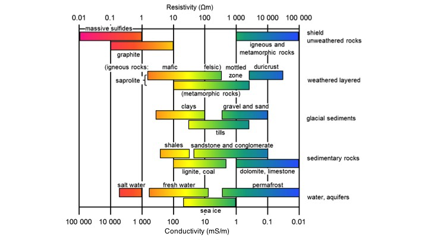

.. _physical_properties_conductivity:

Electrical conductivity
=======================

.. figure:: ../DC_resistivity/images/cube.gif
	:align: right
	:scale: 100 %

Electrical conductivity (or resistivity) is a bulk property of material describing how well that material allows electric currents to flow through it. Consider current flowing through the unit cube of material shown to the right: 

**Conductivity**, \\(\\sigma\\), is the inverse of resistivity: \\(\\sigma = 1/\\rho\\). Conductivity is given in units of Siemens per meter, or S/m. Millisiemens per meter (mS/m) are often used; 1000 mS/m = 1 S/m. So 1 mS/m = 1000 Ohm-m.

The electrical conductivity of Earth's materials varies over many orders of magnitude. It depends upon many factors, including: rock type, porosity, connectivity of pores, nature of the fluid, and metallic content of the solid matrix. An indication of the range of conductivity for rocks and minerals is in the following figure:

Soils and rocks are composed mostly of silicate minerals, which are essentially insulators. Exceptions include magnetite, specular hematite, carbon, graphite, pyrite, and pyrrhotite. Therefore conduction is largely electrolytic, so conductivity depends mainly upon:

	- porosity;
	- hydraulic permeability, which describes how pores are interconnected;
	- moisture content;
	- concentration of dissolved electrolytes;
	- temperature and phase of pore fluid;
	- amount and composition of colloids (clay content).

Detailed discussion of geologic factors affecting this important physical property are provided in a separate location.

	