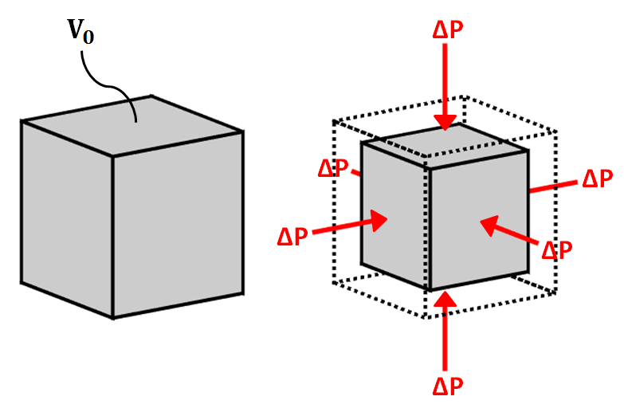
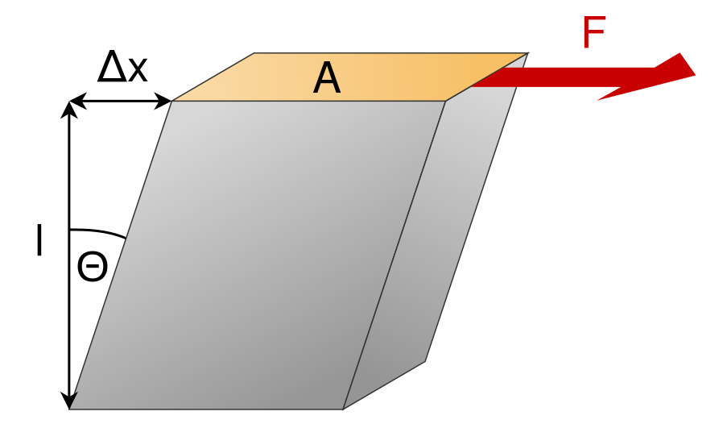
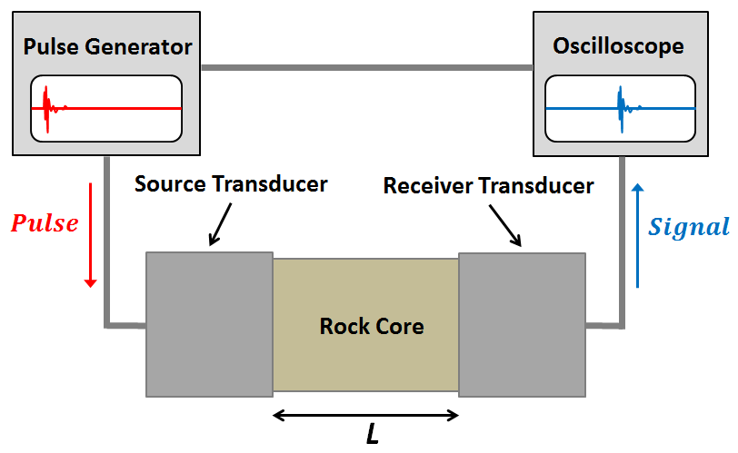

.. _seismic_velocity_duplicate:

Seismic Velocity
****************

Elastic energy propagates through the earth in different ways and at different speeds.
The main wave types are body waves (P and S waves) and surface waves (Rayleigh and Love waves).
Whereas body waves travel through a medium, surface waves travel along surfaces and interfaces.
Each wave has a distinct particle motion and speed of propagation.
The speed of propagation depends upon the bulk modulus, shear modulus and :ref:`density<physical_properties_density>` of the medium.
Density has been discussed already and will not be presented again here.

.. End Devin material

If we strike the earth with a hammer, an explosive charge, or an earthquake,
the material of the earth near the source becomes compressed (or extended) and
twisted. These deformations propagate away from the source. The speed of propagation and the type of motion propagated depends upon the physical properties of the material. Most earth materials under normal seismic conditions can be described by density and two elastic parameters:

1. density: :math:`\rho`
2. bulk modulus:  :math:`K` (compressibility)
3. shear modulus:  :math:`\mu` (twistability)

By knowing the time at which the source was excited and measuring the time needed for the excitation to travel from the source to an array of receivers, it is possible to obtain information about the structure and physical properties of the subsurface.

The propagation of seismic waves in the earth is governed by the theory of linear elasticity. A detailed mathematical treatment of elasticity is beyond the scope of this course. In this page we will give a very brief introduction to the concepts of stress and strain, how they relate to elasticity, and how density and the elastic properties of a material relate to the propagation of seismic waves. We will then describe how seismic waves can be approximated using a simple ray model. The remainder of our study of seismic surveying in this course will then be conducted using the ray model.

Stress
======

.. sidebar:: Compressive and Tensile Stress

	.. figure:: images/compressive.png
		:align: center

		Compressive normal stress

	.. figure:: images/tensile.png
		:align: center

		Tensile normal stress

	.. figure:: images/Elastic_shear_modulus-subwiki.png
		:align: center

		Shear stress. `Image <http://www.subsurfwiki.org/wiki/File:Elastic_shear_modulus.png>`__ from `Subsurface Wiki`_, licensed under `CC BY 3.0`_.

Stress is defined as the external force applied to a body divided by the cross-sectional area of the body over which the force is applied. Stress is a measure of these internal forces. It has units of "force per unit area"--N/m :math:`^2` in SI units. There are two main types of stress, normal and shear. As you would expect normal stress is applied in a direction normal to the surface it is applied on. Normal stresses can be further divided into compressive and tensile stresses. Shear stress is applied parallel to a surface. Compressive, tensile and shear stress are illustrated in the figure to the right.

Strain
======

If a body is stressed it will undergo a change in size and shape. The body is said to be
**strained**. To be a bit more precise, strain is a dimensionless quantity describing the fractional change in the relative positions between points on a body. If strains are small the body will recover its original
shape when the stress is removed. This is **elastic strain**. If the strain is
too great so that the **yield strength** is exceeded, then the body deforms
**plastically** and may ultimately fracture. Plastic strain is not
recoverable.

The figure below plots how strain (horizontal axis) accumulates as stress (vertical
axis) is applied. While behaviour is elastic, increasing or decreasing the
stress does nothing to permanently change the material. Once stress is sufficient to make
material behave plastically, reducing the stress results in reduced strain
along a different path on the graph. Once the fracture point is reached, the
strain is released by breaking.

.. figure :: ./images/stressstrain.png
	:align: center
	:scale: 80 %

Elastic Moduli
==============

In the elastic regime it is often acceptable to assume a linear relationship between stress and strain. This linear relationship is known as Hooke's Law. In addition to linear elasticity, basic seismic techniques also assume that earth materials are isotropic, meaning that their response to stress is invariant with respect to the direction from which the stress is applied. The relationship between stress and strain in a linear isotropic material can be described by two numbers, which are intrinsic properties of the material. Linear elasticity can be mathematically formalized in multiple ways and the different formulations lead to different definitons of these material parameters. They may be known as Lamé parameters or as the bulk and shear moduli. Different definitions of the elastic moduli may be more useful than others in different situations or the reason for choosing one representation over another may be purely a matter of convention. Please see `here <https://en.wikipedia.org/wiki/Lam%C3%A9_parameters>`__ for a table showing the relationship between various representations of isotropic elastic parameters in a convenient representation. In this course we are concerned with how the elastic moduli are related to the velocity of seismic waves in the earth and how they may be related to other material properties of interest such as porosity and permeability. Some important elastic moduli are described below.

Bulk Modulus
------------

Consider an initial volume :math:`V` which is subjected to a hydrostatic
pressure (force per unit area is the same in each direction) :math:`P`. This pressure is a volumetric stress. Let :math:`\Delta
V` be the change in volume resulting from this stress. The volumetric strain is :math:`\Delta V/V`. The **bulk modulus** is defined to be the volumetric stress divided by the volumetric strain:

.. math::
	K = \frac{P}{\Delta V/V}.

.. figure:: ./images/bulk_modulus-subwiki.png
		:align: center
		:scale: 60%

                Bulk modulus. `Image <http://subsurfwiki.org/wiki/File:Elastic_bulk_modulus.png>`__ from `Subsurface Wiki`_, licensed under `CC BY 3.0`_.

Shear Modulus
-------------

Consider a force :math:`F`, applied parallel to the top of a cube, with the force distributed evenly over the surface, as shown in the figure below. The force per unit area is known as the shear stress :math:`\tau`. Application of shear stresses to the top and bottom interfaces produce a strain proportional
to the angle :math:`\tan \theta` in the image below. The **shear modulus** is defined as

.. math::
	\mu = \frac{\tau}{\tan\theta}

.. figure:: images/Elastic_shear_modulus-subwiki.png
		:align: center
		:scale: 60%

		Shear stress. `Image <http://www.subsurfwiki.org/wiki/File:Elastic_shear_modulus.png>`__ from `Subsurface Wiki`_, licensed under `CC BY 3.0`_.

As discussed above, the linear elastic isotropic stress-strain relationship of a material may be fully described by the bulk and shear moduli of the material. Another important alternative pair of parameters that define the elastic behaviour of a material are Young's modulus and Poisson's ratio.

Young's Modulus
---------------

Young's modulus is defined to be the ratio of longitudinal normal stress to longitudinal normal strain. Consider the rectangular prism shown below with square cross-sectional area :math:`A = W^2` and length :math:`L`. A force :math:`F` applied normal to the axis of the prism, distributed over the cross-sectional area, will generate a normal stress of :math:`P = F/A`. If this stress generates a reduction in length of the prism of :math:`\Delta L`, the Young's modulus of the prism material is

.. math::
	E = \frac{P}{\Delta L/L}

.. figure:: ./images/Poisson-ratio-subwiki.png
		:align: center
		:scale: 60%

		Young's modulus. `Image <http://www.subsurfwiki.org/wiki/File:Elastic_Poisson_ratio.png>`__ from `Subsurface Wiki`_, licensed under `CC BY 3.0`_.

Poisson's Ratio
---------------

As a result of the longitudinal stress described above the cross-sectional area of the prism may be increased, compensating for the reduction in length. Let us define the cross-sectional strain as :math:`\Delta W / W`. **Poisson's ratio** is the ratio of transverse strain to longitudinal strain due to a longitudinal stress:

.. math::
	\sigma = \frac{\Delta W / W}{\Delta L/L}

Note that it is possible for :math:`\sigma` to be zero. The decrease in length could be compensated for by decrease in pore space for example. Cork is an example of such a material.

.. Start Devin material

Material Elastic Properties
===========================

**Bulk Modulus**

The bulk modulus (:math:`K`) defines the resistance of a material to elastic compression.
As a result, it is sometimes referred to as the modulus of incompressibility.
When a block of material is subjected to compressional forces, its volume decreases and it becomes more dense (see figure).
Once the compressional force is removed, the block of material returns to its original size if the deformation is elastic.
The bulk modulus characterizes the compressional deformation as follows:

.. math::
    K = - V_0 \frac{\Delta V}{\Delta P}

where :math:`V_0` is the original volume of material, :math:`\Delta P` represents the pressure being applied to the material and :math:`\Delta V` is the resulting change in volume.

**Shear Modulus**

The shear modulus (:math:`\mu`) defines how resistant a material is to shear stress.
As a result, it is sometimes referred to as the modulus of rigidity.
When a block of material is subjected to a shear stress, it experiences a shear strain (see figure).
The shear modulus defines the ratio of shear stress to shear strain:

.. math::
    \mu = \frac{Stress}{Strain} = \frac{F}{\Delta x l A}

where the shear stress is represented by a force (:math:`F`) per unit area (:math:`A`).
Shear strain represents a tangent angle between the shear deformation (:math:`\Delta x`) of the material along the direction of force and the perpendicular demension (:math:`l`) of the block of material.

Body Waves
==========

In seismology, there are two fundamental types of body waves: pressure waves ("P-waves") and shear-waves ("S-waves").

**P-waves**

.. image:: images/Pwave.gif
    :scale: 40%
    :align: right

P-waves are compressional waves in which particle motion is in the direction of the wave propagation.
The compression and extension of the medium, and the propagation of the wave, can be seen in the diagram on the right [#f1]_.
As we can see, cells change volume when they come in contact with the wave.
The P-wave velocity is related to the elastic properties of the medium by the following expression:

.. math::
    v_p = \sqrt{\frac{K+4/3\mu}{\rho}}

where :math:`K` is the bulk modulus, :math:`\mu` is the shear modulus and :math:`\rho` is the density.

**S-waves**

.. image:: images/Swave.gif
    :scale: 40%
    :align: right

S-waves are shear waves in which the particle motion is perpendicular to the direction of wave propagation.
The shearing action and the propagation of the wave can be seen in the diagram on the right [#f1]_.
Cells change shape but do not change volume when they come in contact with the wave.
When there is a reference interface, such as the surface of the earth, S-waves are labelled as SH (horizontal shear) and/or SV (vertical shear).
This is used to indicate the direction of particle motion with respect to the surface.
In isotropic media, SH and SV waves travel at the same speed.
The S-wave velocity can be related to the elastic properties of the medium by the following expression:

.. math::
    v_s = \sqrt{\frac{\mu}{\rho}}

S waves propagate through materials more slowly than P waves.
In addition, S waves cannot propagate through fluids, as fluids do support shear particle motion.

Surface Waves
=============

In seismology, there are two fundamental types of surface waver: Rayleigh waves and Love waves.

**Rayleigh waves**

.. image:: images/Rayleighwave.gif
    :scale: 40%
    :align: right

Rayleigh waves are surface waves in which particle motion is elliptic.
The particle motion which defines Rayleigh waves can be seen in the diagram on the right [#f1]_.
In Rayleigh waves, elliptic particle motion can be prograde (in the same direction as the propagating wave) or retrograde (in the opposite direction as the propagating wave).
The amplitude of the elliptic motion decreases with depth.
As a general rule, Rayleigh waves at the surface of the Earth have a propagation speed which is 90 % the speed of shear waves, thus:

.. math::
    v_R = 0.9 \, v_s

**Love waves**

.. image:: images/Lovewave.gif
    :scale: 40%
    :align: right

Love waves are surface waves in which particle motion is parallel to the Earth's surface and perpendicular to the direction of wave propagation.
The particle motion which defines Love waves can be seen in the diagram on the right [#f1]_.
The amplitude of lateral motion which describes Love waves decreases with depth.
Love waves travel faster than Rayleigh waves but do not travel as fast as P or S waves.
Thus Love waves have a propagation speed of:

.. math::
    0.9 \, v_s < v_L < v_s

Symbols used to define P-wave and S-wave velocities, as well as the elastic properties on which they depend, are summarized in the following table:

+----------------------------------------------+--------------+----------------------------------------+
| Property                                     | Symbol       | Units                                  |
+==============================================+==============+========================================+
| P-Wave Velocity                              | :math:`v_p`  | m/s or km/s                            |
+----------------------------------------------+--------------+----------------------------------------+
| S-Wave Velocity                              | :math:`v_s`  | m/s or km/s                            |
+----------------------------------------------+--------------+----------------------------------------+
| Bulk Modulus(Incompressibility)              | :math:`K`    | Pa or GPa                              |
+----------------------------------------------+--------------+----------------------------------------+
| Shear Modulus (Rigidity)                     | :math:`\mu`  | Pa or GPa                              |
+----------------------------------------------+--------------+----------------------------------------+
| Density                                      | :math:`\rho` | kg/m :math:`\!^3` or g/cm :math:`\!^3` |
+----------------------------------------------+--------------+----------------------------------------+

P-Wave and S-Wave Velocity Measurements
=======================================

**Ultrasonic Elastic Wave Velocity Measurements**

To measure the P-wave and S-wave velocities for a given rock, a core sample is taken.
The core sample is then held in place between two piezometric transducers.
Piezometric transducers contain materials which contract and expand in response to an applied voltage.

The measurement apparatus works by generating a short current pulse.
As a result of the incoming current pulse, materials within the source transducer undergo elastic deformation.
This elastic deformation is then transferred to the rock core where it propagates as elastic waves.
On the other side of the rock, a receiver transducer registers the elastic waves and transforms the corresponding energy back into a current signal.
This current signal is then measured by an oscilloscope.

Using the oscilloscope, we can determine the amount of time (:math:`\Delta t`) it took for the elastic waves to propagate through the rock core.
Given that we know the length of the rock core (:math:`L`), the seismic velocity is given by:

.. math::
    V = \frac{L}{\Delta t}

In practice, the user may control whether they are measuring P-wave or S-wave velocities by specifying the direction of elastic deformation within the source transducer.
Elastic deformation parallel to the length of the core results in P-wave velocity measurements, whereas elastic deformation perpendicular to the length of the core results in S-wave velocity measurements.

P-Wave and S-Wave Velocities in Common Rocks
============================================

P-waves and S-waves travel at different speeds depending on the media they are propagating through; P-waves travel faster than S-waves.
P-waves are able to propagate through solids and fluids, however, S-waves can only propagate through solid materials.
Given that there are so many factors which impact the velocity of seismic waves, it is impossible to assign a single value to a particular rock type.
Therefore, the seismic velocities of rocks are generally defined over a range.
The range of P-wave and S-wave velocities for common materials are shown below:

+---------------------------------+--------------+--------------+
|      **Material**               | P-wave (m/s) | S-wave (m/s) |
+=================================+==============+==============+
| Air                             |  343         | N/A          |
+---------------------------------+--------------+--------------+
| Water                           | 1450 - 1500  | N/A          |
+---------------------------------+--------------+--------------+
| Ice                             | 3400 - 3800  | 1700 - 1900  |
+---------------------------------+--------------+--------------+
| Oil                             | 1200 - 1250  | N/A          |
+---------------------------------+--------------+--------------+
| Vegetal Soil                    |  300 - 700   |  100 - 300   |
+---------------------------------+--------------+--------------+
| Dry Sands                       |  400 - 1200  |  100 - 500   |
+---------------------------------+--------------+--------------+
| Wet Sands                       | 1500 - 2000  | 400 - 600    |
+---------------------------------+--------------+--------------+
| Saturated Shales and Clays      | 1100 - 2500  | 200 - 800    |
+---------------------------------+--------------+--------------+
| Porous and Saturated Sandstones | 2000 - 3500  | 800 - 1800   |
+---------------------------------+--------------+--------------+
| Marls                           | 2000 - 3000  | 750 - 1500   |
+---------------------------------+--------------+--------------+
| Chalk                           | 2300 - 2600  | 1100 - 1300  |
+---------------------------------+--------------+--------------+
| Coal                            | 2200 - 2700  | 1000 - 1400  |
+---------------------------------+--------------+--------------+
| Salt                            | 4500 - 5500  | 2500 - 3100  |
+---------------------------------+--------------+--------------+
| Anhydrites                      | 4000 - 5500  | 2200 - 3100  |
+---------------------------------+--------------+--------------+
| Limestones                      | 3500 - 6000  | 2000 - 3300  |
+---------------------------------+--------------+--------------+
| Dolomites                       | 3500 - 6500  | 1900 - 3600  |
+---------------------------------+--------------+--------------+
| Granite                         | 4500 - 6000  | 2500 - 3300  |
+---------------------------------+--------------+--------------+
| Basalt                          | 5000 - 6000  | 2800 - 2400  |
+---------------------------------+--------------+--------------+
| Gneiss                          | 4400 - 5200  | 2700 - 3200  |
+---------------------------------+--------------+--------------+

Factors Impacting the Seismic Velocity
======================================

Given that P-wave and S-wave velocities both depend on the shear modulus and density of the material, many of the factors which impact the P-wave velocity will affect the S-wave velocity in a similar manner.
Below are some of the factors which are known to affect the seismic velocities in materials.

**Mineralogy and Structure**

The mineralogy and structure of a rock determines its bulk modulus, shear modulus and density; which define the P-wave and S-wave velocities.
In general, igneous, metamorphic, carbonate and anhydrite rocks have relatively large seismic velocities compared to soils and most sedimentary rocks.
This is because the aforementioned rocks only deform under extreme compressional and shear stresses, and are therefore characterized by larger bulk and shear moduli.
In sandstones and soils, clays have a tendency to present in load-bearing positions.
As a result, seismic velocities are heavily influenced by clay content.
Even in small abundances, clays have been shown to significantly reduce the seismic velocity by reducing the shear modulus.

**Porosity**

The most significant factor affecting seismic wave velocities is porosity.
In the above table, we saw that seismic waves travel faster in solids than they do in fluids; with S-waves being unable to propagate through fluids.
Thus as the porosity of a rock increases, both the P-wave and S-wave velocities will decrease.
This is because seismic wave propagation becomes less efficient when forced through a fluid.
Although it will not be explained here, the pore structure also plays an important role in reducing the efficiency of seismic wave propagation within rocks.

**Pore Fluid and Saturation**

Pore fluid determines the elastic properties of the pore space.
Since P-wave velocity is larger in water and oil than it is in air, the P-wave velocity of a rock is less impacted by porosity if the pore-space is saturated.
Additionally, the S-wave velocity has been shown to depend on the density of the pore fluid.
As a result, P-wave and S-wave velocities increase as pore saturation increases.
This can be described in a rudimentary manner using Wyllie's equation:

.. math::
    V_{bulk} = \Bigg [ \frac{\phi}{V_{fluid}} + \frac{1-\phi}{V_{matrix}} \Bigg ]^{-1}

where :math:`0 \leq \phi \leq 1` is the fractional \% fluid saturation, :math:`V_{fluid}` is the seismic velocity of the fluid, :math:`V_{matrix}` is the seismic velocity of the solid material within the rock, and :math:`V_{bulk}` is the bulk seismic velocity for the rock.

**Lithification**

Lithification describes the geological process in which unconsolidated sediments become consolidated through compaction and cementation.
When subject to tectonic compression, or under the weight of overlying geological units, sediments and soils become compacted.
This compaction reduces the pore-space which ultimately increases the P-wave and S-wave velocities.
As a result, the seismic velocities of sedimentary units frequently increase with depth.

Cementation refers to chemical fluid processes in which pore space is replaced by a precipitate and mineral grains become fused to one another.
Cementation increases the incompressibility and rigidity of the sedimentary rock, thus increasing its bulk and shear moduli.
Ultimately, this process is responsible for increasing the seismic velocities.

.. rubric:: Footnotes

.. [#f1] L. Braile, http://web.ics.purdue.edu/~braile/edumod/waves/WaveDemo.htm, Copyright 2004-2010,

.. _CC BY 3.0: https://creativecommons.org/licenses/by/3.0/
.. _Subsurface Wiki: http://subsurfwiki.org/

