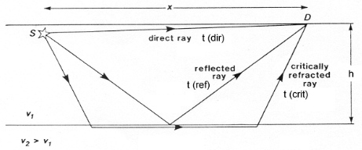

.. _basic_principles:

Basic principles
*******************

Elastic model for Earth rocks
=================================

Recall from the :ref:`seismic velocity <seismic_velocity_duplicate>` page of the physical properties section that the earth deforms elastically when it is deformed by a source of seismic energy. These small elastic strains will propagate as waves away in all directions from the site of the original stress. The easiest way to obtain intuition about this is to think about rocks as being made up of a set of connected springs. Apply a force (stress) to any part and you will eventually get motion elsewhere. This propagation of energy is a type of wave motion. Elastic waves can be divided into two categories:

.. sidebar:: Elastic model for rocks

	.. figure:: ./images/springbox.png
		:align: center

1. **Body waves** which travel through materials

2. **Surface waves** which propagate along boundaries between materials such
   as the air/earth interface.

Subtypes of these two categories are described below. Each wave type travels through a given material with a velocity that depends upon the elastic properties and density of the material.

Body Waves
==========

**Compressional waves (P waves)** propagate by compression and rarefaction and
the velocity of such waves, :math:`v_p`, in a material with bulk modulus :math:`K`, shear modulus :math:`\mu`, and density :math:`\rho` is given by the equation

.. math::
	v_p = \sqrt{ \frac{K + 4/3\mu}{\rho} }.

The figure below shows a simple animation of the motion associated with P waves.

.. figure:: ./images/pwave-animated-2.gif
	:align: center

	Animation by `L. Braile`_, from his `seismic wave demo`_, licensed for non-commercial reuse.

**Shear waves (S waves)** propagate by a pure shear strain perpendicular to the
wave propagation. The propagation speed :math:`v_s` is given by

.. math ::
	v_s = \sqrt{\frac{\mu}{\rho} }.

The below animation shows the propagation of a vertically polarized S wave. Note that an S wave could also be horizontally polarized, meaning that particle motion would be in the y direction in the coordinate system of the animation, as opposed to the z direction for vertical polarization.

.. figure:: ./images/s-wave-animated.gif
	:align: center

	Animation by `L. Braile`_, from his `seismic wave demo`_, licensed for non-commercial reuse.

Note that if :math:`\mu = 0` then :math:`v_s = 0`. This tells us that shear
waves do not travel in a liquid.

Seismic reflection and refraction surveying is usually carried out by the analysis of P waves. S-waves can also be used but they are harder to generate artificially compared to P-waves and require more complex receivers than ones designed to measure just P waves. In marine surveys (unless sources and receivers are coupled directly to the ocean bottom) it is not possible to generate or measure P waves at all. However, since :math:`v_s < v_p`, there are situations where it is beneficial to
use S-waves instead of P-waves.

Surface Waves
=============

**Rayleigh waves** propagate along a free surface or on the boundary between two
materials. Particle motion is a retrograde ellipse, and in the same plane as
wave energy propagation. The amplitude of particle motion decays
exponentially with depth. Rayleigh wave speed :math:`v_R < v_S`. Large
earthquakes can generate Rayleigh waves that circumnavigate the globe. This
provides information about the velocity structure in the upper few hundred
kilometers of the earth.

.. figure:: ./images/Rayleigh-wave-animated.gif
	:align: center

	Animation by `L. Braile`_, from his `seismic wave demo`_, licensed for non-commercial reuse.

**Love waves** exist in a surface layer when the shear wave velocity of the
upper layer is less than the shear wave velocity of the lower layer. The
waves are trapped in the upper layer and the particle motion is parallel to
the free surface and perpendicular to the direction of propagation.

.. math::
	v_{S1} < v_{Love} < v_{S2}

.. figure:: ./images/Love-wave-animated.gif
	:align: center

	Animation by `L. Braile`_, from his `seismic wave demo`_, licensed for non-commercial reuse.

Both Love waves and Rayleigh waves are **dispersive**. That is, different
frequency components travel at different speeds. So the wave changes shape as
it travels. Also, the dispersion can be used to provide information about the
velocity structure in the upper region of the earth. For shallow work, it is
possible to generate surface waves artificially, and then observe the waves at
a series of locations at increasing distances from the source. This type of
field work is sometimes called **multi-channel analysis of surface waves** or
MASW. This is usually considered an "advanced" topic in applied geophysics.

Wave Velocity and Particle Velocity
===================================

Seismic waves typically travel in the ground at 2-7 km/s. This is the velocity
at which the energy moves, not the particles themselves. For comparison, sound
travels in air at approximately 0.33 km/s. The wave energy can be recorded
many kilometers from the source even if the source is small. The velocity and
displacements of individual particles in the rocks are however very small;
typical particle speeds are :math:`10^{-8}` m/s and typical ground
displacements are :math:`10^{-10}` m. For a list of velocities of some common
earth materials and a discussion of the geological factors that affect
velocities please see the :ref:`seismic velocity <seismic_velocity_duplicate>` page on the physical properties
section of this site.

Waves and Rays
==============

A wave is a representation of the propagation of energy. In the case of seismic waves, energy is propagated through the compressions and expansions of the earth. Energy propagates away from source with a distinct pattern. Most seismic sources can be represented spatially as point sources. In a uniform medium, energy propagates away from a point source in an expanding spherical pattern, much like ripples on a pond that's been disturbed. The figure below shows a snapshot of waves on a pond. Notice how each ring forms a coherent surface where the water is disturbed from equilibrium by an equal amount. These rings propagate outward in time, in a coherent manner.

.. figure:: ./images/pondwaves-noleaves.jpg
        :align: center
        
        Image reproduced with permission from The website of the `Gemini Observatory <http://www.gemini.edu/>`__. The original can be found `here <http://www.gemini.edu/images/stories/press_release/pr2003-2/pondwaves-noleaves.jpg>`__.

A wavefront indicates the set of locations at which the phase of the wave has the same value. To continue with the pond example, visualize the peaks (or troughs) of water ripples after a rock has been thrown in. The direction of propagation of the energy is normal to the wavefront. **Seismic rays** are imaginary lines perpendicular to the wavefront that indicate the path along which the wavefront is traveling. Rays are not physical entities. They exist only to illustrate where the energy travels.

.. figure:: ./images/wavefront.gif
	:align: center

Lets illustrate the connection between wavefronts and rays using a seismic example. Have a look at the following animation.

.. figure:: ./images/two-layer-wavefront-animation.gif
        :align: center

The color represents a propagating wavefront due to a point source and the arrows are rays showing the direction of propagation. Note how the rays represent how the wavefront is bent when it hits the interface between two layers in the earth. 

It is common in seismic processing and interpretation to represent waves as plane waves, that is, waves whose wavefronts are straight lines rather than circles. The wavefronts maintain a circular shape when propagating in a uniform medium but as they expand away from the source the circles get larger and larger, to the point where the curvature is negligible and they can be approximated as planes. this is illustrated in the figure below
	
.. figure:: ./images/Sonar_Principle_EN-modified-from-wikipedia-radar-article.svg.png
        :align: center
        
        Adapted from `Wikipedia <https://commons.wikimedia.org/wiki/File:Sonar_Principle_EN.svg>`__, licensed under `CC BY 3.0`_.

Attenuation
===========

The amplitude of seismic waves falls off with distance from the source. There
are two primary reasons:

1. Geometrical spreading - that is, energy falls off as 1/r2 and hence the amplitude falls of as 1/r.

2. Earth materials are not perfectly elastic. Some frictional heating occurs
   as the waves propagate through the earth. This is often described as
   "absorption" and the absorption coefficient expresses the proportion of energy
   lost as the wave travels a distance of one wavelength. The figure here shows
   the progressive change of shape of an original spike pulse during its
   propagation through the ground due to the effects of absorption (After Anstey
   1977.) The spike's shape changes as well as experiencing reduced amplitude.
   This is because the different frequencies making up the pulse decay at
   different rates - in fact, higher frequencies decay more rapidly than lower
   frequencies. This is easily observed on earthquake signals that have been
   recorded at different locations. As noted above in the context of surface
   waves, such frequency dependent behavior is called **dispersion**.

.. figure:: ./images/attenuation.gif
	:align: center

Reflection and transmission of plane waves
==========================================

When a wave strikes an interface between two materials with differing physical properties, some of the wave energy will be reflected and the rest will be transmitted through or along the interface. All of the processing and interpretation methods we will discuss will assume that a seismic wave striking the interface between materials of differing physical properties can be approximated as a plane wave. We define a new quantity called acoustic impedance as :math:`Z = \rho V`, the product of density and velocity. The velocity in question could be for either P or S waves. 

Let us first consider waves striking an interface at normal incidence, i.e. with the direction of propagation perpendicular to the interface. The relative amplitudes of the reflected and transmitted waves will depend on the acoustic impedances of the two materials. Let :math:`A_0`, :math:`A_1` and :math:`A_2` be the amplitudes of the incident, reflected, and transmitted waves, respectively. The ratios of :math:`A_1` and :math:`A_2` to :math:`A_0` are given by the reflection and refraction coefficients:

**Reflection Coefficient:**

.. math::
    R = \frac{A_1}{A_0} = \frac{Z_2 - Z_1}{Z_2 + Z_1} \qquad -1 \le R \le 1

**Transmission Coefficient:**

.. math::
    T = \frac{A_2}{A_0} = \frac{2 Z_1}{Z_2 + Z_1} \qquad 0 \le T \le 2

Displacement of the earth from equilibrium position must be continuous across any interface. This guarantees that :math:`A_0 = A_1 + A_2`. We make note of the values of :math:`R` and :math:`Z` in some important special cases:

1. If :math:`Z_1 = Z_2`:   :math:`R = 0`,  :math:`T = 1`

2. If   :math:`Z_1 >> Z_2`:   :math:`R = -1`,  :math:`T = 2`.  The value :math:`R
   = -1` means that the pulse will be reflected with a polarity change, for
   example at the rock-air interface, with an upward traveling wave.

3. If   :math:`Z_2 >> Z_1`   :math:`R = 1`,  :math:`T = 0` (air earth
   interface with downward traveling wave).

**Remark:**  Large amplitudes of the transmitted wave are sometimes counter-
intuitive. However, the energy transported in an acoustic wave is

.. math::
    \text{Energy} = \frac{1}{2} \rho v \omega^2 A^2 \approx ZA^2

So even though there is an enhanced amplitude of a transmitted wave in certain
situations, there is still loss of energy. The ratio of incoming to reflected
energy is :math:`E_R` and the ratio of incoming to transmitted energy is :math:`E_T`. In terms of the impedances on either side of the interface, The energy ratios are

.. math::
    E_R = \left( \frac{Z_2 - Z_1}{Z_2 + Z_1} \right)^2

.. math::
    E_T = \frac{4 Z_1 Z_1}{(Z_2 + Z_1 )^2}

.. math::
    E_R + E_T = 1    

Mode Conversion
===============

A P-wave incident on an interface at a non-perpendicular angle will produce reflected and transmitted
S-waves, as well as P-waves. Analogous conversions occur when there is an incident S wave on a plane boundary. The
mode conversions (P :math:`\rightarrow` S, or S :math:`\rightarrow` P) can complicate interpretation, but S-waves are always slower than P-waves, so first arrivals will always be P-waves unless a special S-wave energy source is used. Interpretation of shear waves is still important in some contexts, especially in geotechnical applications, since they provide important information about the rigidity of the material.

.. figure:: ./images/modeconversion.gif
	:align: center
	
In seismic refraction surveying we are concerned with first arrivals and will not consider mode conversion further. It will be discussed again in the section on processing reflection survey data.

Angles of reflection and refraction
===================================

Consider a P-wave which is incident at an  angle :math:`\theta_1` measured with
respect to the normal of the interface, as seen in the figure below where the approaching wave is represented as a ray. The angles of the reflected and refracted rays are as follows:

**Law of reflection:** The angle of reflection equals the angle of incidence. So
:math:`\theta_r` = :math:`\theta_1` .

**Law of refraction:** The angle of refraction :math:`\theta_2`  is determined
through Snell's Law, which is

.. math::
	\frac{\sin\theta_1}{v_1} = \frac{\sin\theta_2}{v_2}

If the wave travels from a low velocity medium to a high velocity medium the
wave gets refracted away from the normal. Conversely, it gets refracted toward
the normal if the wave goes from a high velocity to a low velocity medium.

.. figure:: ./images/snell.gif
	:align: center

Critical angle
==============

The critical refraction angle, called :math:`\theta_c`, is a key concept in refraction seismology. This is the angle of incidence for which the corresponding angle of refraction is :math:`90^{\circ}`. In this case, the refracted ray travels horizontally along the interface. A formula for the critical angle can be derived from Snell's law as follows:

.. math::
	\frac{\sin\theta_c}{v_1} = \frac{\sin 90^{\circ}}{v_2} = \frac{1}{v_2}

	\sin\theta_c = \frac{v_1}{v_2}

When the wave in the second medium is critically refracted, it travels
parallel to the interface at a speed of :math:`v_2`. As it travels, it radiates
energy into the upper medium with the associated ray path making an angle
:math:`\theta_c` with the normal. This critically refracted wave is also called
a "head wave". It is somewhat analogous to the bow wave of a moving boat.

.. figure:: ./images/criticalrefraction.gif
	:align: center

    
Travel times
============

A seismic wave travelling through an isotropic homogeneous medium will propagate at a constant velocity. Therefore, the time :math:`t` required for a seismic wave to travel from source to receiver in a homogeneous earth layer with velocity :math:`v` is simply given by the formula 

.. math::
          t = \frac{d}{v}
          
where :math:`d` is the distance travelled in the layer. In a seismic survey we measure source to receiver travel times and use those data to estimate the properties of the subsurface. Basic seismic interpretation methods assume that the earth is composed of a series of uniform layers and attempt to compute the thicknesses, velocities, and sometimes dips of each layer. We will discuss specific techniques for computing layer thicknesses and velocities in the reflection and refraction survey sections. However, we will introduce the concept of travel time computations and how they relate to geometry here, using the example of a two layered earth.

Consider a layer of thickness h and velocity :math:`v_1` overlying a uniform halfspace of velocity :math:`v_2`. A source is detonated at time :math:`t=0`. We are interested in the waves and arrival times of those waves at a receiver which is located at a distance :math:`x` from the source at position :math:`D` in the figure below. There are three principle waves that will travel through the earth and arrive at position D. i) direct waves, ii) reflected waves, and  iii) critically refracted waves.

.. <<editorial comment>> This diagram is ok. If redrawn, put a source symbol (*) and a dashed line for the critically refracted ray.

The travel time curves for these ray paths are shown below, where the horizontal axis represents distance from the source along the flat surface of the earth, :math:`x_{crit}` is called the critical distance, and :math:`x_{cross}` the crossover distance. The critical distance is the closest surface point to the source at which the refracted ray can be observed. The crossover distance is the surface point at which the direct and refracted rays arrive at the same time. At offsets from the source greater than the crossover distance the refracted ray will be the first signal to arrive from the source.

.. figure:: ./images/timetravels.gif
	:align: center

Travel times of visible arrivals are related to the distance between source and receiver (:math:`x`), thickness of the layer (:math:`h`) and the wave velocities in the upper layer and basement (:math:`v_1` and :math:`v_2`). Let us denote the arrival times at point :math:`x` for the direct, reflected and refracted waves as :math:`t_{dir}`, :math:`t_{refl}` :math:`t_{refr}` respectively. These times are given by the following formulas

.. math::
	t_{dir} & = \frac{x}{v_1}\\
	t_{refl} & = \frac{\sqrt{x^2 + 4h^2}}{v_1}\\
	t_{refr}  & = \frac{x}{v_2} + \frac{2h\sqrt{v_2^2-v_1^2}}{v_1 v_2}.

Note that the formulas for the direct and refracted waves are linear in :math:`x` but that the reflected arrival time formula is not.

.. _CC BY 3.0: https://creativecommons.org/licenses/by/3.0/
.. _Subsurface Wiki: http://subsurfwiki.org/
.. _L. Braile: http://web.ics.purdue.edu/~braile/
.. _seismic wave demo: http://web.ics.purdue.edu/~braile/edumod/waves/WaveDemo.htm
