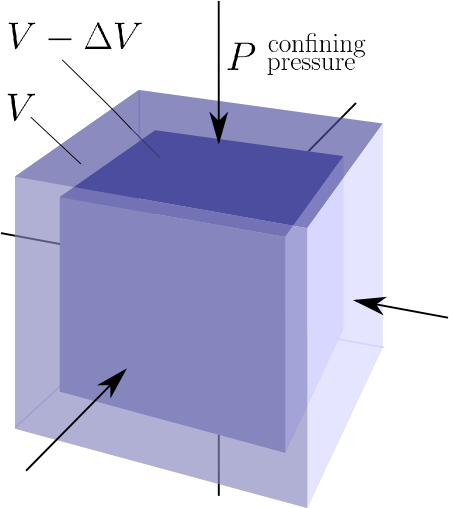

.. _seismic_fundamental_physics:

Fundamental physics
*******************

Fundamental Physics of Seismology
=================================

If we strike the earth with a hammer, an explosive charge, or an earthquake,
the material of the earth near the source becomes compressed (or extended) and
twisted. These deformations propagate away from the source. The speed of propagation and the type of motion propagated depends upon the physical properties of the material. Most earth materials under normal seismic conditions can be described by density and two elastic parameters:

1. density: :math:`\rho`
2. bulk modulus:  :math:`\kappa` (compressibility)
3. shear modulus:  :math:`\mu` (twistability)

By knowing the time at which the source was excited and measuring the time needed for the excitation to travel from the source to an array of receivers, it is possible to obtain information about the structure and physical properties of the subsurface.

The propagation of seismic waves in the earth is governed by the theory of linear elasticity. A detailed mathematical treatment of elasticity is beyond the scope of this course. In this page we will give a very brief introduction to the concepts of stress and strain, how they relate to elasticity, and how density and the elastic properties of a material relate to the propagation of seismic waves. We will then describe how seismic waves can be approximated using a simple ray model. The remainder of our study of seismic surveying in this course will then be conducted using the ray model.

Stress
======

.. sidebar:: Compressive and Tensile Stress 

	.. figure:: images/compressive.png
		:align: center
		
		Compressive normal stress

	.. figure:: images/tensile.png
		:align: center
		
		Tensile normal stress
	
	.. figure:: images/Elastic_shear_modulus-subwiki.png
		:align: center
		
		Shear stress. `Image <http://www.subsurfwiki.org/wiki/File:Elastic_shear_modulus.png>`__ from `Subsurface Wiki`_, licensed under `CC BY 3.0`_.

Stress is defined as the external force applied to a body divided by the cross-sectional area of the body over which the force is applied. Stress is a measure of these internal forces. It has units of "force per unit area"--N/m :math:`^2` in SI units. There are two main types of stress, normal and shear. As you would expect normal stress is applied in a direction normal to the surface it is applied on. Normal stresses can be further divided into compressive and tensile stresses. Shear stress is applied parallel to a surface. Compressive, tensile and shear stress are illustrated in the figure to the right.

Strain
======

If a body is stressed it will undergo a change in size and shape. The body is said to be
**strained**. To be a bit more precise, strain is a dimensionless quantity describing the fractional change in the relative positions between points on a body. If strains are small the body will recover its original
shape when the stress is removed. This is **elastic strain**. If the strain is
too great so that the **yield strength** is exceeded, then the body deforms
**plastically** and may ultimately fracture. Plastic strain is not
recoverable.

The figure below plots how strain (horizontal axis) accumulates as stress (vertical
axis) is applied. While behaviour is elastic, increasing or decreasing the
stress does nothing to permanently change the material. Once stress is sufficient to make
material behave plastically, reducing the stress results in reduced strain
along a different path on the graph. Once the fracture point is reached, the
strain is released by breaking.

.. figure :: ./images/stressstrain.png
	:align: center
	:scale: 80 %
	
	
Elastic Moduli
==============

In the elastic regime it is often acceptable to assume a linear relationship between stress and strain. This linear relationship is known as Hooke's Law. In addition to linear elasticity, basic seismic techniques also assume that earth materials are isotropic, meaning that their response to stress is invariant with respect to the direction from which the stress is applied. The relationship between stress and strain in a linear isotropic material can be described by two numbers, which are intrinsic properties of the material. Linear elasticity can be mathematically formalized in multiple ways and the different formulations lead to different definitons of these material parameters. They may be known as Lamé parameters or as the bulk and shear moduli. Different definitions of the elastic moduli may be more useful than others in different situations or the reason for choosing one representation over another may be purely a matter of convention. Please see `here <https://en.wikipedia.org/wiki/Lam%C3%A9_parameters>`__ for a table showing the relationship between various representations of isotropic elastic parameters in a convenient representation. In this course we are concerned with how the elastic moduli are related to the velocity of seismic waves in the earth and how they may be related to other material properties of interest such as porosity and permeability. Some important elastic moduli are described below.

Bulk Modulus
------------

Consider an initial volume :math:`V` which is subjected to a hydrostatic
pressure (force per unit area is the same in each direction) :math:`P`. This pressure is a volumetric stress. Let :math:`\Delta
V` be the change in volume resulting from this stress. The volumetric strain is :math:`\Delta V/V`. The **bulk modulus** is defined to be the volumetric stress divided by the volumetric strain:

.. math::
	\kappa = \frac{P}{\Delta V/V}.
	

                
                Bulk modulus. `Image <http://subsurfwiki.org/wiki/File:Elastic_bulk_modulus.png>`__ from `Subsurface Wiki`_, licensed under `CC BY 3.0`_.

Shear Modulus
-------------

Consider a force :math:`F`, applied parallel to the top of a cube, with the force distributed evenly over the surface, as shown in the figure below. The force per unit area is known as the shear stress :math:`\tau`. Application of shear stresses to the top and bottom interfaces produce a strain proportional
to the angle :math:`\tan \theta` in the image below. The **shear modulus** is defined as

.. math::
	\mu = \frac{\tau}{\tan\theta}

.. figure:: images/Elastic_shear_modulus-subwiki.png
		:align: center
		:scale: 60%
		
		Shear stress. `Image <http://www.subsurfwiki.org/wiki/File:Elastic_shear_modulus.png>`__ from `Subsurface Wiki`_, licensed under `CC BY 3.0`_.
		
As discussed above, the linear elastic isotropic stress-strain relationship of a material may be fully described by the bulk and shear moduli of the material. Another important alternative pair of parameters that define the elastic behaviour of a material are Young's modulus and Poisson's ratio.

Young's Modulus
---------------

Young's modulus is defined to be the ratio of longitudinal normal stress to longitudinal normal strain. Consider the rectangular prism shown below with square cross-sectional area :math:`A = W^2` and length :math:`L`. A tensile force :math:`F` applied normal to the axis of the prism, distributed over the cross-sectional area, will generate a normal stress of :math:`P = F/A`. If this stress generates an elongation of the prism by length :math:`\Delta L`, the Young's modulus of the prism material is

.. math::
	E = \frac{P}{\Delta L/L)}

.. figure:: ./images/youngs.png
		:align: center
		:scale: 60%

Poisson's Ratio
---------------

As a result of the longitudinal stress described above the cross-sectional area of the prism may be reduced, compensating for the increase in length. Let us define the cross-sectional strain as :math:`\Delta W / W`. **Poisson's ratio** is the ratio of transverse strain to longitudinal strain due to a longitudinal stress:

.. math::
	\sigma = \frac{\Delta W / W}{\Delta L/L}

Note that it is possible for :math:`\sigma` to be zero. The increase in length could be compensated for by increasing pore space for example. Cork is an example of such a material.

Elastic model for Earth rocks
=================================

When the earth is deformed elastically, the small strains will propagate away in all directions from the site of the original stress. The easiest way to obtain intuition about this is to think about rocks as being made up of a set of connected springs. Apply a force (stress) to any part and you will eventually get motion elsewhere. This propagation of energy is a type of wave motion. Elastic waves can be divided into two categories:

.. sidebar:: Elastic model for rocks

	.. figure:: ./images/springbox.png
		:align: center

1. **Body waves** which travel through materials

2. **Surface waves** which propagate along boundaries between materials such
   as the air/earth interface.

Subtypes of these two categories are described below. Each wave type travels through a given material with a velocity that depends upon the elastic properties and density of the material.

Body Waves
==========

**Compressional waves (P waves)** propagate by compression and rarefaction and
the velocity of such waves, :math:`v_p`, in a material with bulk modulus :math:`\kappa`, shear modulus :math:`\mu`, and density :math:`\rho` is given by the equation

.. math::
	v_p = \sqrt{ \frac{\kappa + 4/3\mu}{\rho} }.
	
The figure below shows a simple animation of the motion associated with P waves.

.. figure:: ./images/pwave-animated-2.gif
	:align: center
	
	Animation by `L. Braile`_, from his `seismic wave demo`_, licensed for non-commercial reuse.

**Shear waves (S waves)** propagate by a pure shear strain perpendicular to the
wave propagation. The propagation speed :math:`v_s` is given by

.. math ::
	v_s = \sqrt{\frac{\mu}{\rho} }.
	
The below animation shows the propagation of a vertically polarized S wave. Note that an S wave could also be horizontally polarized, meaning that particle motion would be in the y direction in the coordinate system of the animation, as opposed to the z direction for vertical polarization. 

.. figure:: ./images/s-wave-animated.gif
	:align: center
	
	Animation by `L. Braile`_, from his `seismic wave demo`_, licensed for non-commercial reuse.

Note that if :math:`\mu = 0` then :math:`v_s = 0`. This tells us that shear
waves do not travel in a liquid.

Seismic reflection and refraction surveying is usually carried out by the analysis of P waves. S-waves can also be used but they are harder to generate artificially compared to P-waves and require more complex receivers than ones designed to measure just P waves. In marine surveys (unless sources and receivers are coupled directly to the ocean bottom) it is not possible to generate or measure P waves at all. However, since :math:`v_s < v_p`, there are situations where it is beneficial to
use S-waves instead of P-waves.

Surface Waves
=============

**Rayleigh waves** propagate along a free surface or on the boundary between two
materials. Particle motion is a retrograde ellipse, and in the same plane as
wave energy propagation. The amplitude of particle motion decays
exponentially with depth. Rayleigh wave speed :math:`v_R < v_S`. Large
earthquakes can generate Rayleigh waves that circumnavigate the globe. This
provides information about the velocity structure in the upper few hundred
kilometers of the earth.

.. figure:: ./images/Rayleigh-wave-animated.gif
	:align: center
	
	Animation by `L. Braile`_, from his `seismic wave demo`_, licensed for non-commercial reuse.

**Love waves** exist in a surface layer when the shear wave velocity of the
upper layer is less than the shear wave velocity of the lower layer. The
waves are trapped in the upper layer and the particle motion is parallel to
the free surface and perpendicular to the direction of propagation.

.. math::
	v_{S1} < v_{Love} < v_{S2}

.. figure:: ./images/Love-wave-animated.gif
	:align: center
	
	Animation by `L. Braile`_, from his `seismic wave demo`_, licensed for non-commercial reuse.

Both Love waves and Rayleigh waves are **dispersive**. That is, different
frequency components travel at different speeds. So the wave changes shape as
it travels. Also, the dispersion can be used to provide information about the
velocity structure in the upper region of the earth. For shallow work, it is
possible to generate surface waves artificially, and then observe the waves at
a series of locations at increasing distances from the source. This type of
field work is sometimes called **multi-channel analysis of surface waves** or
MASW. This is usually considered an "advanced" topic in applied geophysics.

Waves and Rays
==============

A wavefront indicates the locations at which the phase of the wave has the
same value. For example, visualize the peaks (or troughs) of water ripples
after a rock has been thrown in. The direction of propagation of the energy is
normal to the wavefront. **Seismic rays** are imaginary lines perpendicular to
the wavefront that indicate the path along which the wavefront is traveling.
Rays are not physical entities. They exist only to illustrate where the energy
travels.

.. figure:: ./images/wavefront.gif
	:align: center

Wave Velocity and Particle Velocity
===================================

Seismic waves typically travel in the ground at 2-7 km/s. This is the velocity
at which the energy moves, not the particles themselves. For comparison, sound
travels in air at approximately 0.33 km/s. The wave energy can be recorded
many kilometers from the source even if the source is small. The velocity and
displacements of individual particles in the rocks are however very small;
typical particle speeds are :math:`10^{-8}` m/s and typical ground displacements
are :math:`10^{-10}` m.

P-wave velocity of earth materials
==================================

Some characteristics of P-wave velocities are:

1. :math:`v_p` increases with confining pressure;

2. sandstones and shales show a systematic increase in :math:`v_p` with depth of burial and age (progressive compaction and cementation);

3. For a wide range of rocks there is an approximate relationship between density and :math:`v_p`;

4. The presence of gas in sedimentary rocks reduces the elastic moduli, Poisson's ratio, and the ratio :math:`v_p / v_s`.

Attenuation
===========

The amplitude of seismic waves falls off with distance from the source. There are two primary reasons:

1. Geometrical spreading - that is, energy falls off as 1/r2 and hence the amplitude falls of as 1/r.

2. Earth materials are not perfectly elastic. Some frictional heating occurs
   as the waves propagate through the earth. This is often described as
   "absorption" and the absorption coefficient expresses the proportion of energy
   lost as the wave travels a distance of one wavelength. The figure here shows
   the progressive change of shape of an original spike pulse during its
   propagation through the ground due to the effects of absorption (After Anstey
   1977.) The spike's shape changes as well as experiencing reduced amplitude.
   This is because the different frequencies making up the pulse decay at
   different rates - in fact, higher frequencies decay more rapidly than lower
   frequencies. This is easily observed on earthquake signals that have been
   recorded at different locations. As noted above in the context of surface
   waves, such frequency dependent behavior is called **dispersion**.

.. figure:: ./images/attenuation.gif
	:align: center

.. _CC BY 3.0: https://creativecommons.org/licenses/by/3.0/
.. _Subsurface Wiki: http://subsurfwiki.org/
.. _L. Braile: http://web.ics.purdue.edu/~braile/
.. _seismic wave demo: http://web.ics.purdue.edu/~braile/edumod/waves/WaveDemo.htm