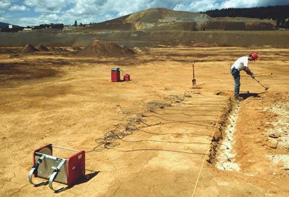

.. _seismic_index:

Seismic
=======

.. figure:: ./images/icon_refrac.gif
   :align: right
   :scale: 110 %

Seismic methods involve generating elastic energy that propagates through the ground. Sensors (geophones) are installed on the surface, and they record the faint ground motions that return from boundaries where the
elastic properties of subsurface materials change. At such boundaries there
are two fundamental physical effects--reflection and refraction. Some of the energy from a seismic wave impinging on an interface will be bounced back, or reflected, toward the surface. The propagation of some energy will also be bent, or refracted, at an interface. A refracted wave may be bent such that it travels
along the interface between two subsurface materials, with energy from the refracted wave eventually returning to the surface. These two phenomena give rise to the two main techniques of applied seismology: reflection surveying and refraction surveying. A third survey, MASW, analyses surface waves to estimate shear strength in the upper layers of the earth. 

Much information about the subsurface can be gained from the analysis of seismic survey data. Some examples include the delineation of sedimentary layers, determination of depth to bedrock, mapping the topography of the bedrock horizon, the location of faults, and the characterization of near surface material properties such as density and porosity. 

There are far more professional geophysicists employed in the seismic industry than any other branch of applied geophysics. Most are working on seismic reflection in its many forms for the oil/gas exploration industries. Some mineral exploration companies have recently used 3D seismic reflection surveying to help delineate known ore bodies but it is not regularly used. The geotechnical and environmental industries use seismic refraction regularly to efficiently assess layer thicknesses and mechanical properties in the top few 10s of meters of the subsurface. Seismic reflection has more recently also become economical for shallow work, from roughly five meters depth down to hundreds of meters. The MASW technique is becoming more widely used for geotechnical surveys.

	A small refraction survey on mine tailings. There are 12 geophones, a hammer is used on the side of a metal block (the operator is standing on it) to produce shear waves. The recording device, it's computer and battery are just left of centre.

In the following parts of our seismic section  we provide background to the fundamental physics that underly all seismic methods and then investigate refraction, reflection and MASW methods.

Contents:

.. toctree::
   :maxdepth: 1

   elastic_properties
   basic_principles
   seismic_survey
   seismic_data
   seismic_processing
   seismic_interpretation
   MASW
   seismic_apps