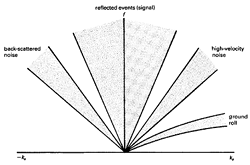

.. _seismic_reflection_filtering:

Filtering of Seismic Data
*************************

 	
The interpretation of seismic data is made purely on the basis of what is
observed in the final processed section. CMP processing greatly enhances the
signal to noise ratio and allows coherent reflections to be visible. However,
the data that goes into the CMP processing is often contaminated with "noise".
The ground roll in the CSP gather shown previously is a good example. Also,
the data might be contaminated with wind noise or instrument vibrations.
These, and other types of noise, can be partially removed by using various
filtering operations.

Three Useful Filtering Operations
=================================

1. Frequency Filtering
----------------------

Wind, instrument, and cultural effects can generate unwanted noise at
frequencies outside the seismic band. Often these are high frequency signals.
Alternatively, ground roll and ship generated noise are low frequency. If this
is the case then the seismic signal might lie in a frequency band that is
distinct from the the noise. This is illustrated below. The unwanted noise can
be removed using bandpass filtering in the frequency domain.

.. figure:: ./images/frequency_band.gif
	:align: center
	:scale: 120 %

One can apply a frequency filter to remove all signals that have a frequency
high than :math:`f_H` and all frequencies lower than :math:`f_L`.

.. raw:: html
    :file: filtering.html

2. Deconvolution
----------------

**a) Deghosting**

In marine work a source is detonated slightly below the water surface. The
primary seismic wavelet propagates downward but there is an upward propagating
wave that reflects from the water surface and then propagates downward. The
latter reflection is referred to as a "ghost".

.. figure:: ./images/ghost.gif
	:align: right
	:scale: 100 %

A seismic wavelet is composed of the original wavelet plus a closely spaced
reflection. This complicates the wavelet as shown in the figure below.

.. figure:: ./images/seismic_wavelet.gif
	:align: center
	:scale: 120 %

**b) Wavelet or Signature Deconvolution**

An "inverse filter" is designed so that the original source wavelet is
contracted to a narrower and symmetric form. e.g.

.. figure:: ./images/inverse_filter.gif
	:align: center
	:scale: 120 %

This can enhance the vertical resolution, though not beyond the "theoretical"
maximum which is controlled by wavelength.

**c) Predictive Deconvolution**

This type of processing can remove some multiples from a seismic section.
Reverberation (multiples of the ocean-bottom reflection) in marine surveys is
a common example of this type of problem.

3. Velocity or :math:`f\mbox{-}k` filtering
-------------------------------------------

In shot gathers or on final sections we often have events that appear with a
specific slope. Notice the ground roll, in the CSP gather below left. These
are characterized by the late-arriving, high amplitude, low-frequency events
which define a steep triangular-shaped central zone which mask the reflected
arrivals.

Ground roll events have a small apparent velocity or equivalently a large dip.
They can be isolated by taking a 2-D Fourier transform. In that domain the
ground roll is located in a fan-like region. By zeroing the Fourier transform
values in this fan and then inverse Fourier transforming, we remove the ground
roll. The diagram below right sketches these fan-shaped regions of an
:math:`f\mbox{-}k` plot for a typical shot gather which contains reflections
events and noise.

.. figure:: ./images/CSP_w_ground_roll_2.gif
	:figclass: center
	:align: left
	:scale: 105%

.. <<editorial comment>> Original GPG has a "click to enlarge" feature for CSP_w_ground_roll_2.gif. 

The procedure for carrying out :math:`f\mbox{-}k` filtering is provided in the
flow chart, below left. The final diagram shows four shallow marine records
before and after :math:`f\mbox{-}k` filtering to remove coherent linear noise.
Hyperbolic reflections are observed after removal of the noise.

.. figure:: ./images/fk_procedure.gif
	:align: left
	:scale: 150 %

.. figure:: ./images/shallow_marine_records.gif
	:figclass: center
	:align: left
	:scale: 130 %

Four shallow marine records (a) before and (b) after f-k dip filtering to
remove coherent linear noise. The coherent noise seen in these records is
primarily of guided wave type.

.. <<editorial comment>> Original GPG has a "click to enlarge" feature for shallow_marine_records.gif