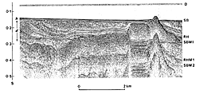
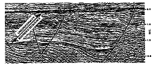

.. _seismic_reflection_introduction:

Introduction
************

.. figure:: ./images/titleicon.gif
	:figclass: float-right-360
	:align: right
	:scale: 135 %

The basic elements of seismology were covered in an earlier course. There we focused upon seismic refraction. Head waves propagated along an interface separating media of different velocities and were recorded as first arrivals at the surface. These arrivals were then analyzed to yield information about the velocities and thicknesses of the layers. 

.. figure:: ./images/reflection_intro_layers.gif
	:figclass: float-right-360
	:align: right
	:scale: 135 %
In reflection seismology we record seismic pulses that are reflected from boundaries which separate layers that have different acoustic impedances. The acoustic impedance is the product of the velocity and density. Information in the seismogram which comes after the first arrival is important. Reflection seismic data are acquired in the same manner as refraction data but the processing is considerably different. In reflection seismology, seismic records from many sets of shots and receivers are used to generate an ideal seismogram which has reflections that correspond to a vertically travelling wave as shown in the diagram below. The reflections occur at travel times that are determined by the velocity and the length of the travel path in each layer. These seismograms are ideal for interpretation.

The ideal seismograms are acquired at regular distances along the surface and are composited into a seismic section. This generates an image of the substructure that can be used in an identical manner to a radar section. The examples below illustrate how the seismic images can be interpreted in terms of geologic structure:

Two Examples
------------

An air gun record from the Gulf of Patras, Greece, showing Holocene hemipelagic (h) and deltaic (d) sediments overlying an irregular erosion surface (rockhead, RH) cut into tectonized Mesozoic and Tertiary rocks of the Hellenide (Alpine) orogenic belt. SB: sea bed reflection; SBM1 and SBM2: first and second multiples of sea bed reflection; RHM1: first multiple of rockhead reflection [#f1]_. 

A seismic section from the northern Amadeus basin, central Australia, illustrating a depositional sequence bounded by major unconformities [#f1]_.

In order to generate the previous images there are numerous operations that need to be applied to the data. Much of the data processing is tied to the hypothesis that the earth's properties vary most strongly in the vertical direction. As background we first review the principles of a reflection seismogram and then consider travel time curves that arise from a horizontally layered earth.

.. [#f1] From Kearey, Philip and Micheal Brooks, 'An Introduction to Geophysical Exploration'. 2nd ed. Blackwell Science: 1991. 

.. Note: the title in the footnote needs to be underlined.