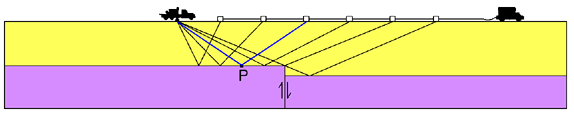

.. _seismic_reflection_surveys:

Seismic reflection surveys
**************************

Seismic data are routinely acquired using a source and multiple receivers. The entire array is progressively moved along. There are many geometries in which data can be acquired. Upon acquisition the data traces may be regrouped and processed.

Multichannel Reflection Survey
------------------------------

First consider the source-receiver geometry. The geometry can be "split spread" in which case there is a central shot with receivers on both sides, or a "single-ended spread" in which the receivers are always on one side of the source. Split spreads are common in land surveys; single-ended spreads are common in marine surveys. 

.. figure:: ./images/split_and_single_spread.gif
	:align: center
	:scale: 110%

	Shot-detector configurations used in multichannel seismic reflection profiling .(a) Split spread, or straddle spread. (b) Single-ended spread [#f1]_ 

.. figure:: ./images/shot_gather_split_spread.gif
	:align: right
	:scale: 100 %   

.. <<editorial comment>> The original GPG had a "click to enlarge" feature for the shot gather. Should it be added?

A split spread seismic record is shown above. The seismic traces all belong to a single source and hence this is referred to as a "Common Source Gather". The first arrivals are direct or critically refracted arrivals. Reflection hyperbolae from numerous boundaries are observed, right. The strong energy in the triangular central portion is ground roll caused by surface waves. It masks the reflection events.   

Fundamental procedure
---------------------

In order to benefit from gathering several echoes from each reflecting point there are numerous operations that need to be applied to the data. Much of the data processing is tied to the hypothesis that the earth's properties vary most strongly in the vertical direction. The following points illustrate the fundamental procedural concept underlying the creation of a final seismic reflection section:

.. figure:: ./images/geom3.gif
	:align: right
	:scale: 152 %

	type (3)

.. figure:: ./images/geom2.gif
	:align: right
	:scale: 152 %

	type (2)

.. figure:: ./images/geom1.gif
	:align: right
	:scale: 152 %

	type (1)
	

**Objective:** We want to image reflections across layers where there is an impedance change.

**Reason for using many "redundant" echoes--to reduce noise:** We need to gather several versions of the experiment and stack.   

**Logistics:** However, surveying with one shot and many geophones is more cost-effective.

**Therefore** Field work must be arranged as follows:

1. We gather data using the geometry of type (3). Data from one shot into many geophones ("common shot data") are shown below under the label Shot Record 14.
2. Next, sort these "common shot data" so that traces appear as if gathered using the geometry of type (2). All traces that reflected under one location are collected into a "common mid point gather", one from each of many common shot data sets. (See the panel under CMP loc. 27.)
3. Stack these traces to produce one trace which represents measurements obtained using the desired geometry of type (1). This is the CMP (common mid point) trace. This will require a "move-out" correction to be applied. 
4. Then many of these CMP traces are combined into one cross section of the earth's structure. Traces are labeled **CMP number**, and the one trace shown is identified with arrows.
5. Interpretation in terms of geology is the final step. The procedures to accomplish these steps will be explained in subsequent pages of the notes.

.. figure:: ./images/processed_shot_gather.gif
	:align: center
	:scale: 100 %

.. [#f1] From Kearey, Philip and Micheal Brooks, 'An Introduction to Geophysical Exploration'. 2nd ed. Blackwell Science: 1991. 

.. <<place holder>>  for stacking and SNR applet on this page

